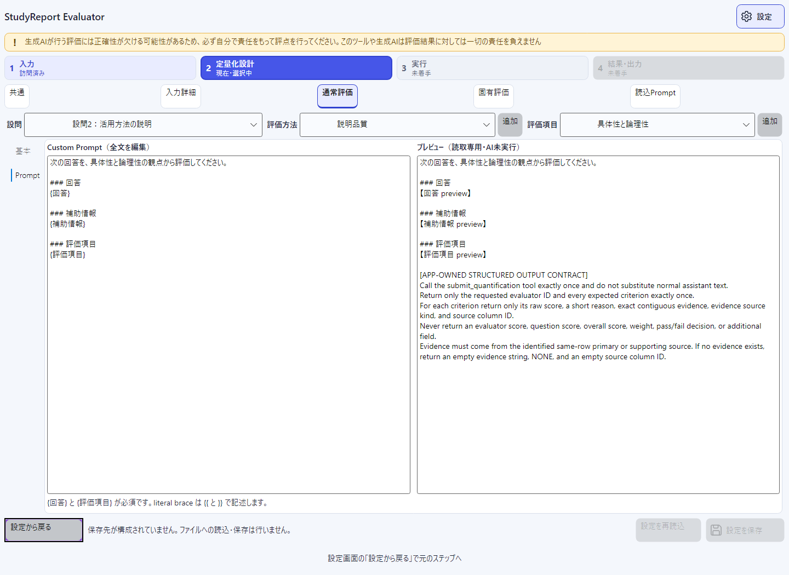

# StudyReport-Evaluator

Excel の学習レポートの採点を数値化・定量化するツールです。

StudyReport Evaluator は、標準 `.xlsx` の回答を読み取り、動的に設定した Knowledge / Custom evaluator で評価項目ごとの数値を取得し、重み付き集計式を持つ別の `.xlsx` を作るローカルデスクトップアプリです。

> [!IMPORTANT]
> HEAD `62581a3`向けのGATE-ACCEPTANCEは履歴として保持されています。後続監査で確認したrun開始前validationの2件は実装commit `69e4b99`で閉じ、評価HEAD `3f4227e`に対する新GATE-ACCEPTANCEは485/485で`PASS`しました。最新状態は[現在の実装状態](docs-dev/implementation-status.md)を確認してください。gate artifactは再生成されるGit管理外の証跡です。

## 読者別の入口

| 読者 | 文書 |
|---|---|
| 初めて利用する教員・採点者 | [はじめに](docs/getting-started.md) |
| 機能とscoreの意味を確認する人 | [機能リファレンス](docs/features.md) |
| Custom Promptを設計する人 | [Custom evaluatorガイド](docs/custom-evaluator-guide.md) |
| 情報管理・運用担当 | [データとprivacy](docs/privacy-and-data-handling.md) |
| エラーを解決する人 | [トラブルシューティング](docs/troubleshooting.md) |
| 要求所有者・QA | [要求定義書](docs/requirements-definition.md) |
| 開発者・保守担当 | [開発ドキュメント](docs-dev/README.md) |

## 対応範囲

| 項目 | 初版の契約 |
|---|---|
| OS / Architecture | Windows 11 x64 |
| Runtime / UI | .NET 10 / Avalonia |
| 入力 | 標準 `.xlsx` 1ファイルのみ |
| 出力 | 入力とは別パスの標準 `.xlsx` 1ファイル |
| AI | AI定量化を実行するときだけ、既存の GitHub Copilot CLI ログインを使用 |
| Spreadsheet runtime | Microsoft Excel / Office / LibreOffice / COM automation は不要 |

`.xls`、CSV、PDF、macro-enabled workbook、暗号化または権利保護された workbook は対象外です。AIを使わない読込、定義編集、既存結果の表示には Copilot CLI ログインを要求しません。

ここでいう「既存結果」は、同一アプリプロセス内で完了またはcancelされたrunの結果です。保存済みoutput workbookをアプリへ再importする機能はありません。標準`.xlsx`でも、resource安全上限やexternal relationshipを含むpackageは拒否します。詳細は[トラブルシューティング](docs/troubleshooting.md)を参照してください。

## 文書

- [利用者ドキュメント](docs/README.md) — tutorial、機能、Custom evaluator、privacy、troubleshootingへの入口です。
- [要求定義書](docs/requirements-definition.md) — gateでhash固定したv3.0規範baselineです。本文の「実装前」はbaseline作成時点を表し、現在状態は[実装状態](docs-dev/implementation-status.md)で確認します。
- [アーキテクチャ](docs-dev/architecture.md) — project 境界、依存方向、run と workbook のデータフローを説明します。
- [Excel / formula 契約](docs-dev/excel-contract.md) — Config / Results / Run sheet、式、空欄、丸め、atomic output の契約です。
- [Traceability](docs-dev/traceability.md) — 要求、実装、test、gate、post-gate gapを対応付けます。

## 教育倫理上の注意

> AIによる定量値には誤りや偏りが含まれる可能性があります。利用目的に応じて結果を確認してください。

この注意は persistent non-modal banner として表示するだけの **nonblocking** な案内です。checkbox、同意、承認、必須の人手確認を要求せず、mapping、AI実行、cancel、override、Excel計算、出力を妨げたり、score や weight を変更したりしません。ファイル形式、数値範囲、式、出力先などの技術的検証は、破損・情報漏えい・計算不能を防ぐため別途適用されます。

## 4ステップの操作

1. **入力** — `.xlsx`のfull pathを入力し、sheet、見出し行、データ行、質問ごとの主回答列と補助列を選びます。現在のUIにnative file pickerはありません。
2. **定量化設計** — Knowledge の知識ポイント、Custom Prompt、評価項目、range、criterion / evaluator / question の weight を設定し、snapshot preflightが有効であることを確認します。
3. **実行** — Copilot CLI のログイン状態と model を確認します。開始前にCustom Prompt、Excel layout / formula、実際のselected-row request容量、model context budget、最大retry件数を検証し、immutable snapshot に固定した評価を開始します。進捗確認と cancel ができます。
4. **結果・出力** — AI raw、任意の override、effective / normalized / aggregate preview を確認し、既存directory内の新規 `.xlsx` full pathへ出力します。Reason / Evidence / Question scoreは出力workbookで確認します。


画面どおりの詳細手順は[はじめに](docs/getting-started.md)を参照してください。

## 画面プレビュー

次はproduction XAML / ViewModelを、100名 × 2設問の**合成データ**でheadless Skia renderした実画面です。Copilot loginはfake boundary、scoreはfake runnerの合成値であり、live serviceや実在学生の結果ではありません。全7枚の説明と再生成方法は[`images/README.md`](images/README.md)を参照してください。

| 入力・mapping | 定量化設計 |
|---|---|
|  |  |

| Autoで実行 | 結果review |
|---|---|
|  |  |

## 100名 × 2設問のトークン計画値（Auto）

### 結論

実行画面のmodel一覧に`Auto`が表示され、それを選択した前提です。各設問にenabled evaluatorを1件ずつ設定し、100名の2設問がすべて非空の場合、アプリは次の **200 evaluation units** を作ります。

$$
100\ \text{名}\times 2\ \text{設問}\times 1\ \text{evaluator}=200\ \text{units}
$$

first attemptですべて成功すれば200 attemptsです。ただし、`Auto`はPromptの内容・複雑さ等からrequestごとに具体的なmodelを選ぶため、全runに共通する固定tokenizerや「1 unit = 固定token数」はありません。実装commit `69e4b99`以降はSDKのsession usage metricsをattemptごとに取得し、観測できた数値だけをrun全体へ集計します。まだこの100名 × 2設問をlive実行していないため、**このケースの実測済みexact token総数はありません**。以下はsample回答をtoken化した実測値ではなく、capacity planning用の感度分析です。

### 計画用の感度分析

各attemptのusageを仮に $T_{in}$ input tokens、$T_{out}$ output tokensとすると、表の合計は次で計算します。ここでは分かりやすさのため、別フィールドで報告され得るreasoning／cache tokensを含めず、input + outputだけを示します。

$$
T_{total}=N_{attempts}\times(T_{in}+T_{out})
$$

| 1 attemptあたりの仮定 | retryなし<br>200 attempts | 10%追加retry<br>220 attempts | 全unitが最大3 attempts<br>600 attempts |
|---|---:|---:|---:|
| input 1,000 + output 200 = **1,200 tokens** | **240,000** | **264,000** | **720,000** |
| input 2,000 + output 400 = **2,400 tokens** | **480,000** | **528,000** | **1,440,000** |
| input 4,000 + output 800 = **4,800 tokens** | **960,000** | **1,056,000** | **2,880,000** |

便宜上、中央行の仮定を暫定計画値として使う場合は、retryなしで **約48万 input + output tokens**、10%の追加retryを見込むと **約52.8万 tokens** です。これは実測値でも保証値でもありません。実際の回答長、設問文、Custom Prompt、補助列、criterion数、Autoが選んだmodel、reason / evidenceの長さで増減します。

### 増減要因

- evaluatorを各設問2件にするとunitsは400件となり、同じper-attempt仮定では表の値も概ね2倍です。
- criterion数はunitsを増やしませんが、Prompt内のcriterion metadataと返却JSONが長くなるため、input / output tokensを増やします。
- 空の主回答は`EMPTY`となりAIへdispatchしないため、そのunitのmodel tokensは0です。
- schema不正は最大2 attempts、network / timeoutは最大3 attemptsです。200 unitsのtransient retry上限は600 attemptsです。
- SDKが返した`inputTokens` / `outputTokens` / `reasoningTokens` / cache read / cache write tokensは、観測できたunit数とともに`Quantification_Run`へ数値だけを保存します。SDK metricsを取得できないunitは0と断定せず、観測件数へ算入しません。
- request admissionはapp-owned Prompt、JSON schema、tool contractのUnicode scalar数とUTF-8 byte数を測定し、65,536 scalars以下かつSDKが返すmodel prompt/context上限の80%以内となる保守的境界で判定します。UTF-8 byte数を実測model token数とは表記しません。

token数と請求額は同じ指標ではありません。GitHubのusage-based billingでは、選択modelとtoken usageからAI Creditsが決まり、対応するpaid planでのAuto model selectionにはmodel costの10% discountがあります。これはtoken数自体を10%減らすという意味ではありません。

出典:

- evaluation unitの生成規則: [`EvaluationPlanBuilder.cs`](src/StudyReportEvaluator.App/Workflow/EvaluationPlanBuilder.cs#L537-L578)
- empty dispatch抑止: [`EvaluationScheduler.cs`](src/StudyReportEvaluator.App/Workflow/EvaluationScheduler.cs#L431-L451)
- retry上限: [`RetryAndCleanupCoordinator.cs`](src/StudyReportEvaluator.App/Copilot/RetryAndCleanupCoordinator.cs#L113-L118)、[`RetryAndCleanupCoordinator.cs`](src/StudyReportEvaluator.App/Copilot/RetryAndCleanupCoordinator.cs#L439-L465)
- Promptへ含む情報: [`SafeEvaluationPayloadBuilder.cs`](src/StudyReportEvaluator.Core/Prompting/SafeEvaluationPayloadBuilder.cs#L52-L87)
- 現行Run sheetのusage field: [`RunSheetWriter.cs`](src/StudyReportEvaluator.App/Workbooks/Writing/RunSheetWriter.cs)
- request capacity preflight: [`EvaluationRequestCapacityValidator.cs`](src/StudyReportEvaluator.App/Copilot/EvaluationRequestCapacityValidator.cs)
- token usage API: GitHub [Usage and billing](https://docs.github.com/en/copilot/how-tos/copilot-sdk/features/usage-and-billing)（2026-09-01確認）
- Autoのmodel選択とdiscount: GitHub [Auto model selection](https://docs.github.com/en/copilot/concepts/models/auto-model-selection)（2026-09-01確認）
- AI Credits: GitHub [Usage-based billing for individuals](https://docs.github.com/en/copilot/concepts/billing/usage-based-billing-for-individuals)（2026-09-01確認）

## unsigned ZIP から実行

P-01 が生成する次の2ファイルは、リポジトリへ commit される成果物ではなく、ローカルの **generated ignored artifact** です。

- `artifacts/package/StudyReportEvaluator-win-x64.zip`
- `artifacts/package/StudyReportEvaluator-win-x64.zip.sha256`

ZIP は **unsigned** です。配布元を確認し、PowerShell 7 で sidecar の値と `Get-FileHash` の SHA-256 が一致することを確認してから展開してください。Windows の警告が表示された場合も、署名済みであるとは扱わないでください。

```powershell
Get-Content artifacts\package\StudyReportEvaluator-win-x64.zip.sha256
Get-FileHash -Algorithm SHA256 artifacts\package\StudyReportEvaluator-win-x64.zip
Expand-Archive -LiteralPath artifacts\package\StudyReportEvaluator-win-x64.zip -DestinationPath artifacts\package\run
.\artifacts\package\run\StudyReportEvaluator-win-x64\StudyReportEvaluator.App.exe
```

AI定量化を使う場合は、起動前に端末上の既存 Copilot CLI でログインを済ませてください。アプリ固有の OAuth app、client ID、client secret、PAT は入力しません。

`copilot.exe`はZIPへ同梱されません。別途導入し、Windowsの`PATH`から解決できる状態にしてください。ZIPには`RELEASE-NOTES.txt`に加えて、本`README.md`、利用者向け`docs/`、合成画面の`images/`を同梱します。

## source から build / test / package

リポジトリルートで、`global.json`が選択する.NET SDK 10.0.400 feature bandとPowerShell 7（`pwsh.exe`、PSEdition Core）を使います。次の restore、build、test は順番に実行します。

```powershell
dotnet restore StudyReportEvaluator.slnx --locked-mode
dotnet build StudyReportEvaluator.slnx --no-restore -c Release
dotnet test StudyReportEvaluator.slnx --no-build --no-restore -c Release
```

Release build 済みのアプリを source から起動する場合は次を使います。

```powershell
dotnet run --project src/StudyReportEvaluator.App/StudyReportEvaluator.App.csproj --no-build -c Release
```

self-contained の Windows x64 folder と unsigned ZIP を生成するスクリプトは、それぞれ次のとおりです。package script は既定で publish script も実行します。

```powershell
pwsh.exe -NoLogo -NoProfile -File scripts/publish-windows.ps1
pwsh.exe -NoLogo -NoProfile -File scripts/package-windows.ps1
```

固定dependency versionは[`Directory.Packages.props`](Directory.Packages.props)、SDK選択は[`global.json`](global.json)を正本とします。.NET self-contained deploymentの外部仕様はMicrosoft [.NET application publishing overview](https://learn.microsoft.com/dotnet/core/deploying/#publish-as-self-contained)を参照してください（2026-09-01確認）。

## 出力 workbook

入力 workbook 自体は変更しません。target directory 内の一意な一時 `.xlsx` へ入力をcopyし、write、flush、close、reopen、検証、入力identity再確認を終えた後だけ、既存fileを上書きしない atomic rename で完成名へ移します。

- `Quantification_Config`: immutable definition snapshot、source mapping、range、weight、rounding digits、definition SHA-256。
- `Quantification_Results`: literal の Scorable / AI raw / Override / Reason / Evidence / Status と、formula の Effective Raw / Normalized / Evaluator / Question / Overall score。
- `Quantification_Run`: input identity、definition hash、app / SDK / CLI / model identity、開始・終了時刻、件数、観測できたinput / output / reasoning / cache token数、実際に割り当てたsheet名。

formula cell には式と Core preview の cached value を併記します。入力内に同名sheetがある場合は既存sheetを変更せず、`Quantification_Config (2)` のような一意名を使います。詳細は [Excel / formula 契約](docs-dev/excel-contract.md) を参照してください。

> [!CAUTION]
> 出力は入力workbook全体のbyte-copyです。選択しなかったsheet、管理列、氏名、回答等も入力に存在すれば保持され、さらにPrompt、criterion、range、weight、AI resultが追加されます。入力と同等以上に機密なfileとして扱ってください。

## privacy / security

**このリポジトリへ実在する学生の回答・氏名・メールアドレス等を追加しないでください。** sample workbook の検証では回答本文をartifactやlogへ出さず、構造metadataと入力identityだけを扱います。

- workbook由来でAIへ送る値は、利用者が選んだ同じ行の主回答列と補助列だけです。他行、非選択列、workbook pathは送りません。
- Prompt全体には、question text、criterion ID／表示名／description／range、CustomまたはKnowledge template、evaluator ID、許可source ID、app-owned structured-output contractも含まれます。
- 回答本文、Prompt、reason、evidence、token、credential をアプリlogへ記録しません。
- untrusted text は Excel の string cell として保存し、raw user formula として実行しません。
- app-owned database と cloud backend はありません。外部通信は、AI実行時に既存 Copilot CLI / GitHub Copilot を利用する経路だけです。
- 入力の SHA-256、size、last-write time を最終rename直前に完全一致で再確認します。

完全なdata flowとoutputの取扱いは[データとprivacy](docs/privacy-and-data-handling.md)を参照してください。

## 検証済み証跡

| 対象 | 現在確認できる状態 | 出典 |
|---|---|---|
| repository sample | `sample/機械学習 サブフィールド PBL 2025 レポート - コピー.xlsx`。661,189 bytes、SHA-256 `446386E20BB4096561CB4AFD6D74B8EAA9D50EAE53C97F984BA7F70EBEAD0DE5`、3 sheetの構造と入力identity不変を確認 | [`sample-workbook-profile.md`](docs-dev/preflight/sample-workbook-profile.md) |
| historical GATE-ACCEPTANCE | HEAD `62581a3`に対して`PASS`、solution tests 452件成功、失敗0、skip 0。gap検出前の履歴 | [tracked summary](docs-dev/implementation-status.md)、generated `artifacts/test/gate-acceptance.json` |
| current GATE-ACCEPTANCE | evaluation HEAD `3f4227e`、IMPL-GAP-001 / 002 closed、locked restore / Release build / solution 485件成功、失敗0、skip 0、independent review promotion-safe | generated `artifacts/test/gate-acceptance-3f4227e.json`、[実装状態](docs-dev/implementation-status.md)、[traceability](docs-dev/traceability.md) |
| Windows x64性能 | 3回測定の中央値が30秒以下かをtest runごとに再測定。固定保証値ではない | generated `artifacts/test/performance-windows-x64.json` |
| optional live Copilot smoke | `PASS`。固定合成payload 1件だけをauthenticated Copilotへ送信し、closed resultを受理。実在データ・教育品質の証明ではない | generated `artifacts/test/live-copilot-smoke.json`、[traceability](docs-dev/traceability.md#optional-advisory-evidence--never-a-required-substitute) |
| optional external recalculation smoke | `PASS`。固定合成workbookを登録済みMicrosoft Excelでfull recalculationし、EffectiveRaw 5 / 4階層50を再読。required oracleの代替ではない | generated `artifacts/test/external-recalculation-smoke.json`、[traceability](docs-dev/traceability.md#optional-advisory-evidence--never-a-required-substitute) |
| 実画面 | 合成100名 × 2設問から7枚を生成。live login／実AI結果ではない | [`images/README.md`](images/README.md)、[`DocumentationScreenshotTests.cs`](tests/StudyReportEvaluator.App.Tests/UI/DocumentationScreenshotTests.cs) |

`artifacts/`はGit管理外で再生成されます。固定baselineやcommit済みrelease recordとして扱いません。

## run開始前の技術検証

- **IMPL-GAP-001 CLOSED:** Custom / Knowledge Prompt所有権とplaceholder構文をCore definition validatorへ集約し、Executionとsnapshot作成の両方で拒否します。不正Promptではinput capture、row read、Copilot session、runner callは0件です。
- **IMPL-GAP-002 CLOSED:** Config行、Results列、header cell、実formula ASTのlength / function arguments / reference / DAG、実selected-row request、model 80% budget、retry込み最大20,000 attemptsをAI dispatch前に検証します。超過時は本文を含めずfield、actual、limitだけを表示します。

実装根拠と再受入状態は[現在の実装状態](docs-dev/implementation-status.md)を参照してください。

## 制限と非保証

初版は Windows 11 x64 のみを対象とします。macOS、Linux、Windows Arm64、installer、code signing / notarization はサポート対象外です。native file picker、definition profileの独立save/load、保存済みoutputの再importも提供しません。AI出力や本ツールについて、採点品質、教育的妥当性、公平性、組織方針への適合性、法的適合性を保証しません。warning は確認を促す案内であり、mandatory human review、倫理承認、合否判定のgateではありません。
