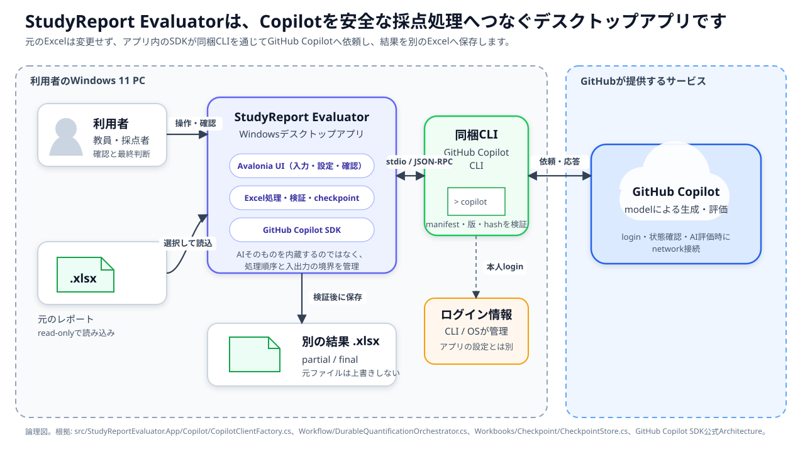
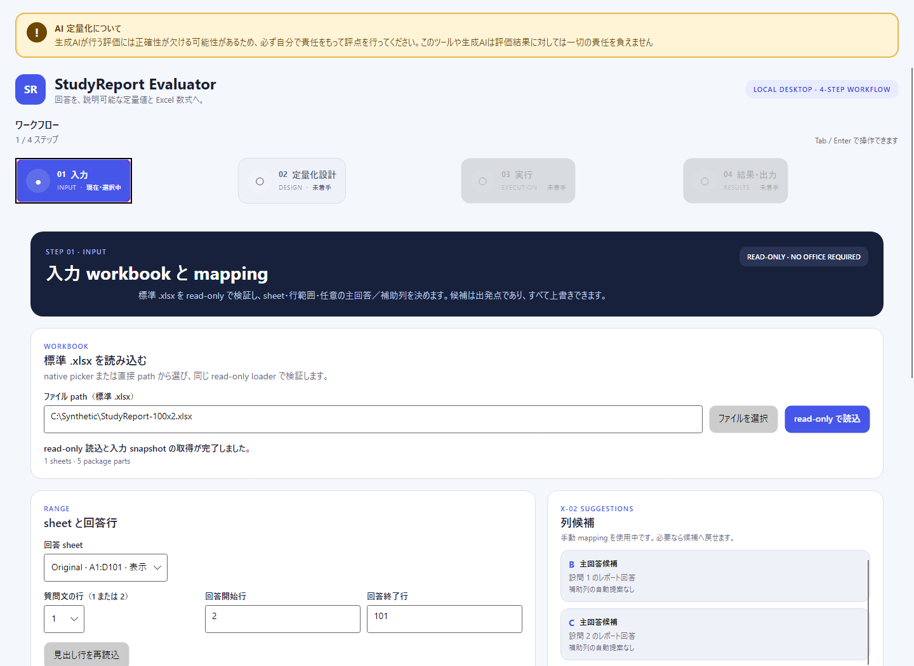
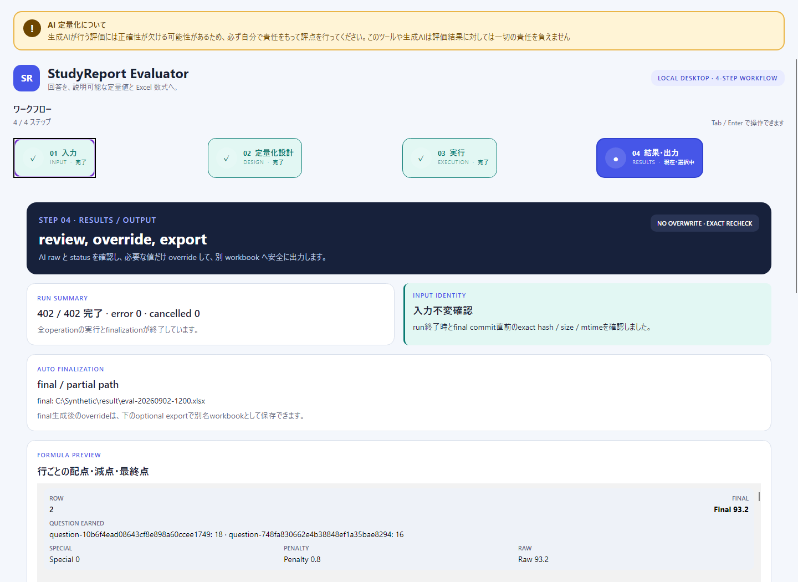

# StudyReport Evaluator

標準`.xlsx`のレポート回答をGitHub Copilotで定量化し、入力を変更せず別の`.xlsx`へ結果を作成するWindowsデスクトップアプリです。

> [!WARNING]
> 生成AIが行う評価には正確性が欠ける可能性があるため、必ず自分で責任をもって評点を行ってください。このツールや生成AIは評価結果に対しては一切の責任を負えません

AIが作る値は確認対象です。最終的な評点と利用判断は、授業目的や所属組織の方針に基づいて利用者が行ってください。Similarityは不正行為の証明ではなく、低いSimilarityも回答品質を保証しません。

## できること

- 標準`.xlsx`をread-onlyで読み込み、設問・回答列・評価方法・配点を設定する
- GitHub Copilotで参照回答、通常評価、固有評価、類似度を求める
- 参照回答・回答行の完了ごとに`.partial.xlsx`へ保存し、中断後に再開する
- 完成版を自動作成し、必要なら評価項目の修正値（override）を別名workbookへ出力する
- 未公開候補では、共通設定と任意の採点定義1件を明示保存して再利用する

## Architecture



StudyReport EvaluatorはAI modelを内蔵していません。Windowsアプリ内のGitHub Copilot SDKが、配布物に同梱され版とSHA-256を検証したGitHub Copilot CLIを起動し、CLIがGitHub Copilotサービスとの通信を担当します。アプリは入力Excelのread-only読込、採点条件、AIへ渡す範囲、結果検証、checkpoint、別Excelへの出力を管理します。

1回のrunでは検証済み同梱CLIを1つの共有Copilot clientとして起動し、AI処理ごとに一時sessionを作ります。各sessionにはその処理専用の結果提出toolだけを公開し、shell、filesystem、Web、GitHub write、MCP toolは評価sessionへ公開しません。認証・model確認・AI評価にはnetworkが必要ですが、Excel読込と採点設計はAI処理を開始せずローカルで行えます。

Component図、認証から出力までのmessage flow、変更時に同期すべき実装とtestは[ソフトウェアエンジニア向け技術ガイド](docs/technical-guid.md)を参照してください。

## 対応環境

| 項目 | 対応内容 |
|---|---|
| OS / architecture | Windows 11 x64 |
| 配布 | .NET 10 self-contained。公開`v0.8.1`はunsigned ZIP、未公開`0.8.6`候補ではunsigned単一EXEを追加。各形式にSHA-256 sidecar |
| 入力 | 標準Office Open XML `.xlsx` 1file |
| AI runtime | 配布物へ同梱したGitHub Copilot CLI。PATH上の別CLIへfallbackしません |
| AI login | 利用者本人のGitHub Copilot対話login。GUI起動とは別条件です |
| Spreadsheet runtime | Microsoft Excel、Office、LibreOfficeはアプリ実行に不要 |

`.xls`、`.xlsb`、CSV、PDF、`.xlsm`等のmacro-enabled file、password／rights-protected／暗号化workbook、安全境界に違反するpackageは対象外です。

## 公開状況・SHA-256確認・起動

現在の公開版は`0.8.1`です。[GitHub Releases](https://github.com/dahatake/StudyReport-Evaluator/releases)で現在取得できる配布物は、`v0.8.1`の`StudyReportEvaluator-win-x64.zip`と`StudyReportEvaluator-win-x64.zip.sha256`です。**この公開版には単一EXE配布も「GitHubにログイン」buttonもありません。**

> [!IMPORTANT]
> **製品候補は`0.8.6`（UNRELEASED・未公開）です。** 以下の新しい画面配置・設定保存・login buttonは候補版向けで、公開`0.8.1`の機能ではありません。版の更新は最終配布物の検証や公開の完了を意味しません。**追加ソフト未導入のOS-only環境でのclean-host試験と本人loginは未実施**です。

### 単一EXEから起動する（未公開候補・今後の主導線）

候補版の配布名は`StudyReportEvaluator-win-x64.exe`と`StudyReportEvaluator-win-x64.exe.sha256`です。公開条件を満たす最終成果物の公開後に主導線となります。未公開のdownload URLは案内しません。

目標とする起動操作は、**取得済みの`StudyReportEvaluator-win-x64.exe`をダブルクリック → 入力画面**です。ダブルクリックを1起動gestureと数え、download、任意の手動hash比較、Windowsの警告への操作、本人loginは含めません。

- 標準userがofflineでGUI、Excel読込、mapping、採点設計を利用する設計です。ただし、**clean-hostでの実証は未完了**です。
- GUI起動に.NET Runtime／SDK、PowerShell、Node.js／npm、Git、GitHub CLI（`gh`）、別Copilot CLI、Microsoft Excel／Office／LibreOffice、IDEの導入を要求しないself-contained設計です。
- 手動展開、setup script、terminalへのcommand入力、管理者昇格、repository、隣接DLL／manifest、既存CLI cache・認証情報、sidecarをGUI起動の前提にしません。
- GUI起動時にloginやAI評価は自動開始しません。AIのnetwork・account・model・組織policy上の許可は別条件です。

### 現在の公開版を起動する（v0.8.1 ZIP・今後も代替として維持）

1. 上記GitHub Releasesの`v0.8.1`から`StudyReportEvaluator-win-x64.zip`をdownloadします。
2. 任意・推奨のhash確認を行う場合は、同じreleaseの`StudyReportEvaluator-win-x64.zip.sha256`も取得し、下記の方法で照合します。
3. ZIPを新しいdirectoryへ展開します。
4. `StudyReportEvaluator-win-x64\StudyReportEvaluator.App.exe`を起動します。

単一EXEが公開された後も、ZIPとsidecarの名前および展開後の起動方法は代替経路として維持します。公開済み`v0.8.1`の配布物を候補版の内容へ差し替えることはありません。

### SHA-256の確認（利用者の手動比較は任意・推奨）

EXE／ZIPそれぞれのsidecar公開と、CI・公開判定での最終配布bytesとのhash完全一致確認は必須です。一方、**利用者の手動hash比較は任意の推奨で、sidecarは起動に必要なfileではありません。**

確認する場合は、配布fileのSHA-256が、同じrelease／候補のsidecarの先頭64文字と完全一致することを確かめます。不一致なら実行せず、正式配布元からの再取得を確認してください。同じ配布元のhash一致だけでは、発行者の真正性やSmartScreen reputationは保証されません。

確認方法は[はじめに](docs/getting-started.md)を参照してください。既存のPowerShell 7やWindows 11標準の`certutil`を利用でき、確認のために追加ソフトを導入する必要はありません。

### Windowsの警告・実行拒否

公開ZIPと候補EXEはunsignedです。SmartScreen、Smart App Control（SAC）、企業policyによる警告・実行拒否があり得ます。code signing済み、installer形式、SmartScreen reputation確立済み、すべての端末で無警告・無条件に1操作で起動できるとは表示しません。

入手元を確認できない場合やhashが不一致の場合は実行しないでください。保護機能が実行を拒否した場合は停止し、所属組織の管理者に確認してください。保護機能の無効化、MOTW除去、証明書の自動trust、execution policy変更、UAC回避は案内しません。

### 単一EXEの標準展開と残存cache

候補EXEの内容は.NET標準hostが、通常は標準userの一時領域`%TEMP%/.net/<app>/<bundle-id>/`へ展開します。展開先の書込権限と空き容量が必要です。cacheは終了後も残り、再利用され得ます。**1ファイル配布は「ディスク上も1ファイル」「痕跡なし」ではありません。** 独自の展開・cache管理UIや自動掃除は追加しません。

cacheはアプリ配置用で、入力／final／partial、利用者別設定、CLI credential storeとは別です。明示出力先が未指定の場合だけ、入力fileに隣接する`result`を使い、抽出cacheを結果保存先にはしません。配布・展開・起動のために利用者workbookを移動・削除しません。結果の扱いは[出力と再開](#出力と再開)を参照してください。

## ローカルビルドから起動するクイックスタート

このrepositoryを取得した端末で、配布物を待たずに現在のソース（`0.8.6`候補）をWindowsアプリとして起動する手順です。**一般利用者向けの入手経路ではありません。** ここで作る実行物はunsignedで、SHA-256 sidecarもGitHub Releasesの公開物もありません。配布物の入手は前節を参照してください。

以下の前提はローカルビルド固有の条件で、配布物の起動条件ではありません。

| 項目 | 内容 | 適用 | 出典 |
|---|---|---|---|
| OS | Windows 11以降（build 22000以上）のx64 OSとx64 process | B | [`scripts/publish-windows.ps1`](https://github.com/dahatake/StudyReport-Evaluator/blob/main/scripts/publish-windows.ps1)の`Assert-SupportedHost` |
| .NET SDK | `10.0.400`と同系列の最新patch（`rollForward`は`latestPatch`、prereleaseは不可） | A・B | [`global.json`](https://github.com/dahatake/StudyReport-Evaluator/blob/main/global.json) |
| PowerShell | PowerShell 7以上の`pwsh`。Windows PowerShell 5.1は非対応 | B | [`scripts/publish-windows.ps1`](https://github.com/dahatake/StudyReport-Evaluator/blob/main/scripts/publish-windows.ps1)の`#Requires -Version 7.0`／`#Requires -PSEdition Core` |
| package取得 | [`NuGet.Config`](https://github.com/dahatake/StudyReport-Evaluator/blob/main/NuGet.Config)が指定する単一package sourceへ到達できること | A・B | [`NuGet.Config`](https://github.com/dahatake/StudyReport-Evaluator/blob/main/NuGet.Config) |
| 同梱CLI取得 | `RuntimeIdentifier`指定時だけ、同梱するGitHub Copilot CLIを取得します | B | [`StudyReportEvaluator.App.csproj`](https://github.com/dahatake/StudyReport-Evaluator/blob/main/src/StudyReportEvaluator.App/StudyReportEvaluator.App.csproj)、[`scripts/publish-windows.ps1`](https://github.com/dahatake/StudyReport-Evaluator/blob/main/scripts/publish-windows.ps1) |

Microsoft Excel、Office、LibreOfficeはA・Bどちらでも不要です。

### A. GUIだけを最短で起動する（AI評価なし）

repositoryのルートで次を実行します。

```powershell
dotnet run --project .\src\StudyReportEvaluator.App\StudyReportEvaluator.App.csproj
```

ビルド後に「StudyReport Evaluator」ウィンドウが開き、入力 → 採点設計 → 実行 → 結果・出力の4ステップを操作できます。

**この方法はGitHub Copilot CLIを同梱しません。** `RuntimeIdentifier`を指定しないビルドでは`CopilotSkipCliDownload`が`true`となり（[`StudyReportEvaluator.App.csproj`](https://github.com/dahatake/StudyReport-Evaluator/blob/main/src/StudyReportEvaluator.App/StudyReportEvaluator.App.csproj)）、同梱manifest`copilot-runtime.json`を出力しません。manifestが無い場合、アプリは同梱CLIを解決できず、PATH上の別CLIへfallbackもしません（[`CopilotClientFactory.cs`](https://github.com/dahatake/StudyReport-Evaluator/blob/main/src/StudyReportEvaluator.App/Copilot/CopilotClientFactory.cs)）。したがって実行画面の認証確認・login・AI評価は利用できず、Excel読込、mapping、採点設計、設定の操作までが対象です。

この`bin`出力はself-containedではなく、起動端末に.NETが必要です。配布物と同じ前提ではありません。

### B. 配布物と同じ構成で起動する（同梱CLIあり）

AI評価まで確認する場合は、公開用と同じself-contained `win-x64`をローカルで作ります。

```powershell
pwsh.exe -NoLogo -NoProfile -File .\scripts\publish-windows.ps1
```

成功すると`artifacts\package\publish\win-x64`へ出力し、最後に出力先pathを表示します（[`scripts/publish-windows.ps1`](https://github.com/dahatake/StudyReport-Evaluator/blob/main/scripts/publish-windows.ps1)）。そのdirectoryの`StudyReportEvaluator.App.exe`を起動してください。self-containedのため、起動端末への.NET追加導入は不要です。

出力には`copilot-runtime.json`と`runtimes\win-x64\native\copilot.exe`が含まれ、アプリはmanifestのRID・版・SHA-256を検証した同梱CLIだけを使います。AI処理には、利用可能なGitHub Copilot account、本人の対話login、network接続、利用可能model、組織policy上の許可が別途必要です。GUIが起動しただけでAI利用可能とは判断しません。

### ローカルビルドの注意

- `artifacts`配下の出力はgit管理外の作業成果で、公開配布物ではありません（[`.gitignore`](https://github.com/dahatake/StudyReport-Evaluator/blob/main/.gitignore)）。第三者への配布・公開に使わないでください。
- unsignedのため、SmartScreen、Smart App Control（SAC）、企業policyによる警告・実行拒否は配布物と同様に起こり得ます。保護機能の無効化、MOTW除去、execution policy変更、UAC回避は案内しません。
- ローカルビルドの成功は、fresh Windowsのclean-host試験、本人login、公開判定の完了を意味しません。

## 5分クイックスタート

> **対象版:** 以下は**`0.8.6`（UNRELEASED・未公開）候補**の操作です。公開`0.8.1`で追加UIや設定保存を前提にしないでください。画像は合成データ・fake結果による説明用で、実認証・実保存・clean-host動作の証拠ではありません。生成時の製品版と来歴は[画像一覧](images/README.md)を参照してください。

主画面は**入力 → 採点設計 → 実行 → 結果・出力**の4ステップです。詳細編集は同じウィンドウの**設定**へ移っています。設定は第5ステップではなく、**共通／入力詳細／通常評価／固有評価／読込Prompt**の5カテゴリです。

設問・結果はコンパクトな一覧のページ切替や対象選択で全件へ到達でき、詳細は選択対象だけを表示します。全件の編集カードを同時に並べる方式ではありません。**設定から戻る**で元ステップへ戻り、同一起動中の編集・選択対象・表示ページを保持します。画面移動は保存やAI実行ではなく、「訪問済み」も準備完了・処理成功を意味しません。

### 1. 入力



1. **ファイルを選択**でnative pickerを開くか、**ファイル path（標準 .xlsx）**へfull pathを入力し、**read-only で読込**を選びます。
2. 回答sheet、質問文の行（1または2）、回答開始・終了行を確認します。
3. ページ切替や**設問**欄から対象を選び、**有効／主回答列／設問文（必須）**を確認・編集します。
4. 設問名・補助列・候補・追加／複製／並替え／削除は**入力詳細… → 設定の入力詳細**で編集します。

主回答列を選ぶと、質問文の行とその列が交差する**1セル**の値を設問文へ即座に反映します。選び直すと手入力も置き換わり、空セルなら設問文も空になります。質問文の行を変えた場合は**見出し行を再読込**してください。

mapping候補は確定値ではありません。見出しと授業設計に合わせ、同じ設問の主回答列と補助列を重複させないでください。技術エラーは**問題箇所へ**などから対象を確認して修正します。

### 2. 採点設計

- **基礎配点**（Base、既定60）、**固有配点**（Special、既定0）、**類似度減点係数**（0〜1、既定0.1）を設定します。
- 主画面で選択設問の**有効／配点**を編集し、通常評価・固有評価と計算式の概要を確認します。設問配点は絶対配点で、ページ切替だけでは編集中の設問を変更しません。
- ページ外を含む**全enabled（有効）設問**について、`Base + Special + enabled Question points = 100`を**丸めず正確に**満たします。合計・過不足を確認し、手動配点の再配分は**設問配点を均等化**を選んだ場合だけ行います。
- Knowledge／Custom、評価項目（criterion）のrange・weight・Promptの詳細は**設定 → 通常評価**へ、別sourceを扱う固有評価は**設定 → 固有評価**へ進みます。定義名・revision・丸め桁数は**共通**で編集します。

Knowledgeの固定Promptは読取専用、Custom Promptは編集可能です。通常Customでは`{回答}`と`{評価項目}`、固有評価では`{回答}`が必須です。全文編集・合成値のプレビュー・読込Promptの適用は設定内で行い、AI評価は開始しません。詳しくは[設定ガイド](docs/settings.md)を参照してください。

### 3. 実行

実行画面の**モデル・並列度・実効出力先は読取専用**です。編集は**変更 → 設定の共通**で行います。認証確認・login、新規／再開、開始・cancelは実行画面に残っています。

1. **Copilot 状態を確認**を明示的に選びます。未認証なら、候補版の**GitHubにログイン**で同梱native CLIのconsole／ブラウザーを開き、本人が対話loginします。完了・取消・失敗後は同じ状態確認buttonで再確認してください。processの起動・終了だけを認証成功とは扱いません。
2. **変更 → 共通**で、列挙された通常モデル、並列度（1〜16、既定8）、指定出力先を確認・変更します。保存希望modelが利用不可なら未選択のままで、別modelへfallbackしません。Reference／通常評価／固有評価は同じ通常モデルとrun-level reasoning effort（既定希望`low`、非対応時は未指定）を使います。Similarityはローカル計算でLLMを呼びません。
3. **設定から戻る**で実効値と新規／checkpoint再開を確認します。再開する場合は既存の`.partial.xlsx`を指定します。
4. 技術検証を通過したら**定量化を開始**を選びます。予約された出力pathの表示だけではfile作成・保存成功を意味しません。

run中は1つのCopilot CLI processを共有し、複数の学生行を最大並列度の範囲で先行処理します。checkpointはsource row順の連続した完了prefixだけを保存するため、再開時の出力順序は決定的です。rate limitを検出した場合は一時的に待機し、有効並列度を下げます。quota exhaustedは無限再試行せず、その時点までのpartialを残して停止します。

**公開`v0.8.1`にはlogin buttonがありません。** 同梱CLIで本人loginを行い、アプリの状態確認buttonで確認する手順は[はじめに](docs/getting-started.md)を参照してください。どちらの版でもアプリへpassword、PAT、token、device codeを入力しないでください。

AI処理には、利用可能なGitHub Copilot account、本人認証、network接続、利用可能model、組織policy上の許可が別途必要です。GUI表示やlogin完了だけでAI利用可能とは判断しません。起動引数・Prompt適用・状態確認でloginやAI評価を暗黙に開始せず、login後もmodelを自動変更したりAI評価を自動開始したりしません。

SimilarityはLLMへ送らず、NFKC正規化・空白／句読点／記号除去・文字n-gram・最長共通substringに基づくローカル決定的計算で求めます。Excel列名は互換性のため`.Similarity_AI_Raw`を維持します。結果には、参照回答との表層コピー傾向に加えて、同じ設問の他学生回答との最大類似度（`.Similarity_Peer_Max`、`.Similarity_Peer_Row`）も情報として出力します。Similarityは不正行為の証明ではなく、低いSimilarityも回答品質を保証しません。

候補版の**ログインを取り消す**またはアプリ終了で終了するのは、このアプリが開始・所有した当該login CLI processだけです。ブラウザーや他のCLI、保存済みcredentialを終了・削除しません。loginの二重開始・評価中の開始を防ぎ、取消・失敗後もExcel読込、mapping、設計編集、checkpoint確認は利用できます。CLI欠落・不一致時は配布物の再取得／展開状態を確認し、PATH上の別CLI導入やhash検証の緩和で回避しません。

**開始済みrunの入力・採点定義・モデル・並列度・出力条件と予約済みpathは固定**されます。実行中に編集する設定は次回用で、現在runを変更しません。他ステップ・設定でも下部の**進捗へ／停止**を利用できます。**cancel**後は新しいAI送信を始めず、最後に保存された完了行までのpartialを保持します。設定表示中に完了しても強制移動せず、**4 結果**から結果を確認できます。

### 4. 結果・出力



1. 一覧で**元の行／最終点／固有点／類似減点／状態／設問別得点**、上部でfinal／partialと警告を確認します。成功・回答空欄・取消・未処理／未確定・技術エラーを区別し、完了件数を成功件数とはみなしません。
2. **前／次**のページ切替や**元の行番号 → 移動**で対象行を選び、**詳細・override**で設問・評価方法・criterionを選びます。選択した1 criterionのAI raw、range、status、overrideと、適用値・正規化・Final raw等の計算previewを確認できます。理由・根拠の本文は出力workbookで確認します。
3. 編集可能な通常criterionへrange内の任意overrideを入力します。空欄に戻すと解除され、AI rawは保持します。**エラー … 件・次へ**でページ外を含む問題箇所へ移動して修正できます。固有評価・類似度のoverride欄はありません。
4. **別名 workbook 出力**へ既存directory内の未使用の`.xlsx` pathを指定し、**検証して出力**を選びます。成功後の**保存済み修正版**とpathを確認してください。入力・既存final／partialは上書きしません。

一覧／詳細やページを往復してもoverrideは保持します。**未保存の override あり**や出力先候補は保存完了ではなく、出力中に再編集した版は、先の出力が成功しても未保存のまま残り得ます。**設定を保存**では結果・overrideを保存しません。前回結果は次回設定から分離され、次回用の編集で自動再評価されません。

## 設定の保存と再利用

候補版では、共通設定と**任意の採点定義1件**を利用者別の`setting.txt`へ保存できます。通常の場所は`%LOCALAPPDATA%\StudyReportEvaluator\setting.txt`、内容は**UTF-8 JSON・`schemaVersion`は整数`1`**です。EXEや入力workbook、runtime cacheとは別の場所です。

- **設定を保存**で明示保存します。画面移動・編集・終了では自動保存せず、初回は明示保存までfileを作りません。保存失敗時は旧fileと現在の編集を保持します。保存中の再編集は、その保存が成功しても未保存として残り得ます。
- 起動時や**設定を再読込**で通常モデルの希望ID・並列度・指定出力先を復元します。希望IDの復元は認証済み・利用可能という判定ではありません。採点定義は保持するだけで自動適用しません。
- Excel読込後、**設定 → 共通 → 保存定義 → 現在の入力に適用**を明示的に選びます。検証成功時だけ現在の入力・採点設計へ反映し、失敗・取消時は変更しません。実行中の一括適用はできません。読込・保存・適用から認証確認・login・AI評価は開始しません。
- **指定出力先**は完全修飾の絶対path、または空欄（`outputDirectoryOverride: null`）です。保存した明示指定は再起動・入力変更後も保持します。`null`の場合だけ現在の入力に隣接する`result`を算出し、算出path自体は保存しません。入力未選択なら**入力後に決定**です。利用できない指定先から別pathへfallbackしません。

保存範囲・再読込の注意は[設定ガイド](docs/settings.md)を参照してください。[画像一覧](images/README.md)の08は保存先未構成（NO STORE）の合成デモで、読込・保存が無効です。本番アプリは利用者別保存先を解決するため、画像は手動setupを求める手順ではありません。

## 点数の読み方

有効Questionを$q=1..N$とします。

$$
BasePoints + SpecialPoints + \sum_{q=1}^{N}QuestionPoints_q = 100
$$

$$
QuestionEarned_q=QuestionPoints_q\times QuestionRate_q
$$

$$
SimilarityPenalty_q=QuestionPoints_q\times Similarity_q\times SimilarityPenaltyWeight
$$

$$
FinalRaw=BasePoints+\sum_q QuestionEarned_q+SpecialEarned-\sum_q SimilarityPenalty_q
$$

Final scoreはFinal rawを0〜100へ収めた表示用の値です。

- 主回答が空と確定した完了行: Normal／SimilarityのAI callなし、Question earnedとSimilarityは0相当
- 非空回答の技術的AI失敗: 対象値はblank
- 取消・未処理／未確定: 未確定値はblankで、0点とはしない
- 必要な値がblank: Final raw / Final scoreもblank

0とblank（画面では**—**）は意味が異なります。詳しくは[機能と点数](docs/features.md)を参照してください。

## 出力と再開

新規runの出力先は**設定 → 共通**の指定値を使い、未指定（`null`）の場合だけ入力fileに隣接する`result`となります。EXE配置先や.NETの抽出cacheを既定先にはしません。

- final: `eval-yyyyMMdd-HHmm[-NN].xlsx`
- partial: `eval-yyyyMMdd-HHmm[-NN].partial.xlsx`

既存final/partialがある場合は、共通の次suffixを使って上書きを避けます。参照回答の完了ごと・回答行の完了ごとにcheckpointを保存します。cancelまたはprocess終了後は、実行画面で**checkpoint から再開**を選び、入力・定義・model・reasoning effort・runtimeの照合後に保存済み参照回答と完了行を再利用します。処理途中の行は完了扱いにせず、最初の未完了行から続けます。再開時はcheckpoint内の予約pathを使い、新規run用の出力先で置き換えません。

finalの保存成功後はpartialを削除します。partialの削除だけが失敗した場合は完成版を無効にせず、cleanup警告と残存pathを表示します。

finalは入力workbookの全sheetを保持し、次を追加します。

- `Quantification_Config`
- `Quantification_References`
- `Quantification_Results`
- `Quantification_Run`

同名sheetが入力にある場合は既存sheetを変更せず、` (2)`等の一意名を使います。partialは入力全体と`Quantification_Checkpoint`を含みます。

## データとprivacy

回答データとしてAIへ送るのは、処理に必要なcurrent rowの選択済みprimary／supporting／special sourceだけです。処理に応じてQuestion text、Prompt、criterion metadata、Reference、closed schema metadataも送ります。他row、非選択列、workbook pathは通常payloadへ含めません。

application logは回答、Prompt、Reference、reason、evidence、credentialを受け取るfree-text surfaceを持ちません。

**`setting.txt`は暗号化されていない平文です。** 回答行本文を自動収集して保存するものではありませんが、見出しセルから取り込んだ設問文や、設問・Prompt・評価基準へ貼り付けた学生回答・氏名・秘密情報は、定義の明示保存時に含まれ得ます。秘密情報を貼り付けず、実設定fileを共有・公開しないでください。入力xlsxのpath・bytes、AI結果、参照回答、override、checkpoint状態、認証状態、未適用Promptのfile一覧は設定の保存対象外です。

本人認証とcredential保管は同梱CLI／ブラウザーに委譲します。アプリの認証処理はpassword、PAT、token、device codeを入力・収集・解析・保存・log出力しません。runtime抽出cache、利用者workbook、CLI credential storeは別のものとして扱い、アプリがcacheの再帰削除やcredentialの削除・logoutを行うことはありません。

final/partialには入力全体、Prompt、Reference、AI結果が含まれ得ます。入力と同等以上に機密なfileとして扱ってください。詳しくは[データとprivacy](docs/privacy-and-data-handling.md)を参照してください。

## Promptファイルから起動する

任意の高度な起動方法です。通常のGUI起動にcommand入力は不要です。未公開候補の`StudyReportEvaluator-win-x64.exe`と、公開`v0.8.1` ZIPの`StudyReportEvaluator.App.exe`は、次の起動引数を扱います。

- `--input`は0または1回
- `--prompt`は0回以上、指定順を維持
- 相対pathは起動時のcwdが基準。EXE配置先や抽出cacheを基準に変更しません。日本語・空白を含むpathも扱います
- Prompt fileはstrict UTF-8の`.txt`、1〜32,767文字
- 候補版では**設定 → 読込Prompt**で原文と適用先を選び、**Promptを適用**した時だけCustom／固有評価のtemplateへcopy
- 起動引数やPrompt適用ではloginもAI処理も自動開始しません。AI処理はExecution画面の明示操作まで開始しません。候補版のlogin buttonも別の明示操作が必要です

詳しい例は[Promptファイルから起動](docs/prompt-launch.md)を参照してください。

## 制限と非保証

- macOS、Linux、Windows Arm64は初版対応対象外です。
- installer、code signing、notarizationを提供しません。
- development MSIXは非公開の開発用検証だけで、一般利用者向けinstallerではありません。
- 自動更新・差分更新、online bootstrap、独自cache管理／自動掃除、常駐service、file associationは追加しません。更新時は正式に公開された配布物を利用者が取得します。
- 保存済みfinal workbookのアプリへの再importと、複数definition profileの管理・切替は提供しません。候補版の採点定義1件の明示保存・適用とは別です。
- AI品質、教育的妥当性、公平性、法的適合性、組織policy適合性、不正行為を保証・判定しません。
- 未実測の処理時間、token数、費用を保証しません。

## ガイド

公開版と未公開候補を区別し、各ガイドの対象版を確認してください。

- [はじめに](docs/getting-started.md)
- [設定の保存と適用](docs/settings.md)
- [機能と点数](docs/features.md)
- [Custom evaluator](docs/custom-evaluator-guide.md)
- [技術アーキテクチャとカスタマイズ](docs/technical-guid.md)
- [Promptファイルから起動](docs/prompt-launch.md)
- [データとprivacy](docs/privacy-and-data-handling.md)
- [トラブルシューティング](docs/troubleshooting.md)

## ライセンス

[MIT License](LICENSE)。同梱ソフトウェアのライセンスは[第三者通知](docs/third-party-notices.md)を参照してください。
