# StudyReport Evaluator 開発・保守ドキュメント

対象読者は開発者、アーキテクト、QA、リリース担当です。利用者向け文書は[`docs/`](../../docs/README.md)を参照してください。

現在のソース候補は**`0.8.6`（UNRELEASED・未公開）**、要求版はv4.6、公開済みは`v0.8.1`のunsigned ZIP／sidecarです。T01〜T38とF01はREVIEWED、T39は追加native FAILと本人確認等の外部前提によりBLOCKEDです。利用者不在時の自律続行指示によりF01／F02を進めますが、G4・全タスクDONE・公開PASSを付与しません。

F02の最終版再検証は本同期時点では親担当で未完了です。以後は[実行記録](archive/work/20260907-ui-settings-execution-record.md)の最新F02欄を参照してください。[実装状態](implementation-status.md)は、0.8.4のT36文書contract・T37実ZIP・T38実EXE・T39自動回帰／MSIX機構確認と、追加native FAIL／Narrator・本人walkthrough・隔離利用者保存の未実施を分けています。旧証跡を0.8.6最終artifactの成功へ流用しません。

## 現行正本

| 文書 | Persona | 内容 |
|---|---|---|
| [実装状態](implementation-status.md) | 開発、QA、リリース | 現在の実装済みsurface、生成gate、post-gate gap closure |
| [アプリケーション版管理手順](version-management.md) | 開発、QA、リリース | SemVer、版変更tool、検証、tag、GitHub Release、failure handling |
| [アーキテクチャ](architecture.md) | 開発、アーキテクト | dependency、run、Copilot、UI、output data flow |
| [詳細設計書](detailed-design.md) | 開発、アーキテクト、QA | v4 domain、AI operation、formula、checkpoint、UI、Windows/macOS delivery設計 |
| [UI・設定のlayout契約](ui-layout-contract.md) | UI開発、QA | T01契約履歴、T26 headless測定、T27実file E2E、T28画像、T39追加native／人手確認の分離 |
| [Excel / formula契約](excel-contract.md) | 開発、Excel監査、QA | sheet、formula、blank、preflight、atomic commit |
| [Traceability](traceability.md) | QA、リリース | AC / TR / implementation / test / gate対応 |
| [README claim台帳](readme-claim-ledger.md) | QA、リリース | 行ごとの検証範囲、未実施条件と公開claimの制限 |
| [要求定義書](../../docs/requirements-definition.md) | 要求所有者、QA | v4.6規範baseline。製品0.8.6・公開0.8.1と独立 |
| [ADR-0012](adr/0012-point-allocation-similarity-resume-portability.md) | アーキテクト | 配点、AI operation、formula、checkpoint、Prompt起動 |
| [ADR-0013](adr/0013-windows-only-public-release.md) | アーキテクト、リリース | 現行platform/release scope decision |
| [ADR-0014](adr/0014-product-versioning.md) | アーキテクト、リリース | 製品SemVer、単一正本、tag/release identity |
| [ADR-0015](adr/0015-windows-macos-installer-delivery.md) | アーキテクト、リリース、QA | Windows ZIP public、development MSIX、macOS source foundation |
| [ADR-0016](adr/0016-windows-one-action-startup.md) | アーキテクト、リリース、QA | App限定Windows単一EXE、login導線、matrix v2、clean-host公開境界 |
| [Windows単一EXEの方式適合](preflight/windows-singlefile-feasibility.md) | 開発、QA、リリース | 固定.NET／SDK／CLIでの開発host適合結果と未実施clean-host境界 |
| [Screenshot manifest](../../images/README.md) | UI開発、QA、利用者支援 | 8枚の合成説明画像。T28の生成履歴は`0.8.4`・1440×1050・2回hash一致。現在のソース`0.8.6`での再生成やnative／実保存の証拠ではない |

## 履歴文書

過去の計画・実行記録・証跡は[作業記録アーカイブ](archive/work/README.md)から参照できます。

ADR-0012はADR-0011のv3評価契約をsupersedeし、入力不変、closed AI result、Excel formula ownership、2-project構成等をcarry forwardします。ADR-0013はcurrent public evidenceをWindows 11 x64初版へ限定した記録です。ADR-0014は製品SemVerとrelease identityを定義します。ADR-0015はv4.3でWindows ZIPをpublic artifact、development MSIXをnon-public mechanism、macOSをsource foundationとするdelivery境界を定義します。ADR-0016はv4.5でApp限定single-file EXEを将来の主配布、ZIPを代替とし、fresh clean-host CH-01〜06とprotected publishを公開条件に追加します。

```mermaid
flowchart LR
    V1[requirements v1.x\nADR-0001..0009] -->|historical| V2[requirements v2.0\nADR-0010]
    V2 -->|superseded evaluation model| V3[requirements v3.0\nADR-0011]
    V3 -->|superseded score / workflow| V4[requirements v4.0\nADR-0012]
    V4 -->|verified release scope| V41[requirements v4.1\nADR-0013]
    V41 --> V42[requirements v4.2\nADR-0015 delivery expansion]
    V42 --> V43[requirements v4.3\nWindows ZIP + development MSIX]
    V43 --> V44[requirements v4.4\nprimary column to question text]
    V44 --> V45[requirements v4.5\nWindows single-file + login + matrix v2]
    V45 --> V46[requirements v4.6\nUI + explicit settings save / apply]
    V46 --> IMPL[current source + deterministic tests]
    V3 --> GATE[historical v3 gate evidence]
    GATE --> AUDIT[post-gate conformance audit\n2 gaps found]
    AUDIT --> CLOSE[commit 69e4b99\n2 gaps closed]
    CLOSE --> REGATE[new GATE-ACCEPTANCE\nPASS at 3f4227e]
```

次の文書は設計経緯・当時の証拠としてのみ参照します。

- `adr/0001-*`〜`adr/0011-*`
- `preflight/document-pipeline.md`
- `preflight/fixture-plan.md`
- `preflight/governance-inputs.md`
- `preflight/report-definition-contract.md`
- `release/p1-disposition.md`

個別文書内の「承認済み」「BLOCKED」「初回正式版」は、その旧scope・記録日時点の状態です。現行実装状態へ読み替えません。

## Gate-time snapshot

- `preflight/gate-result.md`はGATE-0時点のsnapshotです。
- `preflight/requirements-baseline.md`はB-03時点のbaseline identityです。
- `preflight/implementation-task-file-map.md`はtask所有pathの記録です。「future」「pending」は当時の進捗であり、現在状態ではありません。
- `preflight/sample-workbook-profile.md`は現行sampleのread-only構造profileとして有効です。

## Source of truthの優先順位

1. current production source
2. current deterministic tests
3. current requirements v4.6 / ADR-0012 / ADR-0013 / ADR-0014 / ADR-0015 / ADR-0016 / detailed design / version-management
4. generated ignored gate・performance・package evidence
5. historical ADR・preflight

`artifacts/`は再実行で変化し、Gitへcommitされないため、永続するrelease noteの代わりにはなりません。根拠: [`traceability.md`](traceability.md#evidence-integrity-and-storage)。

監査済み`0.8.3`候補のbaselineはsource `20c8121c2474a13f409c0d7f0fde9d4c41f74698`（集約記録: `artifacts/test/final-recovery-20c8121/phases.json`）です。公開`v0.8.1`の証跡と区別し、今回reviewの編集・その後の変更は再検証完了までこのPASSに含めません。

## Windows単一EXEの開発入口

| Surface | Source / test |
|---|---|
| App限定profile | [`WindowsSingleFile.pubxml`](../../src/StudyReportEvaluator.App/Properties/PublishProfiles/WindowsSingleFile.pubxml)、[`WindowsSingleFileProfileTests.cs`](../../tests/StudyReportEvaluator.App.Tests/Packaging/WindowsSingleFileProfileTests.cs) |
| locked publish | [`publish-windows.ps1`](../../scripts/publish-windows.ps1)の`-SingleFile`、[`packages.win-x64-singlefile.lock.json`](../../src/StudyReportEvaluator.App/packages.win-x64-singlefile.lock.json)、[`WindowsSingleFilePublishTests.cs`](../../tests/StudyReportEvaluator.App.Tests/Packaging/WindowsSingleFilePublishTests.cs) |
| EXE／sidecar package | [`package-windows-singlefile.ps1`](../../scripts/package-windows-singlefile.ps1)、[`WindowsSingleFileArtifactTests.cs`](../../tests/StudyReportEvaluator.App.Tests/Packaging/WindowsSingleFileArtifactTests.cs) |
| 実EXEの開発host検証 | [`test-windows-singlefile.ps1`](../../scripts/test-windows-singlefile.ps1)、[`WindowsSingleFilePackageTests.cs`](../../tests/StudyReportEvaluator.App.Tests/Packaging/WindowsSingleFilePackageTests.cs) |
| login導線 | [`BundledCopilotLoginService.cs`](../../src/StudyReportEvaluator.App/Copilot/BundledCopilotLoginService.cs)、[`BundledCopilotLoginServiceTests.cs`](../../tests/StudyReportEvaluator.App.Tests/Copilot/BundledCopilotLoginServiceTests.cs)、[`CopilotLoginCommandTests.cs`](../../tests/StudyReportEvaluator.App.Tests/UI/CopilotLoginCommandTests.cs) |
| matrix v2／公開制御 | [`platform-release-matrix-v2.schema.json`](../../eng/schemas/platform-release-matrix-v2.schema.json)、[`ReleaseMatrixBuilderTests.cs`](../../tests/StudyReportEvaluator.App.Tests/Packaging/ReleaseMatrixBuilderTests.cs)、[`ReleaseWorkflowContractTests.cs`](../../tests/StudyReportEvaluator.App.Tests/Packaging/ReleaseWorkflowContractTests.cs) |

`test-windows-singlefile.ps1`の`-DevelopmentOnly`での成功statusは`PASS_DEVELOPMENT`、clean sourceを要求する既定モードでは`PASS_REQUIRED`です。どちらもfresh Windows 11 x64、MOTW／Windows保護、本人loginのCH-01〜06を代替せず、新EXEの公開資格を単独では与えません。正確な状態は[実装状態](implementation-status.md)と[Traceability](traceability.md)を参照してください。

2026-09-05の[敵対的レビューと修正記録](archive/work/20260905-adversarial-review.md)の最終検証は、`artifacts/test/adversarial-review/final/summary.json`で対象commit、全体status、TRX件数・SHA-256、前後のsource不変を照合してください。これは当時の履歴で、F02の0.8.6再検証ではありません。記録がない／`RUNNING`／`FAILED`の場合は完了扱いにしません。

historical fileへ追加した先頭bannerはpost-gate navigation metadataです。本文内のbytes / SHA-256 / commit identityは、明記されたhistorical content commitのbytesを指し、banner追加後のworking-tree bytesを指しません。

## 長時間エージェントの復旧

- `model_max_prompt_tokens_exceeded`はCopilotへの入力コンテキスト超過であり、本アプリの例外やテスト失敗とは区別する。同じ要求の再送だけでは入力は減らない。
- このworkspaceでは自動要約を有効にし、閾値をcontext windowの50%に設定する。`chat.agent.maxRequests=50`は反復回数の制限であり、token上限を増やす設定ではない。50%は本workspaceの予防的な設定値で、上限超過を必ず防ぐ保証ではない。
- 既に超過した会話は`/compact`またはcontext windowメニューのCompact Conversationで縮約する。失敗する場合は新しい会話へ、commit、未完了項目、証跡のfile pathだけを引き継ぐ。会話保存fileの直接編集・削除は行わない。[VS Code — Manage session context](https://code.visualstudio.com/docs/agents/run/sessions/manage-sessions#_manage-session-context)
- 大きなログ・同じ画像・読了済み資料を繰り返し添付しない。ログ調査はエラー行と集計を先に確認する。[VS Code — Troubleshoot AI](https://code.visualstudio.com/docs/agents/agent-troubleshooting/troubleshooting#_debug-chat-interactions)
- build、test、publishは同じcheckoutで同時実行しない。複雑なPowerShell処理は`.ps1`として構文確認後に実行し、終了コードを確認する。`foreach (...) { ... }`の直後へ直接パイプを付けず、結果を変数に代入してから処理する。

## Pinned toolchain

| Item | Pinned value | Source |
|---|---:|---|
| Product version | `0.8.6` candidate（UNRELEASED・未公開） | [`Directory.Build.props`](../../Directory.Build.props)、[版管理手順](version-management.md) |
| .NET SDK | 10.0.400、latestPatch | [`global.json`](../../global.json) |
| Target framework | `net10.0` | [`Directory.Build.props`](../../Directory.Build.props) |
| Avalonia | 12.1.1 | [`Directory.Packages.props`](../../Directory.Packages.props) |
| DocumentFormat.OpenXml | 3.5.1 | [`Directory.Packages.props`](../../Directory.Packages.props) |
| GitHub.Copilot.SDK | 1.0.11 | [`Directory.Packages.props`](../../Directory.Packages.props) |

## External specifications

- Product version: [Semantic Versioning 2.0.0](https://semver.org/spec/v2.0.0.html)（2026-09-02確認）
- Excel limits: Microsoft [Excel specifications and limits](https://support.microsoft.com/office/excel-specifications-and-limits-1672b34d-7043-467e-8e27-269d656771c3)（2026-09-01確認）
- Open XML formula / cached value: Microsoft [Working with formulas](https://learn.microsoft.com/office/open-xml/spreadsheet/working-with-formulas)（2026-09-01確認）
- .NET self-contained deployment: Microsoft [.NET application publishing overview](https://learn.microsoft.com/dotnet/core/deploying/#publish-as-self-contained)（2026-09-01確認）
- Windows MSIX: Microsoft [Choose a distribution path](https://learn.microsoft.com/windows/apps/package-and-deploy/choose-distribution-path)、[Sign an MSIX package](https://learn.microsoft.com/windows/msix/package/signing-package-overview)（2026-09-03確認）
- macOS delivery: Avalonia [macOS deployment](https://docs.avaloniaui.net/docs/deployment/macos)、Apple [Notarizing macOS software](https://developer.apple.com/documentation/security/notarizing-macos-software-before-distribution)（2026-09-03確認）
