# StudyReport Evaluator 開発・保守ドキュメント

対象読者は開発者、アーキテクト、QA、リリース担当です。利用者向け文書は[`docs/`](../../docs/README.md)を参照してください。

## 現行正本

| 文書 | Persona | 内容 |
|---|---|---|
| [実装状態](implementation-status.md) | 開発、QA、リリース | 現在の実装済みsurface、生成gate、post-gate gap closure |
| [アプリケーション版管理手順](version-management.md) | 開発、QA、リリース | SemVer、版変更tool、検証、tag、GitHub Release、failure handling |
| [アーキテクチャ](architecture.md) | 開発、アーキテクト | dependency、run、Copilot、UI、output data flow |
| [詳細設計書](detailed-design.md) | 開発、アーキテクト、QA | v4 domain、AI operation、formula、checkpoint、UI、Windows/macOS delivery設計 |
| [Excel / formula契約](excel-contract.md) | 開発、Excel監査、QA | sheet、formula、blank、preflight、atomic commit |
| [Traceability](traceability.md) | QA、リリース | AC / TR / implementation / test / gate対応 |
| [要求定義書](../../docs/requirements-definition.md) | 要求所有者、QA | v4.3規範baseline |
| [ADR-0012](adr/0012-point-allocation-similarity-resume-portability.md) | アーキテクト | 配点、AI operation、formula、checkpoint、Prompt起動 |
| [ADR-0013](adr/0013-windows-only-public-release.md) | アーキテクト、リリース | 現行platform/release scope decision |
| [ADR-0014](adr/0014-product-versioning.md) | アーキテクト、リリース | 製品SemVer、単一正本、tag/release identity |
| [ADR-0015](adr/0015-windows-macos-installer-delivery.md) | アーキテクト、リリース、QA | Windows ZIP public、development MSIX、macOS source foundation |
| [Screenshot manifest](../../images/README.md) | UI開発、QA、利用者支援 | 7枚のproduction view renderと合成fixture provenance |

## 履歴文書

ADR-0012はADR-0011のv3評価契約をsupersedeし、入力不変、closed AI result、Excel formula ownership、2-project構成等をcarry forwardします。ADR-0013はcurrent public evidenceをWindows 11 x64初版へ限定した記録です。ADR-0014は製品SemVerとrelease identityを定義します。ADR-0015はv4.3でWindows ZIPをpublic artifact、development MSIXをnon-public mechanism、macOSをsource foundationとするdelivery境界を定義します。

```mermaid
flowchart LR
    V1[requirements v1.x\nADR-0001..0009] -->|historical| V2[requirements v2.0\nADR-0010]
    V2 -->|superseded evaluation model| V3[requirements v3.0\nADR-0011]
    V3 -->|superseded score / workflow| V4[requirements v4.0\nADR-0012]
    V4 -->|verified release scope| V41[requirements v4.1\nADR-0013]
    V41 --> V42[requirements v4.2\nADR-0015 delivery expansion]
    V42 --> V43[requirements v4.3\nWindows ZIP + development MSIX]
    V43 --> IMPL[current source + deterministic tests]
    IMPL --> GATE[generated gate evidence]
    GATE --> AUDIT[post-gate conformance audit\n2 gaps found]
    AUDIT --> CLOSE[commit 69e4b99\n2 gaps closed]
    CLOSE --> REGATE[new GATE-ACCEPTANCE\nPASS at 3f4227e]
```

次の文書は設計経緯・当時の証拠としてのみ参照します。

- `adr/0001-*`〜`adr/0011-*`
- `preflight/document-pipeline.md`
- `preflight/fixture-plan.md`
- `preflight/governance-inputs.md`
- `preflight/report-definition-contract.md`
- `release/p1-disposition.md`

個別文書内の「承認済み」「BLOCKED」「初回正式版」は、その旧scope・記録日時点の状態です。現行実装状態へ読み替えません。

## Gate-time snapshot

- `preflight/gate-result.md`はGATE-0時点のsnapshotです。
- `preflight/requirements-baseline.md`はB-03時点のbaseline identityです。
- `preflight/implementation-task-file-map.md`はtask所有pathの記録です。「future」「pending」は当時の進捗であり、現在状態ではありません。
- `preflight/sample-workbook-profile.md`は現行sampleのread-only構造profileとして有効です。

## Source of truthの優先順位

1. current production source
2. current deterministic tests
3. current requirements v4.3 / ADR-0012 / ADR-0013 / ADR-0014 / ADR-0015 / detailed design / version-management
4. generated ignored gate・performance・package evidence
5. historical ADR・preflight

`artifacts/`は再実行で変化し、Gitへcommitされないため、永続するrelease noteの代わりにはなりません。根拠: [`traceability.md`](traceability.md#evidence-integrity-and-storage)。

historical fileへ追加した先頭bannerはpost-gate navigation metadataです。本文内のbytes / SHA-256 / commit identityは、明記されたhistorical content commitのbytesを指し、banner追加後のworking-tree bytesを指しません。

## Pinned toolchain

| Item | Pinned value | Source |
|---|---:|---|
| Product version | `0.8.1` candidate | [`Directory.Build.props`](../../Directory.Build.props)、[版管理手順](version-management.md) |
| .NET SDK | 10.0.400、latestPatch | [`global.json`](../../global.json) |
| Target framework | `net10.0` | [`Directory.Build.props`](../../Directory.Build.props) |
| Avalonia | 12.1.1 | [`Directory.Packages.props`](../../Directory.Packages.props) |
| DocumentFormat.OpenXml | 3.5.1 | [`Directory.Packages.props`](../../Directory.Packages.props) |
| GitHub.Copilot.SDK | 1.0.11 | [`Directory.Packages.props`](../../Directory.Packages.props) |

## External specifications

- Product version: [Semantic Versioning 2.0.0](https://semver.org/spec/v2.0.0.html)（2026-09-02確認）
- Excel limits: Microsoft [Excel specifications and limits](https://support.microsoft.com/office/excel-specifications-and-limits-1672b34d-7043-467e-8e27-269d656771c3)（2026-09-01確認）
- Open XML formula / cached value: Microsoft [Working with formulas](https://learn.microsoft.com/office/open-xml/spreadsheet/working-with-formulas)（2026-09-01確認）
- .NET self-contained deployment: Microsoft [.NET application publishing overview](https://learn.microsoft.com/dotnet/core/deploying/#publish-as-self-contained)（2026-09-01確認）
- Windows MSIX: Microsoft [Choose a distribution path](https://learn.microsoft.com/windows/apps/package-and-deploy/choose-distribution-path)、[Sign an MSIX package](https://learn.microsoft.com/windows/msix/package/signing-package-overview)（2026-09-03確認）
- macOS delivery: Avalonia [macOS deployment](https://docs.avaloniaui.net/docs/deployment/macos)、Apple [Notarizing macOS software](https://developer.apple.com/documentation/security/notarizing-macos-software-before-distribution)（2026-09-03確認）
