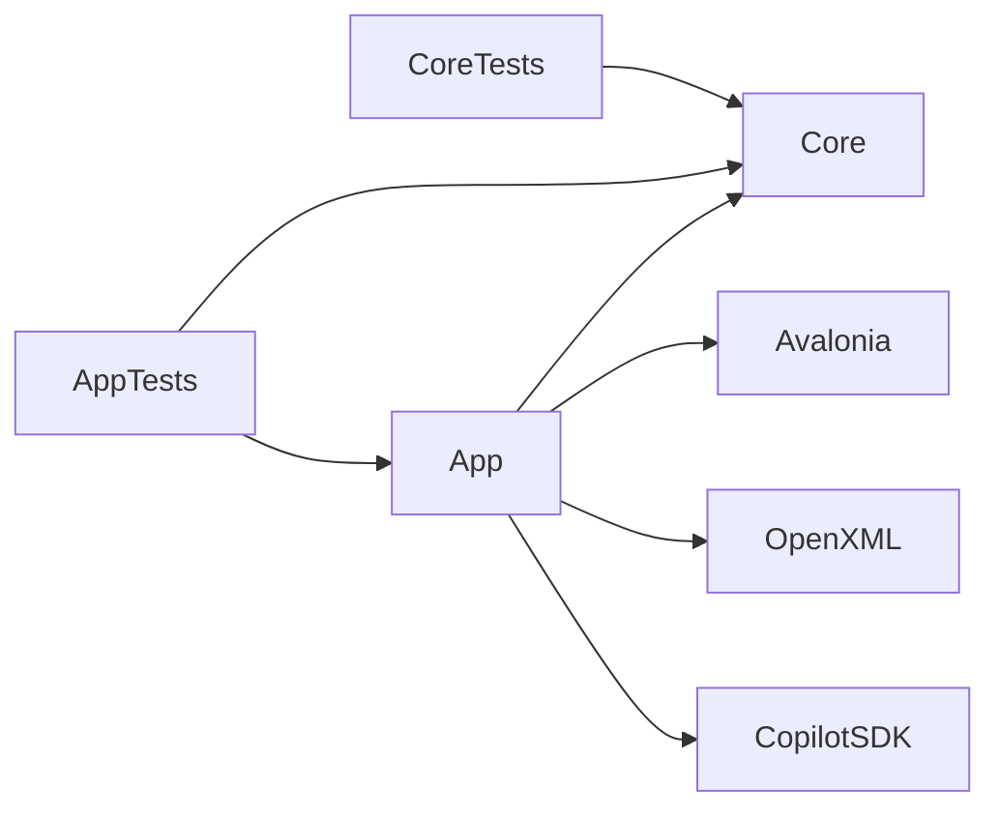
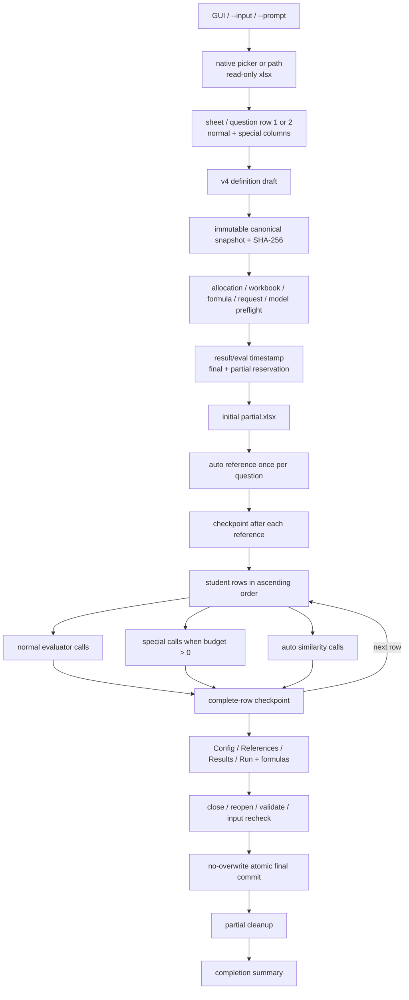
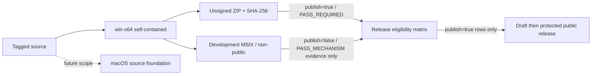

# StudyReport Evaluator アーキテクチャ

| 項目 | 内容 |
|---|---|
| Current requirement | requirements v4.3 |
| Current decision | ADR-0012（機能）/ ADR-0015（Windows ZIP public / development MSIX）。current public evidence境界はADR-0013 |
| Detailed design | [`detailed-design.md`](detailed-design.md) |
| Production projects | 2（Core / App） |
| Target platform | Windows 11 x64。macOS source foundationは現版公開対象外 |

本書はcomponent境界と実行data flowの正本である。型、sheet、formula、checkpoint encodingの詳細は[詳細設計書](detailed-design.md)と[Excel契約](excel-contract.md)を参照する。

## 1. Project境界

| Project | 責務 | 禁止依存 |
|---|---|---|
| `StudyReportEvaluator.Core` | v4 definition、snapshot、Prompt、closed result validation、allocation、score preview、formula AST | Avalonia、Open XML、Copilot SDK、filesystem |
| `StudyReportEvaluator.App` | Avalonia UI、workbook I/O、Copilot adapter、checkpoint／resume、platform composition | Coreからの逆参照 |

Core/App以外のproduction projectを追加しない。checkpointのためのdatabase、server、event storeを追加しない。

## 2. Run data flow

run開始後のdraft変更は次runだけへ反映する。current run、checkpoint、resume、formula、final workbookは同じsnapshotを使用する。

## 3. AI境界

| Operation | Model | Workbook由来input | Tool |
|---|---|---|---|
| Reference | `auto` | なし。question textのみ | `submit_reference_answer` |
| Normal | user-selected | current rowのnormal primary/supporting | `submit_quantification` |
| Special | user-selected | current rowのspecial primary/supporting | `submit_special_quantification` |
| Similarity | `auto` | current row primary + stored reference | `submit_similarity` |

各attemptはrestricted sessionを新規作成する。公開toolは該当operationの1件だけで、shell、filesystem、Web、GitHub write、MCP、ambient memoryを公開しない。normal assistant bodyはresultとして採用しない。tool call exactly once、closed property set、expected ID、finite range、same-row evidenceをvalidationする。

`auto`がavailable modelにない場合はrunを開始せず、別modelへfallbackしない。SDK session persistenceをjob resumeに使用せず、partial workbookだけをresume正本とする。

## 4. Score境界

AIはnormal raw、special 0〜1、similarity 0〜1だけを返す。Excelが次を計算する。

$$
QuestionEarned_q=QuestionPoints_q\times QuestionRate_q
$$

$$
SpecialEarned=SpecialPoints\times average(SpecialQuestionRate)
$$

$$
SimilarityPenalty_q=QuestionPoints_q\times Similarity_q\times SimilarityPenaltyWeight
$$

$$
FinalRaw=BasePoints+\sum QuestionEarned+SpecialEarned-\sum SimilarityPenalty
$$

$$
FinalScore=clamp(FinalRaw,0,100)
$$

empty inputはAIを呼ばず0へ変換する。technical failureはblankとし、formula ancestorへblankを伝播する。

## 5. Workbook境界

inputはread-onlyでsnapshotし、partial／finalはいずれもinputのbyte-copyから作る。

| Workbook | App-owned sheet |
|---|---|
| partial | `Quantification_Checkpoint` |
| final | `Quantification_Config`, `Quantification_References`, `Quantification_Results`, `Quantification_Run` |

partialはcanonical snapshot、runtime identity、references、complete rowsをhash付きchunk JSONで保存する。row途中の結果をcompleteとして保存しない。updateは新temp workbookを完全検証してからsame-volume atomic replaceするため、失敗時は旧partialが残る。

finalは新tempへ4 sheetとformulaを書き、close、read-only reopen、package/formula/cached value/original preservationを検証する。input identityを再確認し、no-overwrite renameだけで完成名を作る。

## 6. UI境界

4 stepを維持する。

1. Input: native picker／path、sheet、question row、normal mapping。
2. Design: base、special、question points、equalize、normal evaluator、special item、imported Prompt。
3. Execution: auth/model/auto、output paths、new/resume、stage/reference/row/unit progress、cancel。
4. Results: finalまたはpartial path、counts、per-row score preview、cleanup warning。

runはExecutionの明示buttonからだけ開始する。command-line引数とPrompt適用でauto-runしない。

指定warningはshell rootへ常時表示し、focus、checkbox、dismiss、snapshot field、processing dependencyを持たない。

## 7. Persistenceとnetwork

app-owned databaseとcloud backendはない。durable stateはpartial/final workbookだけである。外部通信はAI operationだけで、bundled Copilot CLIとGitHub Copilotを使う。

checkpointとoutputはinput全体、Prompt、reference、AI resultを含むためinputと同等以上に機密である。application logはsafe code、ID、dimension、timingだけを保持する。

## 8. Platform delivery

- End-user appはRID別.NET 10 self-containedで、.NET Runtime／SDKを別installしない。
- SDK互換Copilot CLIをpackageに含め、manifestでRID、path、version、shipped file hashを固定する。PATHへfallbackしない。
- Windows public targetは`win-x64` self-contained payloadをunsigned ZIPとSHA-256 sidecarへ格納する。development MSIXはnon-public `PASS_MECHANISM`として別contractで維持する。
- macOSは`osx-arm64`と`osx-x64`のpublish／bundle／sign／notary source foundationだけを維持し、現版のpublic artifactまたはrequired acceptanceにしない。
- macOSではnested CLIを署名してshipped hashをmanifestへ反映した後、outer `.app`を最後に署名する。outer署名後のbundle変更を禁止する。
- Windows primary setupはZIPとsidecarの取得、SHA-256確認、展開、apphost起動とし、別runtime installを要求しない。development MSIXを一般利用者手順へ含めない。
- current public claimはWindows 11 x64 unsigned ZIPだけとする。development MSIX、cross-publish、framework supportを製品証跡にしない。
- 同じrelease matrixへWindows ZIPの`publish=true`行とdevelopment MSIXの`publish=false`行を記録するが、Releaseへ進めるのはrequired statusを満たす`publish=true`行だけとする。
- macOS、Linux、Windows Arm64、universal macOS artifact、Store配布はv4.3 public scope外である。

## 9. Validation timing

| Timing | Validation |
|---|---|
| Input load | extension、package graph、安全上限、metadata、identity |
| Design | definition、Prompt、allocation、special minimum |
| Run admission | snapshot、mapping、formula layout、request/model capacity、auto availability、paths |
| Resume admission | checkpoint schema/hash/input/definition/model/runtime、completed row IDs |
| AI callback | tool count、closed schema、ID、range、evidence |
| Checkpoint save | package、checkpoint sheet、JSON chunk/hash、input identity |
| Final write | sheets、formula/ref/DAG/cached values、original preservation |
| Final commit | input identity、target absence、same-volume atomic rename |

## 10. Evidence boundary

Required deterministic testsはfake Copilot transportとOpen XML／Core oracleだけで成立させる。authenticated Copilotとexternal spreadsheet recalculationは別のadvisory evidenceとして記録し、required fake/oracle evidenceの代替にしない。Windows installerとmacOS packageはtest-only mechanism、production trust、clean-machine evidenceを分離し、未実測行を対応表示しない。
