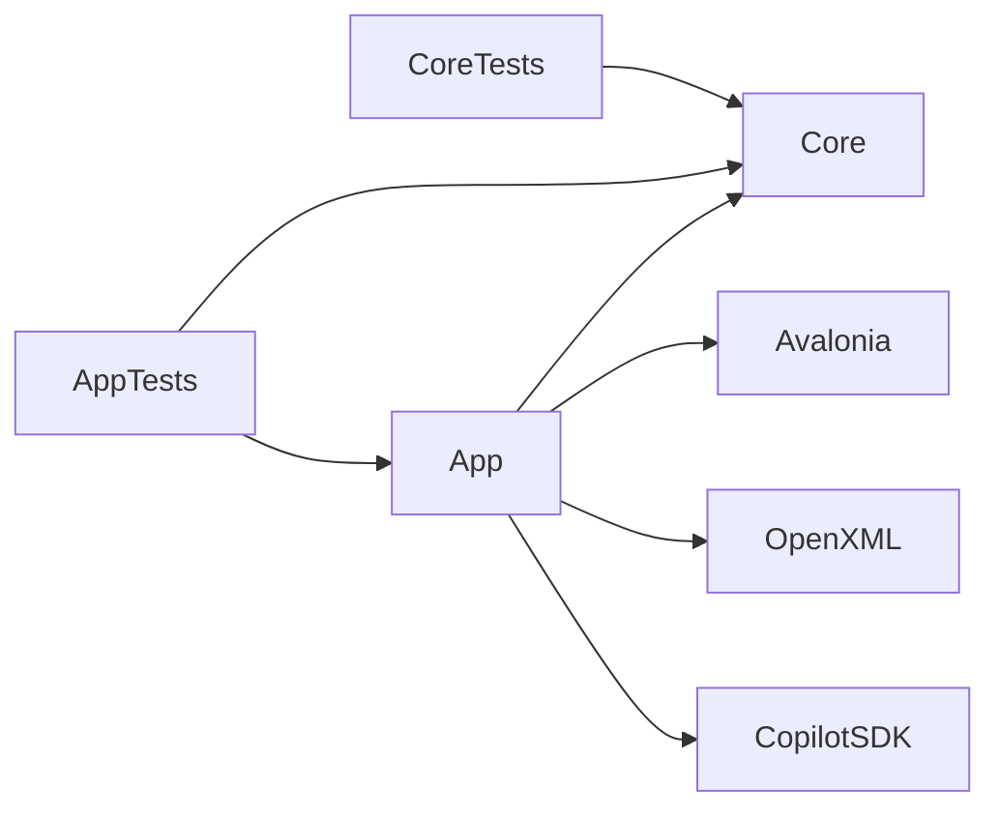
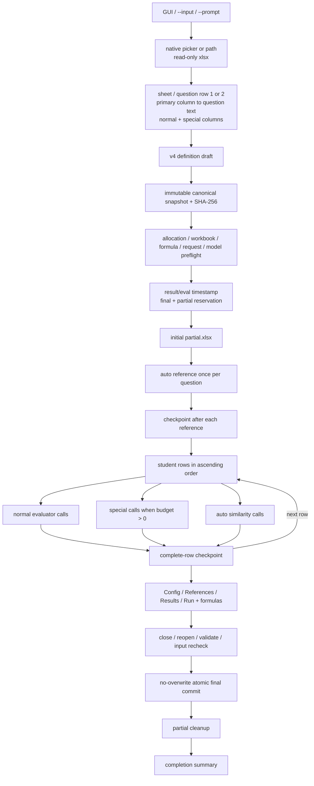
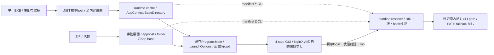
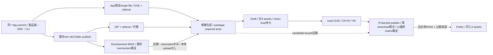

# StudyReport Evaluator アーキテクチャ

| 項目 | 内容 |
|---|---|
| Current requirement | [requirements v4.6](../../docs/requirements-definition.md) |
| Current decision | ADR-0012（機能）/ [ADR-0016](adr/0016-windows-one-action-startup.md)（Windows単一EXE主配布・ZIP代替・明示login・candidate拘束公開gate） |
| UI / settings contract | [UI layout contract](ui-layout-contract.md) / [実装プランv2](../../work/20260907-ui-settings-redesign-plan-v2.md)と後続承認・実行引継ぎ（2026-09-07） |
| Detailed design | [`detailed-design.md`](detailed-design.md) |
| Production projects | 2（Core / App） |
| Target platform | Windows 11 x64。macOS source foundationは現版公開対象外 |

本書はcomponent境界と実行data flowの正本である。型、sheet、formula、checkpoint encodingの詳細は[詳細設計書](detailed-design.md)と[Excel契約](excel-contract.md)を参照する。

v4.6のUI／設定保存はT01〜T38の実装・対象検証・レビュー完了を反映する。製品版正本は親担当が`0.8.5`未公開候補（UNRELEASED）へ更新済み、F01はREVIEWED、公開済みは`v0.8.1` ZIPのままである。`0.8.4`のT36文書contract、T37実ZIP、T38実EXE、T39自動回帰／MSIX機構確認は記録済みだが、T39は追加native FAILと本人確認等の外部前提によりBLOCKED。F02の最終版再検証は本同期時点では親担当で未完了、以後は[実行記録](../../work/20260907-ui-settings-execution-record.md)の最新F02欄を参照する。日付・製品版・証跡範囲を分けた[現在状態](implementation-status.md)を正本とし、G4・全タスクDONE・公開PASSを付与しない。

v4.5のdelivery追加では、実装済みの起動経路／deterministic公開contractと、未実行のcandidate workflow／clean-host／protected publishを分ける（§8・10）。新EXEの公開済み・OS-only受入完了を意味しない。

## 1. Project境界

| Project | 責務 | 禁止依存 |
|---|---|---|
| `StudyReportEvaluator.Core` | v4 definition、snapshot、Prompt、closed result validation、allocation、score preview、formula AST | Avalonia、Open XML、Copilot SDK、filesystem |
| `StudyReportEvaluator.App` | Avalonia UI、ローカル設定の明示保存／復元、workbook I/O、Copilot adapter、login専用service、checkpoint／resume、platform composition | Coreからの逆参照 |

Core/App以外のproduction projectを追加しない。single-file profileとlogin専用serviceもApp内に置く。checkpointのためのdatabase、server、event storeを追加しない。

## 2. Run data flow

run開始後のdraft変更は次runだけへ反映する。current run、checkpoint、resume、formula、final workbookは同じsnapshotを使用する。

## 3. AI境界

| Operation | Model | Workbook由来input | Tool |
|---|---|---|---|
| Reference | `auto` | なし。question textのみ | `submit_reference_answer` |
| Normal | user-selected | current rowのnormal primary/supporting | `submit_quantification` |
| Special | user-selected | current rowのspecial primary/supporting | `submit_special_quantification` |
| Similarity | `auto` | current row primary + stored reference | `submit_similarity` |

各attemptはrestricted sessionを新規作成する。公開toolは該当operationの1件だけで、shell、filesystem、Web、GitHub write、MCP、ambient memoryを公開しない。normal assistant bodyはresultとして採用しない。tool call exactly once、closed property set、expected ID、finite range、same-row evidenceをvalidationする。

`auto`がavailable modelにない場合はrunを開始せず、別modelへfallbackしない。SDK session persistenceをjob resumeに使用せず、partial workbookだけをresume正本とする。

## 4. Score境界

AIはnormal raw、special 0〜1、similarity 0〜1だけを返す。Excelが次を計算する。

$$
QuestionEarned_q=QuestionPoints_q\times QuestionRate_q
$$

$$
SpecialEarned=SpecialPoints\times average(SpecialQuestionRate)
$$

$$
SimilarityPenalty_q=QuestionPoints_q\times Similarity_q\times SimilarityPenaltyWeight
$$

$$
FinalRaw=BasePoints+\sum QuestionEarned+SpecialEarned-\sum SimilarityPenalty
$$

$$
FinalScore=clamp(FinalRaw,0,100)
$$

empty inputはAIを呼ばず0へ変換する。technical failureはblankとし、formula ancestorへblankを伝播する。

## 5. Workbook境界

inputはread-onlyでsnapshotし、partial／finalはいずれもinputのbyte-copyから作る。

| Workbook | App-owned sheet |
|---|---|
| partial | `Quantification_Checkpoint` |
| final | `Quantification_Config`, `Quantification_References`, `Quantification_Results`, `Quantification_Run` |

partialはcanonical snapshot、runtime identity、references、complete rowsをhash付きchunk JSONで保存する。row途中の結果をcompleteとして保存しない。updateは新temp workbookを完全検証してからsame-volume atomic replaceするため、失敗時は旧partialが残る。

finalは新tempへ4 sheetとformulaを書き、close、read-only reopen、package/formula/cached value/original preservationを検証する。input identityを再確認し、no-overwrite renameだけで完成名を作る。

## 6. UI境界

4 stepを維持し、設定は同じwindow内の独立した内容画面とする。`WorkflowStep`へ第5工程を追加しない。`WorkflowNavigator`の`Visited`は訪問済みを表し、準備完了やrun成功ではない。

| 主画面 | 編集・操作 | 読取専用の概要／詳細への入口 |
|---|---|---|
| Input | native picker／path、sheet、質問行1/2、回答範囲、選択設問の有効化・主回答列・設問文、ページ移動 | 実metadata／draftによる件数、検証詳細。同じ設問の「入力詳細」へ移動 |
| Design | Base／Special／類似度係数、選択設問のPoints・有効化、均等配分 | exact配点合計、有効evaluator／criterion／special概要、計算式説明、読込Prompt件数。詳細編集は設定へ |
| Execution | 明示login／取消／状態確認、新規／再開・partial指定、開始／停止 | 実効model・並列度・出力先、現在／前回runの固定条件、予約pathと実progressを分離。「変更」で共通設定へ |
| Results | 学生行ページ・元行移動、一覧／詳細、通常criterion override、別名出力 | 前回runのfinal／partial、件数・行状態・計算preview・入力確認段階・cleanup warning。結果は設定へ移さない |

runはExecutionの明示buttonからだけ開始する。command-line引数、画面遷移、設定の読込／保存／適用、Prompt適用から認証確認・login・AIを自動開始しない。Prompt previewは固定／合成値のローカル展開であり実AI previewではない。

指定warningはshell rootへ常時表示し、focus、checkbox、dismiss、snapshot field、processing dependencyを持たない。

### 6.1 明示loginと状態再確認

- `ExecutionView.axaml`の「GitHubにログイン」→ `ExecutionViewModel.LoginCommand` → App所有の`BundledCopilotLoginService`がlogin経路となる。既存の`CopilotAuthenticationService`による状態確認とは分離する。
- bundled resolverが検証した絶対CLI pathだけを直接子processとして起動する。固定CLIで確認した引数は`--no-auto-update --log-level none login --web-flow`。shell、PowerShell、`cmd /c`、任意command文字列を介さず、標準入力／出力／errorをredirect・収集しない。認証console／ブラウザーとcredential保管はCLIに委譲し、Appはtoken／device codeを入力・収集・解析・保存・log出力しない。
- 二重開始、評価実行中・認証確認中のlogin開始を防ぐ。login開始時に古い認証状態とmodel選択を無効化し、終了codeだけで認証成功としない。完了・取消・失敗後は利用者が「Copilot 状態を確認」を押してruntime identity、認証、利用可能modelを再確認する。login完了による自動再確認・model選択・AI開始を追加しない。
- login processの強制終了はlogin取消またはアプリ終了時だけとし、serviceが開始・所有した当該processに限定する。正常完了を含め、終了確認後に所有processを解放する。process tree全体や名前一致でkillせず、ブラウザー、他CLI、workbook、credential storeに触れない。logout・credential削除・失効を行わない。終了未確認のprocessは所有を保持して二重起動を防ぎ、認証確認・評価を止めるが、GUI／Excel読込／mapping／設計は継続可能にし、safeな状態と再試行案内を表示する。
- CLI欠落・不一致は配布物の再取得／ZIP再展開を案内する。PATH上の別CLIやintegrity検証緩和で回避しない。自己更新抑止とlogin後の明示再確認で固定CLI identityを維持する。

### 6.2 設定5カテゴリと編集先

`SettingsView`は既存Input／Design／Execution VMを束ねる。カテゴリ別VMや第三の採点draftを作らず、主画面と同じ入力欄を二重配置しない。

| カテゴリ | View／所有先 | 内容 |
|---|---|---|
| 共通 | `SettingsView`の共通template／`ExecutionViewModel`と`DesignViewModel` | model希望・並列度・明示出力先はExecution。定義名・revision・丸めはDesign。保存定義の明示適用、設定path、取得済み認証／runtime診断もここに置く。診断は読取専用・非保存 |
| 入力詳細 | `MappingSettingsView`／Input | 設問名、追加・複製・並替え・削除、補助列、候補一式再適用。主回答列・有効状態・設問本文は現在値を読取専用で示し、変更は主画面で行う |
| 通常評価 | `EvaluatorSettingsView`／Design | 設問／evaluator／criterion選択、CRUD、range、weight。Knowledge Promptは読取専用、Custom本文は編集可能 |
| 固有評価 | `SpecialEvaluationSettingsView`／Design | 項目CRUD、source／補助列／Prompt／enabled。固有配点は読取専用で再表示し、0〜1の範囲・等分平均は変更しない |
| 読込Prompt | `ImportedPromptSettingsView`／Design | 起動引数順の一覧と読取専用原文、Custom／specialへの明示copy。未適用一覧は設定保存対象外 |

対象なしのカテゴリも位置を保ち、利用できない理由を表示する。共通内の「共通設定／保存定義／診断」は内部tabであり、第6カテゴリや追加workflowではない。

### 6.3 状態の所有・同期・固定

| 状態 | 所有者・境界 |
|---|---|
| disk上の保存値 | Appの`ApplicationSettings`／`SettingsFileStore`。共通設定と任意の`QuantificationDefinition`1件。保存済みであることは現在の入力への適用やAI-readyを意味しない |
| 次回用共通値 | `ExecutionViewModel.PreferredModelId`、`MaxConcurrency`、`OutputDirectoryOverride`。希望modelと確認済み`SelectedModelId`、明示出力先と算出済み`OutputDirectory`を別に持つ |
| 採点draft | `InputViewModel.DefinitionDraft`と`QuantificationDesignViewModel.Draft`。`SettingsViewModel`が変更通知から最新編集元を追跡し、`SynchronizeDrafts`でその元から相手へ同期する |
| 保存定義の読込状態 | `SettingsViewModel.StoredDefinition`はimmutableな保存済み値。起動時は保持だけ。明示適用成功時だけInputのmetadata／draftとDesignを更新する |
| 現在run | `ExecutionViewModel.StartAsync`が開始通知前にrequestを固定し、workflowがimmutable snapshotを作る。実行中は`Configure`せず、次回用概要だけを更新する |
| 前回結果・override | `ResultsOutputViewModel`が`ExecutionRunContext`／`RunSummary.Snapshot`と元criterion collectionを保持する。次回draftで過去結果を再評価せず、override反映版も別workbookへ出力する |
| 表示中だけの状態 | 各VMの対象ID・ページ・カテゴリと、各Viewの未確定text／選択・focus制御。`setting.txt`やcheckpointへ保存しない |

MainWindowはworkflow遷移・設定開閉の同期境界を呼び、Settingsはカテゴリ変更・保存前の境界を担当する。同じカテゴリを開く場合も同期を省略せず、再入を抑止する。Design VMは再生成せず、残る子editorと選択をIDで保持する。共通設定の編集で「最新の採点編集元」を奪わない。

同じ入力path・同じmetadata参照・同じcanonical定義でのExecution再訪は初期化しない。実際の入力／定義変更時だけ次回構成を更新し、再開指定を解除した理由を示す。進行中runのrequest・予約path・停止操作は維持する。設定中のrun完了はResultsへcontextを届けるだけで設定を閉じず、Execution表示中・設定を閉じている場合だけ結果へ進む。

### 6.4 起動構成とView lifetime

- productionは`Program.BuildAvaloniaApp(startup)` → `ServiceRegistration.FromStartup(startup)`でOSの`LocalApplicationData`を解決する。`App.CreateMainWindow` → `ServiceRegistration.CreateMainWindow`がwindow生成後に`Settings.InitializeAsync`を非同期開始する。VM構築・path解決そのものは設定fileを読まない。
- `ServiceRegistration`／`App`／MainWindow VMの従来の既定constructorはnull storeのままで、実利用者設定I/Oを行わない。試験は一時absolute pathのstoreまたは明示local-data directoryを注入する。保存場所が解決できない場合は保存機能だけを無効にし、cwd／EXE／抽出cacheへfallbackしない。
- `MainWindow`は`CurrentStepContent`の5 DataTemplateから、既存VM参照ごとにViewを1つ生成し、DataContextを一度だけ設定する。表示中の1つだけをtreeへ接続し、他はoff-treeで保持する。`SettingsView`も同じSettings ownerについてカテゴリごとのViewを保持し、owner変更時だけcacheを破棄する。
- これにより往復でControlの未確定textや内部tabを不要に作り直さない。数値変換前のtextは確定draftと区別し、Designの設問配点は必要な対象ID別buffer、Resultsのoverrideは元criterion VMの文字列として保持する。汎用入力履歴・Undo機構は作らない。
- 設定を開く直前のcontrolを記憶し、元editorへ戻った際、同じwindow内で可視・有効ならfocusを戻す。利用不可なら当該editorの既定操作へ移す。カテゴリ変更はそのカテゴリの対象selector等へfocusし、問題箇所への明示focusをshellが奪わない。任意のscroll offsetや全操作履歴の復元は約束しない。
- headerの警告／4-stepナビとfooterの前後操作／進捗入口／停止を固定し、本文へ有限領域を渡す。最小1024×720・初期1180×800 DIPを維持し、多数項目は実viewportに応じたページ、長文・狭小／拡大は局所または本文scrollで扱う。headless検証とnative実測を分ける。

## 7. Persistenceとnetwork

app-owned databaseとcloud backendはない。評価runのdurable state正本はpartial/final workbookだけであり、runtime配置cacheやCLI credential storeとは分離する。

| 保存境界 | 内容・所有範囲 |
|---|---|
| input／partial／final | 利用者data。既定出力は入力隣接の`result`。配布・抽出・起動で移動／削除しない |
| `LocalApplicationData/StudyReportEvaluator/setting.txt` | 共通設定＋任意の採点定義1件の明示保存。Windowsでは通常`%LOCALAPPDATA%`配下。run再開の正本ではない |
| .NET標準抽出cache | App／native依存／CLI／manifest／公開docsの配置用。input／partial／finalの保存先にしない |
| CLI credential store | CLI／OSが管理する本人認証の保存先。Appはcredentialを収集・保存・削除しない |

設定はstrict UTF-8 JSON・schema整数1で、BOMは受理するが、重複／未知property、不正型・範囲、未知schemaを拒否する。`SettingsFileStore`は既存domain validatorで検証し、同directoryの一意tempへwrite／flush／close後、`File.Move(..., overwrite: true)`で置換する。fileなしは最初の明示保存まで未作成、失敗時は旧fileとdraftを保持し、自分のtempだけ後始末する。自動修復・移行・mergeはなく、別processでは最後の成功が優先する。電源断や任意network filesystemの耐久性までは保証しない。

明示出力先は再起動・入力変更後も保持し、未指定または空欄への明示変更による`null`時だけ入力隣接`result`を算出する。復元だけで出力directoryを作らず、利用不可でも別pathへfallbackしない。保存中に次回draftを再編集した場合は、保存成功後もその変更を「未保存」とする。

外部通信はAI operationだけではない。本人loginと認証／利用可能modelの確認にもnetworkが必要となり得るため、**AI送信0件を外部通信0件とみなさない**。`CopilotAuthenticationService`はローカルstdioのStart／Ping後にGetAuthStatus、認証済みならListModelsを行う。明示loginはCLI／ブラウザーからGitHubへ接続する。GUI／Excel読込／mapping／設計のoffline利用と、認証・model確認・AI利用のnetwork／account／組織policy前提を分ける。

checkpointとoutputはinput全体、Prompt、reference、AI resultを含むためinputと同等以上に機密である。application logはsafe code、ID、dimension、timingだけを保持する。

設定を明示保存した場合もheader由来の設問文・適用済みPrompt・貼付内容・sheet名・明示出力pathが平文で含まれ得る。回答行の自動収集、入力xlsx path／bytes、AI結果、credential／認証状態、runtime identity、未適用Prompt一覧、UI状態は保存しない。設定は暗号化containerではなく、公開物・画像・log・共有証跡へ実内容を含めない。

## 8. Platform delivery

ADR-0016はADR-0013／0015のZIP-only主配布と必須の手動hash確認を限定的にsupersedeする。旧ADRとmatrix v1は履歴として保持し、過去ZIPのPASSを新EXEへ転記しない。以下のEXE主配布は承認済みの公開目標であり、現時点の公開済み機能とは表示しない。

本節のv4.5 delivery契約をv4.6でも継承する。文書同梱リストはT37／T38で同期し、`0.8.4`のZIP／EXE／MSIX実物は各対象範囲で検証済みである。UI／同梱文書やF02の製品版変更後は最終artifactを再生成・再検証する必要があり、この`0.8.4`や過去clean-hostの証跡を`0.8.5`の新しいbytesへ流用しない。

### 8.1 App限定publishとpackage

- End-user appは`win-x64` .NET 10 self-containedとする。要求v4.5の固定.NET SDK／runtime／Avalonia／Copilot SDK・CLIを維持する。製品版正本は`Directory.Build.props`であり、要求文書版とは別である。
- `src/StudyReportEvaluator.App/Properties/PublishProfiles/WindowsSingleFile.pubxml`はAppだけへ適用する。`scripts/publish-windows.ps1`の`-SingleFile`でrestore／publishに同じprofileを渡し、`win-x64`、self-contained、`PublishSingleFile=true`、`IncludeNativeLibrariesForSelfExtract=true`、`IncludeAllContentForSelfExtract=true`を揃える。trimming、ReadyToRun、圧縮は無効、symbolsは非配布とする。
- `IncludeAllContentForSelfExtract`はMicrosoftが**非推奨**とする.NET Core 3.1互換モードであり、将来削除される可能性がある。S01/G1で固定構成の開発host適合を確認した条件付き採用であって、推奨方式・将来互換性・clean-host成功の保証ではない。
- single-file出力は`artifacts/package/publish/win-x64-singlefile/`へ分離する。引数なしのfolder publish／既存ZIP、Core、solution全体、macOSへsingle-file条件を適用しない。App専用`packages.win-x64-singlefile.lock.json`で実在するbuild-onlyの`Microsoft.NET.ILLink.Tasks`差分だけを固定し、Core専用lockやproduction依存を増やさず、analyzer・lock・integrity検証を無効化しない。
- .NET/native依存、固定CLI、`copilot-runtime.json`と、既存ZIPと同じ**20 fileの明示allowlist**（公開文書11件＝root README・利用者docs 9件・images README、8画像、LICENSE）をbundle前に含める。T37／T38で設定guide・third-party notices・設定画像を含む集合へ同期済み。repository全体のglobや後付けcopyで代用せず、sample、input／final／partial、setting.txt、work、tests、secretを含めない。
- P02は標準hostによる抽出後のlayout、runtime／SDK／CLI identity、20 fileの一致を検証する。`scripts/package-windows-singlefile.ps1`（P05）は検証済みpublish入力をread-onlyで扱い、最終名`StudyReportEvaluator-win-x64.exe`へのbyte-copyと、そのbytesに一致する`StudyReportEvaluator-win-x64.exe.sha256`を作る。P05自体はpublish・起動・抽出を行わず、PE／版検査だけで任意EXEのself-contained bundleを証明したとはしない。実EXEの起動検証はP06／P07と分離する。
- 代替は既存の`StudyReportEvaluator-win-x64.zip`と`StudyReportEvaluator-win-x64.zip.sha256`。新規candidateのEXE／ZIPは同じsource commit・製品版・SDK／CLI版から作る。sidecar公開とCI／公開gateのexact hash検証は必須、利用者の手動比較は任意推奨であり、sidecarはEXE起動のdependencyではない。

### 8.2 標準抽出と既存起動契約

- Windowsの.NET標準hostが通常`%TEMP%/.net/<app>/<bundle-id>/`へ内容を抽出し、全内容展開後の`AppContext.BaseDirectory`をAppの基準にする。`copilot-runtime.json`から`runtimes/win-x64/native/copilot.exe`への既存相対配置を保持し、`BundledCopilotCliPathResolver`がmanifest／RID／SDK・CLI版／SHA-256を検証した絶対pathだけを使う。PATH fallbackや検証緩和はしない。
- 既存`Program.Main`／`LaunchOptions`をそのまま使う。EXE／ZIPとも`--input`と複数`--prompt`、起動時cwd基準の相対path、日本語・空白path、Promptの順序・同一pathの重複排除、invalid入力検証・明示適用を維持する。EXE配置先や抽出先へcwdを変更せず、独自argv再構成・新引数・login／AI自動開始を追加しない。
- 標準hostのcache再利用・欠落復元・並行起動処理を利用する。単一EXE配布は「ディスク上も1ファイル」「痕跡なし」を意味しない。標準抽出を全cached fileの暗号学的検証とはみなさず、CLI hash検証を残す。別権限userから書換え可能な抽出先を対応済みとしない。`DOTNET_BUNDLE_EXTRACT_BASE_DIR`は試験隔離用であり、利用者の設定やAPI keyを要求しない。
- 独自launcher／抽出・cache・locking engine、cache管理UI、自動cache掃除、旧版の自動削除、online bootstrap、自動／差分更新を追加しない。§7のdata分離と、同じ製品版・runtime identityのEXE／ZIP間の既存checkpoint再開条件を維持する。§5のatomic finalizationと完成成功後のpartial cleanupは変更しない。

取得済みEXEを開く1起動gestureからoffline GUIへ到達することを要求する。追加.NET Runtime／SDK、PowerShell、Node／npm、Git／gh、別CLI、Office、IDE、隣接file、repository、既存cache／認証、手動展開、setup script、昇格を前提にしない。ただしdownload、任意のhash比較、OS警告への操作、本人loginはこの1操作に含めない。EXE／ZIPはunsignedであり、SmartScreen／SAC／企業policyの警告・拒否や実操作数を隠さず、無条件・無警告起動を保証しない。hash一致は発行者の真正性・SmartScreen reputationの保証ではない。保護無効化、MOTW除去、証明書自動trust、execution policy変更、UAC回避を実装・案内しない。

### 8.3 Candidateからprotected publish（contract実装済み・live未実行）

matrix v1は公開`v0.8.1`のZIP＋development MSIX記録という履歴契約として残す。C01〜C03は新規`eng/schemas/platform-release-matrix-v2.schema.json`、validator、builderと直接testを実装し、v1を上書きしていない。C05〜C07はcandidate／protected publish workflowとcontract testを実装済みである。ただしlive workflow、exact最終EXEのCH-01〜06、公開承認、公開後re-downloadは未実行であり、local deterministic成功を実公開gate完了へ読み替えない。

| v2のclosed row | Artifact／sidecar | publish | Required evidence |
|---|---|---|---|
| Windows x64単一EXE | `StudyReportEvaluator-win-x64.exe` / `StudyReportEvaluator-win-x64.exe.sha256` | `true` | package required tests＋exact EXEのCH-01〜06 |
| Windows x64 ZIP | `StudyReportEvaluator-win-x64.zip` / `StudyReportEvaluator-win-x64.zip.sha256` | `true` | 既存package／clean extract／起動／CLI identity／data保護 |
| Windows x64 development MSIX | 同candidateで実物検証したartifact／sidecarのdescriptor | `false` | 既存範囲の`PASS_MECHANISM`記録 |

- 固定3行のunknown／duplicate／missingを拒否する。candidateのpackage／mechanism required tests成功後だけ、EXE／ZIPと各sidecarの計4 assetをdraftへ添付する。この段階で未実施のclean-host結果や公開可能な最終matrixを生成しない。
- MSIXは同candidate runで実物検証し、結果とartifact／sidecar descriptorだけを既存内部control artifactへ保存する。**MSIX本体はGitHub ReleaseにもActions artifactにもuploadしない。** 公開時はcandidate-bound記録を照合し、本体を再取得・再作成・再検証したと扱わない。
- clean-host担当者は当該candidateのexact EXEを試験し、run ID／commit、EXE basename／bytes／SHA-256／製品版、OS／標準user／追加依存／保護状態、実build SDK／bundled runtime／SDK・CLI版とCLI hash、試験ID別結果・操作数・実施記録の参照／hashをmetadata限定closed JSONで渡す。username、token／device code、学生本文、Prompt、環境変数値一覧、生ログを含めず、公開前に製品repositoryへcommitしない。
- 既存protected publishの`clean_host_evidence_json`入力を環境変数経由で一時file化し、型・長さ・許可field・必須試験IDを検証する。workflow式をshell本文へ直接埋め込まず、新しいstorage／workflow／証跡基盤を追加しない。人の試験記録であり、hash一致だけで実施事実が自動証明されたとは扱わない。
- protected publishは指定repositoryの`release.yml`による成功candidate runとtag commitの一致を確認する。4 assetsを再downloadしてversion／bytes／hash／sidecarとpackage evidenceを照合し、MSIXの同run記録を照合した後、v2最終matrixと受領JSONを内部control artifactへ保存する。公開assetは同じ4個だけとする。
- 既存Core／App／package required testsとCH-01〜06すべてのPASSを要求し、必須結果の欠落・FAIL・NOT_RUN、別candidate／source／version／hash、sidecar不一致を拒否する。同梱docや最終製品版変更でEXE bytesが変われば再package・再検証し、以前のclean-host結果を流用しない。tag／push／draft／public Releaseの操作承認は実装承認と分け、公開にはprotected environmentの承認を必要とする。

### 8.4 非公開・対象外境界

- development MSIXは既存sourceとpackage／unpack／integrityのnon-public `PASS_MECHANISM`回帰だけを維持する。installer機能やrequired install試験を増やさず、一般利用者setupへ含めない。production-signed／public MSIXや新installerは追加しない。
- macOSは`osx-arm64`と`osx-x64`のpublish／bundle／sign／notary source foundationだけを維持し、現版のpublic artifactまたはrequired acceptanceにしない。
- macOSではnested CLIを署名してshipped hashをmanifestへ反映した後、outer `.app`を最後に署名する。outer署名後のbundle変更を禁止する。このsource契約をnative production実測済みと表示しない。
- macOS、Linux、Windows Arm64、universal macOS artifact、Store配布はv4.5 public scope外である。署名／notarization／installer、cross-publish、framework supportを本製品の対応証跡として追加しない。

## 9. Validation timing

| Timing | Validation |
|---|---|
| 設定初期読込／明示再読込 | schema／JSON／値の検証。保存定義は保持のみ、共通値の復元で認証・AIを開始しない |
| 設定の明示保存／保存定義適用 | 最新editor同期・固定値の検証／保存headerのread-only metadata再読込・入力identityとmapping検証。成功時だけcommit |
| Input load | extension、package graph、安全上限、metadata、identity |
| Design | definition、Prompt、allocation、special minimum |
| CLI起動前（login／状態確認／AI共通） | bundled manifest／RID／SDK・CLI版／SHA-256／検証済み絶対path |
| Login終了／取消後 | safe結果、所有processの終了確認、認証未確認の保持、利用者による明示再確認 |
| Run admission | snapshot、mapping、formula layout、request/model capacity、auto availability、paths |
| Resume admission | checkpoint schema/hash/input/definition/model/runtime、completed row IDs |
| AI callback | tool count、closed schema、ID、range、evidence |
| Checkpoint save | package、checkpoint sheet、JSON chunk/hash、input identity |
| Final write | sheets、formula/ref/DAG/cached values、original preservation |
| Final commit | input identity、target absence、same-volume atomic rename |
| Protected publish（contract実装済み・live未実行） | candidate run／source／version／bytes／hash／sidecar、exact EXEのCH-01〜06、closed v2／4 assets |

## 10. Evidence boundary

業務処理のrequired deterministic testsはfake Copilot transportとOpen XML／Core oracleだけで成立させる。package実EXE、loginのfake process／UI、fresh OSでの本人認証、実AI評価を別の証跡として扱う。

| D01引継ぎ時点の範囲（2026-09-06） | 状態・意味 |
|---|---|
| P01〜P07 | レビューPASS。P04だけは変更不要の`N/A_REVIEWED`であり、独立した変更・実行成功とはしない |
| P06実EXE試験 | 7 tests PASS、失敗／skip 0。開発hostでの機構・GUI・data保護の実測 |
| P07実行 | `PASS_DEVELOPMENT`、7 tests／9 observations。公開用`PASS_REQUIRED`やclean-host PASSへ昇格させない |
| A01〜A03 | レビューPASS。login専用service／Execution UIのdeterministic検証であり、本人login実測ではない |
| C01〜C03 | matrix v2 schema／validator／builderと直接testを実装済み。C03は18/18 PASS。live candidate／publish実行を意味しない |
| C04〜C07 | CI、candidate、protected publishのworkflow／contract testを実装済み。実workflow、draft、public Releaseは未実行 |
| CH-01〜06（fresh OS／MOTW・Windows保護／本人loginを含む） | `NOT_RUN`。新EXEの公開条件は未達 |

`scripts/test-windows-singlefile.ps1`は既にbuild／publish／packageされたEXEを検査し、再build・再package・認証を行わない。既定実行は前後でclean checkoutを必須とし、source content、EXE／sidecar、fresh TRXのexact 7 testsと9 observationsを照合して初めてpackageの`PASS_REQUIRED`を出す。`-DevelopmentOnly`はdirty checkoutでもsource／package不変を要求し、`artifacts/test/singlefile/`へ`PASS_DEVELOPMENT`を出すだけで、`artifacts/package/`の公開用evidenceを置き換えない。いずれもCHの代替ではない。

P06／P07で未実測のnetwork隔離、本人認証、disk-full、抽出中断、directory ACL fault、EXE／ZIP間checkpoint再開をPASSで補完しない。開発hostのPATH／.NET環境変数隔離、hosted CI、fake、CLI help、process終了だけをOS-only／本人認証の成功に読み替えない。

新経路の公開ではCH-01〜06すべてが必須であり、採用済みD-06の本人login（CH-06）を任意・N/Aにしない。一方、本人が明示承認したsynthetic実AI評価（ADV-01）とexternal spreadsheet再計算（ADV-02）はadvisoryで、`NOT_RUN`可。必須GUI／CLI／loginやrequired fake/oracle evidenceの代替にしない。unsignedの`PASS_REQUIRED`と署名・installer等の`PASS_PRODUCTION`、test-only mechanismとproduction trustを分離し、未実測platform／installer／signing／notarizationを対応表示しない。

### 10.1 UI／Settings差分の証跡（2026-09-07）

T01〜T38の`REVIEWED`、T39の`BLOCKED`と対象試験件数は[現在状態](implementation-status.md)に集約する。T26のheadless測定とT27の実file E2Eを維持する。T27の7ケースは実reader・durable orchestrator・checkpoint・4 sheet writer・validator・atomic commitを通し、認証／model／runtime identityとAI応答をfakeに置き換えている。設定・遷移では呼出し0、明示確認／実行後のfake呼出しを区別する。

`0.8.4`ではT36が21/21、T37が実ZIP＋MSIX静的契約9/9、T38がcontract 114/114とP06 7/7・P07 `PASS_DEVELOPMENT`、T39が自動回帰1892/1892（Core 190＋App 1702、skip 0）とMSIX `PASS_MECHANISM`。これらを合算してfull gateを作らず、`0.8.5`の最終artifactや未実施faultの成功へ拡張しない。

T39の追加nativeは3試行後に停止し、最新`artifacts/test/ui-settings/t39/native-final-attempt.json`は`CONTROL_ID_PREDICATE_NOT_UNIQUE`でFAIL。120 DPI・実client 1475×1000 pixel＝1180×800 DIP、合成入力読込、入力／EXE不変・実利用者設定非作成は確認したが、4画面・5カテゴリ・1024×720・実keyboardは未検証。Narrator、本人walkthrough4項目、隔離利用者のnative保存とCH-01〜06は`NOT_RUN_EXTERNAL_PREREQUISITE`であり、headlessやP06によって成功にしない。利用者不在時のF01／F02続行はこの未達・公開境界を解除しない。
