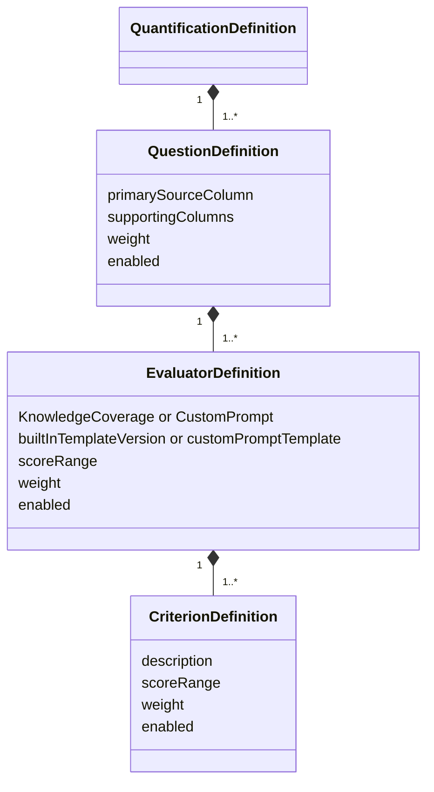
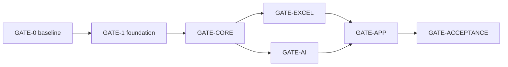

# StudyReport Evaluator 詳細実装プラン — 動的定量化・Excel加重計算版

| 項目 | 内容 |
|---|---|
| 計画版 | 4.0 |
| 作成日 | 2026-09-01 |
| 要求正本 | `docs/requirements-definition.md` v3.0 |
| 状態 | B-01 independent review反映済み・rebaseline前 |
| 初版target | Windows 11 x64 / .NET 10 / Avalonia |
| 入力 | 標準 `.xlsx` 1file |
| 出力 | 入力copyへ定量値とExcel式を追加した別 `.xlsx` |
| 旧版 | v3.0を全面的にsupersede |

## 1. 実装方針

初版は2つのproduction projectと2つのtest projectだけで構成する。

| Project | Responsibility | References |
|---|---|---|
| `src/StudyReportEvaluator.Core/` | dynamic definition、Prompt、result validation、score/formula model、workflow contract | BCL only |
| `src/StudyReportEvaluator.App/` | Avalonia UI、Open XML input/output、Copilot SDK adapter、orchestrator、composition root | Core |
| `tests/StudyReportEvaluator.Core.Tests/` | Core unit/contract/golden tests | Core |
| `tests/StudyReportEvaluator.App.Tests/` | adapter、UI、integration、E2E、publish/package tests | Core、App |

CoreはAvalonia、Open XML SDK、Copilot SDKへ依存しない。Appだけが外部adapterを持つ。追加のApplication、Infrastructure、Platform projectは作らない。

Appの読込、preview、出力、required testはMicrosoft Excel、Office、LibreOffice、COM automationへ依存しない。Open XML formula cellへcached preview valueを書き、formula対応spreadsheetで開いたときの再計算設定を付ける。

## 2. Domain model



- 質問数、evaluator数、criterion数はordered collectionで表し、UIから動的に変更する。
- 1 evaluatorは1行の主回答と選択済み補助列を1回だけ評価する。
- 主回答には学生Prompt列を含む任意の選択列を使える。
- 同じPromptの反復評価・平均・多数決は初版に含めない。
- Knowledgeはapp-owned semantic instructionを使い、利用者は知識ポイントを入力する。
- Customは利用者入力Promptを使う。
- AIはcriterion raw scoreだけを返す。
- Excelがscorable判定を守り、effective raw、criterion normalization、evaluator、question、overallを式で計算する。
- 実行可能snapshotには、1件以上のenabled question、各enabled question内に1件以上のenabled evaluator、各enabled evaluator内に1件以上のenabled criterionを要求する。

## 3. Excel calculation contract

### 3.1 Weight and numeric hierarchy

1. criterion weight: evaluator内
2. evaluator weight: question内
3. question weight: overall内

全weightはExcelへ安全に表現できる有限値かつ`> 0`。合計100入力を要求せず、各階層でweight合計により正規化する。UIは実効percentageを表示する。

score minimum／maximum、AI raw、override、weightはvalidated numeric valueとして扱う。主回答が空なら`Scorable=0`としてoverrideを許可しない。主回答が非空の場合だけ、overrideは空欄またはcriterion effective range内を受け入れる。app入力で非数値または範囲外ならfield errorにして出力を許可せず、出力後の不正編集はformulaがblankへ落とす。

### 3.2 Formula pipeline

各結果行で次の順にliteral／formula cellを生成する。

1. `Scorable`: 主回答が非空ならliteral `1`、空ならliteral `0`。
2. `EffectiveRaw`: Scorableが1の場合だけ、有効range内のnumeric overrideを優先し、overrideが空なら有効range内のnumeric AI rawを使い、どちらもなければblank。
3. `Normalized`: EffectiveRawがnumericの場合だけ`ROUND((EffectiveRaw-Min)/(Max-Min)*100, RoundingDigits)`、それ以外はblank。
4. `EvaluatorScore`: 全enabled criterion normalized scoreがnumericの場合だけweighted average、欠損時はblank。
5. `QuestionScore`: 全enabled evaluator scoreがnumericの場合だけweighted average、欠損時はblank。
6. `OverallScore`: 全enabled question scoreがnumericの場合だけweighted average、欠損時はblank。

基準形は次とする。

```text
EffectiveRaw:
=IF(ScorableCell<>1,"",IF(OverrideCell="",IF(ISNUMBER(AiRawCell),IF(AiRawCell<MinCell,"",IF(AiRawCell>MaxCell,"",AiRawCell)),""),IF(ISNUMBER(OverrideCell),IF(OverrideCell<MinCell,"",IF(OverrideCell>MaxCell,"",OverrideCell)),"")))

Normalized:
=IF(ISNUMBER(EffectiveRawCell),IFERROR(ROUND((EffectiveRawCell-MinCell)/(MaxCell-MinCell)*100,RoundingDigitsCell),""),"")

Aggregate shape:
=IF(COUNT(ChildScoreRef1,...)=EnabledChildCount,IFERROR(ROUND(SUM(ChildScoreRef1*ChildWeightRef1,...)/SUM(ChildWeightRef1,...),RoundingDigitsCell),""),"")
```

- disabled nodeとその子孫はscore参照、blank count、weight分子・分母から除外する。
- AI rawがblankのとき、Excelの算術上の0として扱わない。
- 空の主回答はoverrideを含め常にblank scoreとする。
- 主回答が非空ならvalid overrideはAI rawがblankまたはAI失敗でもeffective rawとして使える。
- 非空の非numeric overrideやrange外overrideはAI rawへfallbackせずblankにする。
- min、max、rounding、全weightは`Quantification_Config`のverified cellを参照し、domain valueをformulaへhard-codeしない。
- aggregateは非連続score cellでも扱えるapp-generated pairwise termとしてserializeし、raw user formulaを連結しない。

Formula AST／serializerは次だけを許す。

- `IF`, `IFERROR`, `ISNUMBER`, `COUNT`, `SUM`, `SUMPRODUCT`, `ROUND`
- 比較、四則演算、括弧
- app-owned sheetのverified cell/range参照

外部参照、defined-name injection、raw formula text、DDE、macro、循環参照を許さない。

### 3.3 Preflight, rounding, and cached values

- formula生成前に、Excel列数、formula長、function引数数、参照先、DAGを計算する。
- 8,192文字以上、Excel function引数上限超過、列上限超過になるdefinitionは、該当するquestion/evaluator/criterionのIDと表示名、fieldまたはformula階層、実測dimensionを示してwrite前に拒否する。回答本文やPrompt本文はerrorへ含めず、切詰めや一部child除外はしない。
- Core previewは`decimal`と`MidpointRounding.AwayFromZero`を使い、Excel `ROUND`のmidpoint away-from-zeroへ合わせる。
- normalized、evaluator、question、overallの各階層で丸め、親は既に丸められたchild scoreを入力にする。
- formula cellにはCore previewの最終丸め値をcached valueとして併記する。
- workbook calculation propertiesはautomatic、force full calculation、full calculation on loadにする。
- required testはformula AST、golden formula、cached value、独立した手計算oracleで判定する。Excel／LibreOffice再計算smokeはinstalled時だけのoptional testとし、required gateをblockしない。

## 4. Sample profile

`sample/機械学習 サブフィールド PBL 2025 レポート - コピー.xlsx`の本文をfixtureへコピーしない。構造metadataだけをprofileとして固定する。

- input SHA-256: `446386E20BB4096561CB4AFD6D74B8EAA9D50EAE53C97F984BA7F70EBEAD0DE5`
- `Original!A1:L531`
- initial target suggestions: F、G、H、I、J、K
- initial unselected columns: A〜E、L
- Jのsupporting column候補: K
- G/Jは学生Prompt列としてCustom evaluatorのprimary候補にできる
- `Old`と`Final`は保持し、初期評価対象にしない

実workbookをunit test fixtureへ複製せず、同じsheet dimensionと列roleを持つfixed-seed synthetic workbookを生成する。実sampleのintegration testはmetadata読取とinput不変検査だけを行い、回答本文をlog/artifactへ保存しない。

## 5. Phase and gates



各gateは全prerequisite gateのPASSを必要とし、gate artifactへprerequisite commit／resultを記録する。

## 6. Phase 0 — Requirement baseline

| Task | Depends | Main artifacts | Completion |
|---|---|---|---|
| B-01 | none | requirement v3.0; plan v4.0 | new intent、blank-safe formula、range-safe override、warning-only semantics、Office非依存 complete |
| B-02 | B-01 | ADR-0011; sample profile | v2.0の廃止behaviorと理由、新blank/override/warning契約、Core/App境界とsnapshot不変性、sample metadataを記録 |
| B-03 | B-01/B-02 | baseline; exact task-file map | hashes、commits、37 task/gate owners、hidden dependency 0 |
| B-04 | B-03 | traceability | AC-001〜015 and mandatory surfaces mapped |
| GATE-0 | B-01〜B-04 | gate result | independent review blocker/high 0; production `src/` files 0 |

GATE-0まではproduction sourceを作らない。GATE-0 PASS後、次のtaskを依存順に実行する。

## 7. Phase 1 — Foundation

| Task | Depends | Files | Tests / completion |
|---|---|---|---|
| F-01 | GATE-0 | `global.json`; `Directory.Build.props`; `Directory.Packages.props`; `NuGet.Config`; `.gitignore` merge | exact .NET 10 SDK、nullable、warnings、deterministic、locked restore |
| F-02 | F-01 | `.slnx`; 2 production `.csproj`; 2 test `.csproj`; App bootstrap | clean restore/build、one-way reference、Office install不要 |
| F-03 | F-02 | package locks; architecture/supply-chain tests | exact package versions、floating 0、forbidden Core refs 0 |
| GATE-1 | F-03 | `artifacts/test/gate-foundation.json` | restore/build/test/architecture PASS |

実装時にcurrent official documentationを再確認してexact versionを固定する。

- Avalonia
- DocumentFormat.OpenXml
- GitHub.Copilot.SDK
- test SDK/framework

## 8. Phase 2 — Core

| Task | Depends | Responsibility | Main files / tests |
|---|---|---|---|
| C-01 | GATE-1 | Dynamic definition model | `Domain/QuantificationDefinition.cs`; `QuestionDefinition.cs`; `EvaluatorDefinition.cs`; `CriterionDefinition.cs`; tests |
| C-02 | C-01 | Definition validation/snapshot | IDs、columns、range、weights、enabled minimum、counts、canonical hash、immutable snapshot; tests |
| C-03 | C-01/C-02 | App-owned Knowledge instruction、Custom template、six-placeholder renderer | `Prompting/BuiltInPromptTemplates.cs`; `PromptTemplateRenderer.cs`; tests |
| C-04 | C-01 | AI criterion result model and exact source-bound validation | `Domain/QuantificationResult.cs`; `Validation/QuantificationResultValidator.cs`; tests |
| C-05 | C-01/C-04 | Weight normalization、preview calculation、closed formula model | `Scoring/WeightedScoreCalculator.cs`; `Formulas/FormulaExpression.cs`; `FormulaSerializer.cs`; tests |
| C-06 | C-01〜C-05 | Fixed-seed synthetic specs | 1/2/10 questions、1/2/5 evaluators、1/4/20 criteria、sample-like 531 rows、single-cause negatives |
| GATE-CORE | C-01〜C-06 | `artifacts/test/gate-core.json` | unit/golden/schema/formula tests PASS |

### C-01/C-02 invariants

- Questions/evaluators/criteria are ordered immutable collections in snapshot.
- Editing operations create a new draft; active run reads only its immutable snapshot.
- Evaluator types are exactly `KNOWLEDGE_COVERAGE` and `CUSTOM_PROMPT`.
- A question maps one arbitrary primary source column and zero or more unique supporting columns.
- Within one question, a supporting column cannot duplicate another supporting column or the primary column.
- Weight 0 is not a disable mechanism; use `Enabled=false` or remove the item.
- Executable snapshot enforces one enabled child at every hierarchy level.
- Disabled nodes remain in snapshot but are excluded from dispatch and formulas.
- Validation errors identify the specific question/evaluator/criterion by ID and display name, field name, and a safe offending value or dimension without echoing answer or Prompt bodies.

### C-03 invariants

- Knowledge semantic core requires explanation／relation／application and cannot be replaced by keyword-count logic.
- Custom template is nonblank and contains `{回答}` and `{評価項目}` at least once.
- Allowed placeholders are exactly six.
- `{{` and `}}` escape literal braces; unknown, unclosed, malformed braces fail before dispatch.
- Inserted values are opaque and never rescanned for placeholders.
- `{最小点}`／`{最大点}` always use evaluator defaults regardless of criterion-specific ranges; `{評価項目}` includes every criterion effective range.

### C-04 invariants

- AI returns every expected enabled criterion exactly once; partial criterion sets are rejected as one invalid response.
- Evidence source kind and stable source column ID identify primary、one actually sent supporting column、or none.
- Evidence is an exact contiguous substring in the identified same-row source.
- Invalid values remain invalid; no truncation、clamp、partial adoption、or 0 conversion.

### C-05 hand-calculated oracles

For one row with rounding digits 1:

- Criterion A: raw 25, range 0〜30, weight 2 → normalized cell `83.3`
- Criterion B: raw 8, range 1〜10, weight 1 → normalized cell `77.8`
- Evaluator unrounded result from rounded child cells: `(83.3×2 + 77.8×1) / 3 = 81.466…`
- Evaluator cell: `81.5`

Additional mandatory oracles:

- empty primary + any override → Scorable 0、effective/normalized/evaluator/question/overall blank。
- nonempty primary、AI raw blank + override blank → effective/normalized/evaluator/question/overall blank, never 0。
- nonempty primary、AI raw invalid + override 5 in range 0〜10 → effective raw 5、normalized 50.0。
- post-export nonnumeric override or override 11 in range 0〜10 → effective raw blank、all dependent aggregates blank。
- midpoint `81.45` at one digit → `81.5` in Core preview and cached value。

## 9. Phase 3A — Excel adapter

| Task | Depends | Responsibility | Main files / tests |
|---|---|---|---|
| X-01 | GATE-CORE | File classifier、read-only snapshot、workbook metadata | xlsx/ZIP/relationship limits、sheet/dimension/header、hash/size/time; tests |
| X-02 | X-01/C-01 | Mapping and sample suggestions | arbitrary primary/support columns、Original F〜K suggestions、no fixed position; tests |
| X-03 | X-01/C-02 | Target-local working copy and Config/Run sheets | byte-copy、`{BaseName} (2)`, `(3)` unique names、definition snapshot、weights/ranges/mapping、calculation properties; tests |
| X-04 | X-03/C-04/C-05 | Results literals、blank-safe formulas、cached values | scorable/raw/override/effective/normalized/evaluator/question/overall、source-bound evidence、string safety; tests |
| X-05 | X-04 | Output validation and atomic commit | Open XML reopen、formula AST/ref/DAG/length、specific hierarchy errors、input recheck、target-local temp/flush/rename faults; tests |
| GATE-EXCEL | X-01〜X-05 | `artifacts/test/gate-excel.json` | sample metadata、synthetic output、input immutability、formula/cached oracle、fault tests PASS |

### Output column pattern

For each enabled question/evaluator/criterion:

- `.Scorable` literal 1/0
- `.AI_Raw` literal or blank
- `.Override` literal or blank with range data validation; disabled when Scorable is 0
- `.Effective_Raw` formula
- `.Normalized` formula
- `.Reason` literal
- `.Evidence` literal
- `.Evidence_Source` literal
- `.Evidence_SourceColumn` literal
- `.Status` literal

Then add evaluator score、question score、overall score formula columns. Column IDs derive from validated stable IDs, not display text。Aggregate formulas are generated from explicit child score/config weight references and do not assume adjacent per-criterion score cells。

App-owned sheet名が既に存在する場合は既存sheetを変更せず、`{BaseSheetName} (2)`から最小の未使用正整数suffixを順に選ぶ。Excelの31文字上限へ収めるためsuffix分だけbaseを安全に切り詰め、予約・不正文字を生成せず、3 sheetすべての実名をformula参照とRun metadataへ記録する。

### Atomic output rules

- Temp file is created in target directory so final rename stays on one volume.
- Existing final path is never silently overwritten.
- Input hash、size、last-write time are rechecked for exact equality before final rename; any drift yields `INPUT_CHANGED` and no final file. A time tolerance is not used because it would hide same-filesystem changes within that window.
- Cancel observed before commit removes temp best effort and creates no final file.
- Once the short rename critical section begins, cancellation is deferred until the operation reaches valid-final or no-final state.
- Validation／rename failure leaves no file under the requested completed name; temp cleanup failure is surfaced without logging cell content.

## 10. Phase 3B — Copilot adapter

| Task | Depends | Responsibility | Main files / tests |
|---|---|---|---|
| A-01 | GATE-CORE | Copilot client/auth/model | existing logged-in user、auth status、exact SDK/CLI identity、no secret input; tests |
| A-02 | A-01/C-03/C-04 | Dynamic schema and one result tool | exact evaluator/criteria IDs、range、source IDs、one call、normal body ignored、external I/O 0; tests |
| A-03 | A-02 | Ephemeral runner、finite timeout、retry、cancel、cleanup、safe log | one evaluator/session、schema retry1、transport retry2、120s attempt timeout、concurrency1〜3、content log0; tests |
| GATE-AI | A-01〜A-03 | `artifacts/test/gate-ai.json` | fake transport/contract/capability/timeout tests PASS; optional synthetic live smoke separately recorded |

- Missing criterion、duplicate criterion、unknown criterion、partial tool payloadはschema failureとしてpayload全体を拒否する。
- Timeoutはtransient retry対象とし、上限後は`AI_TIMEOUT`でblank scoreにする。
- Live smoke is optional and uses fixed synthetic text only。Gate artifact records exactly one advisory status: `PASS`, `SKIPPED_NOT_AUTHENTICATED`, `NOT_RUN`, or `FAILED_ADVISORY`, with a non-content rationale。Only required fake-transport tests determine GATE-AI PASS; the live status never substitutes for them and is never misreported as PASS。

## 11. Phase 4 — Workflow and UI

| Task | Depends | Responsibility | Main files / tests |
|---|---|---|---|
| U-01 | GATE-EXCEL/GATE-AI | Snapshot-bound orchestrator | plan rows×questions×evaluators、progress、cancel、partial output、input recheck、draft isolation; tests |
| U-02 | U-01 | App shell and warning nonblock | 4-step navigation、persistent banner、keyboard/focus、no acknowledgment state; tests |
| U-03 | U-01/U-02 | Input + Quantification Design | file/sheet/rows/arbitrary mapping、dynamic tree editor、Knowledge points/built-in preview、Custom Prompt、criteria/ranges/weights; tests |
| U-04 | U-01〜U-03 | Run + Results/Output | auth/model、progress/cancel、raw/override/formula preview、field validation、output path、input unchanged; tests |
| GATE-APP | U-01〜U-04 | `artifacts/test/gate-app.json` | four-step synthetic journey、warning nonblock、keyboard/200%、cancel/partial output PASS |

### Snapshot and partial-result contract

- Run plan、Prompt、expected schema、result validation、formula layoutはrun開始時の同一snapshotから生成する。
- Run中のUI draft editは次runだけへ反映し、current runへ混入しない。
- Cancel後に新規evaluatorをdispatchしない。完了済みevaluator payloadだけを保持し、未完了unitはblank + `CANCELLED`とする。
- 利用者はcancelled runの部分結果を別fileへ出力できる。blank child propagationにより未完了を0点へ変換しない。

### Warning test contract

- Warning is a persistent non-modal banner visible on input and result steps.
- Warning has no checkbox、accept／dismiss button、role、expiry、status field。
- Warning state is not part of definition snapshot or run gate.
- Never focusing or interacting with warning does not prevent mapping、run、cancel、override、or export.
- Technical validation errors remain blocking and are visually distinct from the warning.

## 12. Phase 5 — Acceptance, package, docs

| Task | Depends | Responsibility | Main files / tests |
|---|---|---|---|
| E-01 | GATE-APP | Synthetic end-to-end | sample-like 531-row workbook→mapping→dynamic evaluators→fake AI→formulas/cached values→separate output |
| E-02 | E-01 | Real sample structural E2E and Windows local E2E | read-only metadata/input hash、no body artifact、self-contained app launch、Office不要 |
| P-01 | E-02 | Windows publish/package | win-x64 self-contained folder、unsigned ZIP、SHA-256、layout/tamper tests |
| D-01 | E-01〜P-01 | User/developer docs | README、architecture、Excel/formula contract、custom evaluator guide、actual UI images only if captured |
| E-TR | E-01〜D-01 | Final traceability | AC-001〜015→required test/evidence、optional evidence separated、unsupported claims 0 |
| GATE-ACCEPTANCE | E-TR | `artifacts/test/gate-acceptance.json` | all required tests PASS; optional live/recalculation smoke may remain explicit SKIP |

## 13. Detailed test matrix

### Definition

- 1/2/10 questions
- 1/2/5 evaluators per question
- 1/4/20 criteria per evaluator
- duplicate/empty IDs
- min=max、min>max、NaN、Infinity
- negative/zero weights
- enabled/disabled/delete/reorder
- zero enabled question/evaluator/criterion → snapshot validation error
- arbitrary primary column including student Prompt column
- supporting column absent、shared across questions、duplicate within question、same as primary
- draft edit during run leaves active snapshot/hash/schema/formulas unchanged
- validation error names safe question/evaluator/criterion identity、field、offending value or dimension without answer/Prompt body

### Prompt and AI result

- Knowledge app-owned semantic instruction and knowledge-point criteria
- Custom Prompt requires `{回答}` and `{評価項目}`
- six placeholders、literal `{{`/`}}`、unknown/unclosed/malformed/recursive-like input
- `{最小点}`/`{最大点}` remain evaluator defaults when criteria use different ranges; `{評価項目}` carries effective criterion ranges
- inserted answer text containing `{回答}` remains literal and is not rescanned
- missing/duplicate/unknown/partial criterion payload rejects whole evaluator result
- score min/max exact boundaries and ±epsilon
- evidence primary/support/none with exact stable source column ID
- evidence source mismatch or substring mismatch rejects result
- normal assistant text without tool
- duplicate tool call
- timeout before/during result, cancellation before/during/after dispatch
- cleanup failure interlock

### Formula

- empty primary produces Scorable 0 and remains blank even if override cell is edited
- nonempty primary with override absent/present/zero/min/max
- valid override while AI blank/invalid
- app-side nonnumeric or below/above-range override blocks export
- post-export nonnumeric or below/above-range override produces blank effective raw, not clamp/fallback
- AI raw blank produces blank effective/normalized/ancestors, never 0
- normalized 0/100 and nonzero minimum
- asymmetric weights using Config cell references in numerator and denominator
- one/multiple enabled criteria/evaluators/questions; disabled children excluded
- blank child propagation at criterion/evaluator/question levels
- rounding digits 0〜6, rounded-child aggregation, and positive/negative midpoint away-from-zero
- formula length 8,191 accepted / 8,192 rejected before write with exact failing hierarchy identity/dimension
- function argument、column count、external/sheet/defined-name/cycle injection boundaries
- independent hand oracle equals Core preview and formula cached value
- optional installed Excel/LibreOffice smoke is reported separately and never substitutes for required oracle tests

### Workbook

- sample metadata and hash
- valid minimal/sample-like xlsx
- corrupt ZIP、macro format、protected/encrypted package
- sheet name collisions use the minimum available ` (n)` suffix, preserve existing sheets, stay within 31 characters, and bind formulas to actual names
- untrusted strings beginning with formula markers stored as literal string cells
- blank AI raw cells remain nonnumeric after reopen
- calculation properties request automatic full recalculation
- disk full、locked target、existing target、rename failure、process interruption seam
- input changed after snapshot prevents final rename with `INPUT_CHANGED`
- original file SHA-256、size、last-write time match exactly on success/failure/cancel
- tests pass on a machine with no Excel/Office/LibreOffice installed

### UI

- persistent warning visible but nonblocking without any interaction
- dynamic add/copy/reorder/disable/delete
- Knowledge points/built-in Prompt preview vs Custom Prompt editing surfaces
- arbitrary primary/support mapping and mapping suggestion override
- weight effective percentage
- empty-primary override disabled
- invalid override field blocks export as technical validation
- keyboard-only、focus order、200% scale、color-independent status
- large valid definition virtualization/responsiveness
- output path collision

## 14. Gate rules

| Gate | Positive | Negative |
|---|---|---|
| GATE-0 | current docs/baseline/map/trace/review | production source before gate 0、hidden external dependency、unresolved blocker/high 0 |
| GATE-1 | restore/build/architecture/lock | floating package、Core external refs、Office runtime dependency 0 |
| GATE-CORE | dynamic model/prompt/result/formula/oracle tests | invalid definition/result/formula accepted、blank converted to 0 0 |
| GATE-EXCEL | valid separate output/formulas/cached values/input unchanged | input mutation、partial final、unsafe string/formula、silent truncation 0 |
| GATE-AI | required fake auth/schema/tool/retry/timeout/cleanup tests PASS; advisory live status recorded | secret input、ambient capability、partial payload adoption、content log、advisory status omitted or reported as required PASS 0 |
| GATE-APP | complete four-step journey | warning gate、snapshot drift、dynamic editor loss、send-after-cancel 0 |
| GATE-ACCEPTANCE | AC-001〜015 linked to required evidence; optional smoke status recorded | required NOT_RUN as PASS、optional smoke as required、unsupported claim 0 |

Optional external recalculation smoke runs only when a supported executable is detected at test startup and may be explicitly disabled in headless/CI environments。Its advisory status is exactly `PASS`, `SKIPPED_NOT_INSTALLED`, `NOT_RUN`, or `FAILED_ADVISORY`, with a non-content rationale。Required oracle tests alone determine gate PASS; optional failure remains visible and is never relabeled as PASS。

## 15. File ownership summary

| Shared path | Owner |
|---|---|
| `docs/requirements-definition.md`; current plan | B-01 |
| ADR-0011; sample profile | B-02 |
| baseline; exact path map | B-03 |
| traceability | B-04 and E-TR |
| gate result | GATE-0 and later gate tasks |
| `.gitignore` | F-01; merge existing changes, never overwrite |
| `README.md` | D-01; merge existing changes, never overwrite |
| App composition root | U-02 |
| package versions/locks | F-01/F-03 |

Exact paths are fixed in `dev/docs/preflight/implementation-task-file-map.md` before revised GATE-0。

## 16. Execution rules

1. Each task edits only its owned files and direct tests.
2. `work/` artifacts are updated by delete→create, never partial edit.
3. Read current files before editing; preserve unrelated worktree changes.
4. Add tests with production behavior in the same task.
5. Run diagnostics、target tests、build as applicable、`git diff --check` after each task.
6. Stage and commit only task-owned files.
7. Do not log or commit sample answer bodies、AI reason/evidence、tokens、raw network/session/spool data.
8. Do not use actual sample content for live Copilot smoke.
9. Do not claim educational validity、legal compliance、signed distribution、or unsupported platform support.
10. Ethics warning is display-only and nonblocking; technical integrity/security/numeric checks remain enforceable.
11. Required gates must run without Excel、Office、LibreOffice、COM automation. Optional external recalculation status is reported honestly.

## 17. Completion definition

Implementation is complete when:

- AC-001〜015 are linked to passing required evidence.
- Input sample metadata is recognized and input remains unchanged.
- Dynamic questions/evaluators/criteria and weights work without business-fixed counts.
- Knowledge uses app-owned semantic coverage; Custom Prompt can quantify any selected primary column.
- AI returns criterion raw values with exact same-row evidence provenance.
- Excel formulas keep empty primary unscorable, choose blank-safe effective raw, and compute normalized evaluator/question/overall scores from Config references.
- For nonempty primary, valid optional override supersedes AI raw without mandatory review; invalid override cannot create out-of-range aggregate scores.
- Formula cached values and Core preview match independent hand oracles; external spreadsheet install is not required.
- Warning is a persistent non-modal banner and cannot block processing.
- Separate output workbook validates and opens; atomic commit creates either a valid final file or no final file.
- Windows 11 x64 self-contained package and documentation are generated.
- Required test/build/gates pass; optional live/recalculation smoke status is reported honestly.
