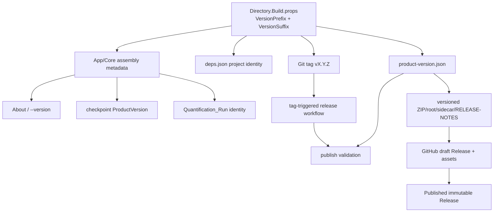

# StudyReport Evaluator バージョン管理 詳細調査レポート

> [!NOTE]
> **IMPLEMENTED AFTER THIS INVESTIGATION:** 本文は版管理導入前の調査snapshotです。現在の手順正本は[`dev/docs/version-management.md`](../../../../dev/docs/version-management.md)、decisionは[ADR-0014](../../../../dev/docs/adr/0014-product-versioning.md)、toolは[`dev/version.ps1`](../../../../dev/version.ps1)です。

| 項目 | 内容 |
|---|---|
| 調査日 | 2026-09-02 |
| 対象 | `dahatake/StudyReport-Evaluator`、ローカル `main` |
| 調査時 HEAD | `c9db2fc038cc09874a142d6575b47bdb49ac4b55` [L01] |
| 目的 | 製品版、互換性、ビルド、配布物、Git tag、GitHub Release、schema、依存関係を一貫して管理するために必要な事項を確定する |
| 成果物 | 本レポートと機械可読な実測証拠 [L01] |
| 変更範囲 | 調査のみ。アプリケーションコード、既存文書、既存の未コミット変更は変更しない |

## 0. 事実・提案・未決事項の区別

本書では、捏造や推測の混入を避けるため、記述を次の3種類に分ける。

- **確認済み事実**: 現在のrepository source、生成済みlocal artifact、read-only commandの実測、または公式一次資料から確認した内容。必ず出典IDを付ける。
- **推奨**: 確認済み事実と公式仕様から導いた、このrepository向けの実装案。現在実装済みとは扱わない。
- **要決定**: 製品所有者またはリリース責任者の判断が必要で、調査者が勝手に確定できない内容。

GitHubの公開APIで確認できたのは**公開Release 0件、remote tag 0件**である。公開APIのrelease一覧は通常のtagだけを含まず、push権限のない呼出しではdraft releaseも列挙しないため、「private draftも存在しない」とは断定しない。[L01][E12]

調査開始時のworking treeは45 status entryを持つdirty状態だった。本調査はその変更をstage、revert、上書きしていない。[L01]

## 1. 結論

### 1.1 総合判定

**製品バージョン管理は、現時点では未確立である。**

.NET SDKが暗黙に `Version=1.0.0` を評価し、生成済みDLLにも `1.0.0.0` / `1.0.0+<commit>` が入っている。しかし、repository自身は製品版を明示しておらず、Git tag、公開GitHub Release、release workflow、changelog、version入りasset名も存在しない。[L01][R01][R04][R05][E02][E03]

したがって、現在見える `1.0.0` は**SDK既定値から生じたbuild metadata**であり、承認済みの「StudyReport Evaluator 1.0.0正式版」を意味しない。SemVerでは `1.0.0` が公開APIを定義する版であり、公開済み版の内容は変更してはならないため、暗黙値のまま正式版として扱うべきではない。[E01]

また、要求定義書の `4.1`、definition schemaの `4.0`、checkpoint schemaの `1`、Copilot runtime manifest schemaの `1` は、それぞれ異なる契約を表す。これらを製品版へ読み替えたり、製品releaseごとに一律で同時更新したりしてはならない。[R09][R10][R12][R13][R20][R21]

### 1.2 最優先で必要なもの

正式な次回配布より前に、少なくとも次が必要である。

1. **公開互換性契約の宣言** — 何をSemVer上の公開APIとみなすかをADRで確定する。[E01]
2. **単一の製品版正本** — `Directory.Build.props` に明示的な `VersionPrefix` / `VersionSuffix` を置き、SDK既定 `1.0.0` への暗黙依存をなくす。[R01][E02][E04]
3. **版の伝播** — assembly、app表示、checkpoint、Run sheet、package名、release notes、machine-readable manifest、Git tag、GitHub Releaseを同じ製品版へ結ぶ。[R06][R07][R08][R09][R14][R15]
4. **版一致の自動gate** — source版、tag、binary、ZIP、sidecar、release assetの不一致をrelease前に失敗させる。[R16][R17][E11]
5. **不変なrelease** — exact commitをtagし、assetをdraftへ全添付してから公開し、可能ならImmutable Releasesを有効化する。[E09][E10][E13][E14]
6. **checkpointのSemVer対応** — 現在の `System.Version` 比較では `1.0.0-rc.1` を解析できないため、prereleaseを含む製品版の互換判定を修正する。[L01][R11][E01]
7. **release履歴** — user-facing変更をMAJOR/MINOR/PATCHへ分類できるchangelogまたは同等のsource-controlled記録と、GitHub release notesを用意する。[E08]

## 2. 調査方法と証拠境界

### 2.1 調査対象

次をread-onlyで調査した。

- 共通MSBuild設定、全project、central package versions、lock file、`global.json`。[R01][R02][R03][R04][R05][R25]
- application identity、Run sheet、checkpoint、definition serializer、Prompt template。[R06][R07][R08][R09][R10][R11][R12][R13]
- Windows publish/package scriptとpackage/supply-chain test。[R14][R15][R16][R17]
- README、利用者ガイド、要求、Excel契約、実装状態、release scope ADR。[R18][R19][R20][R21][R22][R23]
- local Git状態、MSBuild実効値、生成済みDLL/runtime metadata、公開GitHub API。[L01]
- SemVer、.NET/MSBuild、NuGet、Git、GitHub Releases/Actionsの公式資料。[E01]〜[E17]

### 2.2 実測した主なcommand

再現用commandと結果はJSONへ保存した。[L01]

| 観測 | 実測結果 | 出典 |
|---|---|---|
| branch / HEAD | `main` / `c9db2fc038cc09874a142d6575b47bdb49ac4b55` | [L01] |
| Git describe | `c9db2fc-dirty` | [L01] |
| 調査開始前dirty entry | 45 | [L01] |
| local tag | 0 | [L01] |
| `.github` directory | なし | [L01] |
| root `CHANGELOG*` | 0 | [L01] |
| MSBuild `Version` | `1.0.0` | [L01] |
| MSBuild `VersionPrefix` / `VersionSuffix` | `1.0.0` / empty | [L01] |
| published App assembly version | `1.0.0.0` | [L01] |
| published App file version | `1.0.0.0` | [L01] |
| published App product version | `1.0.0+c9db2fc038cc09874a142d6575b47bdb49ac4b55` | [L01] |
| self-contained runtime | `Microsoft.NETCore.App 10.0.11` | [L01][R27] |
| 公開GitHub Release / remote tag | 0 / 0 | [L01] |
| `System.Version.TryParse("1.0.0-rc.1")` | `false` | [L01] |

### 2.3 証拠上の制限

- `artifacts/` はGit ignore対象であり、生成済みDLLやZIPはlocal evidenceであって永続的なrelease recordではない。[R24]
- working treeがdirtyなので、DLLのProductVersionにあるcommit SHAだけでは、そのDLLにどの未コミット差分が含まれたかを証明できない。[L01][E03]
- 本調査ではアプリケーションの全testを再実行していない。既存testの内容はsourceとして読み、過去のPASS記録は実装状態文書の記録としてのみ扱う。[R16][R17][R22]
- repository設定のImmutable Releases有効/無効は公開sourceや公開APIから確認できないため、**未確認**とする。[E13][E14]

## 3. 現在の版管理インベントリ

### 3.1 製品・assembly・配布

| Surface | 現在の状態 | 判定 | 出典 |
|---|---|---|---|
| 製品版のsource of truth | `Version` / `VersionPrefix`の明示設定なし。実効値はSDK既定 `1.0.0` | **欠落** | [L01][R01][R04][R05][E02][E04] |
| App assembly | `AssemblyVersion=1.0.0.0`、`FileVersion=1.0.0.0`、`ProductVersion=1.0.0+commit` | 暗黙生成 | [L01][E02][E03] |
| Core assembly | projectに版指定なし。共通SDK規則の対象 | 暗黙生成 | [R01][R05][E02] |
| `.deps.json` project identity | `StudyReportEvaluator.App/1.0.0` と `StudyReportEvaluator.Core/1.0.0` | 暗黙値が伝播 | [R26] |
| ZIP名 | `StudyReportEvaluator-win-x64.zip` | versionなし | [R15][R16] |
| ZIP root | `StudyReportEvaluator-win-x64/` | versionなし | [R15][R16] |
| SHA-256 sidecar | `StudyReportEvaluator-win-x64.zip.sha256` | versionなし | [R15][R16] |
| `RELEASE-NOTES.txt` | OS、self-contained、unsigned等は記録するが製品版・commitは記録しない | version/provenance欠落 | [R15][R16] |
| product manifest | Copilot用 `copilot-runtime.json` はあるが、製品版を表すmanifestはない | **欠落** | [R04][R14][R15] |
| appの版表示 | launch optionは `--input` / `--prompt` のみ。`--version` はunknown optionになる | **欠落** | [R28] |
| README入手手順 | versionなしasset名を案内 | version coexistence不可 | [R18][R19] |
| code signing | 初版scopeはunsigned ZIP | version管理とは別の既知制約 | [R18][R23] |

### 3.2 Git・Release・履歴

| Surface | 現在の状態 | 判定 | 出典 |
|---|---|---|---|
| local tag | 0件 | release pointなし | [L01] |
| public remote tag | 0件 | 公開release tagなし | [L01] |
| public GitHub Release | 0件 | 公開binary releaseなし | [L01] |
| release workflow | `.github` directoryなし | **自動化なし** | [L01] |
| changelog | root `CHANGELOG*` なし | **履歴正本なし** | [L01] |
| current public release status | `IMPLEMENTATION_IN_PROGRESS` | stable公開済みとは扱えない | [R22] |
| asset download URL | 実在release asset未作成としてBLOCKED | URLを推測してはいけない | [R19][R22] |

GitHub ReleaseはGit tagに基づくdeployable iterationであり、binary assetとrelease notesを添付できる。現在はその対応関係を作る仕組みがない。[E07][E08][E12]

### 3.3 runtime identityとoutputへの記録

`QuantificationRunBoundary` と `ResultsOutputBoundary` はApp assemblyの `AssemblyInformationalVersion` を読み、`+`以降を削除して `StudyReportEvaluator.App/<version>` を作る。現在の生成済みbinaryを前提にすると、記録値は `StudyReportEvaluator.App/1.0.0` となり、source commitは失われる。[L01][R06][R07]

そのidentityはcheckpointの `CheckpointRuntimeIdentity.ApplicationIdentity` とfinal workbookの `Quantification_Run` sheetへ保存される。[R06][R07][R08][R09]

checkpoint再開時は次を検査する。

- application identityは同じassembly名かつ同じmajorならcompatible。
- Copilot CLI versionとSHA-256は完全一致。
- GitHub Copilot SDK informational versionは完全一致。[R11]

ただしmajor解析には `System.Version.TryParse` を使う。`1.0.0-rc.1` はSemVerとして有効だが `System.Version` では解析できず、現在のコードは文字列完全一致へfallbackする。その結果、例えば `rc.1` と `rc.2` は同一majorとして扱われない。[L01][R11][E01]

### 3.4 独立して存在するversion

| Version種別 | 現在値 | 所有契約 | 製品SemVerとの関係 | 出典 |
|---|---:|---|---|---|
| 要求文書版 | `4.1` | 要求baseline | 独立。製品版ではない | [R20] |
| Excel/formula契約 | `v4.0` | workbook構造・formula | 独立。変更影響から製品bumpを判断 | [R21] |
| QuantificationDefinition schema | `4.0` | canonical definition JSON | 独立schema | [R12] |
| Checkpoint schema | `1` | `.partial.xlsx` payload | 独立schema。現在は完全一致のみ受理 | [R09][R10] |
| Copilot runtime manifest schema | `1` | bundled CLI manifest | 独立schema。現在は完全一致のみ受理 | [R04][R14][R15] |
| Knowledge template | `knowledge-v1` | built-in Prompt semantics | 独立template version | [R13] |
| .NET SDK | `10.0.400`、`latestPatch` | build toolchain | 製品版ではない | [R03][R14] |
| Target framework | `net10.0` | compilation/runtime family | 製品版ではない | [R01][R14] |
| self-contained .NET runtime | 実測 `10.0.11` | 配布runtime | releaseごとに記録すべきcomponent | [L01][R27] |
| GitHub.Copilot.SDK | `1.0.11` | dependency | 製品版ではない | [R02][R25] |
| bundled Copilot CLI | SDKが解決する版。現在文書/test evidenceは `1.0.79` | bundled dependency | 製品版ではない | [R14][R15][R23] |

## 4. 採用すべきSemVer 2.0.0方針

### 4.1 前提: 公開APIを先に定義する

SemVer 2.0.0を名乗るsoftwareは、codeまたは文書で明確かつ精密な公開APIを宣言しなければならない。[E01]

このdesktop applicationでは、C#の`public`型だけを公開APIとみなすのは不十分である。利用者や後続toolが依存する外部契約を公開APIとして定義する必要がある。

**推奨する公開互換性契約:** 

1. 対応OS / architecture、配布形式、package layout、起動file。[R14][R15][R18][R23]
2. command-line option `--input` / `--prompt` とそのerror semantics。[R28]
3. 受理するworkbook形式と入力不変契約。[R18][R20]
4. final/partialの命名、sheet名、column/field、formula、blank/zero/status semantics。[R20][R21][R29]
5. checkpointの読込・再開互換性。[R09][R10][R11]
6. AIへ送るdataの範囲とlog/outputのprivacy boundary。[R20]
7. app/SDK/CLI/model identityとして外部へ記録するfield。[R08][R09]
8. sourceからのlibrary利用を正式サポートしない限り、`StudyReportEvaluator.Core.dll` のC# APIはpublic library APIではない、と明記する。現在の配布契約はdesktop appのZIPでありNuGet packageではない。[R14][R15]

### 4.2 MAJOR / MINOR / PATCH

| 要素 | 更新条件 | 例 | SemVer根拠 |
|---|---|---|---|
| `MAJOR` | **後方互換性を壊す公開契約変更** | `1.4.2` → `2.0.0` | [E01] |
| `MINOR` | **後方互換性のある機能追加**。公開機能のdeprecated化も含む | `1.4.2` → `1.5.0` | [E01] |
| `PATCH` | **後方互換性のあるバグ修正** | `1.4.2` → `1.4.3` | [E01] |

追加規則:

- MINOR更新時はPATCHを0へ戻す。[E01]
- MAJOR更新時はMINORとPATCHを0へ戻す。[E01]
- 一度公開した版の内容を差し替えない。変更は必ず新しい版として公開する。[E01]
- dependency更新だけの場合も、公開契約への影響でPATCH/MINOR/MAJORを決める。SemVer FAQは、bug fix目的なら通常PATCH、機能追加目的ならMINORという考え方を示す。[E01]

### 4.3 prereleaseとbuild metadata

| 形式 | 意味 | precedence | 推奨用途 | 出典 |
|---|---|---|---|---|
| `1.0.0-rc.1` | prerelease | `1.0.0` より低い | 公開候補、非stable | [E01] |
| `1.0.0+<commit>` | build metadata | version precedenceへ影響しない | source provenance | [E01][E03] |
| `v1.0.0` | Git tag名 | `v` はSemVer本体に含まれない | release point | [E01][E09] |

**推奨:** source-controlled product versionでは `+build` を使わず、`+`以降は.NET SDKが付加するsource revision用に予約する。prereleaseは `VersionSuffix` で表す。これにより `Version=1.0.0-rc.1`、`InformationalVersion=1.0.0-rc.1+<commit>` の役割が分離できる。[E03][E04]

### 4.4 初回版は要決定

現在は公開Release 0件で、実装状態も `IMPLEMENTATION_IN_PROGRESS` である。[L01][R22]

| 候補 | 適用条件 | 注意 | 根拠 |
|---|---|---|---|
| `0.1.0` | 公開契約がまだ不安定で、互換性を保証しない初期開発版 | SemVer上、`0.y.z` は何でも変更可能 | [E01] |
| `1.0.0-rc.1` | 1.0.0の公開契約候補を試験配布する | prereleaseであることをGitHub Releaseにも設定 | [E01][E08] |
| `1.0.0` | 公開APIを確定し、release gateを完了したstable初版 | 以後のbreaking changeは2.0.0 | [E01] |

**要決定 D-01:** 初回公開をunstable、release candidate、stableのどれとして扱うか。現在の暗黙 `1.0.0` をこの判断の代わりにしてはならない。

## 5. このアプリ向けbump判定表

次は、§4.1の公開互換性契約を採用した場合の**推奨policy**である。

| 変更例 | 製品版 | 関連する独立version | 理由 |
|---|---|---|---|
| score計算の誤りを、既存の文書化済み意味へ戻す | PATCH | formula契約は互換なら据置 | 後方互換bug fix |
| runtime/dependencyのsecurity patchで公開挙動不変 | PATCH | dependency/runtime版を更新 | 配布物は変わるが公開APIは互換 |
| 新しい任意evaluatorを追加し既存runを維持 | MINOR | definition schemaは必要時のみ更新 | 後方互換機能追加 |
| 新しいoptional CLI optionを追加し既定挙動不変 | MINOR | CLI contract更新 | 後方互換機能追加 |
| Windows 11 x64を維持したまま別platform packageを追加 | MINOR | RID/package manifest追加 | 既存利用者を壊さない機能追加 |
| `--input` を削除またはrename | MAJOR | CLI contract major相当 | 既存scriptが壊れる |
| 既存sheet/column名をrenameまたは削除 | MAJOR | Excel/output schema major更新 | 既存consumerが壊れる |
| 同じcell名のscore意味を非互換に変更 | MAJOR | formula契約 major更新 | 値の意味が変わる |
| 過去checkpointをmigrationなしで再開不能にする | MAJOR | checkpoint schema更新 | 保存済み利用者状態を壊す |
| migrationにより過去checkpointを同じ意味で再開可能 | MINOR | checkpoint schema更新 | 後方互換機能追加 |
| Windows 11 x64 supportを削除 | MAJOR | release scope更新 | 現在の対応platform契約を壊す |
| AIへ送信するworkbook data範囲を拡大 | MAJOR | privacy contract更新 | 現在のdata boundaryに依存する利用判断を壊す |
| built-in Promptを意図的に改善し評価挙動を追加 | 原則MINOR | `knowledge-v2` 等へ更新 | user-visible behavior change。互換性を壊す場合はMAJOR |
| typoだけを修正した同梱文書入りZIPを再配布 | PATCH | 文書版は必要に応じ更新 | 公開済みassetを差替えず新しい版にする |
| 要求書だけを改版しbinary/packageをreleaseしない | product releaseなし | 要求文書版のみ更新 | 文書baselineと製品releaseを分離 |

「optional field追加をMINORで許可できるか」は、readerがunknown fieldを許すという拡張規則を先に公開契約へ書いた場合だけ成立する。現在のcheckpoint JSONはunknown memberを拒否するため、checkpoint field追加を無条件に互換とみなせない。[R10]

## 6. 推奨するversion model

### 6.1 単一正本

**推奨:** repository rootの `Directory.Build.props` を製品版の単一正本とし、次の2要素だけを人が変更する。[R01]

| Property | 役割 | 例 |
|---|---|---|
| `VersionPrefix` | `MAJOR.MINOR.PATCH` | `1.4.2` |
| `VersionSuffix` | prerelease。stableはempty | `rc.1` |

.NET SDKは `VersionPrefix` と `VersionSuffix` からversionを合成できる。`Version` を直接設定するとversion suffix指定が無視される経路があるため、prereleaseを運用するなら `VersionPrefix` を正本にする。[E04]

CIが別の製品版を注入する方式ではなく、tagがsource内versionと一致することを検証する方式を推奨する。これにより「sourceは1.4.2だがassetは1.4.3」という二重正本を防ぐ。

### 6.2 .NET version属性へのmapping

SDK-style projectは既定でAssemblyInfoを生成する。`AssemblyVersion` と `FileVersion` はsuffixを除いた `Version`、`InformationalVersion` は `Version`、さらに.NET 8以降ではsource revisionがInformationalVersionへ付加される。[E02][E03]

本repository向けの推奨mapping:

| 属性 | 推奨値 | 用途 | 方針根拠 |
|---|---|---|---|
| Product `Version` | `VersionPrefix[-VersionSuffix]` | 利用者が認識するSemVer | [E01][E04] |
| `AssemblyVersion` | 当面SDK既定のnumeric `MAJOR.MINOR.PATCH.0` | assembly identity | [E02] |
| `FileVersion` | 当面SDK既定のnumeric `MAJOR.MINOR.PATCH.0` | Windows file properties | [E02][E06] |
| `InformationalVersion` | SDK生成 `SemVer+sourceRevision` | build provenance | [E02][E03][E05] |

.NET library guidanceはstrong-named/public libraryでbinding churnを減らすため、AssemblyVersionをmajor中心にする案を示す。現在はdesktop app ZIPであり、Coreを独立NuGet libraryとして公開していないため、まず単一正本とSDK既定mappingを優先する。将来Coreをpublic library化する場合に `MAJOR.0.0.0` policyを別決定する。[E05][R14][R15]

FileVersionへCI build numberを入れることも公式guidance上は選択肢だが、Windowsのbinary versionは4つの16-bit整数である。採用する場合は上限、reset、決定性を先に定義し、無制限のrun numberをそのまま入れない。[E05][E06]

### 6.3 runtimeで扱うidentity

現在の重複した `ApplicationIdentity()` を1つのversion serviceへ統合することを推奨する。[R06][R07]

推奨する論理field:

| Field | 例 | 用途 |
|---|---|---|
| `ProductName` | `StudyReportEvaluator.App` | assembly/product識別 |
| `ProductVersion` | `1.0.0-rc.1` | SemVer互換性・利用者表示 |
| `InformationalVersion` | `1.0.0-rc.1+c9db2fc...` | build識別 |
| `SourceRevision` | `c9db2fc...` | source追跡 |
| `IsReleaseBuild` | release gateでのみtrue | local build誤配布防止 |

既存 `ApplicationIdentity=Name/ProductVersion` は互換性のため維持できるが、Run sheetには `ApplicationInformationalVersion` と `SourceRevision` を追加し、commitを捨てないことを推奨する。field追加の互換性はExcel contractで先に定義する必要がある。[R08][R21]

### 6.4 schema/versionを連動させない

推奨規則:

- 製品SemVerは利用者向け公開契約の差分で更新する。
- definition/checkpoint/manifest/template versionは、それぞれのformatまたは意味が変わった場合だけ更新する。
- schema breaking changeは通常、製品MAJORの根拠にもなるが、「製品版を上げたからschemaも上げる」という逆方向の連動はしない。
- 要求文書版は要求baselineの履歴であり、製品SemVerを決めない。
- dependency versionはcomponent identityであり、製品版を決めない。[E01][R09][R10][R12][R13][R20]

## 7. versionの伝播設計

このflowではtagやworkflowが版を新規生成せず、source正本との一致をgateする。[E09][E11]

### 7.1 version入りasset規則

**推奨命名:** 

| 種別 | stable例 | prerelease例 |
|---|---|---|
| Git tag | `v1.4.2` | `v1.5.0-rc.1` |
| ZIP | `StudyReportEvaluator-1.4.2-win-x64.zip` | `StudyReportEvaluator-1.5.0-rc.1-win-x64.zip` |
| sidecar | 上記ZIP名 + `.sha256` | 上記ZIP名 + `.sha256` |
| ZIP root | `StudyReportEvaluator-1.4.2-win-x64/` | `StudyReportEvaluator-1.5.0-rc.1-win-x64/` |
| Release title | `StudyReport Evaluator 1.4.2` | `StudyReport Evaluator 1.5.0-rc.1` |

version入りassetは複数版を同じdirectoryへ置ける。`latest.zip` のようなmutable aliasをrelease assetの正本にせず、GitHubのLatest Release表示またはReleases pageを案内する。[E07][E08][E12]

### 7.2 machine-readable product manifest

既存 `copilot-runtime.json` はbundled Copilot CLI専用であり、製品manifestとして流用しない。[R04][R14][R15]

新規 `product-version.json` をpublish rootへ生成することを推奨する。

| Field | 値のsource | 検証 |
|---|---|---|
| `schemaVersion` | product manifest独立schema | readerが対応版を明示検証 |
| `productVersion` | MSBuild `Version` | tag/asset名/assemblyと完全一致 |
| `informationalVersion` | App assembly | source revisionを含む |
| `sourceRevision` | Source Link / release commit | tag targetと完全一致 |
| `runtimeIdentifier` | `win-x64` | package contractと一致 |
| `targetFramework` | `net10.0` | runtimeconfigと一致 |
| `runtimeFrameworkVersion` | published runtimeconfig | self-contained component記録 |
| `gitHubCopilotSdkVersion` | bundled manifest / assembly | exact一致 |
| `copilotCliVersion` / `copilotCliSha256` | bundled manifest | exact一致 |
| `unsigned` | current release scope | `true` を明示 |

ZIP自身のhashをZIP内部manifestへ自己参照で埋め込むことはできないため、archive hashは現在どおり外部sidecarとGitHub release asset metadataで扱う。package内manifestはcomponent/version provenance、sidecarは完成archive integrityを担当する。[R15][E12][E13]

## 8. 現在の重大gapとrisk

| ID | Severity | 確認済みgap | 影響 | 必要な処置 | 出典 |
|---|---|---|---|---|---|
| V-01 | BLOCKER | 明示的な製品版正本がない | SDK既定 `1.0.0` を正式版と誤認 | `VersionPrefix` / `VersionSuffix` を明示 | [L01][R01][E02][E04] |
| V-02 | BLOCKER | 公開互換性契約とbump policyがない | MAJOR/MINOR/PATCHを客観判定できない | ADRで§4.1と§5を承認 | [E01][R20][R21] |
| V-03 | HIGH | tag/公開Release/workflow/changelogがない | source、binary、配布履歴が結び付かない | tag + CI + Release +履歴を導入 | [L01][E07][E08][E09] |
| V-04 | HIGH | versionなしZIP/root/sidecar | 複数版が上書き・混同される | §7.1の命名へ変更 | [R15][R16] |
| V-05 | HIGH | dirty buildをrelease scriptが拒否しない | commit SHAだけでsource内容を特定できない | clean exact commit gateを追加 | [L01][R14][E03] |
| V-06 | HIGH | Run sheet/checkpointで `+commit` を削除 | outputからbuildを一意追跡できない | product版とprovenanceを別field化 | [L01][R06][R07][R08] |
| V-07 | HIGH | checkpoint major判定がSemVer prerelease非対応 | `rc.1`→`rc.2`で意図せずruntime mismatch | SemVer-aware判定とtest | [L01][R11][E01] |
| V-08 | HIGH | product versionとschema/doc versionが混在 | 4.1、4.0、1.0.0等の誤連動 | §6.4の独立version台帳 | [R09][R12][R20][R21] |
| V-09 | MEDIUM | package reproducibility testは同一publish folderの再ZIP化だけ | 独立publishのbit-identical性は未証明 | scopeを明記し、必要なら2回publish比較 | [R16] |
| V-10 | MEDIUM | `global.json latestPatch` は同feature bandのより高いpatchを選び得る | 日時/agentによりcompiler/runtime入力が変わり得る | 実選択SDK/runtimeをmanifestへ記録。厳密再現要件は別決定 | [R03][R14][E10] |
| V-11 | MEDIUM | `Sdk_and_central_package_versions_are_exact` の名称と実際のNuGet range semanticsが異なる | 「完全固定済み」という誤認 | exact rangeへ変更するか、lock依存policyとして名称・assertionを修正 | [R17][R25][E15][E17] |
| V-12 | MEDIUM | appに `--version` / About相当の契約がない | 利用者が実行中版を確認しにくい | product版とshort commitを表示 | [R28] |
| V-13 | MEDIUM | repository settingのrelease immutability状態が未確認 | 公開後asset/tag差替え防止を保証できない | repository Settingsで確認・有効化 | [E13][E14] |

### 8.1 dependency「exact」の注意点

`Directory.Packages.props` はversionを中央管理し、各projectはinline versionを持たない。[R02][R04][R05][R17][E16]

しかしNuGet `PackageReference` では裸の `1.0.11` は `x >= 1.0.11` のminimum inclusiveであり、exact matchは `[1.0.11]` で表す。実際、App lock fileはGitHub.Copilot.SDKについて `requested: [1.0.11, )`、`resolved: 1.0.11` と記録する。[R25][E15][E17]

現在のrelease restoreは `packages.lock.json` と `--locked-mode` によりresolved closureを固定し、差分があれば失敗させるため、release再現性の主要保証はlock file側にある。[R01][R14][R17][E17]

**要決定 D-02:** 

- 本当に全direct dependencyをexact constraintにするなら、`[x.y.z]` 形式へ変更しtestもその意味を検証する。
- minimum version + lock policyを維持するなら、test名と文書を「non-floating declarations + locked exact resolution」へ修正する。

少なくともCopilot SDKはmanifestの `sdkVersion` と実DLL版のexact一致を要求するため、明示exact constraintとの相性がよい。[R04][R14][R15]

## 9. checkpointとschema evolution

### 9.1 現在の契約

checkpoint decoderは次をfail-closedで検証する。

- `CheckpointEnvelope.CurrentSchemaVersion == 1`。
- unknown JSON memberを拒否。
- definition canonical JSONの先頭 `schemaVersion == 4.0`。
- input、definition hash、model、runtime identity等の一致。[R09][R10][R11][R12]

これは安全な現在実装だが、将来schemaを変更するmigration policyはまだない。[R10][R20]

### 9.2 推奨policy

1. `productVersion` と `checkpointSchemaVersion` を別fieldとして保持する。
2. runtime compatibilityは、parsed product major、checkpoint schema、definition hash、CLI version/hash、SDK versionを個別に判定する。
3. prereleaseを含むSemVerを `System.Version` で解析しない。
4. checkpoint schemaを上げるときは、旧schema reader/migratorを残すか、製品MAJORで再開不能を明示する。
5. migrationは元checkpointを上書きせず、新しいcopyへ行う。
6. same-major compatibilityを宣言するなら、MINOR/PATCH間のresume testをrelease gateへ入れる。
7. MAJOR間は明示的migrationがない限り拒否する。

**要決定 D-03:** `1.0.0-rc.1` と `1.0.0-rc.2` のcheckpointを、schema/dependencyが同一ならcompatibleとするか。現在コードの意図である「同一application major」を維持するならcompatibleとし、SemVer-aware parserへ変更するのが一貫する。[R11]

## 10. build・再現性・provenance

### 10.1 既にある強い土台

- `Deterministic=true`。[R01][E05]
- `ContinuousIntegrationBuild` を `CI=true` 時に有効化。[R01]
- central package management、lock file v2、release時locked restore。[R02][R14][R17][R25][E16][E17]
- publish layout、CLI version/hash、runtime、AMD64、self-contained、起動の検査。[R14][R16]
- ZIP entry順序とtimestampを固定し、同じpublish directoryの再package hash一致を検査。[R15][R16]
- ZIP SHA-256 sidecarを生成・再検証。[R15][R16]

### 10.2 保証していないこと

`Deterministic` は同一入力に対するcompiler出力を対象とし、入力にはcompiler版、参照assembly、path、Source Link data等も含まれる。[E05]

現在のpackage testはpublishを1回行い、その同じpublished directoryを2回packageしてZIP hash一致を確認する。したがって「任意のmachine/timeでsourceからpublishをやり直してbit-identical ZIPになる」ことまでは証明していない。[R16]

`global.json` の `latestPatch` は `10.0.4xx` feature band内で指定版以上の最高patchを選べる。publish scriptも同じfeature bandかつ最低版以上を許す。[R03][R14][E10]

self-contained appはruntimeを同梱し、そのruntimeを更新するにはappを再releaseする必要がある。現在のlocal publishには `Microsoft.NETCore.App 10.0.11` が入っている。[L01][E18]

### 10.3 推奨release provenance gate

- release buildはclean working treeかつtag targetのexact commitからだけ行う。
- selected `.NET SDK`、self-contained runtime、OS/architecture、PowerShell、product version、commitを `product-version.json` とbuild evidenceへ保存する。
- versioned ZIPとsidecarを同一workflow runで生成する。
- artifactを別workflowで再buildせず、検証済みbuild jobのartifactをrelease jobへ渡す。
- strict bit-for-bit republishを要件にする場合は、`global.json rollForward=disable`、build image、tool versions、path normalization、2回の独立publish比較を別ADRで決定する。`latestPatch`によるservicing追従とのtrade-offを無断で決めない。[E10][E17]

## 11. Git / GitHub Release運用

### 11.1 tag policy

Gitはlightweight tagとannotated tagを提供し、annotated tagはtagger、日時、messageを持ち、署名も可能である。通常の`git push`はtagを自動送信しない。[E09]

**推奨:** 

- release tagは `v<SemVer>` のannotated tagに統一する。
- tagはrelease commitへ作成し、明示的にpushする。
- tag名のversionとMSBuild `Version` をworkflowで完全一致検証する。
- 公開後のtagをmove/reuseしない。
- signed Git tagを採用するかは別のsecurity decisionとし、Windows Authenticode code signingとは混同しない。[E09][R23]

### 11.2 GitHub Actions

workflow fileは `.github/workflows/*.yml` または `.yaml` に置き、push tag filterでrelease workflowを起動できる。Release作成に必要な最小token permissionは `contents: write` である。[E11]

**推奨workflow分離:** 

1. `ci.yml` — pull request / `main` でrestore、build、deterministic test、version policy test。
2. `release.yml` — `v*.*.*` tagでexact commitをcheckoutし、全gate、publish、package、asset検証、draft Release作成。

外部Actionを使う場合、GitHubはcommit SHA固定を最も安全な参照方法としている。[E11]

現在のscript/testはWindows、x64、OS build 22000以上、PowerShell 7+を要求する。GitHub-hosted Windows imageが製品の「Windows 11 x64実機証拠」を満たすかはrepository内で未検証であるため、runnerを推測で選ばない。hosted runnerの実測を行うか、要件を満たすWindows 11 x64 self-hosted runnerを用意する。[R14][R15][R16]

### 11.3 Release作成

GitHub公式の推奨immutable release flowは、draft作成、全asset添付、draft公開の順である。公開後はtag移動とasset変更/削除が保護され、release attestationも生成される。[E08][E13]

推奨手順:

1. `vX.Y.Z[-prerelease]` tagを検出。
2. source版とtagを照合。
3. 全required testを成功させる。
4. versioned ZIP、sidecar、必要なmanifest/evidenceを生成。
5. localでasset名、size、hash、binary metadata、manifestを再検証。
6. GitHub Releaseを**draft**で作成し全assetをupload。
7. generated release notesをreviewし、breaking/features/fixes/securityとknown limitationsを明記。[E08]
8. prereleaseならGitHub Releaseのprerelease flagを設定。[E08][E12]
9. assetが揃ってから公開。
10. `gh release verify` と `gh release verify-asset` でimmutable releaseとlocal assetを確認可能にする。[E14]

Immutable Releases設定はfuture releaseにだけ適用されるため、初回正式公開前にrepository Settingsで有効化を確認する。[E13]

## 12. release notesと変更分類

現在はroot changelogがなく、GitHub releaseもない。[L01]

**推奨:** `CHANGELOG.md` をsource-controlledな利用者影響の正本として追加し、各entryへ次を記録する。

- `Breaking`
- `Added`
- `Changed`
- `Fixed`
- `Security`
- `Deprecated`
- schema/checkpoint migration
- supported platform / dependency runtime change

GitHub generated release notesはmerged PR、contributors、full changelog linkを生成でき、`.github/release.yml` のlabel categoryで整理できる。公式例にもSemver-Major / Semver-Minor等のlabel分類がある。[E08]

**推奨PR label:** `semver-major`、`semver-minor`、`semver-patch`、`no-release`。ただしlabelだけで自動bumpを確定せず、公開契約diffとrelease責任者reviewをgateにする。

公開済み版のassetや同梱READMEだけを修正して差し替えることはSemVerの不変条件に反する。文書修正を配布へ反映するなら新しいPATCHを作る。[E01]

## 13. 必要な実装変更 — file map

以下は**提案する変更範囲**であり、まだ実装していない。

| Priority | File / 新規artifact | 必要な変更 | 完了条件 |
|---|---|---|---|
| P0 | `dev/docs/adr/0014-product-versioning.md` | 公開契約、SemVer、初回版、checkpoint互換、tag/asset不変性を決定 | D-01〜D-09承認 |
| P0 | `Directory.Build.props` | `VersionPrefix` / `VersionSuffix` を明示 | `dotnet msbuild -getProperty:Version` が意図版 |
| P0 | App version service（新規） | Product/Informational/commitを1箇所で取得・検証 | 2つの重複 `ApplicationIdentity()` を除去 |
| P0 | `ExecutionViewModel.cs` | checkpointへ構造化したproduct identityを渡す | prereleaseを含む正しい版 |
| P0 | `ResultsOutputViewModel.cs` | 同じversion serviceを使用 | manual exportとdurable finalが同一identity |
| P0 | `DurableQuantificationOrchestrator.cs` | SemVer-aware major compatibility | stable/prerelease matrix test PASS |
| P0 | `RunSheetWriter.cs` / finalizer | ProductVersion、InformationalVersion、SourceRevisionを記録 | outputからrelease commitを追跡可能 |
| P0 | `StudyReportEvaluator.App.csproj` | `product-version.json` をpublishへ生成・copy | assembly/runtime/manifestと一致 |
| P0 | `publish-windows.ps1` | clean/tag/version gate、実効SDK/runtime/product manifest検証 | dirty/mismatchでpublish失敗 |
| P0 | `package-windows.ps1` | version入りZIP/root/sidecar/notes、manifest検証 | 全surfaceが同一SemVer |
| P0 | `WindowsPublishPackageTests.cs` | binary、manifest、asset名、notes、tag input、2版coexistenceを検証 | mismatch negative test PASS |
| P0 | 新規 `VersionContractTests.cs` | 単一正本、SemVer、assembly、checkpoint、schema独立性 | version driftをunit testで検出 |
| P0 | `.github/workflows/ci.yml` | PR/main gate | protected branchのrequired check候補 |
| P0 | `.github/workflows/release.yml` | tag-triggered Windows release | exact commitからdraft asset作成 |
| P0 | `CHANGELOG.md` | user-facing release history | releaseごとの差分とbump根拠あり |
| P1 | `.github/release.yml` | release note category | generated notesがbreaking/features/fixesに分類 |
| P1 | UI / `LaunchOptions.cs` | Aboutまたはversion表示、`--version` | 利用者が版とshort commitを確認可能 |
| P1 | `README.md`, `docs/getting-started.md`, `docs/troubleshooting.md` | versioned asset、版確認、旧版共存、migration説明 | 実在Release URLだけを記載 |
| P1 | Checkpoint codec/envelope | 将来schema migration policyを実装 | supported旧schema fixture PASS |
| P1 | dependency policy test | exact rangeかminimum+lockかを正しく検証 | test名とNuGet semantics一致 |

既存の多数の未コミット変更があるため、実装時は本versioning changeを独立branch/commitへ分離し、現在の変更を誤って取り込まないことが必要である。[L01]

## 14. 自動test / release gate

### 14.1 既存testで維持すべきもの

| Existing gate | 現在の保証 | 維持理由 | 出典 |
|---|---|---|---|
| Package lock tests | central declaration、lock v2、resolved dependency/content hash | dependency再現性 | [R17][R25] |
| Publish/package integration | self-contained、AMD64、layout、CLI manifest/hash、起動 | deployability | [R16] |
| ZIP repackage comparison | 同一publish inputから同一ZIP hash | deterministic archive | [R15][R16] |
| Runtime identity validation | Copilot SDK/CLI version/hash一致 | bundled runtime integrity | [R04][R14][R15] |
| Checkpoint codec/admission | schema、hash、input/definition/model/runtime一致 | safe resume | [R10][R11][R30] |

### 14.2 追加必須test

| ID | Test | 期待結果 |
|---|---|---|
| VT-01 | sourceに明示 `VersionPrefix` が1件だけある | 重複/未設定でFAIL |
| VT-02 | stable / alpha / beta / rcのSemVer validation | validのみPASS |
| VT-03 | tag `vX.Y.Z` とMSBuild `Version` の一致 | 不一致でrelease FAIL |
| VT-04 | App/Core assembly Product/File/Informational version | policyどおり完全一致 |
| VT-05 | `product-version.json` とassembly/runtimeconfig/Copilot manifest | 全field一致 |
| VT-06 | ZIP名、root、sidecar内部filename、Release Notes | 同じproduct version |
| VT-07 | `Quantification_Run` のProductVersion/commit | build provenanceを保持 |
| VT-08 | checkpoint `1.4.2`→`1.5.0` | policyどおりsame-major受理 |
| VT-09 | checkpoint `1.0.0-rc.1`→`1.0.0-rc.2` | D-03どおり受理/拒否 |
| VT-10 | checkpoint `1.x`→`2.0.0` | migrationなしでは拒否 |
| VT-11 | definition/checkpoint/manifest schemaの独立性 | product PATCHだけではschema不変 |
| VT-12 | dirty treeからrelease publish | 必ずFAIL |
| VT-13 | 同じversion tag/assetの再公開 | 必ずFAIL |
| VT-14 | 2回の独立publish比較 | strict reproducibilityを採用した場合のみbit-identical |
| VT-15 | dependency declaration semantics | exact rangeまたはminimum+lock policyを正しく検証 |
| VT-16 | `--version` / About | product versionとshort commit表示、AI送信0 |

### 14.3 release gate順序

1. exact tag commit checkout。
2. clean tree確認。
3. tag ↔ source version照合。
4. PowerShell Core 7+ / x64 / supported Windows確認。[R14][R15]
5. selected SDKを記録し `global.json` policy検証。[R03][R14]
6. `dotnet restore --locked-mode`。[R14][E17]
7. Release build、全required tests。
8. publish、machine-readable manifest検証。
9. package、ZIP/sidecar/hash/layout/metadata検証。
10. clean extractionから起動。
11. draft Releaseへasset upload。
12. remote asset名/size/digest確認。[E12]
13. release notes review。
14. publish後immutable release/asset verification。[E13][E14]

途中の1項目でも失敗した場合、stable Releaseを公開しない。

## 15. 運用checklist

### 15.1 変更をmergeする前

- [ ] 公開契約への影響をMAJOR/MINOR/PATCH/no-releaseに分類。
- [ ] breaking changeにはmigration/deprecation案を記載。
- [ ] schema、checkpoint、Prompt templateのbump要否を個別判定。
- [ ] dependency updateではlock差分とcomponent identityをreview。
- [ ] changelogへ利用者影響とbump根拠を追加。
- [ ] version policy testを含むCIを成功させる。

### 15.2 release候補作成時

- [ ] D-01で確定したproduct versionをsourceへ設定。
- [ ] prereleaseならsuffixとGitHub prerelease flagを一致。
- [ ] working tree clean。
- [ ] full required validation成功。
- [ ] version commitをmainへmerge。
- [ ] exact commitへannotated `v<version>` tagを作成・push。

### 15.3 公開時

- [ ] tag、assembly、manifest、ZIP、sidecar、notesのversion一致。
- [ ] ZIP SHA-256一致。
- [ ] draftへ必要assetを全添付。
- [ ] release notesにbreaking/known limitations/migrationを記載。
- [ ] Immutable Releases設定を確認。
- [ ] draftを公開。
- [ ] releaseとassetを再検証。
- [ ] 実在download URL確認後だけREADMEへ案内。[R19]

### 15.4 公開後

- [ ] 公開済みtag/assetをmove・差替えしない。
- [ ] 修正は新PATCH/MINOR/MAJORで行う。[E01]
- [ ] security fixなら必要に応じGitHub Security Advisoryを使用。[E07]
- [ ] source commit、workflow run、hash、component versions、test evidenceを保持。

## 16. 要決定事項

| ID | 決定 | 推奨default | 決定者 |
|---|---|---|---|
| D-01 | 初回版: `0.1.0` / `1.0.0-rc.1` / `1.0.0` | current gate完了前はstable tagを作らない | 製品所有者 |
| D-02 | dependencyをexact rangeにするか、minimum+lockにするか | critical runtime dependencyはexact、全体はlockを正本 | 技術責任者 |
| D-03 | prerelease間checkpoint compatibility | schema/runtime exactならsame product majorとして許可 | 製品・データ契約所有者 |
| D-04 | AssemblyVersion policy | appのみの間はSDK既定。public library化時にmajor-only再検討 | .NET owner |
| D-05 | asset命名 | `StudyReportEvaluator-<SemVer>-win-x64.zip` | リリース責任者 |
| D-06 | strict bit-for-bit republishをrequiredにするか | 当面は実効tool/runtime記録 + deterministic archive。strict化は別ADR | supply-chain owner |
| D-07 | release runner | 要件を実測で満たすWindows 11 x64 runner | QA / release owner |
| D-08 | Immutable Releases | 初回公開前に有効化 | repository admin |
| D-09 | supported major / security patch / EOL policy | 少なくとも現行majorのsupport範囲をREADMEで宣言 | 製品所有者 |

## 17. 推奨実装順序

1. **ADRと公開契約** — D-01〜D-09を決定。
2. **単一正本** — explicit `VersionPrefix` / `VersionSuffix`。
3. **runtime identity** — ProductVersion / InformationalVersion / SourceRevisionを統合。
4. **checkpoint修正** — prereleaseを含むcompatibility test。
5. **product manifest** — publish outputへ追加。
6. **package版管理** — versioned filename/root/notes/sidecar。
7. **version contract tests** — mismatchをfail-closed化。
8. **CI** — PR/main gate。
9. **release workflow** — exact tagからdraft asset作成。
10. **changelog/release notes/docs** — user-facing履歴と実在URL。
11. **Immutable Releases** — repository setting確認後に初回release。

この順序なら、version numberだけ先に表示して実体が追随しない「見かけだけの版管理」を避けられる。

## 18. Definition of Done

次をすべて満たしたとき、製品バージョン管理を「導入済み」と判定できる。

1. SemVer 2.0.0に基づく公開互換性契約が承認済み。
2. product versionのsource of truthが1つだけで、SDK既定値に依存しない。
3. stable/prereleaseの両方を正しくbuild・比較できる。
4. App/Core assembly、Run sheet、checkpoint、manifest、ZIP、sidecar、notes、tag、Releaseが同じproduct versionを示す。
5. outputからproduct versionとsource commitを追跡できる。
6. same-major/cross-major/prerelease checkpoint policyがtestで固定されている。
7. definition/checkpoint/Copilot manifest/Prompt/requirements/dependency versionが独立管理される。
8. clean exact commit以外からreleaseできない。
9. locked restore、build、全required test、publish/package/clean launchがrelease workflowで成功する。
10. version入りassetとSHA-256 sidecarがdraft Releaseへ揃ってから公開される。
11. 公開済みtag/assetを差し替えず、修正は新versionで行う。
12. public Releaseとassetの実在・integrityを公開後に検証できる。
13. changelog/release notesがbump理由とmigration/known limitationsを説明する。
14. READMEは実在するversioned assetだけを案内する。

## 19. 出典一覧

### 19.1 repository / local evidence

| ID | 出典 | 用途 |
|---|---|---|
| L01 | [調査実測JSON](20260902-version-management-investigation-evidence.json) | Git/MSBuild/binary/runtime/API実測と制限 |
| R01 | [`Directory.Build.props`](../../../../Directory.Build.props) | 共通build設定、version未指定、deterministic、lock |
| R02 | [`Directory.Packages.props`](../../../../Directory.Packages.props) | central dependency versions |
| R03 | [`global.json`](../../../../global.json) | SDK 10.0.400 / latestPatch |
| R04 | [`StudyReportEvaluator.App.csproj`](../../../../src/StudyReportEvaluator.App/StudyReportEvaluator.App.csproj) | App、Copilot manifest生成、version未指定 |
| R05 | [`StudyReportEvaluator.Core.csproj`](../../../../src/StudyReportEvaluator.Core/StudyReportEvaluator.Core.csproj) | Core、version未指定 |
| R06 | [`ExecutionViewModel.cs`](../../../../src/StudyReportEvaluator.App/ViewModels/ExecutionViewModel.cs) | checkpoint ApplicationIdentity生成 |
| R07 | [`ResultsOutputViewModel.cs`](../../../../src/StudyReportEvaluator.App/ViewModels/ResultsOutputViewModel.cs) | manual output ApplicationIdentity生成 |
| R08 | [`RunSheetWriter.cs`](../../../../src/StudyReportEvaluator.App/Workbooks/Writing/RunSheetWriter.cs) | `Quantification_Run` identity field |
| R09 | [`CheckpointEnvelope.cs`](../../../../src/StudyReportEvaluator.App/Workbooks/Checkpoint/CheckpointEnvelope.cs) | checkpoint schema/identity |
| R10 | [`CheckpointPayloadCodec.cs`](../../../../src/StudyReportEvaluator.App/Workbooks/Checkpoint/CheckpointPayloadCodec.cs) | exact schema、unknown member、definition validation |
| R11 | [`DurableQuantificationOrchestrator.cs`](../../../../src/StudyReportEvaluator.App/Workflow/DurableQuantificationOrchestrator.cs) | resume compatibility / application major比較 |
| R12 | [`CanonicalDefinitionSerializer.cs`](../../../../src/StudyReportEvaluator.Core/Serialization/CanonicalDefinitionSerializer.cs) | definition schema `4.0` |
| R13 | [`BuiltInPromptTemplates.cs`](../../../../src/StudyReportEvaluator.Core/Prompting/BuiltInPromptTemplates.cs) | `knowledge-v1` |
| R14 | [`publish-windows.ps1`](../../../../scripts/publish-windows.ps1) | publish、SDK/CLI/runtime/layout validation |
| R15 | [`package-windows.ps1`](../../../../scripts/package-windows.ps1) | ZIP/root/sidecar/notes/reproducible packaging |
| R16 | [`WindowsPublishPackageTests.cs`](../../../../tests/StudyReportEvaluator.App.Tests/Packaging/WindowsPublishPackageTests.cs) | publish/package/repackage contract |
| R17 | [`PackageLockTests.cs`](../../../../tests/StudyReportEvaluator.App.Tests/SupplyChain/PackageLockTests.cs) | central version/lock assertions |
| R18 | [`README.md`](../../../../README.md) | current public package/version guidance |
| R19 | [`docs/getting-started.md`](../../../../docs/getting-started.md) | asset URL blockerとuser install flow |
| R20 | [`docs/requirements-definition.md`](../../../../docs/requirements-definition.md) | requirements 4.1 / public behavior / checkpoint / privacy |
| R21 | [`dev/docs/excel-contract.md`](../../../../dev/docs/excel-contract.md) | Excel/formula contract v4.0 |
| R22 | [`dev/docs/implementation-status.md`](../../../../dev/docs/implementation-status.md) | current release status/evidence boundary |
| R23 | [`ADR-0013`](../../../../dev/docs/adr/0013-windows-only-public-release.md) | Windows 11 x64 / unsigned ZIP scope |
| R24 | [`.gitignore`](../../../../.gitignore) | generated `artifacts/` evidence boundary |
| R25 | [`App packages.lock.json`](../../../../src/StudyReportEvaluator.App/packages.lock.json) | requested range / resolved dependency / content hash |
| R26 | [published `.deps.json`](../../../../artifacts/package/publish/win-x64/StudyReportEvaluator.App.deps.json) | local generated App/Core/runtime identity |
| R27 | [published `.runtimeconfig.json`](../../../../artifacts/package/publish/win-x64/StudyReportEvaluator.App.runtimeconfig.json) | local generated included runtime |
| R28 | [`LaunchOptions.cs`](../../../../src/StudyReportEvaluator.App/Launch/LaunchOptions.cs) | supported CLI options / unknown option behavior |
| R29 | [`OutputPathPlanner.cs`](../../../../src/StudyReportEvaluator.App/Workbooks/Writing/OutputPathPlanner.cs) | output naming contract |
| R30 | [`DurableQuantificationOrchestratorTests.cs`](../../../../tests/StudyReportEvaluator.App.Tests/Workflow/DurableQuantificationOrchestratorTests.cs) | checkpoint admission test coverage |

`R26` と `R27` はGit ignore対象のlocal generated artifactであるため、永続的sourceとしては[L01]にも実測値を転記した。[R24]

### 19.2 外部一次資料

すべて2026-09-02に参照した。

| ID | 公式資料 | 使用した内容 |
|---|---|---|
| E01 | [Semantic Versioning 2.0.0](https://semver.org/spec/v2.0.0.html) | public API、MAJOR/MINOR/PATCH、prerelease、build metadata、release不変性、`v` prefix |
| E02 | [Set assembly attributes in a project file](https://learn.microsoft.com/dotnet/standard/assembly/set-attributes-project-file#use-package-properties-as-assembly-attributes) | SDK-style AssemblyInfo生成とversion属性既定 |
| E03 | [.NET SDK Source Link](https://learn.microsoft.com/dotnet/core/compatibility/sdk/8.0/source-link) | InformationalVersionへのsource revision付加 |
| E04 | [`dotnet pack` options](https://learn.microsoft.com/dotnet/core/tools/dotnet-pack#options) | VersionPrefix/VersionSuffix/Version合成規則 |
| E05 | [.NET library versioning](https://learn.microsoft.com/dotnet/standard/library-guidance/versioning#version-numbers) | assembly/file/informational versionの役割 |
| E06 | [Windows VERSIONINFO resource](https://learn.microsoft.com/windows/win32/menurc/versioninfo-resource) | 4-part binary file/product version |
| E07 | [About GitHub Releases](https://docs.github.com/en/repositories/releasing-projects-on-github/about-releases) | Releaseとtag、binary asset、release archive、security advisory |
| E08 | [Automatically generated release notes](https://docs.github.com/en/repositories/releasing-projects-on-github/automatically-generated-release-notes) | generated notes、PR分類、`.github/release.yml` |
| E09 | [Git Basics — Tagging](https://git-scm.com/book/en/v2/Git-Basics-Tagging) | annotated/lightweight tag、push、署名、削除 |
| E10 | [`global.json` overview](https://learn.microsoft.com/dotnet/core/tools/global-json) | latestPatch / feature band / prerelease選択 |
| E11 | [GitHub Actions workflow syntax](https://docs.github.com/en/actions/reference/workflows-and-actions/workflow-syntax) | tag trigger、workflow path、permissions、Action SHA pinning |
| E12 | [REST API endpoints for releases](https://docs.github.com/en/rest/releases/releases) | public/draft release列挙、tag、asset、digest、prerelease、draft |
| E13 | [Immutable releases](https://docs.github.com/en/code-security/concepts/supply-chain-security/immutable-releases) | tag/asset保護、attestation、draft-first flow |
| E14 | [Verify release integrity](https://docs.github.com/en/code-security/how-tos/secure-your-supply-chain/secure-your-dependencies/verify-release-integrity) | `gh release verify` / `verify-asset` |
| E15 | [NuGet package version ranges](https://learn.microsoft.com/nuget/concepts/package-versioning#version-ranges) | plain minimum rangeと`[x.y.z]` exact range |
| E16 | [NuGet Central Package Management](https://learn.microsoft.com/nuget/consume-packages/central-package-management) | Directory.Packages.props / transitive pinning |
| E17 | [PackageReference locking dependencies](https://learn.microsoft.com/nuget/consume-packages/package-references-in-project-files#locking-dependencies) | lock file、locked mode、SDK差異、applicationへのcommit推奨 |
| E18 | [.NET application publishing overview — self-contained](https://learn.microsoft.com/dotnet/core/deploying/#publish-as-self-contained) | runtime同梱とruntime更新時の再publish |

## 20. 最終所見

このrepositoryには、dependency lock、deterministic assembly、deterministic ZIP、SHA-256 sidecar、bundled runtime identity、checkpoint compatibilityという強い部品が既にある。[R01][R04][R09][R10][R11][R14][R15][R16][R17]

不足しているのは、これらを**1つの明示的な製品SemVerと不変なrelease recordへ結ぶ制御面**である。単に `Version=1.0.0` を追加するだけでは、asset、checkpoint、output provenance、tag、Release、migration、履歴のdriftは防げない。

§17の順序で「公開契約 → 単一正本 → runtime identity → package → tests → CI → immutable Release」を実装することが、このアプリケーションに必要なversion管理の最小完全系である。
