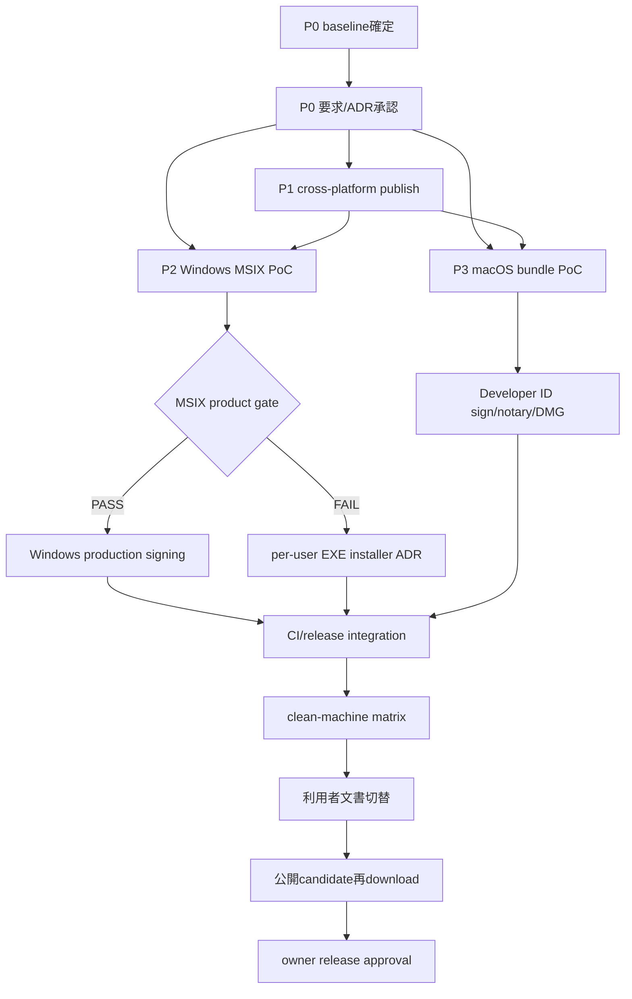

# Windows / macOS セットアップ簡素化 詳細実行計画

## 0. 文書管理

| 項目 | 値 |
|---|---|
| 対象 repository | `dahatake/StudyReport-Evaluator` |
| 計画基準時刻 | 2026-09-03T09:23:19.8045271+09:00 |
| 調査時 HEAD | `5a1d1ebe5e6dcc5d934f959e58ac2582f9d9c326` |
| 対象 | エンドユーザー向け Windows / macOS の入手・install・初回起動 |
| 計画状態 | `APPROVED — IMPLEMENTATION_IN_PROGRESS`。installer、macOS package、署名、公証を完成済みと扱わない |
| 推奨方式 | Windows: 署名済み MSIX を第一候補。macOS: 署名・notarization・staple 済み `.app` を収録した DMG を第一候補 |
| 捏造防止 | 観測済み事実には `[Sxx]`、本計画の選択には `提案`、未取得値には `TBD（実測または所有者決定必須）` を付ける |

本計画は、現在の「ZIP と sidecar を取得し、手作業で SHA-256 を比較し、展開先から実行する」導線を、OS の install UI を使う短い導線へ置き換えるためのものです。現行導線と現行対応範囲は repository の公開文書・要求・package test に記録されています。[S01][S02][S06]

本書は実装結果ではありません。特に、Avalonia や .NET が macOS を一般にサポートする事実、固定 SDK が macOS RID を認識する事実、cross-publish の成功だけを、本製品の macOS 対応証跡へ読み替えません。[S03][S07][S10][S15]

## 1. 状態語彙

| 状態 | 意味 |
|---|---|
| `PROPOSED` | 本計画の推奨。実装・承認・実測は未完了 |
| `TBD` | owner、credential、実機、実測のいずれかが必要 |
| `BLOCKED_EXTERNAL` | repository 外の署名 identity、Apple notarization 入力、実機等がなく進めない |
| `PASS_MECHANISM` | test certificateまたはWindows 11開発専用unsigned package等で仕組みだけを確認。production配布の合格ではない |
| `PASS_PRODUCTION` | production identity と公開候補 artifact を clean machine で検証済み |
| `FAIL` | 必須条件が不一致 |
| `NOT_RUN` | 未実行。PASS へ変換しない |

## 2. 出典台帳

### 2.1 Repository の一次資料

- **[S01] 現行利用者導線** — [`README.md`](../../../../README.md) の「対応環境」「入手・SHA-256確認・起動」「制限と非保証」、および [`docs/getting-started.md`](../../../../docs/getting-started.md) の「準備」「ZIPを確認して起動する」。Windows 11 x64、.NET 10 self-contained、unsigned ZIP、SHA-256 sidecar、5段階の導入、installer / macOS 非対応を記載。
- **[S02] 現行要求正本** — [`docs/requirements-definition.md`](../../../../docs/requirements-definition.md) v4.1 の §1、§13、§17〜§19。Windows 11 x64、unsigned ZIP、installer / macOS / signing / notarization の scope 外、将来対応時の要求改版と RID 別証跡を規定。
- **[S03] 現行 platform decision** — [`dev/docs/adr/0013-windows-only-public-release.md`](../../../../dev/docs/adr/0013-windows-only-public-release.md)。macOS package / sign / notary / runner / launch 証跡が存在しないため、初版を Windows 11 x64 に限定。
- **[S04] 現行 build / release 実装** — [`scripts/publish-windows.ps1`](../../../../scripts/publish-windows.ps1)、[`scripts/package-windows.ps1`](../../../../scripts/package-windows.ps1)、[`.github/workflows/ci.yml`](../../../../.github/workflows/ci.yml)、[`.github/workflows/release.yml`](../../../../.github/workflows/release.yml)。`win-x64` self-contained publish、unsigned ZIP、sidecar、Windows runner のみを実装。
- **[S05] 現行 runtime 実装** — [`src/StudyReportEvaluator.App/StudyReportEvaluator.App.csproj`](../../../../src/StudyReportEvaluator.App/StudyReportEvaluator.App.csproj)、[`Program.cs`](../../../../src/StudyReportEvaluator.App/Program.cs)、[`CopilotClientFactory.cs`](../../../../src/StudyReportEvaluator.App/Copilot/CopilotClientFactory.cs)、[`CheckpointStore.cs`](../../../../src/StudyReportEvaluator.App/Workbooks/Checkpoint/CheckpointStore.cs)。Avalonia `UsePlatformDetect()`、bundled CLI manifest、Windows / macOS RID 解決、`File.Replace` を含む filesystem 実装。
- **[S06] 現行 acceptance / regression** — [`WindowsPublishPackageTests.cs`](../../../../tests/StudyReportEvaluator.App.Tests/Packaging/WindowsPublishPackageTests.cs)、[`DocumentationContractTests.cs`](../../../../tests/StudyReportEvaluator.App.Tests/Content/DocumentationContractTests.cs)、[`dev/docs/traceability.md`](../../../../dev/docs/traceability.md)、[`SystemTest-prompt.md`](../../../../tests/SystemTest-prompt.md)。Windows-only / unsigned / no-installer claim と Windows package layout を required test が固定。
- **[S07] 固定 GitHub Copilot SDK 1.0.11** — [`Directory.Packages.props`](../../../../Directory.Packages.props) と、2026-09-03 に確認した local NuGet package `C:\Users\dahatake\.nuget\packages\github.copilot.sdk\1.0.11\build\GitHub.Copilot.SDK.props` / `.targets`。CLI は `1.0.79`、`osx-x64 -> darwin-x64`、`osx-arm64 -> darwin-arm64`、非 Windows binary 名は `copilot`、出力先は `runtimes/<RID>/native/`。実装時は lock 済み package の同じ内容を再取得して照合する。
- **[S08] 2026-09-03 local inventory snapshot** — PowerShell Core 7.6.5 で本書作成直前に確認したhistorical snapshot。branch=`main`、HEAD=`5a1d1ebe...`。本書とは別に 11 modified + 1 untracked があり、`git ls-files` で `*.icns`、`*.ico`、`Info.plist`、`AppxManifest`、`*.entitlements`、`*.wxs`、`*.wixproj`、`*.msix`、`*.dmg`、`*.pkg` は 0 件。本書自身は作成後に追加された別の untracked 1件である。P0-01でbranchを変更してもこの作成前snapshotを書き換えず、既存12件を本計画の成果とみなさない。
- **[S09] 過去の候補と安全条件** — [`dev/docs/adr/0008-platform-print-package.md`](../../../../dev/docs/adr/0008-platform-print-package.md)。Windows MSIX / per-user setup、macOS ZIP / DMG / PKG の候補、clean install、repair、uninstall、署名、公証、child CLI、quarantine の検証条件を定義する historical / superseded ADR。

### 2.2 外部一次資料

以下は 2026-09-03 に取得した vendor 公式資料です。実装開始時と release candidate 作成時に再確認し、変更があれば本計画ではなく現行仕様を優先します。

- **[S10] .NET publishing** — Microsoft Learn: [.NET application publishing overview](https://learn.microsoft.com/dotnet/core/deploying/)。self-contained は platform-specific executable、依存、.NET runtime を含み、対象端末への .NET runtime 事前導入を不要にする一方、OS native dependency までは含めない。RID ごとに publish する。
- **[S11] .NET RID** — Microsoft Learn: [.NET RID Catalog](https://learn.microsoft.com/dotnet/core/rid-catalog)。対象候補は `win-x64`、`osx-x64`、`osx-arm64`。portable RID を推奨し、RID 文字列を独自生成しない。
- **[S12] Windows 配布経路** — Microsoft Learn: [Choose a distribution path for your Windows app](https://learn.microsoft.com/windows/apps/package-and-deploy/choose-distribution-path)。Store MSIX、direct MSIX、MSI/EXE、self-contained folder 等の差、direct MSIX の trusted signing、App Installer、更新方式を説明。
- **[S13] MSIX trust** — Microsoft Learn: [Sign an MSIX package](https://learn.microsoft.com/windows/msix/package/signing-package-overview)。MSIX は valid code-signing certificate による署名と端末での trust が必要。timestamp と package integrity の意味を説明。
- **[S14] MSIX 作成と version** — Microsoft Learn: [Package from the command line](https://learn.microsoft.com/windows/msix/package/manual-packaging-root)、[Generating MSIX package components](https://learn.microsoft.com/windows/msix/desktop/desktop-to-uwp-manual-conversion)、[MakeAppx](https://learn.microsoft.com/windows/msix/package/create-app-package-with-makeappx-tool)、[Package version numbering](https://learn.microsoft.com/windows/apps/publish/publish-your-app/msix/app-package-requirements#package-version-numbering)。manifest、MakeAppx、signing と 4-part numeric package version を規定。
- **[S15] Avalonia platform matrix** — Avalonia: [Supported platforms](https://docs.avaloniaui.net/docs/supported-platforms)。2026-07-14 更新版では Windows 11 24H2 x64/ARM64 と macOS 26 ARM64/x64 が Tier 1、Windows 11 22H2 と macOS 14/15 ARM64/x64 が Tier 2。tier は製品固有の動作証跡ではない。
- **[S16] Avalonia macOS deployment** — Avalonia: [macOS deployment](https://docs.avaloniaui.net/docs/deployment/macos)。`.app/Contents` 構造、`Info.plist`、`UseAppHost=true`、execute mode、Developer ID、hardened runtime、nested signing、`notarytool`、staple、DMG、CI keychain 例を説明。
- **[S17] Apple notarization** — Apple: [Notarizing macOS software before distribution](https://developer.apple.com/documentation/security/notarizing-macos-software-before-distribution)。Developer ID、全 executable の valid signature、hardened runtime、secure timestamp、notary log、配布前 test を要求。
- **[S18] Apple custom notarization workflow** — Apple: [Customizing the notarization workflow](https://developer.apple.com/documentation/security/customizing-the-notarization-workflow)。ZIP / disk image / signed flat package の upload、`notarytool`、log、staple、ZIP 自体には staple できないことを説明。
- **[S19] Apple bundle / signing details** — Apple: [Resolving common notarization issues](https://developer.apple.com/documentation/security/resolving-common-notarization-issues)、[Hardened Runtime](https://developer.apple.com/documentation/security/hardened-runtime)、[Placing content in a bundle](https://developer.apple.com/documentation/bundleresources/placing-content-in-a-bundle)、[Information Property List](https://developer.apple.com/documentation/bundleresources/information-property-list)。署名後変更による invalidation、Developer ID 種別、timestamp、最小 entitlement、bundle 内配置、`Info.plist` の場所を規定。
- **[S20] Apple bundle version** — Apple: [`CFBundleVersion`](https://developer.apple.com/documentation/bundleresources/information-property-list/cfbundleversion)、[`CFBundleShortVersionString`](https://developer.apple.com/documentation/bundleresources/information-property-list/cfbundleshortversionstring)。machine-readable build version と user-visible version の numeric format を規定。
- **[S21] Copilot bundled CLI** — GitHub: [Bundled CLI](https://github.com/github/copilot-sdk/blob/main/docs/setup/bundled-cli.md)、[Getting started](https://github.com/github/copilot-sdk/blob/main/docs/getting-started.md)。.NET SDK は compatible CLI を依存として扱い、child process / stdio で管理する。製品の exact CLI version と RID mapping は固定 NuGet package [S07] を正本とする。
- **[S22] Windows 11 unsigned MSIX development testing** — Microsoft Learn: [Create an unsigned MSIX package](https://learn.microsoft.com/windows/msix/package/unsigned-package)、[Package identity overview](https://learn.microsoft.com/windows/apps/desktop/modernize/package-identity-overview)。Publisherの最終fieldに固定marker`OID.2.25.311729368913984317654407730594956997722=1`を持つsigned packageとは別identityを使用し、実行codeを含むpackageは管理者PowerShellの`Add-AppxPackage -AllowUnsigned`で全ユーザー向け開発試験を行う。広範配布へ使用せず、release時は固定markerを除去して署名する。

## 3. 現状と gap

| 項目 | 観測済み現状 | 目標との差 | 出典 |
|---|---|---|---|
| Windows 利用者手順 | ZIP と sidecar を取得し、hash 比較、展開、EXE 起動 | 非技術利用者には手順が多い | [S01] |
| Windows package | `win-x64` self-contained unsigned ZIP | installer、trusted publisher、OS install / uninstall がない | [S02][S04][S06] |
| macOS | 要求・README・test が非対応として固定 | publish、`.app`、DMG、sign、notary、launch evidence が全て必要 | [S02][S03][S06] |
| App runtime | Avalonia platform detection と macOS RID 判定は存在 | 実機で GUI、filesystem、CLI、auth、checkpoint を検証していない | [S03][S05] |
| Copilot CLI | 固定 SDK は `osx-x64` / `osx-arm64` を認識 | macOS binary の package 化、execute mode、署名後 hash、実行を検証していない | [S05][S07] |
| CI / Release | Windows runner の単一 job | macOS RID build、sign、notary、artifact、clean launch gate がない | [S04] |
| Test contract | Windows-only と unsigned ZIP を required assertion にしている | 要求改版後に installer / macOS acceptance へ置換・追加が必要 | [S06] |
| 配布資材 | tracked icon、plist、AppxManifest、entitlements、installer project は 0 件 | owner-approved identity と visual assets が必要 | [S08] |
| 作業ツリー | 本書追加前から 12 件の既存差分 | 実装開始前に owner が baseline を確定する必要がある | [S08] |

## 4. 推奨する利用者体験

### 4.1 Primary path

これは本計画の**提案**であり、下記 acceptance gate を通過するまで README に対応済みと書きません。

| OS | Release asset 第一候補 | 利用者向け手順 | 手動で要求しない操作 |
|---|---|---|---|
| Windows 11 x64 | trusted publisher で署名した `StudyReportEvaluator-win-x64.msix` | 1. download / open、2. **Install**、3. 起動 | ZIP 展開、SHA-256 文字列比較、PowerShell、管理者 terminal、.NET install |
| macOS Apple Silicon | signed / notarized / stapled `StudyReportEvaluator-osx-arm64.dmg` | 1. DMG を開く、2. app を Applications へ drag、3. Applications から起動 | Terminal、`chmod`、`xattr`、Gatekeeper bypass、.NET install |
| macOS Intel | signed / notarized / stapled `StudyReportEvaluator-osx-x64.dmg` | Apple Silicon と同じ | architecture emulation を native success とみなさない |

.NET self-contained は .NET runtime の事前導入を不要にできますが、RID 別 artifact と OS native requirement の検証は残ります。[S10][S11] MSIX は署名と trust が必要で、macOS 直接配布は Developer ID、hardened runtime、notarization、staple を必要とします。[S13][S17][S18]

### 4.2 setup script の位置付け

- エンドユーザーの primary path に `setup.ps1` を採用しません。現行 repository の PowerShell automation は PowerShell 7+ を要求するため、script を primary path にすると別 runtime の準備を新たに要求します。[S01][S04][S06]
- `publish-*`、`package-*`、`verify-*` script は engineering / CI automation として維持します。利用者は実行しません。
- production signing input がない間だけ unsigned ZIP を Windows の明示的な legacy / development fallback として保持できます。ただし、それを installer 完成や macOS 対応と表示しません。[S01][S03]
- macOS の `.command` / shell setup を Gatekeeper 回避手段として提供しません。signed / notarized package が成立しない場合は macOS release を `BLOCKED_EXTERNAL` にします。[S17][S18][S19]

### 4.3 Package format decision gate

1. **Windows 第一候補は MSIX。** 現行 self-contained payload を手動 manifest + MakeAppx で package し、既存の Core / App 2-project production boundaryを維持します。[S05][S12][S14]
2. MSIX candidate は、本製品固有の bundled Copilot CLI child process、利用者 login、native file picker、任意 workbook path、checkpoint / final write、uninstall を実機で通過した場合だけ採用します。[S05][S06][S09][S21]
3. MSIX container / policy が上記を阻害する場合は、MSIX を無理に採用せず、signed per-user EXE installer を第2候補として別 ADR で選定します。installer framework は license、保守、silent mode、repair、uninstall、signing を比較するまで `TBD` とし、本書では特定製品を採用済み依存にしません。[S09][S12]
4. **macOS 第一候補は DMG。** `.app` を `~/Applications` または `/Applications` へ利用者が drag する non-script path とします。wizard 型 PKG は managed deployment 等の明示要求が出た場合だけ別候補とします。[S09][S16][S18]

## 5. Scope 決定と外部入力

実装着手前に次を owner role が確定します。空欄のまま package 名、publisher、bundle ID、署名 identity を推測しません。個人名と期限は repository から確認できないため `TBD` とし、要求所有者が assignment record へ記入します。

| ID | 決定 / 入力 | 現在値 | 提案 owner role | 解除条件 |
|---|---|---|---|---|
| X-01 | 次の製品 version / requirement revision | `TBD`。working tree は v1.0.1 release recovery 中 | Requirement owner / Release owner | [S08] の既存12件と本書を分離し、release baseline を確定 |
| X-02 | Windows distribution channel | `TBD`（GitHub direct MSIX / Microsoft Store） | Product owner / Release owner | owner decision。direct の場合は trusted signing を用意 [S12][S13] |
| X-03 | Windows package Identity Name / Publisher / DisplayName | `TBD` | Release engineering / Signing administrator | signing identity または Store reservation と一致する値を決定 [S13][S14] |
| X-04 | Windows production signing | `TBD` | Security owner / Release owner | trusted CA / managed signing / Store signing のいずれかを承認。test cert は production evidence にしない [S12][S13] |
| X-05 | Apple Developer Team / bundle identifier | `TBD` | Apple Account Holder / Product owner | reverse-DNS bundle ID と owner を承認 [S16][S19] |
| X-06 | Developer ID Application identity / notarization credential | `TBD` | Apple Account Holder / Release engineering | CI secret store へ登録し、値を log / repository へ出さない [S16][S17][S18] |
| X-07 | approved app icon | `TBD`。tracked source は 0 件 | Product / Design owner | Windows visual assets と `.icns` の正本を owner が提供 [S08][S14][S16] |
| X-08 | macOS support scope | **提案:** macOS 14 / 15 / 26、ARM64 / x64 を候補行として扱う | Requirement owner / QA owner | vendor tier は候補選定の入力に限定し、exact OS build と実行環境を列挙。未実測行を対応表示しない [S15] |
| X-09 | Windows support scope | 現行 claim は Windows 11 x64 | Requirement owner / QA owner | RC ごとに exact tested build を記録。framework tier だけで製品 support を決めない [S01][S15] |
| X-10 | macOS x64 / ARM64 実機または production-equivalent runner | `TBD` | QA owner / Release engineering | 各 architecture で quarantine 付き clean install / launch が可能。未解除なら P3-05 と当該 release 行を `BLOCKED_EXTERNAL` とする |

## 6. Artifact contract（提案）

| Artifact | 内容 | Required trust / evidence |
|---|---|---|
| `StudyReportEvaluator-win-x64.msix` | `win-x64` self-contained app + bundled CLI + public docs | trusted MSIX signature、timestamp、package integrity、clean install / launch / uninstall [S10][S13] |
| `StudyReportEvaluator-win-x64.msix.sha256` | 公開 artifact の監査用 sidecar | asset と exact match。primary user step では手作業比較を要求しない |
| `StudyReportEvaluator-osx-arm64.dmg` | `osx-arm64` `.app` + Applications alias | Developer ID、hardened runtime、app / DMG notarization、staple、Gatekeeper、native ARM64 launch [S16][S17][S18] |
| `StudyReportEvaluator-osx-x64.dmg` | `osx-x64` `.app` + Applications alias | 同上、native x64 launch。Rosetta のみの結果を代用しない [S09][S15] |
| 各 DMG の `.sha256` | 公開 artifact の監査用 sidecar | public re-download 後の exact match |
| release evidence JSON | artifact identity と gate 結果 | source commit、version、RID、bytes、SHA-256、signer の非秘密 identity、timestamp / notary submission ID、OS build / arch、test status。学生 data / secret / private path は含めない [S06][S09] |

### 6.1 Version mapping

- stable SemVer `Major.Minor.Patch` から MSIX `Major.Minor.Patch.0` を作る規則を**提案**します。各値の範囲、major=0、pre-release の扱いは [S14] と現行 version policy を使って実装前に validator へ固定します。
- macOS の `CFBundleShortVersionString` は stable `Major.Minor.Patch`、`CFBundleVersion` は配布ごとに増加する numeric build version とする規則を**提案**します。pre-release label をそのまま書かず、numeric mapping を owner が承認します。[S20]
- 正式版の installer / DMG は stable tag だけから作ることを**提案**します。preview 配布が必要な場合は、stable と衝突しない別 package identity / bundle identifier / update channel と numeric version policy を別 ADR で承認するまで `BLOCKED_EXTERNAL` とします。[S14][S20]
- version、assembly informational version、MSIX Identity Version、`CFBundleVersion`、`CFBundleShortVersionString`、Git tag の不一致を release 前に fail させます。[S06][S14][S20]

## 7. 実行 phase

## Phase 0 — Baseline と要求改版

### P0-01 既存差分を保護する

1. [S08] で本書作成前に観測した 11 modified + 1 untracked の owner と目的を、本書自身の untracked 差分と分けて確認する。
2. 本作業用 branch / worktree を、owner が確定した commit から作る。
3. 既存差分を stash、reset、clean、上書きしない。
4. baseline commit、status hash、version、要求版を execution record に保存する。

**Exit gate:** installer 作業の source baseline が一意で、既存 v1.0.1 recovery 差分と混在しない。

### P0-02 要求と decision を改版する

更新候補:

- `docs/requirements-definition.md`
- 新規 `dev/docs/adr/0015-windows-macos-installer-delivery.md`
- `dev/docs/architecture.md`
- `dev/docs/detailed-design.md`
- `dev/docs/implementation-status.md`
- `dev/docs/traceability.md`
- `dev/docs/readme-claim-ledger.md`
- `SystemTest-prompt.md`

必須内容:

1. ADR-0013 を historical にし、実測済み行だけを新 scope にする。[S03]
2. Windows installer、macOS `.app` / DMG、RID、signing、notarization、repair / uninstall、update policy の owner と acceptance を定義する。[S09][S12][S13][S17]
3. macOS の x64 / ARM64 と OS major を独立行にする。[S11][S15]
4. test certificate / ad-hoc signing を `PASS_MECHANISM` に限定する。
5. installer が失敗しても既存 workbook を削除しないこと、uninstall が input / output / checkpoint を削除しないことを明記する。[S09]

**Exit gate:** requirement owner が package format、platform matrix、external inputs、failure policy を承認する。

## Phase 1 — Cross-platform publish foundation

### P1-01 OS / filesystem inventory

production `src/**/*.cs` を再走査し、次を台帳化します。

- OS 判定、path comparison、case sensitivity
- `File.Replace` / `File.Move` / flush / atomicity
- process spawn と child cleanup
- native picker、output directory open、clipboard 等
- Windows-only P/Invoke / executable 名 / path literal

現時点で Windows/macOS 分岐は bundled CLI と path comparison にあり、checkpoint update は `File.Replace` を使用しています。[S05] これらを macOS 実 filesystem で fault injection し、Windows 結果を代用しません。

### P1-02 macOS RID publish script

新規候補:

- `scripts/publish-macos.sh`
- `scripts/package-macos.sh`
- `eng/packaging/macos/Info.plist`
- `eng/packaging/macos/StudyReportEvaluator.entitlements`
- `eng/packaging/macos/StudyReportEvaluator.icns`

実装条件:

1. `osx-arm64` と `osx-x64` を別 run / output にする。[S11]
2. `net10.0`、Release、self-contained、`UseAppHost=true`、folder-based、non-trimmed、non-single-file を初期条件とし、最適化を同時導入しない。[S04][S10][S16]
3. canonical package locks を変更せず、RID restore で増えた target を検査する。[S04][S06]
4. output に apphost、runtime、Avalonia native assets、Open XML、SDK、`copilot-runtime.json`、`runtimes/osx-*/native/copilot` があることを検査する。[S05][S07]
5. `copilot` と apphost の execute bit、Mach-O architecture、nonzero、safe path を検査する。[S16]
6. PATH 上の別 CLI へ fallback しない現行 resolver contract を維持する。[S05][S06]

**Exit gate:** 各 RID の unsigned development publish が同 architecture の macOS 上で起動し、外部 .NET を要求しない。これは production release gate ではない。[S10]

### P1-03 Bundled CLI の署名後 integrity

macOS code signing は Mach-O を変更し、署名後の file hash は署名前と同一とは限りません。Apple は署名後の bundle 変更を invalid signature として扱います。[S17][S19]

outer `.app` がまだ未署名の状態で、実装順を次に固定します。

1. 固定 SDK の npm package / version / integrity を検証して CLI を取得する。[S07][S21]
2. 署名前 CLI の source SHA-256 と package provenance を release evidence に記録する。
3. `.app` の全 resource を配置し、notarization に必要な nested Mach-O、CLI、apphost を内側から署名する。ここでは outer `.app` 自体をまだ署名せず、`--deep` を signing shortcut にしない。[S16][S19]
4. **最終的に配布する signed CLI** の SHA-256 を計算し、`copilot-runtime.json` の `cliSha256` を更新する。
5. manifest を含む全 resource が確定したことを検査し、最後に outer `.app` を署名する。[S17][S19]
6. outer signature 後は bundle 内を一切変更せず、strict signature verification を行う。[S17][S19]
7. runtime resolver が signed CLI の hash と version を macOS で受理し、CLI handshake を完了することを検証する。[S05]

upstream hash と shipped signed hash の両方を app manifest に持たせる必要が生じた場合は schema v2 と backward compatibility test を先に追加します。現行 schema v1 は closed six-property set です。[S05][S06]

**Exit gate:** source provenance、signed payload hash、bundle signature、runtime resolver の全てが同一 artifact で一致する。

## Phase 2 — Windows installer PoC と実装

### P2-01 MSIX mechanism PoC

新規候補:

- `eng/packaging/windows/AppxManifest.xml`
- `eng/packaging/windows/Assets/`
- `scripts/package-windows-msix.ps1`
- `tests/StudyReportEvaluator.App.Tests/Packaging/WindowsInstallerPackageTests.cs`

手順:

1. 現行 `publish-windows.ps1` の validated `win-x64` folderを staging へ copy する。[S04][S06]
2. production候補はowner-approved Identity / Publisher / visual assets / version、開発専用unsigned packageは明示的なtest identity / synthetic visual assetsをmanifestへ生成する。placeholderのままpackageを作らない。[S08][S14][S22]
3. 証明書がないWindows 11開発試験では、Publisher末尾の固定marker`OID.2.25.311729368913984317654407730594956997722=1`、`.unsigned.test.msix` suffix、署名entry不在を検査し、`PASS_MECHANISM`だけを評価する。[S22]
4. test certificateを利用できる場合は別artifactをMakeAppxで作成・署名・検証し、同じく`PASS_MECHANISM`だけを評価する。unsigned専用Publisherをsigned artifactへ使用しない。[S13][S14][S22]
5. signed-test modeはfresh local user相当、unsigned executable packageは使い捨てWindows 11 VMまたは復元可能なsnapshot上の全ユーザーinstallとして、Start menu launch、二重起動、upgrade、repair、uninstallを観測する。unsigned modeは管理者PowerShellの`Add-AppxPackage -AllowUnsigned`だけを使い、全ユーザーregistrationとcleanupを確認し、標準App Installer UIや非管理者導線の成功証拠にしない。[S22]
6. test certのtrust導入や`-AllowUnsigned`を一般利用者手順へ含めない。production identityがない状態をrelease-readyとしない。[S13][S22]

repair は、同版再installまたは OS の repair 後に app-owned missing / tampered file が正規 package へ戻り、利用者 workbook / output / checkpoint を変更しないことを acceptance とします。uninstall は package registration と installed app-owned payload がなくなり、利用者 workbook / output / checkpoint が残ることを acceptance とします。[S09]

### P2-02 本製品固有 MSIX compatibility gate

次を 1 項目ずつ検証します。

1. packaged app の GUI startup / close / restart。
2. native picker で package 外の利用者 `.xlsx` を read-only load。
3. 利用者が選択した directory への partial / final / override output。
4. `runtimes/win-x64/native/copilot.exe` の absolute package-local 解決。
5. bundled CLI child process start、version / SHA-256、login status、model list、controlled cleanup。
6. login state が app update 後も期待どおり利用できること。credential 値は採取しない。
7. cancel、process kill、checkpoint resume、atomic finalization。
8. uninstall が app-owned files / registration だけを除去し、利用者 workbook と output を残すこと。
9. enterprise policy / sideload disabled / signature trust failure を成功表示しないこと。

これらは MSIX 一般仕様から本製品の成功を推測せず、current source path と system tests を package install 後に再実行します。[S05][S06][S12]

unsigned development MSIXでは1〜5、7、8のproduct compatibilityを先行確認できる。6のproduction identity間update、9のsignature trust、標準App Installer UI、non-admin setupはproduction-signed candidateで再実行し、unsigned結果を代用しない。[S22]

**分岐:** 1件でも MSIX 固有 blocker があり、設計を安全に直せない場合は P2 を `FAIL` とし、signed per-user EXE installer の比較 ADR へ移ります。MSIX acceptance を緩めません。

### P2-03 Production signing

1. X-02〜X-04 で選んだ production signing path を CI に接続する。[S12][S13]
2. private key / token を repository、artifact、process argument、通常 log へ出さない。
3. package の Publisher と certificate subject、chain、revocation、timestamp、package integrity を検証する。[S13][S14]
4. signer / timestamp / verification result の非秘密部分だけを evidence に残す。
5. public download 後に signature と hash を再検証する。

**Exit gate:** test cert ではなく production trust path の clean Windows 11 x64 で install / launch / uninstall が成功する。

## Phase 3 — macOS `.app` / DMG PoC と実装

### P3-01 `.app` bundle を組み立てる

1. `StudyReportEvaluator.app/Contents/Info.plist`、`MacOS/`、`Resources/`、必要な `Frameworks/` を作る。[S16][S19]
2. `CFBundleExecutable` と apphost 名、bundle ID、display name、icon、minimum OS、`CFBundleVersion`、`CFBundleShortVersionString` を一致させる。[S16][S19][S20]
3. Avalonia の documented publish layout と Apple の code/resource placement rule の差を PoC で確認し、launch・strict signature・notarization の全てを通る layout だけを採用する。[S16][S19]
4. x64 / ARM64 を別 bundle とし、各 Mach-O architecture を検査する。[S11][S15]
5. package 後の apphost と bundled CLI に execute bit があることを確認する。[S16]

### P3-02 Hardened runtime / entitlement 最小化

1. app と nested executable が実際に必要とする entitlement を実験で列挙する。
2. .NET JIT に必要な `com.apple.security.cs.allow-jit` を候補とし、それ以外は必要性を実測するまで追加しない。[S16][S19]
3. `get-task-allow`、unrestricted unsigned executable memory、library validation disable 等を便宜で追加しない。[S17][S19]
4. entitlement file を `plutil` で検査し、BOM / malformed XML を拒否する。[S19]
5. app 起動、Avalonia render、Copilot child process、network login、file picker、read / write を hardened runtime 下で検証する。

### P3-03 Developer ID signing

1. X-06 の Developer ID Application identity を ephemeral CI keychain に import する。[S16][S17]
2. P1-03 の acquire → source hash → nested sign → shipped CLI hash / manifest → outer sign の順序を1回だけ実行する。別の第2 signing passを設けない。
3. nested executable と outer app の signing で hardened runtime と secure timestamp を有効にする。[S17][S19]
4. outer signature 後に `codesign` strict verification と `spctl` assessment を実行し、その後 bundle を変更しない。[S19]

### P3-04 Notarization と DMG

1. signed `.app` を `ditto` で notarization 用 ZIP にし、`notarytool submit --wait` 相当で送信する。[S16][S18]
2. status が Accepted でも notary log を保存・検査し、warning / issue を無視しない。[S17][S18]
3. ticket を `.app` に staple し、validate する。ZIP 自体を staple 済みと表示しない。[S18]
4. stapled `.app` と Applications alias を DMG に格納する。
5. DMG の integrity を検証し、DMG も notarize / staple / validate する。[S16][S18]
6. final DMG の bytes / SHA-256 を計測し、sidecar と release evidence を作る。

### P3-05 Quarantine 付き clean-machine test

各 `OS major × architecture` 行で次を実測します。[S09][S15][S16][S17]

1. HTTPS / public candidate asset と同じ経路で DMG を取得し、quarantine attribute が付く状態を作る。
2. DMG open、Applications への drag、Finder から初回起動。
3. Gatekeeper dialog、publisher identity、offline staple validation。
4. GUI、native picker、input read-only、output / checkpoint / resume。
5. bundled CLI resolver、signed CLI hash / version、interactive login、model list、AI synthetic smoke、child cleanup。
6. app update / replacement と user data preservation。
7. app 削除後も利用者 input / output が残ること。
8. wrong architecture、tamper、signature invalid、notary rejected、missing execute bit を fail-closed にする。

interactive login と AI synthetic smoke は、owner が許可した非実データ用 test account / synthetic payload だけを使用します。credential、device code、token、Prompt、response を screen capture、terminal log、evidence へ保存せず、許可または login がなければ当該行を `BLOCKED_EXTERNAL` とします。[S02][S06]

**Exit gate:** 実測した exact OS build / architecture だけが `PASS_PRODUCTION`。他の行は `NOT_RUN` または `BLOCKED_EXTERNAL` のままにする。

## Phase 4 — Test と CI/CD

### P4-01 Test suite を platform contract へ改版する

更新 / 新規候補:

- `WindowsPublishPackageTests.cs` — legacy ZIP test と installer test の役割を分離
- `WindowsInstallerPackageTests.cs` — manifest、version、signature、install / upgrade / uninstall、bundled CLI
- `MacOsPublishPackageTests.cs` — RID、Mach-O、bundle、plist、mode、manifest
- macOS shell integration test — codesign、spctl、notary log、stapler、hdiutil、quarantine launch
- `CopilotClientFactoryTests.cs` — `osx-x64` / `osx-arm64` manifest と signed CLI hash
- checkpoint / atomic output tests — macOS filesystem で `File.Replace` を実測
- `DocumentationContractTests.cs` — Windows-only / no-installer assertion を新要求へ更新
- `SystemTest-prompt.md` — OS 別 install-to-uninstall scenario を追加

Windows-only assertion を先に削除して green に見せません。新 requirement / ADR、production behavior、direct test を同じ変更で接続します。[S06]

### P4-02 CI matrix

`ci.yml` を次の責務へ分けます。[S04]

1. OS-neutral Core / App build and deterministic tests。
2. Windows `win-x64` publish + legacy regression + MSIX mechanism package。
3. macOS `osx-arm64` / `osx-x64` publish + package structure test。
4. signing secret を使わない pull request gate。
5. credentialed signing / notarization は protected release environment の tag workflow だけ。
6. runner image、OS build、architecture、Xcode、.NET、Avalonia、SDK / CLI exact version を evidence へ記録。
7. claimed platform matrix を機械可読で検査し、required 行に `NOT_RUN`、`BLOCKED_EXTERNAL`、`FAIL` が1件でもあればその行を release asset / README support scope へ入れない。

hosted runner が target architecture / GUI / quarantine を再現できない行は self-hosted clean Mac または release lab を割り当て、cross-build の成功で代用しません。[S03][S09][S15]

### P4-03 Release workflow

`release.yml` を fail-closed な platform jobs に変更します。[S04]

1. annotated tag / version / clean checkout / private sample 非追跡を従来どおり確認。
2. deterministic regression を完了後、RID 別 publish。
3. Windows MSIX package → production sign → verify。
4. macOS RID 別 `.app` → nested sign → final manifest → outer sign → notarize / log check / staple → DMG → notarize / staple / verify。
5. artifact を一時 workflow artifact へ保存し、全 required platform job が成功するまで GitHub Release を公開しない。
6. expected asset set、bytes、SHA-256、signature / notary evidence を照合。
7. claimed platform matrix の required 行が全て `PASS_PRODUCTION` であることを release job で assert する。
8. draft Release で public-like re-download test を行い、owner approval 後に publish。
9. 公開後 artifact を差し替えず、不具合は新 version で修正。

### P4-04 Secret boundary

- Windows signing credential、Apple certificate、certificate password、Apple ID / API credential、temporary keychain password は protected secret store だけに置く。[S13][S16][S18]
- secret 値を `.env`、repository、release evidence、shell trace、artifact に書かない。
- PR / fork workflow に production secrets を渡さない。
- keychain / temporary certificate file を job 終了時に削除し、cleanup failure を記録する。

## Phase 5 — 利用者文書の簡素化

package と実測証跡が完成した後にだけ次を更新します。[S01][S03][S06]

- `README.md`
- `docs/getting-started.md`
- `docs/README.md`
- `docs/troubleshooting.md`
- `docs/privacy-and-data-handling.md`
- `CHANGELOG.md`
- package 内 `RELEASE-NOTES`

### Windows 記載契約

1. primary 手順は「MSIX を download / open → Install → 起動」にする。
2. supported Windows build / architecture と package signer を実測値で記載する。
3. SmartScreen / organization policy の実挙動を実測範囲だけ記載し、警告が絶対に出ないとは保証しない。[S12][S13]
4. manual SHA-256 は「高度な確認」へ移し、primary setup の必須操作にしない。
5. legacy ZIP を残す場合は installer と混同しない別節へ置く。

### macOS 記載契約

1. Apple Silicon / Intel の選び方を CPU 名と artifact 名で明示する。
2. primary 手順は「DMG を開く → Applications へ drag → 起動」にする。
3. supported exact macOS major / architecture を実測済み行だけ記載する。
4. `xattr -d`、Gatekeeper disable、right-click bypass、未署名 app の実行を案内しない。
5. GitHub login が AI 実行時に必要で、.NET / Excel / LibreOffice は app runtime として不要という既存契約を、macOS package 実測後に platform 別に記載する。[S01][S02][S10][S21]

## Phase 6 — Release acceptance

### 6.1 共通 acceptance

- [ ] 要求改版と ADR-0015 が owner 承認済み。
- [ ] artifact は tag / source commit / product version と一致。
- [ ] self-contained runtime を package 内から loadし、外部 .NET を要求しない。[S10]
- [ ] bundled CLI は exact RID / version / shipped SHA-256 と一致し、PATH fallback しない。[S05][S07]
- [ ] clean install、launch、restart、upgrade、repair、uninstall を実測。
- [ ] picker、`.xlsx` read-only、partial、resume、final、override output を package-installed app で実測。
- [ ] uninstall / app removal が利用者 input / output / checkpoint を削除しない。
- [ ] wrong RID、tamper、invalid signature、partial install、disk full、locked file、process kill を fail-closed にする。[S09]
- [ ] package / app log と evidence に credential、学生 data、Prompt、reason、evidence、private path がない。[S02][S06]
- [ ] public docs の setup 手順を初見利用者が対象 OS の標準 UI だけで完了できる。

### 6.2 Windows acceptance

- [ ] MSIX Publisher / Identity / version と production certificate が一致。[S13][S14]
- [ ] signature chain、timestamp、package integrity が production trust path で PASS。[S13]
- [ ] bundled Copilot CLI child process と existing-user login flow が package 内で PASS。
- [ ] current Windows 11 x64 exact build ごとに install-to-uninstall PASS。
- [ ] test certificate の結果を production PASS に数えていない。

### 6.3 macOS acceptance

- [ ] x64 / ARM64 の各 apphost と CLI が native architecture と一致。[S11][S15]
- [ ] Developer ID、nested signatures、secure timestamp、hardened runtime、entitlements が strict verification を通過。[S17][S19]
- [ ] app と DMG の notarization status / log / staple / validation が PASS。[S16][S18]
- [ ] quarantine 付き public-like download から Finder launch が PASS。
- [ ] signed CLI の final SHA-256 と runtime manifest が一致。
- [ ] macOS 14 / 15 / 26 のうち実測していない行を対応表示していない。[S15]

### 6.4 Documentation acceptance

- [ ] README の primary setup が OS ごとに 3 操作以内。
- [ ] installer / package の実在 asset URL は公開後の実測 URL だけを記載。
- [ ] unsupported OS / architecture / package format を明記。
- [ ] signing / notarization / SmartScreen / Gatekeeper を実測以上に保証していない。
- [ ] local / package 内 Markdown link と画像が全て有効。
- [ ] claim ledger の該当 claim は、各 OS の required evidence へ接続。

## 8. 実行順と並列化

- P2 の manifest / installer PoC と P3 の `.app` bundle PoC は、P0 の decision 後に並行できます。
- production signing / notarization は X-04 / X-06 が揃うまで `BLOCKED_EXTERNAL` です。
- README の primary 手順変更は clean-machine matrix 後です。文書を先に「対応済み」にしません。[S03][S06]
- 工期は team capacity、signing identity、runner / 実機の取得が未確定のため、本書では日数を捏造しません。

## 9. 主要 risk と停止条件

| Risk | 検出 | 対応 / 停止条件 |
|---|---|---|
| MSIX で bundled CLI / auth / file access が変わる | P2-02 install 後 E2E | 修正不能なら MSIX 不採用。acceptance を緩めず EXE installer ADR へ |
| macOS signing で CLI hash が変わる | P1-03 pre/post-sign hash | final shipped hash を manifest へ反映して outer sign。resolver 不一致なら release 停止 |
| nested Copilot CLI の Developer ID signing / license / runtime compatibility | P3-03 + CLI handshake + dependency review | 1件でも unresolved なら macOS release 停止 |
| `File.Replace` 等の filesystem semantics 差 | macOS fault-injection test | old partial preservationを満たす platform adapter を実装。data loss の可能性が残れば停止 |
| x64 Mac 実行環境がない | X-10 | x64 artifact を公開せず、ARM64 だけを明示 scope にするか取得まで待つ |
| signing / notary secret 不足 | X-04 / X-06 | unsigned installer / unnotarized DMG を正式配布物として公開しない |
| icon / identity の仮値混入 | package validator | placeholder 検出時に build failure |
| current dirty tree と作業混在 | P0-01 status / owner review | baseline 未確定なら編集開始しない |
| framework tier を製品 support と誤記 | claim ledger / docs test | exact product evidence がない行を削除または unsupported とする [S03][S15] |

## 10. 完了条件

次の全てが成立した時だけ、本タスクを `COMPLETE` とします。

1. Windows の primary setup が署名済み installer の OS UI だけで完了する。
2. macOS の primary setup が notarized / stapled DMG と Finder だけで完了する。
3. 各公開 claim が exact artifact、source commit、signature / notary、clean-machine result に追跡できる。
4. Windows / macOS package-installed app で既存 required functional / privacy / workbook regression が PASS する。
5. 未実測 OS / architecture、test certificate、cross-publish だけの結果を production support としていない。
6. README、利用者文書、要求、ADR、architecture、traceability、claim ledger、system test、release workflow が同じ platform / package contract を示す。
7. 公開 asset を fresh download し、hash、trust、install、launch、bundled CLI、uninstall を再検証している。

それまでは、現行の Windows unsigned ZIP だけが repository で検証済みの配布方式であり、macOS / installer / code signing / notarization を提供済みと表示しません。[S01][S03][S06]
