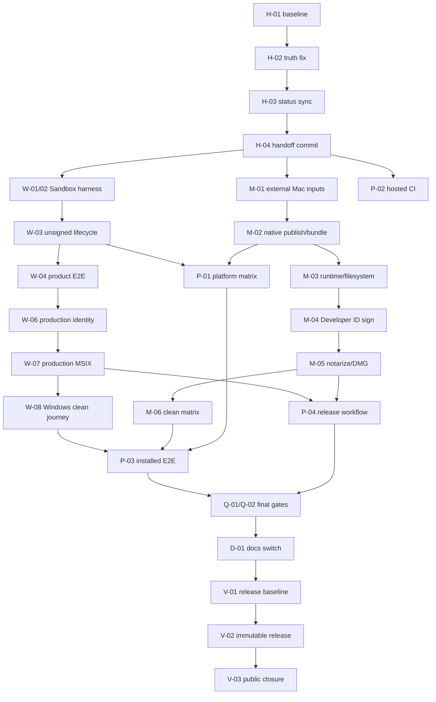

# StudyReport Evaluator 残タスク詳細実行計画

## 0. 文書管理

| 項目 | 値 |
|---|---|
| 対象 repository | `dahatake/StudyReport-Evaluator` |
| 計画作成日時 | 2026-09-03 16:55 JST |
| 調査 snapshot | 2026-09-03T16:54:07.9321780+09:00 [M01][M03] |
| 対象 branch | `feature/setup-simplification-20260903` [M01] |
| 調査時 HEAD | `5a1d1ebe5e6dcc5d934f959e58ac2582f9d9c326` [M01] |
| requirement / candidate | v4.2 / `1.1.0` candidate [R01][R11] |
| predecessor | [`20260903-0923-windows-macos-setup-simplification-plan.md`](20260903-0923-windows-macos-setup-simplification-plan.md) [R03] |
| execution record | [`20260903-setup-simplification-execution-record.md`](20260903-setup-simplification-execution-record.md) [R04] |
| 本書の状態 | `READY_FOR_HANDOFF — NOT_EXECUTED` |
| 完了の意味 | 本書の全required taskが実測証跡へ接続され、claimed platformだけが`PASS_PRODUCTION`で、公開asset再取得後のclosureまで完了した状態 [R01][R02][R06][R08] |

本書は実装結果ではない。観測していないinstall、launch、signing、notarization、release、test件数をPASSへ変換しない。未実行は`NOT_RUN`、外部入力不足は`BLOCKED_EXTERNAL`、仕組みだけの成功は`PASS_MECHANISM`、production identityとclean target OSでの成功だけを`PASS_PRODUCTION`とする。[R02][R03][R04]

## 1. 状態語彙と捏造防止規則

| 状態 | 意味 |
|---|---|
| `DONE` | 今回のsource/evidenceで完了を直接確認済み |
| `IN_PROGRESS` | 実装または診断途中。exit gate未達 |
| `NOT_RUN` | 未実行。過去PASSや一般仕様で代用しない |
| `BLOCKED_EXTERNAL` | credential、identity、approved asset、native host等のrepository外入力待ち |
| `PASS_MECHANISM` | unsigned/test artifactやstatic contractで仕組みだけ成功 |
| `PASS_REQUIRED` | OS非依存のrequired deterministic testが成功 |
| `PASS_PRODUCTION` | production trust path、公開候補artifact、clean target OSの全oracleが成功 |
| `FAILED_ADVISORY` | optional test失敗。required gateへ合算しない |
| `SUPERSEDED` | 履歴として保持し、実行してはならない旧task |
| `TBD（実測必須）` | command、API、owner decision、または実機測定前に値を書かない |

必須規則:

1. 各statusは同じ行または同じ節で出典IDへ接続する。
2. cross-publish、framework support、test certificate、unsigned packageをproduction supportへ昇格しない。[R01][R02][E03][E07]
3. `PASS_PRODUCTION`を付ける単位はexact artifact SHA-256 × exact OS build × native architectureとする。[R01][R02][R08]
4. credential、private key、password、token、device code、学生回答、Prompt、AI reason/evidence、private pathを共有evidenceへ保存しない。[R01][R08]
5. taskごとに敵対的reviewを行い、再現できたfindingだけを採用する。findingを作ること自体を成果にしない。[R06]
6. command/APIが失敗したtaskは次の依存taskへ進めず、観測したstatusとsafe errorだけを記録する。
7. optional live Copilotとexternal spreadsheet recalculationをrequired release gateへ算入しない。[R05][R06][R14]

## 2. 出典台帳

### 2.1 Repository一次資料

- **[R01] 要求正本** — [`docs/requirements-definition.md`](../../../../docs/requirements-definition.md)。v4.2 target、Windows/macOS delivery、AC-023〜028、TR-25〜29、platform別実測前の非保証を定義する。特に§13、§18、§19。[`L580-L624`](../../../../docs/requirements-definition.md#L580-L624)、[`L699-L760`](../../../../docs/requirements-definition.md#L699-L760)
- **[R02] Delivery decision** — [`dev/docs/adr/0015-windows-macos-installer-delivery.md`](../../../../dev/docs/adr/0015-windows-macos-installer-delivery.md)。Windows direct MSIX、macOS RID別DMG、production trust、3操作setup、外部入力、`PASS_MECHANISM`/`PASS_PRODUCTION`境界を承認。[`L20-L61`](../../../../dev/docs/adr/0015-windows-macos-installer-delivery.md#L20-L61)
- **[R03] 詳細先行計画** — [`work/20260903-0923-windows-macos-setup-simplification-plan.md`](20260903-0923-windows-macos-setup-simplification-plan.md)。P0〜P4、Phase 5/6、X-01〜10、risk、完了条件を定義。[`L107-L120`](20260903-0923-windows-macos-setup-simplification-plan.md#L107-L120)、[`L231-L377`](20260903-0923-windows-macos-setup-simplification-plan.md#L231-L377)、[`L416-L451`](20260903-0923-windows-macos-setup-simplification-plan.md#L416-L451)
- **[R04] 現行実行記録** — [`work/20260903-setup-simplification-execution-record.md`](20260903-setup-simplification-execution-record.md)。P0〜P4 mechanism、未実行native/production gate、レビュー結果を記録。unsigned MSIXはpackage/unpackまで`PASS_MECHANISM`だがinstall未実施。[`L258-L328`](20260903-setup-simplification-execution-record.md#L258-L328)、[`L338-L373`](20260903-setup-simplification-execution-record.md#L338-L373)、[`L414-L622`](20260903-setup-simplification-execution-record.md#L414-L622)
- **[R05] Current status** — [`dev/docs/implementation-status.md`](../../../../dev/docs/implementation-status.md)。delivery変更前670/670は比較baselineで、変更後full regressionを再実行すると明記。transition表は一部mechanism実装前の`NOT_RUN`表示のまま。[`L28-L43`](../../../../dev/docs/implementation-status.md#L28-L43)
- **[R06] Traceability** — [`dev/docs/traceability.md`](../../../../dev/docs/traceability.md)。AC-022〜028とTR-25〜29は未完了または外部block、final gate prerequisitesを定義。[`L55-L61`](../../../../dev/docs/traceability.md#L55-L61)、[`L91-L95`](../../../../dev/docs/traceability.md#L91-L95)、[`L132-L142`](../../../../dev/docs/traceability.md#L132-L142)
- **[R07] Claim ledger** — [`dev/docs/readme-claim-ledger.md`](../../../../dev/docs/readme-claim-ledger.md)。C-026とC-033〜038を`BLOCKED`で保持し、実在asset・production trust・clean journey前の断定を禁止。[`L42-L54`](../../../../dev/docs/readme-claim-ledger.md#L42-L54)
- **[R08] System-test正本** — [`SystemTest-prompt.md`](../../../../tests/SystemTest-prompt.md)。ST-UC-22 Windows MSIX、ST-UC-23 macOS structure、ST-UC-24 sign/notary/quarantine、ST-UC-25 installed E2E/release matrixを規定。[`L1254-L1357`](../../../../tests/SystemTest-prompt.md#L1254-L1357)
- **[R09] CI workflow** — [`.github/workflows/ci.yml`](../../../../.github/workflows/ci.yml)。Windows deterministic/legacy package、unsigned MSIX mechanism、macOS secret-free contract matrixだけを実行。production signing/notaryは含まない。[`L23-L122`](../../../../.github/workflows/ci.yml#L23-L122)、[`L123-L185`](../../../../.github/workflows/ci.yml#L123-L185)
- **[R10] Release workflow** — [`.github/workflows/release.yml`](../../../../.github/workflows/release.yml)。現状はWindows unsigned ZIPとsidecarだけを作成・公開し、MSIX/DMG jobを持たない。[`L17-L36`](../../../../.github/workflows/release.yml#L17-L36)、[`L103-L180`](../../../../.github/workflows/release.yml#L103-L180)
- **[R11] Version/toolchain正本** — [`Directory.Build.props`](../../../../Directory.Build.props)の`VersionPrefix=1.1.0`、[`global.json`](../../../../global.json)のSDK `10.0.400` / `latestPatch`、[`dev/docs/version-management.md`](../../../../dev/docs/version-management.md)。
- **[R12] Package実装とdirect tests** — [`scripts/test-windows-msix-unsigned.ps1`](../../../../scripts/test-windows-msix-unsigned.ps1)、[`scripts/package-windows-msix.ps1`](../../../../scripts/package-windows-msix.ps1)、[`WindowsInstallerPackageTests.cs`](../../../../tests/StudyReportEvaluator.App.Tests/Packaging/WindowsInstallerPackageTests.cs)、[`scripts/publish-macos.sh`](../../../../scripts/publish-macos.sh)、[`scripts/package-macos.sh`](../../../../scripts/package-macos.sh)、[`scripts/sign-macos.sh`](../../../../scripts/sign-macos.sh)、[`scripts/notarize-package-macos.sh`](../../../../scripts/notarize-package-macos.sh)、[`MacOsPublishPackageTests.cs`](../../../../tests/StudyReportEvaluator.App.Tests/Packaging/MacOsPublishPackageTests.cs)。
- **[R13] Release履歴とsupersession** — [`work/20260903-v1.0.1-release-recovery-plan.md`](20260903-v1.0.1-release-recovery-plan.md)は`SUPERSEDED_BY_1_1_0_DELIVERY`で、`v1.0.1` tag/Releaseを作成しないと明記。[`L1-L14`](20260903-v1.0.1-release-recovery-plan.md#L1-L14)。[`README.md#L34`](../../../../README.md#L34)はv1.0.1 assetへ直接リンクし、[`CHANGELOG.md#L16-L23`](../../../../CHANGELOG.md#L16-L23)は未公開v1.0.1節を持つため、現decisionと不整合。
- **[R14] Optional advisory** — [`dev/docs/implementation-status.md#L24`](../../../../dev/docs/implementation-status.md#L24)と[`dev/docs/readme-claim-ledger.md#L82-L83`](../../../../dev/docs/readme-claim-ledger.md#L82-L83)。external recalculationはsynthetic `PASS`とcanonical output copyの`FAILED_ADVISORY`が混在し、required gateではない。

### 2.2 2026-09-03 planning-session実測

- **[M01] Git snapshot（2026-09-03T16:54+09:00）** — PowerShell Core 7.6.5で`git branch --show-current`、`git rev-parse HEAD`、`git status --porcelain=v1 --untracked-files=all`、`git for-each-ref`を実行。branch=`feature/setup-simplification-20260903`、HEAD=`5a1d1ebe...`、upstreamなし、42 entries（tracked変更22、untracked 20）、status text SHA-256=`5197785BD23231C24343370F23A0F388786E6482FFF86390160D552CE8D6B4A2`。本書追加後は少なくとも本書1件が増えるため、42を再利用せず再計測する。
- **[M02] Unsigned MSIX artifact snapshot（同日）** — `artifacts/package/mechanism/`に3点setが存在。MSIX=155,500,721 bytes / SHA-256 `C7E2A2696EC29A293D99A1674D4A46C10C971DE6E3559DE0212E4F6A39FDA684`、sidecar SHA-256 `0400642CD83DEAE685F7C91922EE963E7ED6899553E241AD7A3D66F7F898DA85`、mechanism evidence SHA-256 `C073434589B7CCB9A5D5F2308DE173F0D475DCED1FEA6CFA9B91B73190866D4D`。ignored/local artifactであり、別環境に存在すると仮定しない。
- **[M03] Windows Sandbox local-only診断（同日）** — `%TEMP%\StudyReportEvaluator-MsixSandbox-6a17c8b0`のprobeでLogonCommand markerとWDAGUtilityAccount Session 1のPowerShell 7.6.5 user probeは観測したが、`windows-sandbox-unsigned-msix-lifecycle.json`、`lifecycle-bootstrap.json`、最終install/launch/uninstall evidenceは存在しない。調査終了時に`wsb list --raw`は0件、hostの`StudyReportEvaluator.UnsignedDev` package countは0。これら一時fileはrepository未追跡であり、passing evidenceや別環境の入力にしない。
- **[M04] Public GitHub確認（2026-09-03）** — [`releases?per_page=100`](https://api.github.com/repos/dahatake/StudyReport-Evaluator/releases?per_page=100)は空配列。[`releases/tags/v1.0.1`](https://api.github.com/repos/dahatake/StudyReport-Evaluator/releases/tags/v1.0.1)、[`git/ref/tags/v1.0.1`](https://api.github.com/repos/dahatake/StudyReport-Evaluator/git/ref/tags/v1.0.1)、[`v1.0.1 ZIP`](https://github.com/dahatake/StudyReport-Evaluator/releases/download/v1.0.1/StudyReportEvaluator-win-x64.zip)はいずれもHTTP 404。実行時には必ず再取得する。

### 2.3 外部一次資料

- **[E01] Windows Sandbox CLI** — Microsoft Learn: [Windows Sandbox command line interface](https://learn.microsoft.com/windows/security/application-security/application-isolation/windows-sandbox/windows-sandbox-cli)。Windows 11 24H2以降の`start/list/exec/stop/connect`、`ExistingLogin`にはactive user sessionと事前`connect`が必要、`exec`はprocess I/Oを返さないことを規定。
- **[E02] Windows Sandbox構成** — Microsoft Learn: [Use and configure Windows Sandbox](https://learn.microsoft.com/windows/security/application-security/application-isolation/windows-sandbox/windows-sandbox-configure-using-wsb-file)。absolute mapped folders、read-only/write mapping、LogonCommand、network/clipboard等の設定を規定。
- **[E03] Unsigned MSIX** — Microsoft Learn: [Create an unsigned MSIX package](https://learn.microsoft.com/windows/msix/package/unsigned-package)。fixed OID、signed packageと別identity、実行codeの管理者`Add-AppxPackage -AllowUnsigned`、広範配布禁止を規定。
- **[E04] MSIX signing** — Microsoft Learn: [Sign an MSIX package](https://learn.microsoft.com/windows/msix/package/signing-package-overview)、[Sign with SignTool](https://learn.microsoft.com/windows/msix/package/sign-app-package-using-signtool)。Publisher/certificate subject一致、SHA-256署名、timestamp、trustを規定。
- **[E05] PowerShell 7 deployment** — Microsoft Learn: [Install PowerShell on Windows](https://learn.microsoft.com/powershell/scripting/install/install-powershell-on-windows?view=powershell-7.6)。MSI/MSIX/ZIPを区別し、ZIPはportableなside-load用途に使用可能。
- **[E06] .NET publish/RID** — Microsoft Learn: [.NET publishing](https://learn.microsoft.com/dotnet/core/deploying/)、[RID catalog](https://learn.microsoft.com/dotnet/core/rid-catalog)。self-containedと`win-x64`、`osx-x64`、`osx-arm64`を規定。
- **[E07] Avalonia macOS** — Avalonia: [macOS deployment](https://docs.avaloniaui.net/docs/deployment/macos)、[Supported platforms](https://docs.avaloniaui.net/docs/supported-platforms)、Context7 `/avaloniaui/avalonia-docs`同ページ。`.app`構造、`UseAppHost`、execute mode、nested-first signing、`--deep`をsigning shortcutにしないこと、notary/staple、candidate OS/architectureを説明。framework tierは本製品のPASSではない。
- **[E08] Apple notarization** — Apple: [Notarizing macOS software](https://developer.apple.com/documentation/security/notarizing-macos-software-before-distribution)、[Customizing the notarization workflow](https://developer.apple.com/documentation/security/customizing-the-notarization-workflow)、[Resolving common issues](https://developer.apple.com/documentation/security/resolving-common-notarization-issues)。Developer ID、全code signature、hardened runtime、secure timestamp、well-formed entitlements、notary log確認、stapleを規定。
- **[E09] Immutable GitHub Releases** — GitHub Docs: [Immutable releases](https://docs.github.com/en/code-security/concepts/supply-chain-security/immutable-releases)、[Preventing changes](https://docs.github.com/en/code-security/how-tos/secure-your-supply-chain/establish-provenance-and-integrity/prevent-release-changes)。draftへ全asset添付後にpublishし、公開後のtag/asset変更を禁止する。

## 3. 現在状態の確定

### 3.1 完了済みで、入力変更がない限り作り直さないもの

| Surface | 現在status | 根拠 |
|---|---|---|
| P0 baseline/要求/ADR改版 | `DONE` | P0-01/P0-02 `PASS` [R04] |
| Cross-platform source inventory | `DONE`（native macOS測定は別task） | P1-01 inventory `PASS` [R04] |
| macOS publish/package/sign/notary script foundation | `PASS_MECHANISM` | P1-02/P1-03/P3-01〜04 mechanism [R04][R12] |
| Windows unsigned MSIX package/unpack/evidence | `PASS_MECHANISM` | 3点setとdirect tests [R04][M02] |
| Platform static/direct tests | `PASS_MECHANISM` | P4-01、focused 19/19 [R04] |
| Secret-free CI定義 | `PASS_MECHANISM` | P4-02 repository workflow [R04][R09] |
| Current legacy Windows ZIP workflow | `PASS` historical/current fallback | P4-03 legacy regression [R04][R10] |

上表はrelease acceptanceではない。delivery変更後の全required regression、hosted CI、installed behavior、production trust、public re-downloadは未完了である。[R04][R05][R06]

### 3.2 実行してはならない旧task

1. `v1.0.0`公開を続行しない。共有済みtagを移動・再利用しない。[R13][E09]
2. `v1.0.1` tag/Releaseを作成しない。旧recoveryのP-03〜P-11は`SUPERSEDED`で、修正内容だけを1.1.0へcarry forwardする。[R13]
3. 旧R-01〜R-12/P-01〜P-11の未チェック数を現行残タスク数へ足さない。現行taskは本書のIDへ置換する。
4. C-026の「実在release asset」要求だけを1.1.0 release closureへcarry forwardする。[R07][M04]

## 4. 残タスク一覧

| ID | 優先 | 残タスク | 現在status | 主依存 | 実行環境 |
|---|---:|---|---|---|---|
| H-01 | P0 | dirty treeの所有権確認とhandoff baseline固定 | `NOT_RUN` | なし | 現Windows host |
| H-02 | P0 | README/CHANGELOGのv1.0.1 false URL・版記述修正 | `NOT_RUN — URGENT` | H-01 | 任意開発host |
| H-03 | P0 | execution record/status/traceabilityの事実同期 | `NOT_RUN` | H-01/H-02 | 任意開発host |
| H-04 | P0 | feature branch checkpoint commit/pushまたはbundle化 | `NOT_RUN` | H-01〜03 | Git + remote権限 |
| W-01 | P1 | repository-managed Windows Sandbox lifecycle harness | `IN_PROGRESS — temp probe only` | H-04 | Windows 11 24H2+ x64 |
| W-02 | P1 | Sandbox bootstrap/user-session/mapping probe | `NOT_RUN_FORMAL` | W-01 | 同上、Sandbox有効 |
| W-03 | P1 | unsigned MSIX install/launch/CLI/uninstall lifecycle | `NOT_RUN` | W-02 | disposable Windows 11 |
| W-04 | P1 | 残るMSIX product compatibility E2E | `NOT_RUN` | W-03 | disposable Windows 11 |
| W-05 | P2 | signed-test MSIX mechanism | `BLOCKED_EXTERNAL` | test cert | disposable Windows 11 |
| W-06 | P2 | production Identity/Publisher/signing/assets決定 | `BLOCKED_EXTERNAL` | owner/security input | owner/protected system |
| W-07 | P2 | production MSIX sign/verify/evidence | `BLOCKED_EXTERNAL` | W-04/W-06 | protected Windows runner |
| W-08 | P2 | clean Windows production journey・negative policy | `BLOCKED_EXTERNAL` | W-07 | clean Windows 11 x64 |
| M-01 | P1 | Apple identity、notary profile、approved `.icns`、native host確保 | `BLOCKED_EXTERNAL` | owner/Apple/QA input | protected macOS |
| M-02 | P1 | native ARM64/x64 publish・unsigned `.app`生成 | `NOT_RUN_NATIVE` | H-04/M-01 icon/hosts | native Mac各1台 |
| M-03 | P1 | macOS filesystem・GUI・CLI・hardened runtime entitlement測定 | `NOT_RUN` | M-02 | native Mac各RID |
| M-04 | P2 | Developer ID nested/outer signingとsigned CLI manifest | `BLOCKED_EXTERNAL` | M-01/M-03 | protected native Mac |
| M-05 | P2 | app/DMG notarization・staple・strict verify | `BLOCKED_EXTERNAL` | M-04 | Apple service接続Mac |
| M-06 | P2 | quarantine clean-machine 6-row matrix | `BLOCKED_EXTERNAL` | M-05 | macOS 14/15/26 × ARM64/x64 |
| P-01 | P1 | machine-readable platform matrix/schema/validator | `NOT_RUN` | W-03/M-02 | 任意 + platform evidence |
| P-02 | P1 | current CIのhosted Windows/macOS jobs実行 | `NOT_RUN` | H-04 | GitHub Actions |
| P-03 | P2 | package-installed application E2E統合 | `NOT_RUN` | W-08/M-06/P-01 | 各PASS_PRODUCTION host |
| P-04 | P2 | protected multi-platform release workflow | `BLOCKED_EXTERNAL` | W-07/M-05/P-01 | GitHub protected environment |
| Q-01 | P1 | delivery変更後full required regression | `NOT_RUN` | H-03、実装変更ごと再実行 | Windows + native Mac |
| Q-02 | P1 | task別・最終敵対的reviewとclosure | `NOT_RUN` | 各task | 独立reviewer/agent |
| D-01 | P3 | end-user 3操作document switch | `BLOCKED_EXTERNAL` | W-08/M-06/P-03 | docs + actual artifacts |
| V-01 | P3 | 1.1.0 release baseline/version/changelog確定 | `NOT_RUN` | 全required gate | clean release branch |
| V-02 | P3 | annotated tag・immutable draft Release・asset publish | `NOT_RUN` | V-01/P-04 | GitHub release権限 |
| V-03 | P3 | public re-download・closure commit・final CI | `NOT_RUN` | V-02 | clean target hosts + GitHub |
| A-01 | P4 | optional calcChain advisoryの調査または明示defer | `FAILED_ADVISORY` | required release非依存 | Excel利用可能Windows |

## 5. Phase 0 — Truthfulness、baseline、別環境handoff

### H-01 — dirty treeを安全に固定する

**目的:** 別環境で同じsourceを再現し、既存差分を本task成果へ誤帰属しない。[M01][R04]

**手順:** 

1. PowerShell Core 7+でbranch、HEAD、status、status SHA-256を再取得する。調査時42 entriesは本書追加前の値なので再利用しない。[M01]
2. `git diff --name-status`、`git ls-files --others --exclude-standard`、各file SHA-256をmachine-readable manifestへ保存する。
3. execution record開始時13 entriesと現在差分を比較する。開始前差分、setup task追加、今回計画書を3区分し、owner不明fileを自動stageしない。[R04]
4. `sample/`、`artifacts/`、`TestResults/`、`bin/`、`obj/`、credential、certificate、private pathをcommit対象から除外する。[R01][R09][R10]
5. `git diff --check`、UTF-8/LF policy、zero-byte、secret-name scanを実行する。
6. status manifestへsource commit、branch、file count、各hash、作成時刻だけを記録する。file本文やprivate workbook pathを記録しない。
7. manifest生成後にsourceを変更せず同じ採取処理を再実行し、file set、各SHA-256、manifest自身を除く集約hashが一致することを確認する。

**Exit gate:** 全変更fileにowner/purpose/dispositionがあり、2回のstatus manifestと実file hashが一致する。未分類fileが1件でもあればH-02へ進まない。

### H-02 — public truthfulnessを先に修正する

**根拠:** v1.0.1 release/tag/ZIPはHTTP 404だがREADMEはdirect v1.0.1 URLを案内し、recovery decisionはv1.0.1を作らない。[R07][R13][M04]

**実装:** 

1. GitHub APIを再取得し、v1.0.1 Release/tagが引き続き不存在か確認する。存在した場合は変更せず停止し、新しい事実で計画をrebaselineする。
2. 不存在なら`README.md`からv1.0.1 direct assetを「取得可能」とする表現を除去する。transition中は実在するReleases indexへの案内と「公開asset未提供」を明記するか、download節自体をblocked表示にする。存在しない1.1.0 URLへ置換しない。
3. 未公開の`CHANGELOG.md` 1.0.1節を`[Unreleased]`/1.1.0候補へ統合する。failed v1.0.0/v1.0.1 recovery履歴は`work/`に保持し、公開済みでない版をdated releaseとして残さない。
4. documentation contractを更新し、C-026は実在1.1.0 asset公開まで`BLOCKED`のままにする。[R07]
5. public docs全linkを実際に解決し、404をPASSにしない。

**Exit gate:** READMEに不存在assetのdownload断定が0件、CHANGELOG/version decisionが1.1.0と一致、C-026は`BLOCKED`、documentation testがPASS。

### H-03 — status文書を現実へ同期する

**対象:** `work/20260903-setup-simplification-execution-record.md`、`dev/docs/implementation-status.md`、`dev/docs/traceability.md`、`dev/docs/readme-claim-ledger.md`。[R04][R05][R06][R07]

**実装:** 

1. execution recordへ今回のWindows Sandbox診断を追記する。ただしlocal-only probe、no final lifecycle evidence、cleanup済みを明記し、P2-02をPASSにしない。[M03]
2. `implementation-status.md`のWindows MSIX mechanismとmacOS script foundationを、最新source/testに応じて`PASS_MECHANISM`へ更新する一方、install/native/sign/notaryは`NOT_RUN`/`BLOCKED_EXTERNAL`のまま分離する。[R04][R05]
3. documentation countをSystemTest 25件、TR-01〜29、最新focused test実測値へ同期する。実測していないfull test総数は記載しない。[R04][R08]
4. traceabilityの単一statusでmechanismとproductionを混同しない。必要なら`Mechanism status`と`Production status`を列分割する。
5. AC-023/025/026/027/028、TR-25/27/28/29、C-026/C-033〜038はproduction evidence前にclosedへ変更しない。[R06][R07]
6. 本書の残task IDをexecution recordへ参照し、旧v1.0.x taskをactive listから除外する。[R13]

**Exit gate:** source、execution record、implementation status、traceability、claim ledgerのstatusが同じ意味を持ち、false PASSが0件。

### H-04 — 別環境へ移送可能なcheckpointを作る

**推奨経路:** reviewed feature-branch commitをremoteへpushする。mainへ直接pushしない。[M01]

1. H-01 allowlistだけを明示stageする。
2. `git diff --cached --check`、name/status/hash manifest、secret/sample scan、focused testsを再実行する。
3. `feature/setup-simplification-20260903`へcheckpoint commitを作る。
4. remote push権限がある場合は同名feature branchへpushし、upstreamを設定する。
5. remoteを使えない場合はcheckpoint commitを含む`git bundle`をrepository外に作り、bundle SHA-256を別経路で渡す。uncommitted patchだけを正本にしない。
6. 別環境ではfresh clone/bundle clone後、exact commitをcheckoutし、clean statusとcommit SHAを確認する。

**Exit gate:** `HANDOFF_COMMIT=TBD（実測必須）`が別環境でclean checkoutでき、source manifest hashが一致する。

## 6. Phase 1 — Windows unsigned MSIX compatibility

### W-01 — Sandbox lifecycle harnessをrepository化する

**現状:** `%TEMP%` probeは別環境へ移送できず、最終lifecycle JSONもない。[M03]

**新規候補（提案）:** 

- `scripts/test-windows-msix-sandbox.ps1` — host orchestrator
- `eng/packaging/windows/sandbox/unsigned-msix-lifecycle.wsb.xml` — tokenized template
- `eng/packaging/windows/sandbox/bootstrap.ps1` — user-session/mapping probe
- `eng/packaging/windows/sandbox/run-lifecycle.ps1` — inner lifecycle
- `eng/schemas/windows-msix-lifecycle-v1.schema.json` — closed evidence schema
- `tests/StudyReportEvaluator.App.Tests/Packaging/WindowsInstallerPackageTests.cs` — static/negative contracts

**必須設計:** 

1. Windows 11 24H2+ x64、Sandbox optional feature、virtualization、`wsb.exe` CLIをpreflightし、未提供なら`BLOCKED_EXTERNAL`にする。[E01]
2. hostはPowerShell Core 7+のみ。Sandbox用PowerShellは`-SandboxPowerShellDirectory`で明示するか、公式PowerShell ZIPを一時directoryへ展開する。MSIX版`$PSHOME`を直接mapせず、copy後の`pwsh.exe` SHA-256とAuthenticodeをsourceと照合する。[E05][M03]
3. `.wsb`はabsolute pathをXML escapeして一意tempへ生成し、repository固有・利用者固有pathをtemplateへhard-codeしない。[E02]
4. package、fixture、harness、PowerShell mappingはread-only、evidenceだけwrite-enabledにする。network、clipboard、audio/video、printerはdisableする。[E02]
5. `wsb start`のIDを唯一のcleanup identityとし、全pathにrun nonceを含める。
6. `wsb connect`を開始後、LogonCommandのnonce付きsession markerを`FileSystemWatcher`で有限待機する。markerはlocal観測に基づくready gateであり、Windows Sandbox仕様上の順序保証とは扱わない。marker前に`ExistingLogin`を呼ばない。[E01][M03]
7. marker後はまず公式`wsb exec --run-as ExistingLogin`を使用する。独自WTS token/PInvokeはtemp診断結果を理由に標準経路へ混入させず、標準経路が再現可能に失敗した場合だけ別ADR/review対象にする。[E01][M03]
8. `wsb exec`はstdout/stderrを返さないため、inner processはatomic JSON stage journalとfinal JSONをmapped evidenceへ書く。[E01]
9. `BOOTSTRAP_STARTED`から全codeをouter try/catch/finally内に置き、`Add-Type`、module load、path parse失敗もevidenceへ残す。
10. inner scriptは`shutdown.exe`を呼ばない。hostがfinal evidenceのflush/schema/hashを確認後、`wsb stop --id`をfinallyで実行する。
11. host watchdogはstageごとのfinite timeout、overall timeout、Sandbox消失、duplicate/stale evidenceを区別する。初期上限はsession marker 90秒、各bootstrap/exec 60秒、GUI input-idle 30秒、lifecycle全体10分、stop 60秒とし、超過はFAILにする。値を変更する場合は実測時間と理由をexecution recordへ残し、pollingで無限待機しない。[M03]
12. finallyでSandbox 0件、host package count不変、host package/fixture hash不変、temp process 0件を確認する。

**Exit gate:** static tests、mocked evidence tests、bootstrap probeがPASSし、failure injectionでも必ずstage/failure/cleanup JSONが残る。

### W-02 — non-install bootstrap probe

1. unsigned MSIXをopenせずSandboxを起動する。
2. `connect`後のnonce markerを確認する。
3. `ExistingLogin`でuser name/SID/session、PowerShell edition/version、administrator role、mapped folder read/write、network adapter countをJSONへ記録する。
4. read-only mappingへのwriteが拒否され、evidence mappingだけにwriteできることを確認する。
5. `ExistingLogin`が`0x80070520`等で失敗した場合、statusを`FAIL_BOOTSTRAP_USER_SESSION`として停止する。独自token bypassでPASSにしない。
6. Sandbox停止後にmarker/final JSONをschema検証し、host cleanupを確認する。

**Exit gate:** packageに触れず、official user-context起動とevidence round-tripが2回連続でPASS。1回だけの偶然を採用しない。[E01]

### W-03 — unsigned MSIX最小lifecycle

**対象:** ST-UC-22のうち、unsigned developmentで検証可能なmechanism scope。[R08][E03]

1. target environmentで`pwsh.exe -NoLogo -NoProfile -File .\scripts\test-windows-msix-unsigned.ps1`を実行し、local artifactを再生成する。M02のartifactをコピーして代用しない。[R12][M02]
2. package/sidecar/mechanism evidence、source commit/status、tool version/hash、identity、fixed OID、signature entry 0を照合する。
3. install前に対象package registrationが0件であることを確認する。
4. executable unsigned packageを管理者contextで`Add-AppxPackage -AllowUnsigned`する。user-contextがelevatedでない場合はその事実を記録し、System installとExistingLogin launchを分離できるかを明示的に設計・検証する。権限を推測しない。[E03]
5. AllUsers/current user registration、Publisher、version、architecture、InstallLocationを検証する。
6. installed apphost、runtime manifest、package-local CLIのSHA-256/RID/versionをpackage evidenceと照合する。
7. CLI `--version`をfinite timeoutで実行し、residual process 0を確認する。login/model/AIはこの最小scopeへ含めない。[R08]
8. AUMIDからGUIを起動し、input idle、installed apphost path、normal close、restartを2 cycle確認する。
9. uninstallし、registration 0、installed payload消失、host/fixture hash不変、residual app/CLI process 0を確認する。
10. fixed marker欠落/改変/非final、signature entry混入、tamper、wrong architecture、`-AllowUnsigned`なしを個別negativeとして実行する。[R08]
11. final statusは最大`PASS_MECHANISM`、production statusは`BLOCKED_EXTERNAL`とする。[E03]

**Exit gate:** install→registration→payload/CLI→GUI 2 cycle→uninstall→cleanupが同一nonceのclosed JSONでPASSし、negative casesが期待どおりfail-closed。

### W-04 — 残るproduct compatibility E2E

W-03だけではP2-02の全9項目を満たさない。次をsynthetic 10-person fixtureで個別に実行する。[R04][R08]

1. native pickerでpackage外`.xlsx`を選択し、取消と選択を確認する。
2. input hash/size/last-writeを開始前後で比較する。
3. user-selected directoryへpartial、checkpoint、resume、final、override outputを作る。
4. app process kill後、最後のatomic checkpointからresumeし、uninterrupted runと結果同値を確認する。
5. package-local CLI absolute path/hash/version、child start/stop、PATH fallback拒否を確認する。
6. unsigned scopeではLive AIを必須にしない。login/model/update-stateはproduction/credentialed scopeへ分離する。[R08]
7. same-version repairとhigher-version upgradeをmechanismとして試す場合、production identity間updateの証拠へ昇格しない。
8. uninstall前後でinput/final/partial SHA-256と存在を比較し、user data保持を確認する。
9. package/app evidenceにworkbook本文、Prompt、reason/evidence、credential、private pathがないことをscanする。

**Exit gate:** unsignedで可能なP2-02項目ごとのstatusが`PASS_MECHANISM`または具体的なFAIL/BLOCKEDになり、MSIX固有blockerがあれば修正する。安全に修正不能ならMSIXを`FAIL`とし、signed per-user EXE installer比較ADRへ分岐する。[R03]

### W-05 — signed-test mechanism

1. owner提供のtest code-signing certificateをdisposable hostだけで使用する。subject、EKU、validity、private key存在を確認し、production certificateと混同しない。[R12][E04]
2. test-owned visual assetsを明示し、production brandingへ転用しない。
3. `package-windows-msix.ps1`の`SignedTest` parameter setでpackageを作成する。実引数はsourceのparameter contractから取得し、planへcertificate値を書かない。[R12]
4. SignTool SHA-256 signature、test timestamp、Publisher/subject、package integrity、tamper rejectionを確認する。
5. trust storeへtest certificateを導入する場合はSandbox内だけに限定し、cleanupをevidence化する。
6. statusは`PASS_MECHANISM`のみ。

**Exit gate:** signed/unsigned identity分離とsignature mechanismがPASS。test certificateが提供されない場合は`BLOCKED_EXTERNAL`を維持し、W-06のproduction trustへ代用しない。

## 7. Phase 2 — Windows production trust

### W-06 — owner/security入力を確定する

| Input | 現在 | 解除条件 |
|---|---|---|
| production Identity Name | `TBD（owner決定必須）` | signing/distribution identityと一致 |
| Publisher DN / DisplayName | `TBD（certificate実測必須）` | certificate subjectとexact一致 |
| trusted signing method | `TBD（security決定必須）` | protected runnerから非対話sign可能 |
| timestamp service/policy | `TBD（security決定必須）` | RFC 3161/SHA-256と検証方法確定 |
| MSIX version mapping | mechanism candidateは`1.1.0.0`、production未承認 | SemVer→4-part mappingをversion validatorとowner decisionで固定 |
| approved 44×44/150×150/50×50 logo | `TBD（design提供必須）` | source provenanceとapproval記録 |
| supported Windows build rows | `TBD（実測必須）` | exact clean buildごとにtest可能 |

secret値や仮secret名をrepositoryへ追加しない。非秘密identity、owner role、approval date、rotation/expiry owner、revocation対応だけをdecision recordへ保存する。[R02][E04]

**Exit gate:** placeholder 0、production identityとsigning methodが承認済み、credentialはprotected storeに存在し通常logへ露出しない。

### W-07 — production MSIXを作成・署名・検証する

1. clean exact source commitからRelease/self-contained `win-x64` publishを作る。[E06]
2. W-06で承認しversion validatorが受理したidentity/assets/4-part versionをmanifestへ入れ、unsigned fixed OIDが存在しないことをassertする。current mechanism candidateの`1.1.0.0`を未承認のままproductionへ転記しない。[R02][E03]
3. packageを作成し、protected signing methodでSHA-256 signatureとtimestampを付与する。[E04]
4. Publisher/subject、chain、revocation、timestamp、package block map、Authenticode、bytes/SHA-256を検証する。
5. evidenceへ非秘密signer identity、certificate validity、timestamp、verification result、source commit、package hashだけを保存する。
6. signing後artifactを変更しない。sidecarはfinal signed bytesから作る。

**Exit gate:** production signature/chain/timestamp/package integrityが同一artifactでPASS。credential漏洩scan 0件。

### W-08 — clean Windows production journey

1. package historyとtest certificate trustがないclean Windows 11 x64 exact buildを使用する。
2. GitHub draft asset相当のHTTPS経路で取得し、hash/signatureを再検証する。
3. standard App Installer UIでopen→Install→Start menu launchを3操作以内で実行する。
4. non-admin user、publisher表示、SmartScreen/organization policyの実挙動を記録する。警告なしを推測しない。
5. GUI、picker、synthetic input/output、bundled CLI、existing-user login、model list、controlled cleanupを確認する。credential値は採取しない。
6. same-version repair、higher-version upgrade、login state、user data保持を確認する。
7. invalid signature、tamper、wrong Publisher/RID、partial install、disk full、locked file、process kill、sideload disabled/enterprise policyを単一原因negativeとして検証する。
8. uninstall後、package registration/app-owned payloadは0、input/final/partialは不変であることを確認する。

**Exit gate:** exact build行だけ`PASS_PRODUCTION`。未実測buildへ一般化しない。[R01][R08]

## 8. Phase 1/2 — macOS native、signing、notarization

### M-01 — 外部入力を確保する

| Input | 現在status | 必須条件 |
|---|---|---|
| approved `.icns` | `BLOCKED_EXTERNAL` | owner approval、source provenance、nonzero valid icon |
| Apple Team / Developer ID Application identity | `BLOCKED_EXTERNAL` | non-secret identity承認、private keyはprotected keychain |
| notarytool keychain profile | `BLOCKED_EXTERNAL` | profile名だけscriptへ渡し、secret値をlogへ出さない |
| native ARM64 Mac | `BLOCKED_EXTERNAL` | target OS/build、quarantine clean test可能 |
| native x64 Mac | `BLOCKED_EXTERNAL` | Rosettaで代用しない |
| official npm/Apple service network | `BLOCKED_EXTERNAL` | registry SHA-512 SRI、notary/stapler endpointへ接続 |

**Exit gate:** 各入力のownerとavailabilityが記録され、secretはrepository外。未提供RIDは公開matrixから除外するか、要求改版まで`BLOCKED_EXTERNAL`。

### M-02 — native RID別publishとunsigned bundle

各native hostで別々に実行する。`<numeric-build-version>`はversion policyから実測・承認した正整数を使い、仮値でrelease evidenceを作らない。[R12]

```bash
bash ./scripts/publish-macos.sh osx-arm64
STUDY_REPORT_EVALUATOR_ICON_PATH=/approved/path/StudyReportEvaluator.icns bash ./scripts/package-macos.sh osx-arm64 1.1.0 <numeric-build-version>
```

```bash
bash ./scripts/publish-macos.sh osx-x64
STUDY_REPORT_EVALUATOR_ICON_PATH=/approved/path/StudyReportEvaluator.icns bash ./scripts/package-macos.sh osx-x64 1.1.0 <numeric-build-version>
```

1. `uname -s/-m`、`sw_vers`、Xcode/CLI、.NET SDK、source commit/statusを記録する。
2. `publish-macos.sh`内のofficial npm metadata/SHA-512 SRI取得を成功させる。SRIのないmirrorへdowngradeしない。[R04][R12]
3. canonical locksが前後不変であることを確認する。
4. apphost/CLI/Avalonia/HarfBuzz/Skiaがtarget thin Mach-Oで、execute mode、runtime manifest、source provenanceが一致することを確認する。
5. unsigned `.app`のInfo.plist、bundle ID、version、icon、safe layout、forbidden contentを検証する。
6. native GUI launchとexternal .NET非依存を確認する。cross-publish結果は代用しない。[E06][E07]

**Exit gate:** ARM64/x64を独立evidenceで`PASS_MECHANISM`。未実行RIDは`NOT_RUN`。

### M-03 — native filesystem/runtime/entitlement測定

1. case-sensitive/insensitive APFSでpath comparison、`File.Replace`、`File.Move`、`Flush(true)`、atomic checkpoint/final、locked file、disk full、process killを実測する。[R04]
2. native picker、read-only input、partial/final/override、resume、CLI start/stopをunsigned bundleで確認する。
3. empty entitlementsでhardened runtime sign/launchを試し、実際のfailureを採取する。
4. Avalonia current guidanceの`com.apple.security.cs.allow-jit`を候補にするが、必要性をnative runtimeで確認してから追加する。[E07]
5. `get-task-allow`、`allow-unsigned-executable-memory`、`disable-library-validation`を便宜で追加しない。必要性が実証された場合もsecurity reviewと要求更新を先に行う。[E08][R12]
6. app、render、CLI、network login、picker、read/writeが最小entitlement集合で動くことを確認する。

**Exit gate:** RID別に必要最小entitlementとfilesystem adapter要否が実測され、未解決data-loss/security risk 0件。

### M-04 — Developer ID signing

実引数は現在のscript contractに従う。[R12]

```bash
MACOS_DEVELOPER_ID_APPLICATION='<approved non-secret identity>' bash ./scripts/sign-macos.sh osx-arm64
MACOS_DEVELOPER_ID_APPLICATION='<approved non-secret identity>' bash ./scripts/sign-macos.sh osx-x64
```

1. unsigned source bundleを保持し、copyへ署名する。
2. 全dylib→CLI→signed CLI hash manifest→apphost→outer appの順で1回だけ署名する。
3. signing shortcutとして`codesign --deep`を使わず、nested itemを個別署名する。[E07]
4. hardened runtime、secure timestamp、entitlements、thin architecture、execute modeを検証する。[E08]
5. outer後にCLI/manifestが不変、strict verify、pre-notary `spctl`、runtime resolver/CLI handshakeが一致することを確認する。

**Exit gate:** 同一artifactでsource provenance、signed CLI hash、nested/outer signature、resolver handshakeがPASS。

### M-05 — app/DMG notarization

```bash
MACOS_DEVELOPER_ID_APPLICATION='<approved non-secret identity>' \
MACOS_NOTARY_KEYCHAIN_PROFILE='<approved profile name>' \
bash ./scripts/notarize-package-macos.sh osx-arm64
```

x64もRIDだけを変えて独立実行する。[R12]

1. signed app strict verify後、`ditto` ZIPをnotarytoolへsubmitする。[E08]
2. `Accepted`だけでなくnotary log `issues=[]`を確認する。
3. appをstaple/validateし、outer signature/Gatekeeperを再検証する。
4. stapled appとApplications symlinkからDMGを作り、verify/sign/notarize/log/staple/validateする。
5. final DMG bytes/SHA-256/sidecar/submission IDs/statusを保存し、secret/private pathを除外する。
6. auxiliary evidenceを先、DMGをcommit markerとして最後に配置する。[R04]

**Exit gate:** appとDMG双方のnotary log、staple、strict verify、GatekeeperがPASS。

### M-06 — quarantine clean-machine matrix

既定matrixはmacOS 14/15/26 × ARM64/x64の6行。要求所有者がscopeを狭める場合は、実行前にv4.2/ADR/traceabilityを承認付きで改版する。[R01][R03][E07]

各行で:

1. public-like HTTPSからDMGを取得し、quarantine attributeを確認する。
2. DMG open→Applicationsへdrag→Finder launchを3操作以内で行う。
3. offline staple、Gatekeeper、signer identity、native architectureを確認する。
4. GUI、picker、input不変、partial/checkpoint/resume/final/override、CLI hash/version/login/model/cleanupを確認する。
5. update/replacementとuser data保持、app removal後のinput/output保持を確認する。
6. wrong architecture、tamper、invalid signature、notary rejected、missing execute modeをfail-closedにする。

**Exit gate:** exact OS build × native architecture行だけ`PASS_PRODUCTION`。6行未完なら未完行を対応表示しない。[R08]

## 9. Phase 1/2 — Platform matrix、CI、installed E2E、release workflow

### P-01 — machine-readable platform matrix

**新規候補（提案）:** 

- `eng/schemas/platform-release-matrix-v1.schema.json`
- `scripts/validate-platform-release-matrix.ps1`またはcross-platform .NET validator
- `artifacts/test/platform-release-matrix.json`（generated、release input。tracking policyはreviewで決定）

schemaのrequired row、status vocabulary、version、owner、approval dateを先にdesign recordへ固定し、その承認後にvalidatorとgenerated matrixを実装する。未承認schemaでrelease可否を判定しない。[R01][R06]

closed schemaへ次を必須化する。[R01][R08]

- source commit、product version、artifact name/bytes/SHA-256
- RID、native architecture、exact OS edition/version/build
- mechanism statusとproduction statusを別field
- non-secret signer identity、timestamp/notary submission ID
- install/launch/upgrade/repair/uninstall、CLI、user-data-preservation、negative test status
- evidence file SHA-256
- `NOT_RUN/BLOCKED/FAIL/PASS_MECHANISM`行の公開禁止理由

**Exit gate:** unknown property、duplicate row、hash不一致、required status不足を拒否し、未合格行をrelease asset listへ出さない。

### P-02 — hosted CIを実行する

1. H-04 feature branchをpushし、PRまたはworkflow_dispatchでcurrent `ci.yml`を1回実行する。[R09]
2. Windows jobのlocked restore/build/deterministic tests/legacy package/unsigned MSIX mechanismを確認する。
3. `macos-15`と`macos-15-intel`のactual OS/build/architecture facts、build、contract testsを確認する。
4. artifact/TRXを取得し、source SHAとstatusを照合する。
5. hosted contract successをnative package/sign/notary/quarantine successへ昇格しない。
6. failure findingを修正した場合、同一sourceの新run IDで再実行し、旧failureを消さない。

**Exit gate:** current source SHAの全required secret-free jobsが`completed/success`。run ID/URLは実測値だけを記録。

### P-03 — package-installed application E2E

ST-UC-25を、W-08/M-06で`PASS_PRODUCTION`となった各rowに対して実行する。[R08]

1. 10-person synthetic fixtureのみを使用する。
2. picker、input hash不変、reference/row checkpoint、process restart resume、final workbookを検証する。
3. package-local CLI path/hash/versionとno-content logsを検証する。
4. install/upgrade/repair/uninstall/removal前後でinput/final/partial identityを比較する。
5. platform matrixへevidence hashを接続する。

**Exit gate:** claimed全rowのinstalled E2EがPASS。過去unpackaged 670/670を代用しない。[R05]

### P-04 — protected release workflow

現`release.yml`はWindows ZIPだけなので、production inputs確定後に次へ改版する。[R10]

1. PR/fork用secret-free validationとtag用protected release jobsを分離する。
2. Windows MSIX sign job、macOS RID別sign/notary/DMG jobを独立させる。
3. exact expected asset set、matrix、sidecar、evidenceを集約し、全required行が`PASS_PRODUCTION`になるまでReleaseを公開しない。
4. credential値をargument/log/artifactへ出さず、ephemeral certificate/keychain/temp fileをfinallyでcleanupする。
5. immutable releaseはdraftを作成し、全assetを添付・再検証後にpublishする。[E09]
6. legacy ZIPを残す場合は明示fallbackとして別statusにし、trusted MSIXと混同しない。[R02]
7. placeholder identity/secret名を先行commitせず、W-06/M-01のowner決定を入力にする。

**Exit gate:** workflow contract test、dry-run/static review、protected environment実runがPASSし、PR/forkへのsecret exposure 0、partial public Release 0。

## 10. Phase 3 — Full regression、review、docs、1.1.0 release

### Q-01 — delivery変更後full required regression

`implementation-status.md`が明示する再実行を行う。[R05]

最低限:

1. `dotnet restore .\StudyReportEvaluator.slnx --locked-mode`
2. `pwsh.exe -NoLogo -NoProfile -File .\dev\version.ps1 verify`
3. `dotnet build .\StudyReportEvaluator.slnx --configuration Release --no-restore`
4. 全required deterministic tests。実測総数、failed/error/skippedを記録する。
5. Windows legacy ZIP publish/package/hash/extract/clean launch/reproducibility。
6. Windows installer direct testsとW-03/W-04/W-08 evidence。
7. macOS contract/native package/sign/notary tests。
8. private canonical sampleが安全な別経路で提供されたhostだけでexact path/size/hashを確認し、structural/no-network E2Eを実行する。sampleをcommit/uploadしない。
9. fixed 10-personと531-row synthetic new/resume journey。
10. `git diff --check`、locks不変、secret/sample/zero-byte/link/privacy scan。

optional live Copilot/Excelは別statusで実行し、required総数へ加えない。[R14]

**Exit gate:** current source SHAに対する全required gateがPASS、sample input identity不変、unresolved blocker/high finding 0。

### Q-02 — task別敵対的review

各H/W/M/P/Q/D/V taskの直後に次を行う。[R06]

1. reviewed task ID、source/evidence file、source commitを記録する。
2. security、data loss、false-success、cleanup、portability、secret/privacy観点で独立reviewする。
3. findingは再現command、expected/actual、severityを持つ場合だけ採用する。
4. false positiveはsource/requirement根拠付きで`REJECTED`とする。
5. fix後にtarget testとoriginal reproductionを再実行する。
6. blocker/high未解決なら依存taskを停止する。
7. 学生data、Prompt、reason/evidence、credentialをreview recordへ含めない。

**Exit gate:** taskごとに採用finding未反映0、最終横断reviewでCritical/High 0。finding 0件も正当な結果として記録する。

### D-01 — public docsを3操作setupへ切り替える

W-08/M-06/P-03の合格後だけ実施する。[R04][R07]

対象:

- `README.md`
- `docs/getting-started.md`
- `docs/README.md`
- `docs/troubleshooting.md`
- `docs/privacy-and-data-handling.md`
- `CHANGELOG.md`
- package内release notes
- `dev/docs/implementation-status.md`、`traceability.md`、`readme-claim-ledger.md`

必須内容:

1. Windows: actual MSIX URL、open→Install→launch、actual signer/build、実測したpolicy/SmartScreenだけを記載。
2. macOS: CPU/RID選択、actual DMG URL、open→drag→launch、実測OS/archだけを記載。
3. PowerShell、shell、`chmod`、`xattr`、Gatekeeper disableをprimary user stepにしない。
4. manual SHA-256はadvanced verificationへ移す。
5. unsupported Linux/Windows Arm64/macOS 13以前/universal/Storeを明記する。
6. C-033〜038を対応するproduction evidenceへ接続する。未合格claimは`BLOCKED`のまま。
7. actual UIと異なるscreenshotだけを再生成し、synthetic provenanceを保持する。

**Exit gate:** OSごと3操作以内、broken link 0、false support claim 0、documentation/screenshot contract PASS。

### V-01 — 1.1.0 release baselineを確定する

1. 全required gateのsource commitを1件に固定する。
2. `VersionPrefix=1.1.0`、W-06で承認したMSIX 4-part version、macOS short/build version、tag `v1.1.0`をvalidatorで照合する。[R11]
3. `[Unreleased]`の確定内容を`[1.1.0] - <actual-date>`へ移し、空`[Unreleased]`を残す。未公開1.0.1節は残さない。[R13][M04]
4. full regression、platform matrix、docs、privacy、asset contractをrelease commitで再実行する。
5. clean tree、private sample非追跡、approved evidenceだけを確認する。
6. release commitをmainへmerge/pushし、そのexact SHAのCI successを確認する。

**Exit gate:** `RELEASE_COMMIT=TBD`、全version一致、main CI `completed/success`、clean source。

### V-02 — immutable draft Releaseを公開する

1. release immutabilityが有効かAPI/Settingsで再確認する。過去値を代用しない。[E09]
2. annotated `v1.1.0`をrelease commitへ作成し、tag object/target/signature policyを検証してpushする。
3. idempotency gateで既存tag/Release/workflow runを確認し、重複dispatchしない。
4. protected workflowを1回だけdispatchし、run IDを記録する。
5. draftへexpected Windows/macOS artifact、sidecar、matrix/evidenceを全添付する。
6. draft assetをfresh downloadし、hash、signature/notary、install/launch/uninstallを再検証する。
7. owner approval後にdraftをpublishする。公開後のtag/assetを変更しない。[E09]

**Exit gate:** stable public immutable `v1.1.0`、exact asset set、release attestation、全asset identityがPASS。

### V-03 — public re-downloadとclosure

1. 認証なしで公開assetをfresh tempへ取得する。
2. bytes/SHA-256/sidecar/attestation、安全なarchive/layout、version/RID、signature/notaryを検証する。
3. clean Windows/macOS対象行でpublic artifactからinstall/launch/CLI/uninstallを再実行する。
4. C-026を実在URL/asset ID/bytes/hash/確認日時で`VERIFIED`へ変更する。[R07]
5. implementation statusを`RELEASED — v1.1.0`へ更新し、traceability、execution record、本書を実測値でcloseする。
6. docs-only closure commitをmainへpushし、そのSHAのfinal CIを確認する。
7. remote main、annotated tag target、Release、assets、docs、local clean状態を再取得して一致させる。
8. evidenceをcommit済みと確認後だけtemp download/harnessを削除する。public Release/tag/assetは変更しない。

**Exit gate:** public download、production journey、claim closure、final CI、remote/local整合が全てPASS。

## 11. Optional non-blocking backlog

### A-01 — external recalculation `calcChain.xml` advisory

現statusは`MIXED_ADVISORY`で、canonical output copyにだけ`Sem_MissingIndexedElement`がある。[R14]

1. 専用copyだけで再現し、primary output/inputを変更しない。
2. Excel保存前後の`/xl/calcChain.xml`生成差分を本文非包含で比較する。
3. app output defect、Excel生成optional part、Open XML validator互換のどれかを実測で切り分ける。
4. app修正が必要ならrequired regressionを追加する。外部tool由来でrequired behaviorに影響しない場合はsafe rationale付き`FAILED_ADVISORY`を維持する。
5. required release taskへ勝手に昇格・降格しない。

**Exit gate:** fix+test PASS、またはowner承認済みdeferとsafe rationale。どちらでもrequired gateとは別status。

## 12. 別環境での開始手順

### 12.1 共通

1. H-04で作成したfeature branchまたはbundleをfresh directoryへcloneする。
2. `git rev-parse HEAD`が`HANDOFF_COMMIT`、`git status --porcelain`が0件であることを確認する。
3. `global.json`互換の.NET SDK 10.0.400 feature bandを選択する。[R11]
4. locked restore前後で全canonical lock hashを比較する。
5. private sampleが必要なtaskはsecure out-of-bandで提供し、要求正本のexact size/hashを照合する。repositoryへcopy/stageしない。[R01]
6. credentialはterminal入力や本書へ書かず、各platformのprotected storeへ事前登録する。

### 12.2 Windows host

必須:

- Windows 11 x64。Sandbox CLI使用時は24H2+、virtualization、Windows Sandbox optional feature。[E01]
- PowerShell Core 7+。Windows PowerShell 5.1へfallbackしない。[E05][R12]
- .NET SDK 10.0.400 compatible latestPatch。[R11]
- locked `Microsoft.Windows.SDK.BuildTools` 10.0.26100.4948はscriptからrestoreする。[R04][R12]
- production taskだけapproved signing identity/assets/protected credential。[E04]

初期確認例:

```powershell
if ($PSVersionTable.PSEdition -cne 'Core' -or $PSVersionTable.PSVersion.Major -lt 7) { throw 'PowerShell Core 7+ is required.' }
dotnet --version
git status --porcelain=v1 --untracked-files=all
wsb --help
```

### 12.3 macOS host

必須:

- target RIDと同じnative architecture。Rosettaをnative evidenceへ代用しない。[R02][E07]
- .NET SDK 10.0.400 compatible latestPatch、Xcode command line tools、`codesign`、`notarytool`、`stapler`、`hdiutil`。[R12][E08]
- approved `.icns`、Developer ID identity、notary keychain profile。値はprotected keychain/storeに保持。[R02][E08]
- official npm registryとApple servicesへのnetwork。[R12][E08]

初期確認例:

```bash
uname -s
uname -m
sw_vers
dotnet --version
xcrun notarytool --version
security find-identity -v -p codesigning
```

## 13. 依存関係と並列化



安全に並列化できるもの:

- H-02のpublic truth fixとW-01のread-only設計reviewは並列可。ただしcommitはH-03後。
- W-01〜05とM-01〜03はH-04後に並列可。
- W-06/07とM-04/05はcredential ownerが別なら並列可。
- P-01 schema/validatorとplatform実測は並列可。ただしmatrix row確定はactual evidence後。
- A-01はrequired pathと独立して並列可。

並列化禁止:

- source commitが異なるartifact/evidenceの混在。
- outer macOS sign前後のresource変更。
- immutable Release公開とasset uploadの競合。
- 同一Sandbox IDへの複数lifecycle harness実行。
- 同一version/RID output directoryへの同時write。

## 14. 各task共通evidence contract

最低field:

- schema version / evidence kind / task ID
- source commit / branch / status entry count / status SHA-256
- started/completed UTC
- exact OS edition/version/build / native architecture
- PowerShell/.NET/Xcode/SDK tool identity
- input artifact basename/bytes/SHA-256
- output artifact basename/bytes/SHA-256
- mechanism status / production status（別field）
- stage / failure type / HRESULTまたはexit code
- cleanup status / residual process/package count
- limitations / NOT_RUN/BLOCKED理由
- content data included=`false`

禁止field/value:

- workbook本文、sheet名、Prompt、AI response/reason/evidence
- credential、token、device code、private key/certificate bytes/password
- private absolute path、利用者名
- 未実測URL/hash/run ID

## 15. 最終完了checklist

### Handoff / truth

- [ ] H-01 current差分のowner/allowlist/hashを確定。
- [ ] H-02 dead v1.0.1 URLと未公開版記述を修正。
- [ ] H-03 status/traceability/execution recordを同期。
- [ ] H-04 別環境でclean checkout可能なcommit/bundleを作成。

### Windows

- [ ] W-01 repository-managed Sandbox harnessとschemaを実装。
- [ ] W-02 official user-session bootstrapを2回連続PASS。
- [ ] W-03 unsigned install/launch/CLI/uninstallを`PASS_MECHANISM`。
- [ ] W-04 picker/output/checkpoint/kill/resume/user-data保持を実測。
- [ ] W-05 signed-testを実行、または正確に`BLOCKED_EXTERNAL`維持。
- [ ] W-06 production identity/signing/assets承認。
- [ ] W-07 production signed MSIXのchain/timestamp/integrity PASS。
- [ ] W-08 clean Windows exact build journey `PASS_PRODUCTION`。

### macOS

- [ ] M-01 approved icon/identity/notary/native hosts確保。
- [ ] M-02 ARM64/x64 native publish/bundle PASS。
- [ ] M-03 filesystem/runtime/minimal entitlement測定 PASS。
- [ ] M-04 Developer ID nested/outer signing PASS。
- [ ] M-05 app/DMG notary/log/staple/strict verify PASS。
- [ ] M-06 claimed matrix全行`PASS_PRODUCTION`。

### Platform/release

- [ ] P-01 closed platform matrix/schema/validator PASS。
- [ ] P-02 current SHAのhosted CI全required job success。
- [ ] P-03 claimed全rowのpackage-installed E2E PASS。
- [ ] P-04 protected release workflow/secret cleanup PASS。
- [ ] Q-01 delivery変更後full required regression PASS。
- [ ] Q-02 task別・最終reviewのunresolved Critical/High 0。
- [ ] D-01 actual artifactだけで3操作docsへ切替。
- [ ] V-01 1.1.0 release commit/version/changelog/CI整合。
- [ ] V-02 immutable draft→asset検証→publish完了。
- [ ] V-03 public re-download、C-026 closure、final CI、remote/local整合完了。
- [ ] A-01 optional advisoryをfixまたは明示defer（required releaseとは別status）。

全required項目が実測証跡へ接続されるまで、本task、Windows MSIX、macOS DMG、1.1.0 releaseを`COMPLETE`と表記しない。[R01][R02][R06][R07]
