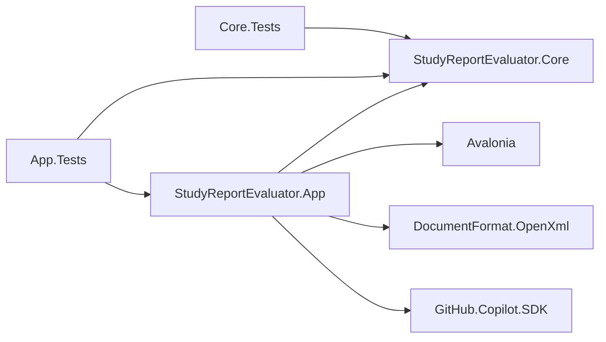
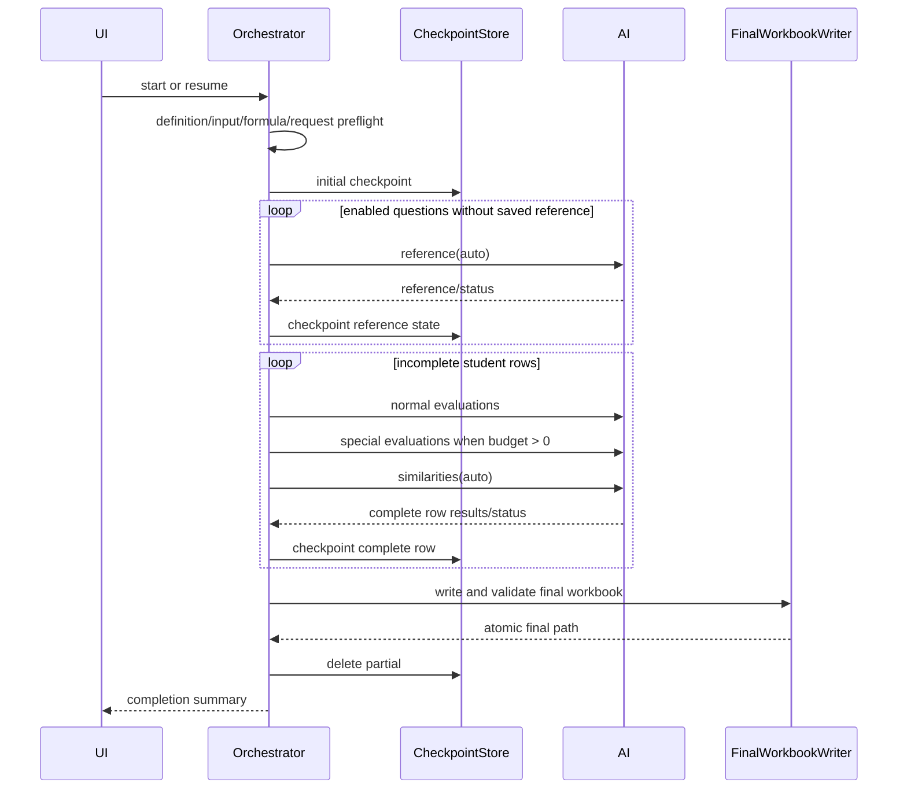

# StudyReport Evaluator 詳細設計書

| 項目 | 内容 |
|---|---|
| 対象要求 | `docs/requirements-definition.md` v4.2 |
| 設計決定 | ADR-0012（機能）/ ADR-0015（target delivery）/ ADR-0013（current public evidence boundary） |
| 作成日 | 2026-09-02 |
| 状態 | delivery expansion実装baseline |
| Production topology | Core + App の2 projectを維持 |

## 1. 設計目標

本設計は、既存v3実装を必要最小限変更し、次を追加する。

- base／question／specialの絶対配点
- questionごとの参照回答と学生回答類似度
- empty-zero／technical-blank
- `.partial.xlsx` checkpointとprocess restart後のresume
- native file picker
- Prompt text fileによるGUI prefill
- Windows 11 x64 self-contained MSIXとmacOS RID別DMGによる3操作setup

追加のdatabase、server、plugin framework、汎用AI operation framework、production projectは作らない。

## 2. 構成



| Project / folder | 責務 |
|---|---|
| `Core/Domain` | v4 definition、snapshot、normal/special/similarity result value |
| `Core/Validation` | definition、result、checkpoint payloadの純粋validation |
| `Core/Scoring` | allocationとcached preview計算 |
| `Core/Formulas` | closed Excel formula AST |
| `Core/Prompting` | normal/special/similarity Prompt rendering |
| `App/Copilot` | 4種類のclosed Copilot operation |
| `App/Workbooks` | read-only input、Config/References/Results/Run/Checkpoint sheet |
| `App/Workflow` | reference先行、student row単位処理、checkpoint、resume |
| `App/ViewModels` / `Views` | 4-step UI、picker、Prompt import、progress、completion |
| `scripts` | Windows x64 publish/ZIP/MSIX、macOS RID publish/bundle/sign/notary/DMG |

## 3. Domain model

### 3.1 QuantificationDefinition

```csharp
public sealed record QuantificationDefinition
{
    public required string Id { get; init; }
    public required string Name { get; init; }
    public required string Revision { get; init; }
    public required string SourceSheet { get; init; }
    public int HeaderRow { get; init; }
    public int FirstDataRow { get; init; }
    public int LastDataRow { get; init; }
    public decimal BasePoints { get; init; } = 60m;
    public decimal SpecialPoints { get; init; }
    public decimal SimilarityPenaltyWeight { get; init; } = 0.1m;
    public int RoundingDigits { get; init; } = 1;
    public ImmutableArray<QuestionDefinition> Questions { get; init; }
}
```

`HeaderRow`はUI上「質問文行」と表示し、1または2だけを許可する。既存serialized field名はv4 schema内で維持し、不要なmigration codeを作らない。

### 3.2 QuestionDefinition

```csharp
public sealed record QuestionDefinition
{
    public required string Id { get; init; }
    public required string DisplayName { get; init; }
    public required string QuestionText { get; init; }
    public required string PrimarySourceColumn { get; init; }
    public ImmutableArray<string> SupportingSourceColumns { get; init; }
    public decimal Points { get; init; }
    public ImmutableArray<EvaluatorDefinition> Evaluators { get; init; }
    public ImmutableArray<SpecialEvaluationDefinition> SpecialEvaluations { get; init; }
    public bool Enabled { get; init; } = true;
}
```

旧`Weight`は`Points`へrenameする。通常evaluatorとcriterionの内部weightは変更しない。

### 3.3 SpecialEvaluationDefinition

```csharp
public sealed record SpecialEvaluationDefinition
{
    public required string Id { get; init; }
    public required string DisplayName { get; init; }
    public required string PrimarySourceColumn { get; init; }
    public ImmutableArray<string> SupportingSourceColumns { get; init; }
    public required string PromptTemplate { get; init; }
    public bool Enabled { get; init; } = true;
}
```

weight、range、type hierarchyは追加しない。score contractは常に0〜1である。

### 3.4 Result value

```csharp
public sealed record ReferenceAnswerResult(
    string QuestionId,
    string ModelId,
    string? Answer,
    string StatusCode,
    DateTimeOffset GeneratedAtUtc);

public sealed record SpecialQuantificationResult(
    string SpecialEvaluationId,
    decimal? Score,
    string Reason,
    string Evidence,
    EvidenceSourceKind EvidenceSource,
    string EvidenceSourceColumnId);

public sealed record SimilarityQuantificationResult(
    string QuestionId,
    decimal? Score,
    string Reason);
```

- accepted AI scoreはfiniteかつ0〜1。
- emptyはaccepted resultを作らず、workflow resultのliteral score 0と`EMPTY` statusを持つ。
- technical failureはscore nullとfailure statusを持つ。
- reference answer本文はfinal/checkpoint workbookへ保存するがlogへ渡さない。
- token usageはApp workflowの既存`EvaluationTokenUsage`で保持し、Core result型へApp型を参照させない。

### 3.5 Allocation calculator

`ScoringAllocationCalculator`はI/Oを持たない。

```csharp
ImmutableArray<decimal> Equalize(
    decimal basePoints,
    decimal specialPoints,
    int enabledQuestionCount);

AllocationValidationResult Validate(
    decimal basePoints,
    decimal specialPoints,
    IEnumerable<decimal> enabledQuestionPoints);
```

- 0〜100とfinite decimalを検証する。
- 合計はexact decimalで100と比較する。
- Equalizeは最大6 decimal placesで先頭$N-1$件を同値にし、最後の1件へexact差分を入れる。
- disabled questionのPointsは変更しない。

## 4. Definition validation

### 4.1 root

| Code | 条件 |
|---|---|
| `BASE_POINTS_OUT_OF_RANGE` | BasePointsが0〜100外 |
| `SPECIAL_POINTS_OUT_OF_RANGE` | SpecialPointsが0〜100外 |
| `SIMILARITY_WEIGHT_OUT_OF_RANGE` | weightが0〜1外 |
| `QUESTION_TEXT_ROW_INVALID` | HeaderRowが1または2でない |
| `DATA_ROW_BEFORE_QUESTION_ROW` | FirstDataRow <= HeaderRow |
| `ALLOCATION_TOTAL_INVALID` | base + special + enabled question points != 100 |
| `SPECIAL_ITEMS_REQUIRED` | SpecialPoints > 0かつenabled special item合計0 |

### 4.2 question / special

- enabled questionは0以上のPointsを持つ。
- question text、primary column、enabled evaluatorを必須とする。
- special ID、display name、primary column、Promptを必須とする。
- special Promptは`{回答}`を必須、`{評価項目}`は任意とする。
- 同一special内のprimary/supporting重複を拒否する。
- normal questionとspecialが同じsource columnを使うことは許可する。
- `SpecialPoints == 0`でもdefinition内のspecial itemは保持するがdispatchしない。

## 5. PromptとAI contract

### 5.1 operation一覧

| Operation | Model | Input | Result tool |
|---|---|---|---|
| Reference | `auto` | question text | `submit_reference_answer` |
| Normal | user-selected | question、primary、supporting、criteria | `submit_quantification` |
| Special | user-selected | question、special primary/supporting、Prompt | `submit_special_quantification` |
| Similarity | `auto` | question、student answer、reference | `submit_similarity` |

各sessionへ公開するtoolは表の1件だけとする。permission requestは全拒否する。

### 5.2 Reference Prompt

app-owned固定Prompt:

```text
次の設問に、設問文だけを根拠として回答してください。
学生の回答、採点情報、過去の回答は使用しないでください。
比較用の一つの回答本文だけを返してください。

### 設問
{設問}
```

structured toolは`question_id`と`answer`だけを受ける。answerは1〜32,767 characters。normal assistant bodyは採用せず、tool call exactly onceを要求する。

これは利用者templateではない。app-owned定数に含まれる`{設問}`を`StringComparison.Ordinal`のexact replacementで1回展開する。利用者向け6 placeholder validatorの対象にせず、任意templateや追加placeholderを受け取らない。

### 5.3 Special Prompt

利用者templateを既存single-pass rendererで展開し、app-owned instructionを後置する。

```text
0は満たしていない、1は十分に満たしているとして0から1の有限数で評価してください。
指定ID、score、短い理由、同じ行の連続substring根拠とsourceだけをsubmit_special_quantificationへ1回送信してください。
```

### 5.4 Similarity Prompt

Similarity Promptは利用者templateではなく、次の固定sectionへ検証済み値を`StringBuilder`で直接追加する。以下の`<...>`は説明用であり、`PromptTemplateRenderer`が解釈するplaceholderではない。

```text
設問に対する二つの回答の意味内容と表現の類似度を評価してください。
0は類似しない、1は同一または実質同一です。
不正行為や回答品質を判定せず、類似度だけを返してください。

### 設問
<question.QuestionText>

### 学生回答
<studentAnswer>

### 比較用LLM生成回答
<referenceAnswer>
```

resultは`question_id`、`similarity`、`reason`だけとし、similarityを0〜1でclosed validateする。`{参照回答}`を利用者向けplaceholderへ追加しない。通常Custom／Specialだけをsingle-pass rendererで検証し、app-owned Reference／Similarityはそれぞれ上記の限定置換／固定section構築を使う。

### 5.5 retry

既存`RetryAndCleanupCoordinator`の有限attempt、timeout、cleanup順序を再利用する。operationごとにadapterを作るがretry engineを複製しない。

## 6. Excel workbook設計

### 6.1 Sheet set

| Base name | 内容 |
|---|---|
| `Quantification_Config` | v4 definitionとformula input cells |
| `Quantification_References` | questionごとのreference result |
| `Quantification_Results` | student row resultsとformula |
| `Quantification_Run` | run identity、counts、usage、paths以外のsafe metadata |
| `Quantification_Checkpoint` | partial workbookだけ。resume envelope |

final workbookへCheckpoint sheetを残さない。partial workbookへConfig／References／Results／Runを重複生成せず、Checkpoint sheetだけを追加する。

### 6.2 Config rows

既存25列へ次を追加する。

- `BasePoints`
- `SpecialPoints`
- `QuestionPoints`
- `SimilarityPenaltyWeight`
- `AllocationTotal`
- `AllocationValid`
- `SpecialPrimarySourceColumn`
- `SpecialSupportingSourceColumn`

formula参照mapへ次を追加する。

- root BasePoints cell
- root SpecialPoints cell
- root SimilarityPenaltyWeight cell
- root AllocationValid formula cell
- question Points cells

`AllocationTotal = SUM(BasePoints, SpecialPoints, enabled question points)`。
`AllocationValid = IF(AllocationTotal=100,1,0)`。

### 6.3 References sheet

headerは次の7列とする。

1. `QuestionId`
2. `DisplayName`
3. `QuestionText`
4. `ModelId`
5. `ReferenceAnswer`
6. `Status`
7. `GeneratedAtUtc`

すべてliteral stringであり、formulaへ昇格しない。token usageはRun sheetへ集計する。

### 6.4 Results layout

先頭列は`SourceRow`。各enabled questionについて次を順に置く。

#### Normal criterion

既存10列を維持する。

- `.Scorable`
- `.AI_Raw`
- `.Override`
- `.Effective_Raw`
- `.Normalized`
- `.Reason`
- `.Evidence`
- `.Evidence_Source`
- `.Evidence_SourceColumn`
- `.Status`

各evaluator末尾に`.Evaluator_Score`。

#### Question normal result

- `.Answer_Present` literal 1/0
- `.Question_Normalized` formula 0〜100またはblank
- `.Question_Rate` formula 0〜1またはblank
- `.Question_Earned` formula points換算またはblank

empty answerではcriterion/evaluatorは既存どおりblankでも、Question_Rateを0、Question_Earnedを0にする。

#### Special item

- `.Special_AI_Raw` literal 0〜1またはblank
- `.Special_Reason` literal
- `.Special_Evidence` literal
- `.Special_Evidence_Source` literal
- `.Special_Evidence_SourceColumn` literal
- `.Special_Status` literal

enabled special itemを1件以上持つquestionの末尾だけに`.Special_Question_Rate` formulaを置く。enabled special itemが0件のquestionには列も式も生成せず、SpecialEarnedの分母にも含めない。`SpecialPoints=0`時はitem raw blank、status `NOT_RUN_ZERO_BUDGET`、question rate blankとする。`SpecialEarned`式はroot SpecialPointsが0なら0を返し、後からSpecialPointsだけを変更した場合はraw不足によりblankを返す。

#### Similarity

- `.Similarity_AI_Raw` literal 0〜1またはblank
- `.Similarity_Reason` literal
- `.Similarity_Status` literal
- `.Similarity_Penalty` formula

#### Row totals

- `Base_Points` formula
- `Special_Earned` formula
- `Final_Raw` formula
- `Final_Score` formula

### 6.5 Formula

$A$をConfigのAllocationValid、$B$をBase、$S$をSpecialPoints、$W$をSimilarityPenaltyWeightとする。

Question rate:

```text
=IF(AnswerPresentCell=0,0,IF(ISNUMBER(QuestionNormalizedCell),QuestionNormalizedCell/100,""))
```

Question earned:

```text
=IF(ISNUMBER(QuestionRateCell),ROUND(QuestionRateCell*QuestionPointsCell,RoundingDigitsCell),"")
```

Special question rate:

```text
=IF(SpecialPointsCell=0,"",IF(COUNT(SpecialRawCells)=EnabledSpecialCount,ROUND(SUM(SpecialRawCells)/EnabledSpecialCount,RoundingDigitsCell),""))
```

この式は`EnabledSpecialCount >= 1`のquestionにだけ生成する。0件のquestionへ空rangeや除数0の式を生成しない。

Special earned:

```text
=IF(SpecialPointsCell=0,0,IF(COUNT(SpecialQuestionRateCells)=SpecialQuestionCount,ROUND(SpecialPointsCell*SUM(SpecialQuestionRateCells)/SpecialQuestionCount,RoundingDigitsCell),""))
```

Similarity penalty:

```text
=IF(ISNUMBER(SimilarityRawCell),ROUND(QuestionPointsCell*SimilarityRawCell*SimilarityWeightCell,RoundingDigitsCell),"")
```

Final raw:

```text
=IF(AllocationValidCell<>1,"",IF(COUNT(QuestionEarnedCells,SpecialEarnedCell,SimilarityPenaltyCells)=ExpectedCount,ROUND(BasePointsCell+SUM(QuestionEarnedCells)+SpecialEarnedCell-SUM(SimilarityPenaltyCells),RoundingDigitsCell),""))
```

Final score:

```text
=IF(ISNUMBER(FinalRawCell),IF(FinalRawCell<0,0,IF(FinalRawCell>100,100,FinalRawCell)),"")
```

既存allowlistで表現できるためMIN/MAX、AVERAGE等を追加しない。Formula ASTへ新しい汎用functionを追加しない。

### 6.6 Cached preview

`WeightedScoreCalculator`を次の責務へ拡張する。

- normal criterion／evaluator normalized preview
- question rate／earned
- special question／overall rate
- similarity penalty
- final raw／clamp

Excelと同じ各段階rounding、`decimal`、`MidpointRounding.AwayFromZero`を使う。

## 7. Checkpoint設計

### 7.1 Envelope

```csharp
internal sealed record CheckpointEnvelope
{
    public int SchemaVersion { get; init; } = 1;
    public required InputSnapshot Input { get; init; }
    public required string DefinitionCanonicalJson { get; init; }
    public required string DefinitionSha256 { get; init; }
    public required string NormalModelId { get; init; }
    public string ReferenceModelId { get; init; } = "auto";
    public required CheckpointRuntimeIdentity Runtime { get; init; }
    public required string FinalPath { get; init; }
    public required string PartialPath { get; init; }
    public required DateTimeOffset StartedAtUtc { get; init; }
    public required DateTimeOffset SavedAtUtc { get; init; }
    public ImmutableArray<CheckpointReference> References { get; init; }
    public ImmutableArray<CheckpointCompletedRow> CompletedRows { get; init; }
}
```

`CheckpointCompletedRow`はnormal unit results、special results、similarity results、usageをまとめる。row途中のarrayは保存しない。

### 7.2 Sheet encoding

Checkpoint sheet:

| Column | 値 |
|---|---|
| A `RecordType` | `META` / `PAYLOAD` |
| B `ChunkIndex` | 0-based integer |
| C `Value` | schema/hashまたはJSON chunk |

- canonical UTF-8 JSONを30,000 character以下へchunkする。
- METAへ`SchemaVersion`、`PayloadSha256`、`ChunkCount`を保存する。
- readerはunknown row／column、missing／duplicate chunk、順序gap、hash mismatchを拒否する。
- payload本文をerrorへ含めない。

### 7.3 Save

1. partialと同directoryにCreateNew tempを作る。
2. inputをtempへbyte-copyしてflushする。
3. `Quantification_Checkpoint`を追加する。入力に同名sheetがある場合はpartial作成を拒否し、既存input sheetをcheckpointと誤認しない。
4. close、read-only reopen、package／sheet／payload hashをvalidateする。
5. 初回はno-overwrite move、更新はsame-volume replaceを行う。
6. update失敗時は旧partialを保持し、tempをbest-effort cleanupする。

### 7.4 Load / resume

1. 利用者がpartialを選ぶか、選択inputのresult directoryに一致候補を検出する。
2. fileをread-onlyで開き、Checkpoint sheetとpayloadをclosed validateする。
3. input pathをcheckpointから取得し、identityを再計算する。
4. canonical definitionからsnapshotを復元し、hashを再計算する。
5. normal model、`auto` availability、runtime identityを検証する。
6. completed rowsをsource rangeとexpected IDsへ再validationする。
7. 保存済みreferenceとcompleted rowsをseedとしてrunを続行する。

mismatch時はpartialへwriteしない。

## 8. Workflow

### 8.1 Run sequence



### 8.2 Row scheduling

学生行はsource row昇順に処理する。row間は並列化しない。1行内のnormal evaluator、special item、similarityを既定1／最大3で並列化する。

理由:

- student row単位checkpointを自然に保証する。
- process終了時の再実行範囲を最大1行に限定する。
- current global concurrency上限を維持する。

専用operationを汎用queue hierarchyへ抽象化しない。orchestratorはnormal／special／similarityの3配列を明示的に扱う。

### 8.3 Progress

```csharp
public enum EvaluationStage
{
    Preparing,
    GeneratingReferences,
    EvaluatingRows,
    SavingCheckpoint,
    FinalizingWorkbook,
    Completed,
    Cancelling,
}
```

progressはstage、reference completed/total、row completed/total、unit completed/total、in-flight、safe status codeを持つ。回答本文やPromptを含めない。

### 8.4 Cancel

- cancel後に新規AI operationを開始しない。
- in-flight sessionを既存contractでcleanupする。
- 完了行だけをcheckpointへ保存する。
- final workbookは作らず、partial pathを結果画面へ表示する。

## 9. Output path

`OutputPathPlanner`をApp/ViewModelsまたはWorkbooks/Writingへ1型だけ追加する。

```csharp
OutputPathReservation Reserve(string inputPath, DateTimeOffset localTime, string? outputDirectory);
```

- default directoryは`<input directory>/result`。
- directoryがなければrun開始時に作成する。
- basenameは`eval-yyyyMMdd-HHmm`。
- finalとpartialの両方が未使用となる最小suffixを選ぶ。
- suffixなし、`-02`、`-03`…の順。
- path予約後に第三者がfileを作った場合は上書きせずfinalizationを失敗させる。

lock fileやglobal reservation serviceは追加しない。

## 10. UI

### 10.1 Input

- `ファイルを選択` buttonを追加。
- View code-behindはStorageProviderで1fileを選び、ViewModelの`SelectFileAsync(path)`だけを呼ぶ。
- `.xlsx` filterはUX補助であり、loaderのformat validationを省略しない。
- question text row labelを「質問文の行（1または2）」へ変更する。
- special mappingはDesign画面の各special itemでsourceを選ぶ。

### 10.2 Design

root card:

- Base points
- Special points
- Similarity penalty weight
- Rounding digits
- 配点合計／残り
- `設問配点を均等化` button

question card:

- Points
- normal evaluators
- special items add/copy/reorder/disable/delete

imported Prompt card:

- command line指定順のbasename一覧
- selected Prompt preview
- target: selected Custom evaluatorまたはselected special item
- `Promptを適用` button

### 10.3 Execution

- normal model listと`auto` availabilityを別表示する。
- final／partial path previewとoutput directory選択を表示する。
- new run／resumeを明確に分ける。
- stage、reference、row、unit progressを表示する。

### 10.4 Results

- completion headline
- finalまたはpartial path
- input unchanged
- row counts、technical failure count
- per row: QuestionEarned、SpecialEarned、SimilarityPenalty、FinalRaw、FinalScore
- cleanup warning

finalizationはrunの一部なので、旧「検証して出力」buttonは削除する。結果からfolderを開く操作だけを提供する。

### 10.5 Warning

`EthicsWarningText.Message`を要求のexact文面へ置換する。shell rootの既存non-focusable bannerを再利用する。

## 11. Command-line launch

### 11.1 Parser

`LaunchOptions.Parse(string[] args)`はpure methodとする。

- `--input <path>`: 0または1回
- `--prompt <path>`: 0回以上、順序維持
- option名はordinal ignore-case
- unknown option、missing value、duplicate inputをerror
- relative pathは起動時current directoryを基準にabsolute化

### 11.2 PromptFileLoader

- `.txt` only
- UTF-8。invalid byte sequenceを拒否
- BOMあり／なしを許可
- 1〜32,767 characters
- basenameを表示名とする
- duplicate pathは重複一覧にせず最初の指定順を維持する
- contentをlog／exception messageへ含めない

### 11.3 Startup

`Program.Main`でparseし、safe errorがあればdialog表示後終了する。valid optionsは`App`へ渡し、MainWindow composition時にInputとDesignへ適用する。AI実行commandは呼ばない。

## 12. Copilot runtime

### 12.1 pinning

- NuGet SDK exact versionをcentral package managementで固定する。
- SDKのbundled CLI assetをRID別publishへ含める。
- package manifestへSDK version、CLI file relative path、CLI SHA-256を保存する。
- appはmanifestを読んでpackage-relative absolute pathを使用する。
- manifest／file/hash mismatchではAI unavailableとし、PATH fallbackしない。

### 12.2 identity

checkpointとRun sheetへ次を保存する。

- SDK assembly informational version
- CLI reported version
- CLI executable SHA-256
- normal model ID
- reference/similarity model ID `auto`

## 13. Packaging

### 13.1 共通payload

- `win-x64`、`osx-arm64`、`osx-x64`を別々にRelease/self-contained/non-trimmed/non-single-fileでpublishする。
- apphost、.NET runtime、Avalonia native assets、Open XML、GitHub Copilot SDK、RID別bundled CLI、runtime manifest、README/docs/images/licenseを含める。
- source、test、sample、symbol、secret、0-byte、root外linkをpackageへ含めない。
- package-installed appが外部.NET、Office、別Copilot CLIへfallbackしないことを検証する。

### 13.2 Windows

- primary artifactは`StudyReportEvaluator-win-x64.msix`とSHA-256 sidecar。
- package Identity Versionはstable SemVer `Major.Minor.Patch`から`Major.Minor.Patch.0`へ写像し、Publisherはproduction certificate subjectと一致させる。
- test certificateはmanifest/layout/install mechanismだけを検証し、statusを`PASS_MECHANISM`に限定する。
- 証明書なしのWindows 11開発試験は`StudyReportEvaluator-win-x64.unsigned.test.msix`へ分離する。Publisherは`CN=<test name>, OID.2.25.311729368913984317654407730594956997722=1`とし、fixed unsigned markerを最終fieldに置く。署名entryなし、signed packageと別identityを必須とし、使い捨てVMまたは復元可能なsnapshot上で管理者PowerShellの`Add-AppxPackage -AllowUnsigned`による全ユーザーinstallだけを行う。標準App Installer UI、非管理者setup、production trustの証拠にしない。
- production packageはtrusted signatureとtimestampを持ち、clean Windows 11 x64でinstall、Start menu launch、upgrade、repair、uninstallを検証する。
- bundled `runtimes/win-x64/native/copilot.exe`のspawn、login state、model list、cleanup、user-selected workbook I/OをMSIX container下で実測する。
- 現行unsigned ZIPとsidecarはregression/fallbackとして維持し、MSIXと別artifact contractにする。
- PowerShell 7はengineering scriptだけの前提で、end-user setup要件にしない。

### 13.3 macOS

- `StudyReportEvaluator.app/Contents`に`Info.plist`、`MacOS`、`Resources`、必要な`Frameworks`を配置する。
- `CFBundleExecutable`はapphost、`CFBundleIdentifier`は`com.github.dahatake.study-report-evaluator`、short versionはstable SemVer、build versionは単調増加するnumeric valueとする。
- `osx-arm64`と`osx-x64`を別bundle／DMGにし、Mach-O architectureとexecute modeを各artifactで検証する。
- entitlementは実測で必要な最小集合とし、`get-task-allow`を含めない。JITが必要な場合だけ`com.apple.security.cs.allow-jit`を採用する。
- nested Mach-O／CLI／apphostを署名し、signed CLI SHA-256をmanifestへ反映後、outer `.app`を最後に署名する。outer署名後はbundleを変更しない。
- appをnotarize／stapleした後にDMGへ格納し、DMGもnotarize／staple／validateする。notary statusがAcceptedでもlogを検査する。
- quarantine付きdownload、DMG open、Applicationsへのdrag、Finder launch、bundled CLI、workbook read/write、app removalをexact OS build × native architectureで実測する。

### 13.4 Setup lifecycle

- Windows: MSIXを開く→Install→起動。
- macOS: DMGを開く→Applicationsへdrag→起動。
- install／upgrade／repair／uninstallまたはapp removalは利用者のinput、final、partialを変更・削除しない。
- wrong RID、tamper、invalid signature、partial install、disk full、locked file、process killを単一原因で試験し、成功表示しない。

### 13.5 自動化境界

- [`.github/workflows/ci.yml`](../../.github/workflows/ci.yml)はsecretなしでlocked restore、Release build、決定的test、Windows legacy package、MSIX mechanism、macOS RID publish/bundle structureを検査する。
- `sample/SampleReport.xlsx`はprivate local inputとしてGit追跡・package同梱を禁止する。platform package acceptanceはsynthetic fixtureで行い、canonical sampleのlocal technical E2Eと分離する。
- [`.github/workflows/release.yml`](../../.github/workflows/release.yml)はprotected environmentでproduction signing/notarizationを実行する。PR/forkへsecretを渡さない。
- required platform matrixの全claim行が`PASS_PRODUCTION`でなければ該当artifactを公開しない。
- Live Copilot、canonical sample technical E2E、external spreadsheet recalculationは各scopeを分離し、未実行を成功扱いにしない。

### 13.6 製品版

- 製品SemVerの単一正本はroot `Directory.Build.props`の`VersionPrefix` / `VersionSuffix`とする。
- 版の表示、設定、bump、App/Core/published assembly/tag検証は`dev/version.ps1`を使う。
- 要求文書版、definition/checkpoint/Copilot manifest schema、Prompt template、dependency versionを製品版へ読み替えない。
- MAJOR/MINOR/PATCH判定、CHANGELOG、tag、GitHub Release、failure handlingは[`version-management.md`](version-management.md)を正本とする。
- 製品版変更だけでtest済みまたは公開済みとは扱わない。

## 14. Privacyとlogging

- normal payload: current rowのselected normal cellsのみ。
- special payload: current rowのselected special cellsのみ。
- similarity payload: current row primary + same question reference。
- reference payload: question textのみ。
- output／partialは入力全体、definition、AI結果を含み、入力と同等以上に機密。
- application logはoperation kind、safe IDs、counts、status、timingだけ。
- file path、answer、Prompt、reference、reason、evidence、credentialをlogへ渡さない。
- tempとpartialはtarget directoryの既存OS access controlを継承し、より広いpermissionへ変更しない。

## 15. Error code

### Definition

`BASE_POINTS_OUT_OF_RANGE`, `SPECIAL_POINTS_OUT_OF_RANGE`, `SIMILARITY_WEIGHT_OUT_OF_RANGE`, `QUESTION_TEXT_ROW_INVALID`, `ALLOCATION_TOTAL_INVALID`, `SPECIAL_ITEMS_REQUIRED`, `SPECIAL_PROMPT_INVALID`

### Reference / special / similarity

`REFERENCE_OUTPUT_INVALID`, `REFERENCE_TIMEOUT`, `REFERENCE_NETWORK_FAILED`, `SPECIAL_OUTPUT_INVALID`, `SIMILARITY_OUTPUT_INVALID`, `AUTO_MODEL_REQUIRED`

既存`AUTH_REQUIRED`, `AI_TIMEOUT`, `NETWORK_FAILED`, `CLEANUP_FAILED`, `AI_RUNTIME_FAILED`をoperation contextとともに再利用できる。

### Checkpoint / output

`CHECKPOINT_INVALID`, `CHECKPOINT_SCHEMA_UNSUPPORTED`, `CHECKPOINT_HASH_MISMATCH`, `CHECKPOINT_INPUT_MISMATCH`, `CHECKPOINT_DEFINITION_MISMATCH`, `CHECKPOINT_MODEL_MISMATCH`, `CHECKPOINT_RUNTIME_MISMATCH`, `CHECKPOINT_SAVE_FAILED`, `PARTIAL_CLEANUP_FAILED`, `OUTPUT_INVALID`, `TARGET_EXISTS`, `INPUT_CHANGED`

error messageはsafe ID、field、actual dimension、limitだけを持ち、contentを含めない。

## 16. Test design

### 16.1 Core

- allocation equalize 1/2/3/7 questions、exact sum、last remainder
- validation boundaries base/special/points/similarity/header row
- special collection operationsとsnapshot isolation
- normal/special/similarity result validation 0/1/NaN/unknown/missing
- empty-zero／technical-blank preview
- all formulasのhand oracle、negative/over-100 clamp
- canonical JSON v4 determinism

### 16.2 App adapters

- Microsoft Forms型／Google Forms型synthetic header row 1/2
- picker boundary select/cancel
- 4 Copilot operationのsingle tool／permission／retry／cleanup
- Config／References／Results／Run writerとreopen validation
- checkpoint chunks/hash/unknown/missing/duplicate、atomic update fault
- resume mismatch matrixとcompleted row skip
- output naming／suffix／race／input drift

### 16.3 UI

- exact warning text／nonblocking
- root points／equalize／validation
- special editor
- imported Prompt order／reuse／explicit apply／no AI send
- output／partial path、new/resume
- stage/row progress、cancel、completion、cleanup warning
- keyboard、focus、200% scroll

### 16.4 E2E

- fixed-seed 531-row new run to final workbook
- stop after checkpoint and resume to same expected result
- empty normal/special values produce 0 without runner calls
- technical failures produce blank FinalScore
- reference exactly once/question across resume
- input SHA-256/size/mtime unchanged

### 16.5 Delivery

- Windows legacy ZIP layout/hash/clean launch regression
- MSIX manifest/version/layout、test-sign mechanism、production trust、install/upgrade/repair/uninstall
- macOS RID別bundle、Info.plist、Mach-O/mode、nested/outer signing、runtime manifest、notary/staple/DMG/quarantine
- package-installed appのbundled CLI、input不変、checkpoint/resume、final、privacy regression
- platform matrix、secret isolation、未実測artifact非公開、public candidate再download

## 17. File-level implementation map

| Task | Production files | Direct tests |
|---|---|---|
| C-01 | Core Domain definition files + new `SpecialEvaluationDefinition.cs` | Domain tests |
| C-02 | `QuantificationDefinitionValidator.cs`, new `ScoringAllocationCalculator.cs` | Validation/scoring tests |
| C-03 | `WeightedScoreCalculator.cs` | scoring tests |
| C-04 | Formula files | formula tests |
| C-05 | Prompt/result files | prompting/result tests |
| C-06 | serializer/snapshot | serialization/snapshot tests |
| X-01 | metadata/suggester/mapping | workbook mapping tests |
| A-01 | package/runtime factory/auth | Copilot runtime tests |
| A-02 | reference runner/tool | reference tests |
| A-03 | normal/special runner/tool | Copilot tests |
| A-04 | similarity runner/tool | similarity tests |
| X-02 | Config/References/Run writers | writer tests |
| X-03 | Results/preflight/validator | formula/workbook tests |
| X-04 | path planner/final writer | atomic/path tests |
| W-01 | checkpoint reader/writer | checkpoint tests |
| W-02 | orchestrator/scheduler/run summary | workflow/resume tests |
| U-01 | Input View/VM/code-behind | UI tests |
| U-02 | Design View/VM | UI tests |
| U-03 | Execution/Results View/VM | UI tests |
| U-04 | warning resource/shell | warning tests |
| L-01 | Program/App/composition + launch files | startup tests |
| P-01 | Windows scripts/package | packaging tests |
| P-02 | Windows MSIX manifest/package/sign/install | Windows installer tests |
| P-03 | macOS RID publish/bundle/sign/notary/DMG | macOS package and quarantine tests |
| P-04 | platform matrix / protected release | workflow contract and release evidence tests |
| D-01..05 | README/docs/dev/docs/images | documentation/screenshot tests |

## 18. Definition of done

- 要求v4.2のAC-001〜028がdirect deterministic、mechanism、production external evidenceへ適切に接続される。
- 各implementation taskでtarget tests、Release build、diff checkが成功する。
- 各taskの敵対的reviewで再現したfindingを修正し、同じ観点のfollow-upで0件を確認する。
- full required testsが成功する。
- Windows legacy package regressionとMSIX production install/launch/bundled CLI/uninstallが成功する。
- macOS RID別sign/notary/staple/quarantine launchがexact test行で成功する。
- Linux、Windows Arm64、macOS 13以前、未実測installer／signing／notarizationを対応済みと記録しない。
- 実在学生本文、Prompt、reference、AI reason/evidenceをlog、test artifact、review recordへ追加しない。
