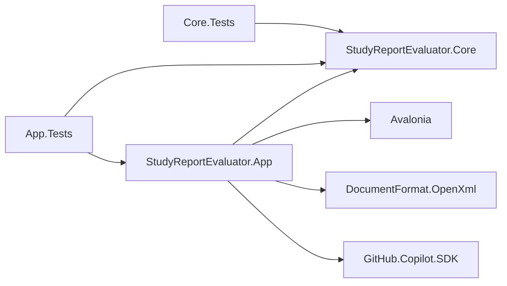
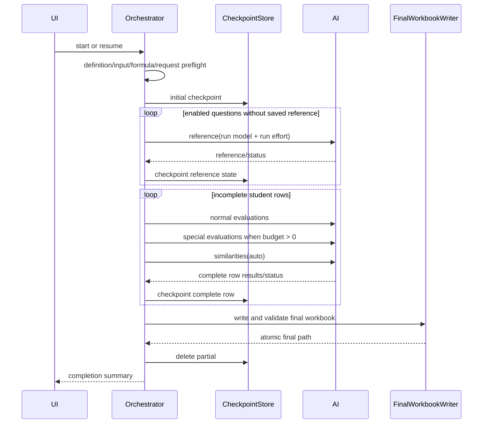

# StudyReport Evaluator 詳細設計書

| 項目 | 内容 |
|---|---|
| 対象要求 | `docs/requirements-definition.md` v4.6 |
| 設計決定 | ADR-0012（機能）/ ADR-0016（Windows単一EXE主配布・ZIP代替・明示login・candidate拘束公開gate） |
| UI / 設定の契約 | [`ui-layout-contract.md`](ui-layout-contract.md) / [UI・設定保存プランv2](archive/work/20260907-ui-settings-redesign-plan-v2.md)と後続承認 |
| 作成日 | 2026-09-02 |
| 更新日 | 2026-09-07 |
| 状態 | `0.8.6`未公開candidate（UNRELEASED、EXE主配布候補 + ZIP代替 + development MSIX非公開記録）。F01はREVIEWED、公開済みは`v0.8.1` ZIP |
| Production topology | Core + App の2 projectを維持 |

## 1. 設計目標

本設計はv4の業務・配布境界と、v4.6のUI／ローカル設定保存の実装を記述する。T01〜T38は対象検証・REVIEWED、T39は追加native FAILと本人確認等の外部前提によりBLOCKED。0.8.4の記録済み文書contract／実ZIP／実EXE／自動回帰／MSIX機構確認と、F02後の0.8.6最終再検証を分ける。本同期時点のF02再検証は親担当で未完了、以後は[実行記録](archive/work/20260907-ui-settings-execution-record.md)の最新F02欄を参照する。件数・適用限界・履歴は[現在状態](implementation-status.md)へ集約し、全タスクDONEや公開PASSを主張しない。

- base／question／specialの絶対配点
- questionごとの参照回答と学生回答類似度
- empty-zero／technical-blank
- `.partial.xlsx` checkpointとprocess restart後のresume
- native file picker
- Prompt text fileによるGUI prefill
- Windows 11 x64 App限定self-contained単一EXE（主配布候補）とZIP（代替）の併存
- 同梱CLIの明示login開始/取消/所有process cleanupと、login後の利用者明示再確認
- candidate → 人手clean-host証跡受領 → protected publish Final v2の公開制御
- 4ステップ＋独立した設定5カテゴリ、ページ一覧／選択詳細、未確定text・対象・設定往復の保持
- 共通設定＋任意の採点定義1件の明示保存、保存定義の検証後明示適用、次回draft／現在run／前回結果の分離

追加のdatabase、server、plugin framework、汎用AI operation framework、production projectは作らない。

## 2. 構成



| Project / folder | 責務 |
|---|---|
| `Core/Domain` | v4 definition、snapshot、normal/special/similarity result value |
| `Core/Validation` | definition、result、checkpoint payloadの純粋validation |
| `Core/Scoring` | allocationとcached preview計算 |
| `Core/Formulas` | closed Excel formula AST |
| `Core/Prompting` | normal/special/similarity Prompt rendering |
| `App/Copilot` | 4種類のclosed Copilot operation |
| `App/Workbooks` | read-only input、Config/References/Results/Run/Checkpoint sheet |
| `App/Workflow` | reference先行、student row単位処理、checkpoint、resume |
| `App/Settings` | `ApplicationSettings`、strictな`SettingsFileStore`。Core型を保存するがCoreへI/Oを持ち込まない |
| `App/ViewModels` / `Views` | 4-step＋設定UI、既存draft同期、picker、Prompt import、progress、結果／override |
| `App/Composition` | productionだけの設定path解決と明示的な初期読込接続。既定test構成はnull store |
| `scripts` | Windows x64 publish/ZIP/MSIX、macOS RID publish/bundle/sign/notary/DMG |

## 3. Domain model

### 3.1 QuantificationDefinition

```csharp
public sealed record QuantificationDefinition
{
    public required string Id { get; init; }
    public required string Name { get; init; }
    public required string Revision { get; init; }
    public required string SourceSheet { get; init; }
    public int HeaderRow { get; init; }
    public int FirstDataRow { get; init; }
    public int LastDataRow { get; init; }
    public decimal BasePoints { get; init; } = 60m;
    public decimal SpecialPoints { get; init; }
    public decimal SimilarityPenaltyWeight { get; init; } = 0.1m;
    public int RoundingDigits { get; init; } = 1;
    public ImmutableArray<QuestionDefinition> Questions { get; init; }
}
```

`HeaderRow`はUI上「質問文行」と表示し、1または2だけを許可する。既存serialized field名はv4 schema内で維持し、不要なmigration codeを作らない。

### 3.2 QuestionDefinition

```csharp
public sealed record QuestionDefinition
{
    public required string Id { get; init; }
    public required string DisplayName { get; init; }
    public required string QuestionText { get; init; }
    public required string PrimarySourceColumn { get; init; }
    public ImmutableArray<string> SupportingSourceColumns { get; init; }
    public decimal Points { get; init; }
    public ImmutableArray<EvaluatorDefinition> Evaluators { get; init; }
    public ImmutableArray<SpecialEvaluationDefinition> SpecialEvaluations { get; init; }
    public bool Enabled { get; init; } = true;
}
```

旧`Weight`は`Points`へrenameする。通常evaluatorとcriterionの内部weightは変更しない。

### 3.3 SpecialEvaluationDefinition

```csharp
public sealed record SpecialEvaluationDefinition
{
    public required string Id { get; init; }
    public required string DisplayName { get; init; }
    public required string PrimarySourceColumn { get; init; }
    public ImmutableArray<string> SupportingSourceColumns { get; init; }
    public required string PromptTemplate { get; init; }
    public bool Enabled { get; init; } = true;
}
```

weight、range、type hierarchyは追加しない。score contractは常に0〜1である。

### 3.4 Result value

```csharp
public sealed record ReferenceAnswerResult(
    string QuestionId,
    string ModelId,
    string? Answer,
    string StatusCode,
    DateTimeOffset GeneratedAtUtc);

public sealed record SpecialQuantificationResult(
    string SpecialEvaluationId,
    decimal? Score,
    string Reason,
    string Evidence,
    EvidenceSourceKind EvidenceSource,
    string EvidenceSourceColumnId);

public sealed record SimilarityQuantificationResult(
    string QuestionId,
    decimal? Score,
    string Reason);
```

- accepted AI scoreはfiniteかつ0〜1。
- emptyはaccepted resultを作らず、workflow resultのliteral score 0と`EMPTY` statusを持つ。
- technical failureはscore nullとfailure statusを持つ。
- reference answer本文はfinal/checkpoint workbookへ保存するがlogへ渡さない。
- token usageはApp workflowの既存`EvaluationTokenUsage`で保持し、Core result型へApp型を参照させない。

### 3.5 Allocation calculator

`ScoringAllocationCalculator`はI/Oを持たない。

```csharp
ImmutableArray<decimal> Equalize(
    decimal basePoints,
    decimal specialPoints,
    int enabledQuestionCount);

AllocationValidationResult Validate(
    decimal basePoints,
    decimal specialPoints,
    IEnumerable<decimal> enabledQuestionPoints);
```

- 0〜100とfinite decimalを検証する。
- 合計はexact decimalで100と比較する。
- Equalizeは最大6 decimal placesで先頭$N-1$件を同値にし、最後の1件へexact差分を入れる。
- disabled questionのPointsは変更しない。

## 4. Definition validation

### 4.1 root

| Code | 条件 |
|---|---|
| `BASE_POINTS_OUT_OF_RANGE` | BasePointsが0〜100外 |
| `SPECIAL_POINTS_OUT_OF_RANGE` | SpecialPointsが0〜100外 |
| `SIMILARITY_WEIGHT_OUT_OF_RANGE` | weightが0〜1外 |
| `QUESTION_TEXT_ROW_INVALID` | HeaderRowが1または2でない |
| `DATA_ROW_BEFORE_QUESTION_ROW` | FirstDataRow <= HeaderRow |
| `ALLOCATION_TOTAL_INVALID` | base + special + enabled question points != 100 |
| `SPECIAL_ITEMS_REQUIRED` | SpecialPoints > 0かつenabled special item合計0 |

### 4.2 question / special

- enabled questionは0以上のPointsを持つ。
- question text、primary column、enabled evaluatorを必須とする。
- special ID、display name、primary column、Promptを必須とする。
- special Promptは`{回答}`を必須、`{評価項目}`は任意とする。
- 同一special内のprimary/supporting重複を拒否する。
- normal questionとspecialが同じsource columnを使うことは許可する。
- `SpecialPoints == 0`でもdefinition内のspecial itemは保持するがdispatchしない。

## 5. PromptとAI contract

### 5.1 operation一覧

| Operation | Model | Input | Result tool |
|---|---|---|---|
| Reference | run開始時のuser-selected model | question text | `submit_reference_answer` |
| Normal | run開始時のuser-selected model | question、primary、supporting、criteria | `submit_quantification` |
| Special | run開始時のuser-selected model | question、special primary/supporting、Prompt | `submit_special_quantification` |
| Similarity | `auto` | question、student answer、reference | `submit_similarity` |

各sessionへ公開するtoolは表の1件だけとする。permission requestは全拒否する。

run開始時に、選択modelの`ModelInfo`からrun-level reasoning effortを1つ解決し、Reference／Normal／Specialの全sessionへ同じ`SessionConfig.ReasoningEffort`を指定する。既定の希望値は`low`（最低限reasoningを維持する最小値）で、`none < minimal < low < medium < high < xhigh < max`の順に、非対応時は最も近い対応値へ決定的にfallbackする。同距離では`none`でreasoningを無効化しにくい高い側を優先する。`auto`・reasoning effort非対応model・対応effort未列挙model・一覧にないmodelではnullをrun全体へ適用する。非対応modelや`auto`へeffortを送るとruntimeがsession作成を拒否するため、session作成直前のtransportは`auto`のeffortを必ずnullに戻す。指定した値（未指定はnull）はcheckpoint、Run sheet、Reference sheet、ジョブログ`Context.RequestedReasoningEffort`と各attemptの`Attempt.RequestedReasoningEffort`へ記録する。tracker境界では安全なeffort識別子だけを保存し、任意のfree textは保存しない。

`submit_quantification`のroot `EvaluatorId`はschema上の任意項目とする。claude-sonnet-5が定数のevaluator IDをtool引数から省略し、必須のままではschema不正（`ROOT_MISSING_PROPERTY`）になった（2026-09-25実測）。省略時はpayloadの値を補い、返された場合は従来どおり期待値との一致を検証する。未知項目・重複項目の拒否は変えない。Promptの「expected evaluator IDを返す」指示は変えない（返された場合も受理して検証するため、変更は不要）。固有評価の`SpecialEvaluationId`は同じ条件（claude-sonnet-5・`medium`）で30/30返されたため必須のままとする。

### 5.2 Reference Prompt

app-owned固定Prompt:

```text
次の設問に、設問文だけを根拠として回答してください。
学生の回答、採点情報、過去の回答は使用しないでください。
比較用の一つの回答本文だけを返してください。

### 設問
{設問}
```

structured toolは`question_id`と`answer`だけを受ける。answerは1〜32,767 characters。normal assistant bodyは採用せず、tool call exactly onceを要求する。

これは利用者templateではない。app-owned定数に含まれる`{設問}`を`StringComparison.Ordinal`のexact replacementで1回展開する。利用者向け6 placeholder validatorの対象にせず、任意templateや追加placeholderを受け取らない。

### 5.3 Special Prompt

利用者templateを既存single-pass rendererで展開し、app-owned instructionを後置する。

```text
0は満たしていない、1は十分に満たしているとして0から1の有限数で評価してください。
指定ID、score、短い理由、同じ行の連続substring根拠とsourceだけをsubmit_special_quantificationへ1回送信してください。
```

### 5.4 Similarity Prompt

Similarity Promptは利用者templateではなく、次の固定sectionへ検証済み値を`StringBuilder`で直接追加する。以下の`<...>`は説明用であり、`PromptTemplateRenderer`が解釈するplaceholderではない。

```text
設問に対する二つの回答の意味内容と表現の類似度を評価してください。
0は類似しない、1は同一または実質同一です。
不正行為や回答品質を判定せず、類似度だけを返してください。

### 設問
<question.QuestionText>

### 学生回答
<studentAnswer>

### 比較用LLM生成回答
<referenceAnswer>
```

resultは`question_id`、`similarity`、`reason`だけとし、similarityを0〜1でclosed validateする。`{参照回答}`を利用者向けplaceholderへ追加しない。通常Custom／Specialだけをsingle-pass rendererで検証し、app-owned Reference／Similarityはそれぞれ上記の限定置換／固定section構築を使う。

### 5.5 retry

既存`RetryAndCleanupCoordinator`の有限attempt、timeout、cleanup順序を再利用する。operationごとにadapterを作るがretry engineを複製しない。AIの応答待ちは、送信をSDKへ`timeout: null`で渡してSDK `SendAndWaitAsync`の既定60秒に従う（SDKは`TimeoutException`を送出し、`TimedOut`として扱う）。`AttemptTimeout`の既定120秒は起動・認証確認・session作成を含むattempt全体の外側上限で、準備が異常に長い場合だけ先に満了する。送信中にCLIがAI呼び出しの通信失敗をsession errorとして返した場合（SDKは`InvalidOperationException`、messageに`error sending request for url`を含む）は`NetworkFailed`として再試行する。

## 6. Excel workbook設計

### 6.1 Sheet set

| Base name | 内容 |
|---|---|
| `Quantification_Config` | v4 definitionとformula input cells |
| `Quantification_References` | questionごとのreference result |
| `Quantification_Results` | student row resultsとformula |
| `Quantification_Run` | run identity、counts、usage、paths以外のsafe metadata |
| `Quantification_Checkpoint` | partial workbookだけ。resume envelope |

final workbookへCheckpoint sheetを残さない。partial workbookへConfig／References／Results／Runを重複生成せず、Checkpoint sheetだけを追加する。

### 6.2 Config rows

既存25列へ次を追加する。

- `BasePoints`
- `SpecialPoints`
- `QuestionPoints`
- `SimilarityPenaltyWeight`
- `AllocationTotal`
- `AllocationValid`
- `SpecialPrimarySourceColumn`
- `SpecialSupportingSourceColumn`

formula参照mapへ次を追加する。

- root BasePoints cell
- root SpecialPoints cell
- root SimilarityPenaltyWeight cell
- root AllocationValid formula cell
- question Points cells

`AllocationTotal = SUM(BasePoints, SpecialPoints, enabled question points)`。
`AllocationValid = IF(AllocationTotal=100,1,0)`。

### 6.3 References sheet

headerは次の7列とする。

1. `QuestionId`
2. `DisplayName`
3. `QuestionText`
4. `ModelId`
5. `ReferenceAnswer`
6. `Status`
7. `GeneratedAtUtc`

すべてliteral stringであり、formulaへ昇格しない。token usageはRun sheetへ集計する。

### 6.4 Results layout

先頭列は`SourceRow`。各enabled questionについて次を順に置く。

#### Normal criterion

既存10列を維持する。

- `.Scorable`
- `.AI_Raw`
- `.Override`
- `.Effective_Raw`
- `.Normalized`
- `.Reason`
- `.Evidence`
- `.Evidence_Source`
- `.Evidence_SourceColumn`
- `.Status`

各evaluator末尾に`.Evaluator_Score`。

#### Question normal result

- `.Answer_Present` literal 1/0
- `.Question_Normalized` formula 0〜100またはblank
- `.Question_Rate` formula 0〜1またはblank
- `.Question_Earned` formula points換算またはblank

empty answerではcriterion/evaluatorは既存どおりblankでも、Question_Rateを0、Question_Earnedを0にする。

#### Special item

- `.Special_AI_Raw` literal 0〜1またはblank
- `.Special_Reason` literal
- `.Special_Evidence` literal
- `.Special_Evidence_Source` literal
- `.Special_Evidence_SourceColumn` literal
- `.Special_Status` literal

enabled special itemを1件以上持つquestionの末尾だけに`.Special_Question_Rate` formulaを置く。enabled special itemが0件のquestionには列も式も生成せず、SpecialEarnedの分母にも含めない。`SpecialPoints=0`時はitem raw blank、status `NOT_RUN_ZERO_BUDGET`、question rate blankとする。`SpecialEarned`式はroot SpecialPointsが0なら0を返し、後からSpecialPointsだけを変更した場合はraw不足によりblankを返す。

#### Similarity

- `.Similarity_AI_Raw` literal 0〜1またはblank
- `.Similarity_Reason` literal
- `.Similarity_Status` literal
- `.Similarity_Penalty` formula

#### Row totals

- `Base_Points` formula
- `Special_Earned` formula
- `Final_Raw` formula
- `Final_Score` formula

### 6.5 Formula

$A$をConfigのAllocationValid、$B$をBase、$S$をSpecialPoints、$W$をSimilarityPenaltyWeightとする。

Question rate:

```text
=IF(AnswerPresentCell=0,0,IF(ISNUMBER(QuestionNormalizedCell),QuestionNormalizedCell/100,""))
```

Question earned:

```text
=IF(ISNUMBER(QuestionRateCell),ROUND(QuestionRateCell*QuestionPointsCell,RoundingDigitsCell),"")
```

Special question rate:

```text
=IF(SpecialPointsCell=0,"",IF(COUNT(SpecialRawCells)=EnabledSpecialCount,ROUND(SUM(SpecialRawCells)/EnabledSpecialCount,RoundingDigitsCell),""))
```

この式は`EnabledSpecialCount >= 1`のquestionにだけ生成する。0件のquestionへ空rangeや除数0の式を生成しない。

Special earned:

```text
=IF(SpecialPointsCell=0,0,IF(COUNT(SpecialQuestionRateCells)=SpecialQuestionCount,ROUND(SpecialPointsCell*SUM(SpecialQuestionRateCells)/SpecialQuestionCount,RoundingDigitsCell),""))
```

Similarity penalty:

```text
=IF(ISNUMBER(SimilarityRawCell),ROUND(QuestionPointsCell*SimilarityRawCell*SimilarityWeightCell,RoundingDigitsCell),"")
```

Final raw:

```text
=IF(AllocationValidCell<>1,"",IF(COUNT(QuestionEarnedCells,SpecialEarnedCell,SimilarityPenaltyCells)=ExpectedCount,ROUND(BasePointsCell+SUM(QuestionEarnedCells)+SpecialEarnedCell-SUM(SimilarityPenaltyCells),RoundingDigitsCell),""))
```

Final score:

```text
=IF(ISNUMBER(FinalRawCell),IF(FinalRawCell<0,0,IF(FinalRawCell>100,100,FinalRawCell)),"")
```

既存allowlistで表現できるためMIN/MAX、AVERAGE等を追加しない。Formula ASTへ新しい汎用functionを追加しない。

### 6.6 Cached preview

`WeightedScoreCalculator`を次の責務へ拡張する。

- normal criterion／evaluator normalized preview
- question rate／earned
- special question／overall rate
- similarity penalty
- final raw／clamp

Excelと同じ各段階rounding、`decimal`、`MidpointRounding.AwayFromZero`を使う。

## 7. Checkpoint設計

### 7.1 Envelope

```csharp
internal sealed record CheckpointEnvelope
{
    public int SchemaVersion { get; init; } = 1;
    public required InputSnapshot Input { get; init; }
    public required string DefinitionCanonicalJson { get; init; }
    public required string DefinitionSha256 { get; init; }
    public required string NormalModelId { get; init; }
    public required string ReferenceModelId { get; init; }
    public string? ReasoningEffort { get; init; }
    public required CheckpointRuntimeIdentity Runtime { get; init; }
    public required string FinalPath { get; init; }
    public required string PartialPath { get; init; }
    public required DateTimeOffset StartedAtUtc { get; init; }
    public required DateTimeOffset SavedAtUtc { get; init; }
    public ImmutableArray<CheckpointReference> References { get; init; }
    public ImmutableArray<CheckpointCompletedRow> CompletedRows { get; init; }
}
```

`CheckpointCompletedRow`はnormal unit results、special results、similarity results、usageをまとめる。row途中のarrayは保存しない。

### 7.2 Sheet encoding

Checkpoint sheet:

| Column | 値 |
|---|---|
| A `RecordType` | `META` / `PAYLOAD` |
| B `ChunkIndex` | 0-based integer |
| C `Value` | schema/hashまたはJSON chunk |

- canonical UTF-8 JSONを30,000 character以下へchunkする。
- METAへ`SchemaVersion`、`PayloadSha256`、`ChunkCount`を保存する。
- readerはunknown row／column、missing／duplicate chunk、順序gap、hash mismatchを拒否する。
- payload本文をerrorへ含めない。

### 7.3 Save

1. partialと同directoryにCreateNew tempを作る。
2. inputをtempへbyte-copyしてflushする。
3. `Quantification_Checkpoint`を追加する。入力に同名sheetがある場合はpartial作成を拒否し、既存input sheetをcheckpointと誤認しない。
4. close、read-only reopen、package／sheet／payload hashをvalidateする。
5. 初回はno-overwrite move、更新はsame-volume replaceを行う。
6. update失敗時は旧partialを保持し、tempをbest-effort cleanupする。

### 7.4 Load / resume

1. 利用者がpartialをpickerまたはpathで指定する。出力directoryの自動走査はしない。
2. fileをread-onlyで開き、Checkpoint sheetとpayloadをclosed validateする。
3. input pathをcheckpointから取得し、identityを再計算する。
4. canonical definitionからsnapshotを復元し、hashを再計算する。
5. normal model、reference model、run-level reasoning effort、`auto` availability、runtime identityを検証する。model IDの一致はID文字列の一致であり、`auto`で同一の実routing先を保証しない。
6. completed rowsをsource rangeとexpected IDsへ再validationする。
7. 保存済みreferenceとcompleted rowsをseedとしてrunを続行する。

mismatch時はpartialへwriteしない。

`ResumeInspectionBoundary`はread-onlyでcheckpointと現在入力を確認し、`ResumeAdmissionEvaluator`をUIとorchestratorで共有する。採点設計は自動復元せず現在の定義との一致を要求する。`ApplyCheckpointInputAsync`は親VM経由で`TryLoadCheckpointInputAsync`を呼び、入力未読込なら通常の初回読込、既存入力なら採点設計を保持する。失敗時は現在入力を変更しない。model適用も明示操作だけで、開始には再確認とStartが必要。

`LastRunTask`は開始通知前に公開し、`StopAndDrainAsync`で有限待機する。`MainWindow.Closing`の繰返し要求は待機を省略せず、内部Closeだけを許可する。OS shutdownは中断要求のみ。中断後は結果画面へ自動移動せず、過去runの遅延進捗を除外する。

## 8. Workflow

### 8.1 Run sequence



### 8.2 Row scheduling

学生行はsource row昇順に処理する。row間は並列化しない。1行内のnormal evaluator、special item、similarityを既定1／最大3で並列化する。

理由:

- student row単位checkpointを自然に保証する。
- process終了時の再実行範囲を最大1行に限定する。
- current global concurrency上限を維持する。

専用operationを汎用queue hierarchyへ抽象化しない。orchestratorはnormal／special／similarityの3配列を明示的に扱う。

### 8.3 Progress

```csharp
public enum EvaluationStage
{
    Preparing,
    GeneratingReferences,
    EvaluatingRows,
    SavingCheckpoint,
    FinalizingWorkbook,
    Completed,
    Cancelling,
}
```

progressはstage、reference completed/total、row completed/total、unit completed/total、in-flight、safe status codeを持つ。回答本文やPromptを含めない。

### 8.4 Cancel

- cancel後に新規AI operationを開始しない。
- in-flight sessionを既存contractでcleanupする。
- 完了行だけをcheckpointへ保存する。
- final workbookは作らず、partial pathを結果画面へ表示する。

## 9. Output path

既存`OutputPathPlanner`がrun開始時のfinal／partial予約を担う。設定復元では予約・directory作成を行わない。

```csharp
OutputPathReservation Reserve(string inputPath, DateTimeOffset localTime, string? outputDirectory);
```

- `ExecutionViewModel.OutputDirectoryOverride`はabsoluteな明示指定または`null`。今回の明示編集 → 保存済み共通設定 → 従来の既定値の順で使い、入力Excel変更後も明示指定を保持する。
- `OutputDirectory`は次回の実効値。明示指定がない場合だけ`<input directory>/result`を算出し、入力未選択なら未決定とする。空欄への明示編集は`null`へ戻す操作で、自動算出pathを保存値へ昇格しない。
- 利用不可・相対指定を別pathへfallbackさせない。再開requestは新規出力先ではなくpartial pathを渡し、既存checkpointの予約pathとadmissionを使用する。
- directoryがなければrun開始時に作成する。
- basenameは`eval-yyyyMMdd-HHmm`。
- finalとpartialの両方が未使用となる最小suffixを選ぶ。
- suffixなし、`-02`、`-03`…の順。
- path予約後に第三者がfileを作った場合は上書きせずfinalizationを失敗させる。

lock fileやglobal reservation serviceは追加しない。

## 10. UI

- `MainWindow`は最小1024×720・初期1180×800 DIPを維持する。固定headerに警告全文／4-stepナビ／設定入口、固定footerに前後移動と実行中の進捗入口／停止を置く。設定表示中は設定内の戻る操作を使い、結果画面では不要な次へボタンを隠す。
- `ShellScrollViewer`はhorizontalを`Disabled`、verticalを`Auto`とし、本文の`ShellBody`だけへ有限高を渡す。本文の最小canvasは通常450 DIP、本文幅856 DIP未満では520 DIP。これはsourceのlayout値で、nativeの実ClientSizeや実測結果ではない。
- 通常サイズの非scroll・完全包含、多数項目のページ容量、長文／狭小／拡大の例外を別に検証する。scrollbarの非表示やclippingを成功にしない。測定契約・記録先は[`ui-layout-contract.md`](ui-layout-contract.md)。

### 10.1 Input

- `ファイルを選択`は`NativeInputWorkbookPicker`／StorageProviderで1fileを選び、ViewModelの`SetFilePathAsync(path)`を呼ぶ。取消は現在の入力を変えず、local path取得不可は直接入力を案内する。
- `.xlsx` filterはUX補助であり、loaderのformat validationを省略しない。
- 主画面はpath、sheet、質問文行1/2、回答範囲、設問ページ、選択設問のenabled・主回答列・設問本文を扱う。補助列／候補／詳細CRUDは設定の「入力詳細」、special mappingは設定の「固有評価」で扱う。
- `WorkbookMetadataReader`が選択済みquestion text rowから取得した各`WorkbookHeaderCell.Value`を、`SourceColumnOption.HeaderText`として列名と対応付ける。値はtrim、正規化、代替生成を行わない。
- 利用者が通常Questionのprimary columnを選択した場合、`InputViewModel.SetPrimaryColumn`は同じimmutable question更新で`PrimarySourceColumn`、対応するraw `QuestionText`、primaryと重複しない`SupportingSourceColumns`をcommitする。既存の`CommitDraft`→`SynchronizeQuestionItems`→`InputQuestionMappingViewModel.Synchronize`の通知経路だけを使用し、View event handlerを追加しない。
- 対応header cellが空または存在しない場合は`QuestionText`を空にし、fallback文字列を生成しない。既存の`REQUIRED` validationで遷移をblockし、TextBoxからの手入力は許可する。
- `HeaderRow != WorkbookMetadata.HeaderRowNumber`の間はstale metadataを参照せず、現在の`QuestionText`を保持する。既存の`HEADER_METADATA_MISMATCH`を表示し、見出し行の再読込後に新metadataを使用する。
- 見出し行の再読込は選択sheet、行範囲、質問ID、手入力text、配点、評価設定を保持し、metadataだけを更新する。候補一覧の更新中はUIの一時的な空選択を書き戻さない。明示した候補再適用とは区別する。
- 初回候補と質問追加も空headerへ代替文を生成しない。metadata不一致時の質問追加はtextを空にして手入力／再読込を求める。
- UI候補にないcolumnがprogrammaticに渡された場合もheader値を推測せず、`QuestionText`を保持したまま既存のsource column validationへ委ねる。
- `InputContentRoot`は有限領域のGrid。`InputMappingHost`はページ一覧と単一の選択設問editorを横に置く。回答範囲のfield配置だけを実content幅840 DIPで1行／2行に切り替える。旧880 DIPの候補card用ContainerQueryは現行主画面では使わない。
- `VisibleQuestions`は元の`Questions`のeditor参照であり、表示copyに編集を閉じ込めない。`QuestionPageViewport`の実高さを44 DIPの行高で割って`PageSize`を更新する。ページ閲覧と論理選択を分離し、構造変更・resizeは残るIDを保って範囲を補正する。
- `InputSelectionWriteback`とVM側guardでDataContext／候補／ページ差替え中の一時nullや旧選択の書戻しを抑止する。技術エラーは一覧と読取専用全文、`InputGoToProblem`で対象入力へ移動する。
- 回答行の変換エラーは`NUMERIC_INPUT_UNCOMMITTED`として未反映と示す。未確定textを確定行番号・件数へ読み替えず、往復では同じControlに保持する。設問本文・長いpath／候補は局所領域で全文へ到達できるようにする。

### 10.2 Design

- 主画面はBase／Special／類似度係数、選択設問のPoints／enabled、均等配分を編集する。定義名・revision・丸めは共通設定、evaluator／criterion・固有項目・Promptは該当設定へ移設した。
- `AllocationSummaryText`は既存calculatorのexact decimal合計・過不足を読取専用で表示する。微小な差を表示丸めで100にせず、未確定数値入力と確定値の状態を別に示す。
- `QuestionEditorList`は`VisibleQuestions`の元editor参照を表示し、単一の選択設問editorで編集する。実ListBox高さと実現行高（local styleは48 DIP）からページ容量を求め、ページ移動だけで配点や論理選択を変えない。
- 数値変換できない設問配点は`pendingQuestionPoints`へID別のtextとして保持する。root数値は同じControlに保持し、不正textを新しい数値へ強制変換しない。未確定textは保存・runに使う確定draftの数値とは別である。
- 通常／固有評価の有効数・対象概要は実draftから表示し、同じ設問の設定を1操作で開く。設定の入力詳細にある主列／本文や、固有評価にある固有配点は読取専用の再表示で、主画面の入力欄を複製しない。
- 読込Promptは件数と入口だけを主画面へ残す。本文・適用先・`Promptを適用`は設定の「読込Prompt」。一覧の順序や原文は移動・保存定義適用で失わない。
- 計算式概要は説明と確定Base／Special／Wだけを表示し、学生ごとの未実行scoreを作らない。詳説は「計算式」のFlyoutで確認する。エラーはnode／field／codeで対象を保ち、「問題箇所へ」で配点、Inputの該当欄、または同じ対象の設定を開く。
- `QuantificationDesignScrollViewer`は小さすぎる本文でも到達性を残す。`DesignBody`へ幅720・高さ426 DIP以上の有限canvasを与え、通常条件では外側scroll不要、狭小条件は例外として検証する。

### 10.3 Execution

- normal model／並列度／実効出力先は主画面では読取専用。「変更」でSettings.Commonを開き、model選択・並列度・明示出力先を編集する。`auto` availabilityは通常modelと別表示する。
- `PreferredModelId`は保存希望、`SelectedModelId`は確認結果に存在する実効選択。不在なら未選択のまま明示変更を要求し、確認失敗だけで希望IDを消さない。希望未指定の初回は既存の明示確認後の初期選択を維持する。
- `CurrentRunModelId`／`CurrentRunMaxConcurrency`／`CurrentRunOutputSummary`は実際にdispatchしたrequestに由来し、次回の共通設定と区別する。予約final／partial pathも読取専用だが、予約名はfile作成済みの証明ではない。
- 明示login／取消／状態確認、新規／再開、partial path、開始／停止は主画面に残す。状態確認・loginは画面の表示だけでは開始しない。
- stage／reference／student row／operation進捗は実progressを表示する。予定単位数・retry込み上限・実行済み送信数を混同せず、完了件数を成功件数と同一視しない。
- 技術エラーの選択は`(Code, NodeId, Path, Field)`で保持する。ここで`Path`はvalidatorの定義内locationで、利用者のfile pathではない。同じcodeの別対象を一件へ畳まず、読取専用の全文で確認できる。
- `ExecutionLayout`の条件概要と開始／停止を固定し、認証・進捗・エラー・長いpathは局所領域で到達可能にする。設定や前工程へ移動してもshellの進捗入口と停止は現在runに接続したままにする。

### 10.4 Results

- `ExecutionRunContext`／`RunSummary.Snapshot`に由来する「前回の実行結果」を保持し、入力・次回draftを編集しても再評価しない。final／partial、件数、cleanup warning、入力identityを確認できた段階を表示する。取消・checkpoint失敗をfinal commit直前の不変確認済みとは表示しない。
- `RowScoreList`は`VisibleRowScores`の学生行ページ。元行番号、最終点、固有点、類似減点、行状態、設問別得点概要を示す。`ResultsList`は選択行の`SelectedRowCriteria`、その隣に選択criterionの単一editorを置く。設問数に比例して横へ列や全件editorを増やさない。
- `Results`が元の`ResultsCriterionViewModel` collectionを所有し、`SelectedRowCriteria`も同じ参照を使う。ページ移動では表示ページ内の行を再選択するが、ページ外のoverrideも元collectionに保持する。再計算で行previewを作り直しても、同じ行のcriterion editorを不要に初期化しない。
- 「元の行番号」→移動は存在するsource rowだけを対象にする。不正・空のtextでは`GoToRowNumber=null`として旧有効値を実行対象に残さず、Enterも同じ移動commandを使う。一覧のEnter／double tapは詳細表示へ進む。
- `NextOverrideErrorCommand`は全`Results`から次のエラーを探し、ページ外でも元行・criterion・詳細表示へ移る。残り1件でも再移動でき、Viewは対象criterionをscrollして表示する。
- AI raw、effective／normalized／evaluator／question／overall previewは読取専用で、編集するのは許可された通常criterionの`OverrideText`だけ。snapshotのscorableとeffective rangeで検証し、空回答・未確定行をoverride可能としない。固有評価・類似度のoverride UIは追加しない。
- `ResultsRowStatus`は成功／回答空欄／取消／未処理・未確定／技術エラーを区別する。完了済みemptyの0、数値としての0、技術失敗・未処理のblank（表示`—`）を混同せず、計算は既存`WeightedScoreCalculator`を使う。
- finalizationはrun中の自動処理。任意の修正版は`ResultsOutputBoundary`がrunのsnapshot＋overrideから既存4 sheet writer／validator／atomic committerを通して別名へ出力し、入力・元final・既存fileを上書きしない。
- `HasUnsavedOverrides`と`LastSuccessfulExportPath`を分離する。成功した出力の受領値だけを保存済みpathとし、後続失敗で前回成功pathを消さない。出力開始時に固定したoverrideのrevisionと現在revisionが違えば、成功後も現在の修正は未保存とする。
- `ResultsLayout`は最小416 DIPの有限本文を持ち、実viewport／行高からページ容量を更新する。両listの`VirtualizingStackPanel`と長文の局所scrollを維持し、狭小表示の本文scrollを通常非scrollの成功へ数えない。

### 10.5 Warning

`EthicsWarningText.Message`の要求exact文面をshell rootのnon-focusable／nonblocking bannerへ全文表示する。4ステップと設定の両方に共通で、確認・同意・dismissを状態や操作条件へ追加しない。

### 10.6 Startup error

- `StartupErrorWindow`は最小420×220を維持し、contentを`StartupErrorScrollViewer`で包む。
- horizontal scrollを`Disabled`、vertical scrollを`Auto`とし、長いguidanceと終了buttonへ縦scrollで到達できるようにする。

### 10.7 Layout decision sources and limits

- Avaloniaは、再利用可能なcomponentをwindow全体ではなくancestor controlの実際のsizeへ適応させる手段として`Container.Name`、`Container.Sizing`、`ContainerQuery`を示している。[Avalonia — Responsive layouts](https://github.com/AvaloniaUI/avalonia-docs/blob/main/docs/layout/responsive-layouts.md)
- Microsoftは、responsive breakpointを物理screenではなくapp windowの利用可能領域とeffective pixelで判断し、小さいwindowでは縦積み、大きいwindowでは複数列へreflowする手法を示している。[Microsoft Learn — Screen sizes and breakpoints](https://learn.microsoft.com/windows/apps/design/layout/screen-sizes-and-breakpoints-for-responsive-design)、[Responsive design techniques](https://learn.microsoft.com/windows/apps/design/layout/responsive-design)
- W3CのReflowは、意味または機能上二次元配置が必要な部分を除き、情報・機能を失わず二方向scrollを避けることを求める。Understanding文書は、二次元表示が必要なtable等を専用scroll containerへ限定し、page全体はreflowさせる例を示す。[WCAG 2.2 SC 1.4.10 Reflow](https://www.w3.org/TR/WCAG22/#reflow)、[Understanding Reflow](https://www.w3.org/WAI/WCAG22/Understanding/reflow.html)
- W3CのResize Textは、captionとtext imageを除くtextを200%まで拡大してもcontentまたはfunctionalityを失わないことを求める。[WCAG 2.2 SC 1.4.4 Resize Text](https://www.w3.org/TR/WCAG22/#resize-text)
- 旧Input mapping paneの`880` DIPは過去layout固有の判断値であり、現行Viewのbreakpointではない。現行の有限領域・reflow・ページ容量は§10.1〜10.4の実装に従う。ソース上の寸法、headlessのClientSize／scale、native Windowsの実DPIを分け、現在の限定検証は[`implementation-status.md`](implementation-status.md)、測定欄は[`ui-layout-contract.md`](ui-layout-contract.md)を参照する。
- 上記WCAG資料はdesktop UIの設計heuristicとして使用する。本製品全体のWCAG適合宣言または第三者認証を意味しない。

### 10.8 Settingsの5カテゴリとView保持

| `SettingsCategory` | 表示 | 値の所有と編集範囲 |
|---|---|---|
| `Common` | `SettingsView`内の共通template | 共通値はExecution、定義名／revision／丸めはDesign。「保存定義」「診断」は内部tabで、設定path・保存定義概要・取得済みruntime／認証状態は読取専用 |
| `Mapping` | `MappingSettingsView` | Inputの設問名・補助列・候補一式再適用・CRUD。主回答列／有効状態／設問本文は主画面の現在値を読取専用表示 |
| `Evaluation` | `EvaluatorSettingsView` | Designの通常evaluator／criterion CRUD、range、weight。Knowledge固定Promptと合成previewは読取専用、Custom本文は編集可能 |
| `Special` | `SpecialEvaluationSettingsView` | Designの固有項目・主対象列／補助列／Prompt／enabled。固有配点の再表示と0〜1範囲は読取専用 |
| `ImportedPrompts` | `ImportedPromptSettingsView` | Designが持つ起動引数順の原文を読取専用表示し、選択Custom／specialへ明示copy。一覧と原文を保持し、未適用本文を定義へ混ぜない |

- Settingsは`UiObservableObject`を継承し、既存Input／Design／Executionを参照する。独立の採点draft、カテゴリ別VM、設定providerは持たない。入力なしでも共通・読込Promptの閲覧は可能だが、定義編集・Prompt適用は`CanEditDefinition`と既存command条件で制限する。
- `MainWindow.CurrentStepContent`は5種類のDataTemplateを持つ。code-behindはVMの参照同一性をkeyにViewをcacheし、初回だけDataContextを設定、表示中の1つだけを接続する。往復で古いshell DataContextを書き戻さず、隠れた兄弟Viewを並べてAutomation IDを重複させない。
- `SettingsView.categoryViews`も同じSettings ownerに対してカテゴリごとに保持する。切替はoff-treeへの退避で、Settingsのownerが変わる場合だけ破棄する。共通tabと移設Viewの未確定textを不要な再生成で消さず、設定内TabStripPlacementも脱着時に変動させない。
- カテゴリ切替後は対象selector等へfocusし、設定終了時は元の呼出しcontrolが可視・有効なら戻す。削除等で復帰できなければ元editorの既定操作へ移す。問題箇所への明示focusをshellの遅延focusで奪わない。閉じたwindowの遅延処理・購読はlifetime／参照の検査とdisposeで無効化する。
- 設定本文へ幅720・高さ340 DIP以上の有限領域を渡し、footerの保存／戻るを本文scrollへ含めない。数値宣言だけで通常表示の完全包含を検証済みとはしない。

### 10.9 ApplicationSettingsとstrict file store

正本はAppの[`ApplicationSettings.cs`](../../src/StudyReportEvaluator.App/Settings/ApplicationSettings.cs)と[`SettingsFileStore.cs`](../../src/StudyReportEvaluator.App/Settings/SettingsFileStore.cs)。設定schemaは整数1で、Core canonical schema／checkpoint schema／要求版／製品版と独立する。

| JSON property | 永続化する値 |
|---|---|
| `schemaVersion` | 必須の整数`1` |
| `preferredModelId` | 通常model希望IDまたは`null`。利用可能性の確認状態ではない |
| `maxConcurrency` | 1〜3、既定1 |
| `outputDirectoryOverride` | fully qualifiedな明示出力先または`null`。自動算出resultは含めない |
| `definition` | 任意の`QuantificationDefinition`1件。ID・順序・decimal・設問文・mapping・配点・evaluator／criterion／special・適用済みPrompt・丸めを保持 |

1. storeは注入されたfully qualified file pathだけを扱う。constructorとloadはdirectory／fileを作らない。fileなしは`Missing`＋既定値、fileが親directory位置を占める等の失敗は`ReadFailed`として区別する。
2. strict UTF-8でBOMあり／なしを読み、JSON root、schemaの必須・整数表記を検査する。schema欠損・不正型・小数／指数表記は`JsonInvalid`、1以外の整数版は`UnsupportedVersion`。未知版を移行しない。
3. System.Text.Jsonのcase-sensitive camelCase／strict number／未知member拒否／重複property拒否／nullable・required検査を使い、ScoreRange両端の欠損、enum、値域、不正Unicodeやnull collection要素も拒否する。定義は既存validatorで検証する。canonical serializerにDeserializeを追加せず、canonical bytes／SHA-256は往復のoracleとして使う。
4. 明示保存時のimmutable record graphを最初のawait／I/O前にUTF-8 bytesへ固定する。不正な共通値や定義は`InvalidSettings`で拒否する。同directoryの一意`.setting-<GUID>.tmp`を`CreateNew`／`FileShare.None`で作成し、write／flush／close後に`File.Move(temporaryPath, FilePath, overwrite: true)`で置換する。旧fileの先行削除・直接切詰めやcheckpointへの書込は行わない。
5. 置換前の取消は旧bytesを保ち、置換成功後は後発の取消を保存失敗と誤報しない。I/O失敗は`WriteFailed`、自分のtempだけbest-effort cleanupとする。安全なstatusだけを返し、例外本文・設定本文・pathをlogへ出さない。
6. 破損・未知版・読込拒否でも元fileを自動修復／削除せずoffline編集を継続する。同processの二重保存はVMが防ぎ、別process間のmerge／監視／履歴はなく最後の成功が優先する。同directory置換の契約であり、電源断や任意network filesystemの無条件な耐久性を保証しない。

### 10.10 最新editor、保存状態、run／結果の分離

- [`SettingsViewModel`](../../src/StudyReportEvaluator.App/ViewModels/SettingsViewModel.cs)はInputの`DefinitionDraft`／Designの`Draft`変更通知で`latestEditor`を追跡する。`SynchronizeDrafts`はその元から相手へ一方向に同期し、同期済み状態と再入guardで古いdraftの逆書戻しを防ぐ。MainWindowは遷移・設定開閉、Settingsはカテゴリ変更・保存前の境界を呼ぶ。同カテゴリopenでも必要な同期を省略しない。
- Designは同一VMを維持し、`SynchronizeFromInput`で内容が同じ場合は再commitしない。残るquestion／evaluator／criterion／specialのeditorをIDで再利用する。表示ページ・選択とImported Promptの順序／本文も維持し、選択候補更新中のTwoWay feedbackをguardする。
- 共通値はExecutionが所有し、その編集は最新採点editorを変更しない。初期読込前・読込中の明示編集を優先し、初期読込取消後の再試行でもその履歴を保持する。初期読込完了前は保存を許可せず、取消なら読込待ちのまま再試行を求める。
- 保存前に最新draftを同期して`ApplicationSettings`をcaptureする。入力未読込の場合はDesignのplaceholderでなく`StoredDefinition`を残す。保存成功時だけ、その固定値を比較baselineにする。`HasUnsavedChanges`は現在値とbaselineを比較し、decimalは比較用に`G29`へ統一する。保存中に編集された現在値を保存済みとせず、比較用bytesをfile形式や第二draft storeへ転用しない。
- `StoredDefinition`の初期読込はInput／Designへ自動適用しない。「現在の入力に適用」は保存headerのread-only metadata再読込、入力identity・sheet／行／列・定義検証の成功後だけcommitする。失敗／取消／読込中の競合は両draftを保持し、Imported Prompt一覧も変更しない。実行中の一括適用は不可。
- MainWindowの`RefreshExecutionConfiguration`は設定表示中・入力処理中・適用中の再構成を避け、同期完了後だけExecutionを更新する。`Configure`は同path・同metadata参照・同canonical定義なら再初期化しない。変更時だけ次回準備を更新し、再開指定の解除理由を表示する。
- `StartAsync`は`IsRunning`通知より前に`QuantificationRunRequest`の定義copy・model・runtime・並列度・出力／再開条件を固定する。実行中は`Configure`を拒否し、`UpdateNextDraftSummary`は次回の表示だけを更新する。後続の設定・draft編集で現在request、workflow snapshot、checkpoint、予約pathを差し替えない。
- 完了contextはResultsへ渡すが、Settings表示中は閉じず、前工程表示中も強制移動しない。Execution表示中でSettingsが閉じている場合だけ結果へ進む。次回の再構成でExecutionの直前状態が初期化されても、Resultsが所有する前回context／overrideは次の結果読込まで独立して残る。
- 遷移・設定読込／保存／適用・Prompt表示／適用から認証確認・login・AIを自動開始しない。実Avaloniaの操作とfake境界による呼出し数検証は、本人login／実AIの成功証跡ではない。

## 11. Command-line launch

### 11.1 Parser

`LaunchOptions.Parse(string[] args)`はpure methodとする。

- `--input <path>`: 0または1回
- `--prompt <path>`: 0回以上、順序維持
- option名はordinal ignore-case
- unknown option、missing value、duplicate inputをerror
- relative pathは起動時current directoryを基準にabsolute化

### 11.2 PromptFileLoader

- `.txt` only
- UTF-8。invalid byte sequenceを拒否
- BOMあり／なしを許可
- 1〜32,767 characters
- basenameを表示名とする
- duplicate pathは重複一覧にせず最初の指定順を維持する
- contentをlog／exception messageへ含めない

### 11.3 Startup

- `Program.Main`は`LaunchStartupState.Create(args)`を呼び、`BuildAvaloniaApp(startup)`から`ServiceRegistration.FromStartup(startup)`をAppへ渡す。safeな起動errorは`StartupErrorWindow`で表示し、通常windowの構成と分離する。
- productionの`FromStartup`は`Environment.GetFolderPath(LocalApplicationData, DoNotVerify)`を使い、`StudyReportEvaluator/setting.txt`のstoreを構成する。この段階ではpath解決だけでread／writeしない。解決不能・不正pathならnull storeで保存を無効化し、cwd／EXE隣接へfallbackしない。
- `App.CreateMainWindow` → `ServiceRegistration.CreateMainWindow`がwindowを構築後、UI threadを同期waitせず`InitializeAsync` → `Settings.InitializeAsync`で初期読込を開始する。初期化は同じSettings VMで冪等で、設定画面を開くことを読込条件にしない。
- 従来の`new App()`／`new ServiceRegistration()`／MainWindow VM constructorはnull storeで設定I/Oを行わない。テストは一時absolute pathの`SettingsFileStore`または`FromStartup(startup, localDataDirectory)`を注入する。OS実pathを解決するだけの試験ではreadを開始しない。
- `--input`のpath事前入力はcompositionが設定し、従来のInput Viewの一度限りのLoaded処理がread-only読込を行う。`--prompt`の原文はDesignへ順序どおり渡す。設定初期化はこの入力読込要求を消費せず、保存定義を自動適用せず、認証確認・login・AIを開始しない。

## 12. Copilot runtime

### 12.1 pinning

- NuGet SDK exact versionをcentral package managementで固定する。
- v4.6でもbuild SDK `10.0.400`、要求runtime `.NET 10.0.11`、Avalonia `12.1.1`、Open XML `3.5.1`、Copilot SDK `1.0.11`／bundled CLI `1.0.79`を維持する。UI／設定のための依存追加・lock変更・resolver緩和は行わない。これらの版宣言を新artifactの実測と混同しない。
- SDKのbundled CLI assetをRID別publishへ含める。
- package manifestへSDK version、CLI file relative path、CLI SHA-256を保存する。
- appはmanifestを読んでpackage-relative absolute pathを使用する。
- manifest／file/hash mismatchではAI unavailableとし、PATH fallbackしない。
- `BundledCopilotCliPathResolver`は`AppContext.BaseDirectory`配下の`copilot-runtime.json`をstrictに検証し、`runtimes/win-x64/native/copilot.exe`を絶対path化して返す。manifestのschema/runtime/SDK version/CLI version/SHA-256不一致は失敗として扱う。

### 12.2 identity

checkpointとRun sheetへ次を保存する。

- SDK assembly informational version
- CLI reported version
- CLI executable SHA-256
- normal/reference model ID（同一ID）
- run-level reasoning effort（未指定はnull）
- similarity model ID `auto`

### 12.3 runtime配置cacheとcredential storeの分離

- 単一EXEは.NET標準hostのbundle抽出cache（通常`%TEMP%/.net/<app>/<bundle-id>/`）を使う。
- このcacheはアプリ配置専用であり、input/final/partial workbookの保存先にしない。
- `setting.txt`も抽出cacheではなくOSのLocalApplicationData配下へ分離する。設定復元をruntime検証やCLI credential復元の代わりにしない。
- CLI credential storeはCLI/OS管理の境界とし、Appはcredentialを収集/保存/削除しない。
- runtime cacheとCLI credential storeを混同せず、失敗時メッセージも境界を分ける。

### 12.4 login lifecycle（明示開始・取消・所有）

- login開始はExecution画面の`GitHubにログイン`ボタン操作だけで行う。GUI起動/Prompt適用/状態確認で自動開始しない。
- `BundledCopilotLoginService`は検証済み絶対CLI pathを直接起動し、固定引数`--no-auto-update --log-level none login --web-flow`を使用する。
- shell/PowerShell/`cmd /c`/任意command文字列経由でloginを起動しない。標準入出力のcredential処理を行わない。
- login取消またはアプリ終了時のみ、serviceが所有する当該login processだけを停止対象にする。process tree全体や名前一致killを行わない。
- login完了は認証成功の証明ではない。完了/取消/失敗後、利用者が`Copilot 状態を確認`を押して認証状態とモデルを明示再確認する。
- login完了による自動model選択変更・自動評価開始を行わない。

## 13. Packaging

### 13.1 共通payload

- App限定single-file publish profile（`WindowsSingleFile.pubxml`）を使用し、`win-x64`/self-contained/`PublishSingleFile=true`/`IncludeNativeLibrariesForSelfExtract=true`/`IncludeAllContentForSelfExtract=true`を固定する。
- `IncludeAllContentForSelfExtract`は非推奨互換モードであることを明示し、固定構成での適合確認に限定して採用する。
- 公開payloadは、.NET runtime/Avalonia/Open XML/Copilot SDK/固定CLI/runtime manifestに加え、明示allowlist 24ファイル（公開文書12件＝root README・docs 10件・images README、PNG 8件、architecture SVG 3件、LICENSE）を同梱する。T37／T38で同期した20件へ技術ガイドと3つのSVGを加え、ZIP・MSIX・EXEの作成側／検証側を同じ現行集合へ同期する。
- source、test、sample、setting.txt、利用者workbook、symbol、secret、0-byte、root外linkをpackageへ含めない。
- package-installed appが外部.NET、Office、別Copilot CLIへfallbackしないことを検証する。

### 13.2 Windows

- candidate/publicで扱う公開assetは常に4件固定：
    - `StudyReportEvaluator-win-x64.exe`
    - `StudyReportEvaluator-win-x64.exe.sha256`
    - `StudyReportEvaluator-win-x64.zip`
    - `StudyReportEvaluator-win-x64.zip.sha256`
- 単一EXEは主配布候補、ZIPは代替経路として併存する。
- development MSIXのIdentity Versionはstable SemVer `Major.Minor.Patch`から`Major.Minor.Patch.0`へ写像し、test-only Publisherを使用する。
- test certificateはmanifest/layout/install mechanismだけを検証し、statusを`PASS_MECHANISM`に限定する。
- 証明書なしのWindows 11開発試験は`StudyReportEvaluator-win-x64.unsigned.test.msix`へ分離する。Publisherは`CN=<test name>, OID.2.25.311729368913984317654407730594956997722=1`とし、fixed unsigned markerを最終fieldに置く。署名entryなし、signed packageと別identityを必須とし、使い捨てVMまたは復元可能なsnapshot上で管理者PowerShellの`Add-AppxPackage -AllowUnsigned`による全ユーザーinstallだけを行う。標準App Installer UI、非管理者setup、production trustの証拠にしない。
- development MSIXは同candidateで実物検証したsidecar/evidence descriptorを内部controlとして保持するが、MSIX本体をRelease asset/Actions artifactへ公開しない。
- EXE/ZIPは同一source commit・製品版・SDK/CLI版で作成し、各sidecarのexact hash一致を必須にする。
- PowerShell 7はengineering scriptだけの前提で、end-user setup要件にしない。

### 13.3 macOS source foundation（現版公開対象外）

- `StudyReportEvaluator.app/Contents`に`Info.plist`、`MacOS`、`Resources`、必要な`Frameworks`を配置する。
- `CFBundleExecutable`はapphost、`CFBundleIdentifier`は`com.github.dahatake.study-report-evaluator`、short versionはstable SemVer、build versionは単調増加するnumeric valueとする。
- `osx-arm64`と`osx-x64`を別bundle／DMGにし、Mach-O architectureとexecute modeを各artifactで検証する。
- entitlementは実測で必要な最小集合とし、`get-task-allow`を含めない。JITが必要な場合だけ`com.apple.security.cs.allow-jit`を採用する。
- nested Mach-O／CLI／apphostを署名し、signed CLI SHA-256をmanifestへ反映後、outer `.app`を最後に署名する。outer署名後はbundleを変更しない。
- appをnotarize／stapleした後にDMGへ格納し、DMGもnotarize／staple／validateする。notary statusがAcceptedでもlogを検査する。
- quarantine付きdownload、DMG open、Applicationsへのdrag、Finder launch、bundled CLI、workbook read/write、app removalをexact OS build × native architectureで実測する。

本節は将来production scopeへ追加する場合のcontractである。現版ではstatic source testだけをrequiredとし、DMG、署名、公証、quarantine結果を作成済みまたは対応済みと表示しない。

### 13.4 Setup lifecycle

- Windows EXE主導線: 取得済み`StudyReportEvaluator-win-x64.exe`を開いてGUI起動（download・任意hash比較・本人loginは別操作）。
- Windows ZIP代替: ZIP/sidecar取得→任意のSHA-256確認→展開→`StudyReportEvaluator.App.exe`起動。
- Windows development MSIX: package mechanismだけをrequiredとし、一般利用者へ案内しない。
- package作成、展開、起動は利用者のinput、final、partialを変更・削除しない。
- wrong RID、tamper、hash mismatchを単一原因で試験し、成功表示しない。

### 13.5 自動化境界

- [`.github/workflows/ci.yml`](../../.github/workflows/ci.yml)はsecretなしでlocked restore、Release build、決定的test、Windows legacy package、MSIX mechanismを検査する。macOS jobsはlocked restore／Release build後に`MacOsPublishPackageTests`のstatic source contractと`CopilotClientFactoryTests`のresolver contractを実行するだけで、macOS RID publish／bundle生成／署名／公証／実app起動は実施しない。
- `sample/SampleReport.xlsx`はprivate local inputとしてGit追跡・package同梱を禁止する。platform package acceptanceはsynthetic fixtureで行い、canonical sampleのlocal technical E2Eと分離する。
- [`.github/workflows/release.yml`](../../.github/workflows/release.yml)はcandidateとしてEXE/ZIPと各sidecarの4 assetだけをdraftへ添付し、development MSIX本体を添付しない。
- [`.github/workflows/publish-release.yml`](../../.github/workflows/publish-release.yml)は受領したhuman clean-host JSONを検証し、candidate runと再downloadした4 assetのidentity一致を確認してからpublishする。
- 受領clean-host証跡は人手実施記録であり、hash一致だけでは実行事実そのものを自動証明しない。
- Live Copilot、canonical sample technical E2E、external spreadsheet recalculationは各scopeを分離し、未実行を成功扱いにしない。

#### 13.5.1 Platform release matrix v2（candidate拘束）

- schema正本は[`eng/schemas/platform-release-matrix-v2.schema.json`](../../eng/schemas/platform-release-matrix-v2.schema.json)、validator正本は[`scripts/validate-platform-release-matrix.ps1`](../../scripts/validate-platform-release-matrix.ps1)とする。
- candidate modeは`release-candidate-record.json`を生成し、固定3種（single-file EXE / ZIP / development MSIX）のdescriptorを同一runへ拘束する。
- final modeはcandidate record + 受領clean-host JSONで`platform-release-matrix.json`（schemaVersion 2）を確定する。
- rowはclosed 3件固定：
    1. `windows-singlefile-exe`: `publish=true`、`PASS_REQUIRED`、公開asset対象
    2. `windows-zip`: `publish=true`、`PASS_REQUIRED`、公開asset対象
    3. `windows-development-msix`: `publish=false`、`PASS_MECHANISM`、non-public記録対象
- validatorはstrict UTF-8、duplicate JSON property、row重複、unsafe basename、reparse point、size/hash drift、sidecar exact bytes、artifact-kind別evidence contract、publishable asset集合をfail-closedで検査する。
- matrix validatorの`PASS`はcandidate/run/source/version/bytes/hash/sidecar/evidenceの整合を示す。clean-host実行そのものの証明には人手記録と運用承認を別途要する。

### 13.6 製品版

- 製品SemVerの単一正本はroot `Directory.Build.props`の`VersionPrefix` / `VersionSuffix`とする。
- 版の表示、設定、bump、App/Core/published assembly/tag検証は`dev/version.ps1`を使う。
- 要求文書版、definition/checkpoint/Copilot manifest schema、Prompt template、dependency versionを製品版へ読み替えない。
- MAJOR/MINOR/PATCH判定、CHANGELOG、tag、GitHub Release、failure handlingは[`version-management.md`](version-management.md)を正本とする。
- 製品版変更だけでtest済みまたは公開済みとは扱わない。

## 14. Privacyとlogging

- normal payload: current rowのselected normal cellsのみ。
- special payload: current rowのselected special cellsのみ。
- similarity payload: current row primary + same question reference。
- reference payload: question textのみ。
- output／partialは入力全体、definition、AI結果を含み、入力と同等以上に機密。
- `setting.txt`には定義の明示保存時だけ、header由来の設問文・適用済みPrompt・貼付内容・sheet名・明示出力pathが平文で含まれ得る。暗号化containerではなく、読込や主列変更だけで自動書込する意味でもない。
- 設定へ入力xlsxのpath／bytes、回答行の自動収集、AI結果／reason／evidence／reference、run／checkpoint、credential／login／CLI hash、未適用Prompt一覧・本文、Control／選択ID／ページ／履歴／警告承認を保存しない。実設定内容を公開物・画像・logへ含めない。
- application logはoperation kind、safe IDs、counts、status、timingだけ。
- file path、answer、Prompt、reference、reason、evidence、credentialをlogへ渡さない。
- tempとpartialはtarget directoryの既存OS access controlを継承し、より広いpermissionへ変更しない。
- ジョブ単位のコスト観測は`App/Usage`が所有し、application logとは別の`Logging/JobCostLogger`がUTF-8 JSON Linesへ数値・生成ID・閉じたコードだけを書く。閉じたDTOを経由し、SDK応答全文・例外本文を渡さない（[ADR-0018](adr/0018-job-cost-observability.md)）。
- 集計は開始操作ごとのジョブへ閉じ、attemptの累計は置換で更新する。イベント合計とセッション累計、モデル別内訳とセッション総量を加算せず、不一致は不一致のまま記録する。
- 単位はSDK報告の原単位（`nano-AI units`、premium request消費量）を保持し、AIクレジット・通貨へ換算しない。`AggregationScope`と`UnitPolicy`を固定コードで記録する。
- ログのI/O障害・容量上限・記録欠落はUIの独立表示とし、評価・retry・cleanup・checkpointの結果へ影響させない。

## 15. Error code

### Definition

`BASE_POINTS_OUT_OF_RANGE`, `SPECIAL_POINTS_OUT_OF_RANGE`, `SIMILARITY_WEIGHT_OUT_OF_RANGE`, `QUESTION_TEXT_ROW_INVALID`, `ALLOCATION_TOTAL_INVALID`, `SPECIAL_ITEMS_REQUIRED`, `SPECIAL_PROMPT_INVALID`

### Reference / special / similarity

`REFERENCE_OUTPUT_INVALID`, `REFERENCE_TIMEOUT`, `REFERENCE_NETWORK_FAILED`, `SPECIAL_OUTPUT_INVALID`, `SIMILARITY_OUTPUT_INVALID`

既存`AUTH_REQUIRED`, `AI_TIMEOUT`, `NETWORK_FAILED`, `CLEANUP_FAILED`, `AI_RUNTIME_FAILED`をoperation contextとともに再利用できる。

### Authentication / login preflight distinction

- 認証状態未確認: `AUTH_CHECK_REQUIRED`
- 認証必要: `AUTH_REQUIRED`
- 同梱CLI欠落/不一致: `COPILOT_CLI_UNAVAILABLE`
- runtime確認失敗: `COPILOT_RUNTIME_FAILED`
- model未選択/未列挙: `MODEL_SELECTION_REQUIRED` / `MODEL_REQUIRED`
- 固定`auto`未列挙: Execution preflightの`AUTO_MODEL_UNAVAILABLE`。Similarity用の固定modelとして通常modelとは別に開始を拒否する
- login終了未確認やcleanup失敗は、login status文言で再確認要求を出し、自動run開始を抑止する。

### Settings（run statusとは独立）

- `SettingsLoadStatus`: `Loaded` / `Missing` / `JsonInvalid` / `UnsupportedVersion` / `ReadFailed`
- `SettingsSaveStatus`: `Saved` / `InvalidSettings` / `WriteFailed`
- VMは未読込／読込中、未保存、保存中、保存済み、保存失敗・取消、明示適用の状態を分ける。エラーは安全な理由を表示し、既存設定や現在draftを自動修復・破棄しない。

### Checkpoint / output

`CHECKPOINT_INVALID`, `CHECKPOINT_SCHEMA_UNSUPPORTED`, `CHECKPOINT_HASH_MISMATCH`, `CHECKPOINT_INPUT_MISMATCH`, `CHECKPOINT_DEFINITION_MISMATCH`, `CHECKPOINT_MODEL_MISMATCH`, `CHECKPOINT_RUNTIME_MISMATCH`, `CHECKPOINT_SAVE_FAILED`, `PARTIAL_CLEANUP_FAILED`, `OUTPUT_INVALID`, `TARGET_EXISTS`, `INPUT_CHANGED`

error messageはsafe ID、field、actual dimension、limitだけを持ち、contentを含めない。

## 16. Test design

### 16.1 Core

- allocation equalize 1/2/3/7 questions、exact sum、last remainder
- validation boundaries base/special/points/similarity/header row
- special collection operationsとsnapshot isolation
- normal/special/similarity result validation 0/1/NaN/unknown/missing
- empty-zero／technical-blank preview
- all formulasのhand oracle、negative/over-100 clamp
- canonical JSON v4 determinism

### 16.2 App adapters

- Microsoft Forms型／Google Forms型synthetic header row 1/2
- row 1／2の各metadataでprimary column変更後のQuestionTextが同じrow・columnのraw header値へexact一致
- 空または欠落header columnではQuestionTextを空にして`REQUIRED`、HeaderRow変更後の再読込前は旧headerを反映せず`HEADER_METADATA_MISMATCH`
- picker boundary select/cancel
- 4 Copilot operationのsingle tool／permission／retry／cleanup
- Config／References／Results／Run writerとreopen validation
- checkpoint chunks/hash/unknown/missing/duplicate、atomic update fault
- resume mismatch matrixとcompleted row skip
- output naming／suffix／race／input drift

### 16.3 UI

- exact warning text／nonblocking
- Inputのprimary column ComboBox操作後に、同じQuestion cardの可視QuestionText TextBoxがraw header値へ更新
- 手編集後のprimary再選択による上書きと、primary/supporting重複の同時除去
- root points／equalize／validation
- 設定5カテゴリの通常／固有editor、主画面の現在値を読取専用で示す重複編集の防止
- 設定内のimported Prompt order／reuse／explicit apply／no auth・login・AI send
- output／partial path、new/resume
- stage/row progress、cancel、completion、cleanup warning
- keyboard、focus、200% scroll
- 1024×720／1180×800 shellの実ClientSize・警告／固定操作・本文完全包含と外側scroll不要を確認し、760×600 standalone／scale 2の例外到達と区別
- Input／Design／Resultsの実viewportに応じたページ容量増減、全件／末尾到達、空一覧、ID保持、構造変更時の補正とvirtualization
- 長い日本語名・path・設問文・Promptの局所全文到達、530行でも単一criterion editor、420×220の起動エラーのscroll回帰
- 実shellでのInput／Design／Settings交互編集・保存、同カテゴリopen、未確定text、内部tab、設定終了focusとAutomation ID一意性
- 現在run固定／全画面停止／設定中完了の非強制遷移、前回結果保持、ページ外overrideエラー移動、元行番号の不正text・Enter回帰

### 16.4 E2E

- fixed-seed 531-row new run to final workbook
- stop after checkpoint and resume to same expected result
- empty normal/special values produce 0 without runner calls
- technical failures produce blank FinalScore
- reference exactly once/question across resume
- input SHA-256/size/mtime unchanged

### 16.5 Delivery

- Windows legacy ZIP layout/hash/clean launch regression
- Windows single-file publish/package/layout/identity/allowlist 20ファイル検証
- development MSIX manifest/version/layout、unpack、block map、bundled CLI、sidecar、policy negative、cleanup
- macOS RID別bundle/sign/notary source foundationのstatic contractと未実測artifact非公開
- public EXE + ZIPの4 asset再download照合、candidate拘束matrix v2、secret isolation
- clean-host CH-01〜06と本人login実測は別証跡（現時点`NOT_RUN_EXTERNAL_PREREQUISITE`）

### 16.6 UI／Settingsの直接検証範囲

- `ApplicationSettingsTests`／`SettingsFileStoreTests`は設定の往復・strict schema・real filesystem拒否・旧bytes保持・temp cleanupを扱う。実利用者folderを使わず、一時absolute pathを注入する。
- `SettingsCompositionTests`はproduction factoryのpath解決と初期化接続、既定constructorの設定I/Oなし、明示編集優先、入力Loaded処理との分離を扱う。`SettingsViewModelTests`／`WorkflowStateTests`は最新editor同期、保存／適用、実shell往復とrun固定を扱う。
- `SettingsWorkflowSystemTests`の7ケースは4行の合成workbookと実store／reader／durable orchestrator／checkpoint／writer／validator／atomic commitを使う。指定／未指定出力先の復元、zero／blank、run snapshotに従う別名override出力、取消・新VMでのresume、適用失敗の無変更、cached score改変のcommit拒否を検証する。
- T27ではtest専用run adapterがAI runnerだけをfakeへ置換し、RunSummaryやfile成功receiptを捏造しない。認証／model／runtime identity・時刻も合成で、設定・遷移は呼出し0、明示確認／実行後はfakeの呼出しを検査する。実CLI・本人login・実AIは実施していない。
- T01〜T38の親担当レビューと対象件数は[現在状態](implementation-status.md)のF02節を参照する。T34のsource／既存証跡読取・文書編集のみという記録は0.8.4の履歴。T36は21/21、T37は実ZIP＋MSIX静的契約9/9、T38はcontract 114/114と実EXE P06 7/7・P07 PASS_DEVELOPMENT、T39は自動回帰1892/1892（Core 190＋App 1702、skip 0）とMSIX PASS_MECHANISMで、いずれも0.8.4の範囲である。
- T39初回の1失敗は設定済みExecution単体＋未読込Inputのfixtureを、合成Excelの実読込→通常ナビゲーションへ直し、126/126・独立レビュー指摘0後の全体再実行で成功した。期待を緩めず、初回失敗を保持する。追加nativeは3試行で停止し、最新`artifacts/test/ui-settings/t39/native-final-attempt.json`はCONTROL_ID_PREDICATE_NOT_UNIQUEでFAIL。120 DPI・実client 1475×1000 pixel＝1180×800 DIP、入力読込・入力／EXE不変・実利用者設定非作成の部分観測だけで、4画面・5カテゴリ・1024×720・実keyboardは未完了。
- T26 headlessとT27 local real-fileをnative成功へ拡張しない。Narrator・本人walkthrough4項目・隔離利用者native保存はNOT_RUN_EXTERNAL_PREREQUISITE。P06の未実施disk-full／directory ACL／抽出中断／EXE・ZIP間checkpoint再開も残す。F02の文書編集自体はbuild／test／実設定・secret読書／本人login／実AI／実学生data／公開操作を行わない。

## 17. File-level implementation map

| Task | Production files | Direct tests |
|---|---|---|
| C-01 | Core Domain definition files + new `SpecialEvaluationDefinition.cs` | Domain tests |
| C-02 | `QuantificationDefinitionValidator.cs`, new `ScoringAllocationCalculator.cs` | Validation/scoring tests |
| C-03 | `WeightedScoreCalculator.cs` | scoring tests |
| C-04 | Formula files | formula tests |
| C-05 | Prompt/result files | prompting/result tests |
| C-06 | serializer/snapshot | serialization/snapshot tests |
| X-01 | metadata/suggester/mapping | workbook mapping tests |
| A-01 | package/runtime factory/auth | Copilot runtime tests |
| A-02 | reference runner/tool | reference tests |
| A-03 | normal/special runner/tool | Copilot tests |
| A-04 | similarity runner/tool | similarity tests |
| X-02 | Config/References/Run writers | writer tests |
| X-03 | Results/preflight/validator | formula/workbook tests |
| X-04 | path planner/final writer | atomic/path tests |
| W-01 | checkpoint reader/writer | checkpoint tests |
| W-02 | orchestrator/scheduler/run summary | workflow/resume tests |
| J-01 | `Usage/*`、`Logging/JobCostLogEntry.cs`・`JobCostLogger.cs`、`ViewModels/JobCostViewModel.cs`、`Views/JobCostView.axaml` | JobUsageTracker／SdkUsageAdapter／UsageProvenance／JobCostBackend／JobCostView／CostAttemptLifecycle tests |
| U-01 | Input View/VM/code-behind | UI tests |
| U-02 | Design View/VM | UI tests |
| U-03 | Execution/Results View/VM | UI tests |
| U-04 | warning resource/shell | warning tests |
| L-01 | Program/App/composition + launch files | startup tests |
| P-01 | Windows scripts/package | packaging tests |
| P-02 | Windows development MSIX manifest/package/unpack | Windows installer mechanism tests |
| P-03 | macOS RID publish/bundle/sign/notary source foundation | macOS static contract tests |
| P-04 | platform matrix / protected release | workflow contract and release evidence tests |
| D-01..05 | README/docs/dev/docs/images | documentation/screenshot tests |

v4.6のUIプランT番号に対応する追加・更新箇所（上表の既存業務taskとは別）:

| Task | App内の所有先 | Direct tests |
|---|---|---|
| T02〜T04、T10 | `Settings/ApplicationSettings.cs`、`Settings/SettingsFileStore.cs`、Inputの明示適用、`SettingsViewModel.cs` | ApplicationSettings／SettingsFileStore／SavedDefinitionApplication／SettingsViewModel tests |
| T05〜T09 | Input／Designの同一VM・子editorとページ、Executionの希望値と固定request、Resultsの元criterion／ページ／修正版 | DesignState／InputPresentation／DesignPresentation／ExecutionSettings／ResultsPresentation tests |
| T13〜T17 | Mapping／Evaluator／SpecialEvaluation／ImportedPromptSettingsView、SettingsView | 各Settings View tests |
| T18〜T23 | 4主View、MainWindow View／VM、WorkflowNavigator、ServiceRegistrationとProgramのproduction接続 | 各View／MainWindow／MainWindowSettings／SettingsComposition tests |
| T24〜T27 | 既存App境界の結合・headless・実file検証（新production projectなし） | WorkflowState／PrimaryJourneyAccessibility／EthicsWarning／CopilotLoginCommand／ResponsiveLayout／CompactWorkflowLayout／SettingsWorkflowSystem tests |

## 18. Definition of done

以下は完了条件であり、全条件を現在達成したという状態表ではない。

- 要求v4.6のAC-001〜037がdirect deterministicまたは適切なmechanism/candidate-bound evidenceへ接続される。
- 各implementation taskでtarget tests、Release build、diff checkが成功する。
- 各taskの敵対的reviewで再現したfindingを修正し、同じ観点のfollow-upで0件を確認する。
- full required testsが成功する。
- candidate段階でEXE/ZIP 4 assetと対応evidenceが整合し、development MSIXはnon-public recordのみで扱う。
- protected publishでcandidate run・受領clean-host記録・再download 4 asset照合・v2 final matrix確定が成功する。
- 受領human証跡は実行事実の自動証明ではないことを維持する。
- `0.8.6` single-file EXE candidateは未公開で、公開済み`v0.8.1` ZIPとの境界を崩さない。0.8.3 baseline・0.8.4のR03／V01・T28画像生成・T36〜T39の証跡はそれぞれの履歴として保持する。
- 利用者不在時の自律続行指示によりT39をBLOCKEDのままF01／F02を進める。F01はREVIEWED、親担当によるPATCH `0.8.4` → `0.8.5`は反映済みだが、0.8.5最終版の再検証結果は実行記録の最新F02欄で確認する。headless・局所試験・0.8.4の自動回帰成功だけでnative／本人walkthrough、G4・全タスクDONEを付与しない。
- clean-host CH-01〜06と本人login実測が`NOT_RUN_EXTERNAL_PREREQUISITE`の間は、新EXE公開完了を主張しない。
- macOS source foundationのstatic contractが成功し、production artifactを公開しない。
- Linux、Windows Arm64、macOS 13以前、未実測installer／signing／notarizationを対応済みと記録しない。
- 実在学生本文、Prompt、reference、AI reason/evidenceをlog、test artifact、review recordへ追加しない。
