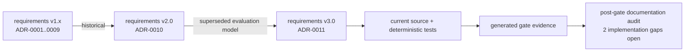

# StudyReport Evaluator 開発・保守ドキュメント

対象読者は開発者、アーキテクト、QA、リリース担当です。利用者向け文書は[`docs/`](../docs/README.md)を参照してください。

## 現行正本

| 文書 | Persona | 内容 |
|---|---|---|
| [実装状態](implementation-status.md) | 開発、QA、リリース | 現在の実装済みsurface、生成gate、post-gate既知差分 |
| [アーキテクチャ](architecture.md) | 開発、アーキテクト | dependency、run、Copilot、UI、output data flow |
| [Excel / formula契約](excel-contract.md) | 開発、Excel監査、QA | sheet、formula、blank、preflight、atomic commit |
| [Traceability](traceability.md) | QA、リリース | AC / TR / implementation / test / gate対応 |
| [要求定義書](../docs/requirements-definition.md) | 要求所有者、QA | GATE-0でexact-byte固定したv3.0規範baseline。current statusではない |
| [ADR-0011](adr/0011-dynamic-quantification-excel-formulas.md) | アーキテクト | 現行scope decision |
| [Screenshot manifest](../images/README.md) | UI開発、QA、利用者支援 | 7枚のproduction view renderと合成fixture provenance |

## 履歴文書

ADR-0011は、ADR-0001〜0010と旧baseline／preflightを履歴として保持し、現行GATE-0や機能契約へ使用しないと定めています。[ADR-0011のsupersession](adr/0011-dynamic-quantification-excel-formulas.md#supersession-semantics)

次の文書は設計経緯・当時の証拠としてのみ参照します。

- `adr/0001-*`〜`adr/0010-*`
- `preflight/document-pipeline.md`
- `preflight/fixture-plan.md`
- `preflight/governance-inputs.md`
- `preflight/report-definition-contract.md`
- `release/p1-disposition.md`

個別文書内の「承認済み」「BLOCKED」「初回正式版」は、その旧scope・記録日時点の状態です。現行実装状態へ読み替えません。

## Gate-time snapshot

- `preflight/gate-result.md`はGATE-0時点のsnapshotです。
- `preflight/requirements-baseline.md`はB-03時点のbaseline identityです。
- `preflight/implementation-task-file-map.md`はtask所有pathの記録です。「future」「pending」は当時の進捗であり、現在状態ではありません。
- `preflight/sample-workbook-profile.md`は現行sampleのread-only構造profileとして有効です。

## Source of truthの優先順位

1. current production source
2. current deterministic tests
3. current requirements v3.0 / ADR-0011
4. generated ignored gate・performance・package evidence
5. historical ADR・preflight

`artifacts/`は再実行で変化し、Gitへcommitされないため、永続するrelease noteの代わりにはなりません。根拠: [`traceability.md`](traceability.md#evidence-integrity-and-storage)。

`docs/requirements-definition.md`は同一v3.0のidentityを維持するため本文を更新せず、実装後のstatusと差分を`implementation-status.md`へ分離します。

historical fileへ追加した先頭bannerはpost-gate navigation metadataです。本文内のbytes / SHA-256 / commit identityは、明記されたhistorical content commitのbytesを指し、banner追加後のworking-tree bytesを指しません。

## Pinned toolchain

| Item | Pinned value | Source |
|---|---:|---|
| .NET SDK | 10.0.400、latestPatch | [`global.json`](../global.json) |
| Target framework | `net10.0` | [`Directory.Build.props`](../Directory.Build.props) |
| Avalonia | 12.1.1 | [`Directory.Packages.props`](../Directory.Packages.props) |
| DocumentFormat.OpenXml | 3.5.1 | [`Directory.Packages.props`](../Directory.Packages.props) |
| GitHub.Copilot.SDK | 1.0.11 | [`Directory.Packages.props`](../Directory.Packages.props) |

## External specifications

- Excel limits: Microsoft [Excel specifications and limits](https://support.microsoft.com/office/excel-specifications-and-limits-1672b34d-7043-467e-8e27-269d656771c3)（2026-09-01確認）
- Open XML formula / cached value: Microsoft [Working with formulas](https://learn.microsoft.com/office/open-xml/spreadsheet/working-with-formulas)（2026-09-01確認）
- .NET self-contained deployment: Microsoft [.NET application publishing overview](https://learn.microsoft.com/dotnet/core/deploying/#publish-as-self-contained)（2026-09-01確認）
