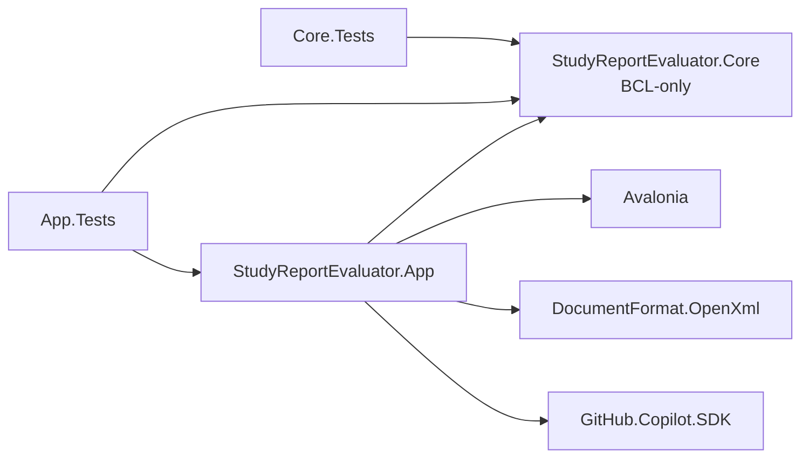
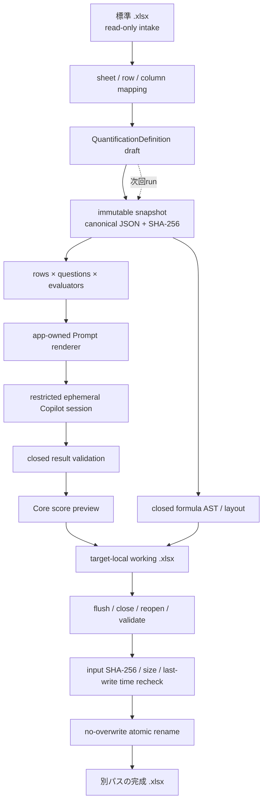

# StudyReport Evaluator アーキテクチャ

## 1. 構成と依存方向

初版の production project は正確に2件、test project は正確に2件です。追加の Application / Infrastructure / Platform project や、独立した E2E project は設けません。

| 種別 | Project | 責務 | 直接依存 |
|---|---|---|---|
| production | `src/StudyReportEvaluator.Core/` | definition、immutable snapshot、Prompt rendering、result validation、scoring、formula AST | BCL-only |
| production | `src/StudyReportEvaluator.App/` | Avalonia UI、Open XML workbook adapter、GitHub Copilot adapter、workflow、composition root | Core、Avalonia、DocumentFormat.OpenXml、GitHub.Copilot.SDK |
| test | `tests/StudyReportEvaluator.Core.Tests/` | Core unit / contract / formula golden tests | Core |
| test | `tests/StudyReportEvaluator.App.Tests/` | adapter、UI、integration、E2E、publish / package、documentation tests | Core、App |

Core は Avalonia、Open XML、Copilot SDK を参照しません。外部frameworkとI/Oは App 側のadapterに閉じ、依存方向を App → Core の一方向にします。

## 2. run のデータフロー

利用者が編集するdefinitionはdraftです。実行開始時に ordered collection をdeep copyし、canonical JSONとSHA-256を持つ **immutable snapshot** を作ります。同じsnapshotだけをrun plan、Prompt、期待schema、result validation、formula layout、Config / Run metadataへ渡します。実行中のdraft編集は次のrunにだけ反映されます。

## 3. Prompt・result・capability 境界

- Knowledge evaluator は app-owned の semantic coverage instruction を使い、単語一致ではなく説明・関係・具体的適用を評価します。Custom evaluator は利用者templateを使いますが、app-owned structured-output contract は外せません。
- 1回の評価単位は1行 × 1質問 × 1evaluatorです。選択済みの同じ行の主回答と補助列だけをPromptへ入れ、他行、非選択列、file pathは渡しません。
- AIへ要求するのは、期待するevaluator IDと各criterionのraw score、短いreason、連続substringのevidence、source kind、stable source column IDだけです。weight、evaluator / question / overall aggregate、合否は要求しません。
- expected ID、全criterion、range、evidence provenanceをclosed schemaとCore validatorで確認します。partial result、unknown field、duplicate、range外を部分採用せず、0点にも変換しません。
- evaluatorごとにrestricted ephemeral sessionを作り、公開toolは `submit_quantification` 1件だけです。shell、filesystem、GitHub write、MCP、ambient memoryやremote sessionを公開せず、permission requestを拒否します。
- schema failureは最大1回、transient network / timeoutは最大2回だけ新sessionでretryします。各attemptは既定120秒、並列度は既定1・最大3です。cancel後に新規dispatchせず、sessionをabort / dispose / deleteします。
- logはevent codeとsafe dimensionだけを保持し、回答、Prompt、reason、evidence、token、credentialを記録しません。

## 4. workbook 境界

Open XML adapterは入力をread-onlyで識別し、出力先directory内の一意な **target-local** temp `.xlsx` へbyte-copyします。Config、Results、Run sheetと式を書いた後、flush、close、reopen、formula / cached value / referenceを検証し、入力のSHA-256・size・last-write timeが開始時と完全一致することを再確認します。

final pathは入力と異なる `.xlsx` に限り、既存fileを上書きしません。完成状態への遷移は同一volumeのno-overwrite atomic renameだけです。commit前のcancelまたは検証失敗では完成名を作らずtempをbest effortで削除し、rename critical section開始後はvalid finalまたはfinalなしの安全点までcancelを遅延します。

formulaはCoreのclosed ASTから生成し、Configの検証済みcellだけを参照します。回答、Prompt、reason、evidenceなどのuntrusted textはinline string cellとして保存し、formulaとして解釈させません。詳細は [Excel / formula 契約](excel-contract.md) を参照してください。

## 5. UI と warning

Avalonia shellは **入力 → 定量化設計 → 実行 → 結果・出力** の4 stepです。keyboard navigation、文字による状態表現、200% scale時のscrollをrequired UI testで確認します。

> AIによる定量値には誤りや偏りが含まれる可能性があります。利用目的に応じて結果を確認してください。

warningはpersistent non-modal bannerであり **nonblocking** です。Focusable / tab stop / hit testの対象にせず、checkbox、dismiss、同意、承認、role、期限、snapshot fieldを持ちません。warningへ一度も操作しなくてもmapping、run、cancel、override、exportを行えます。file形式、range、formula、output pathなどの技術的validationは別のblocking errorとして表示します。

## 6. 永続化とnetwork

app-owned database と cloud backend はありません。definitionとrun provenanceは完成workbookのConfig / Run sheetへ保存します。通常のworkbook読込、preview、出力はlocal I/Oだけで完結し、外部通信はAI実行時に既存Copilot CLIログインを使ってGitHub Copilotへ接続する場合だけです。アプリ固有secretは保存しません。

## 7. tests と gates

required pathはMicrosoft Excel、Office、LibreOffice、COM automationを必要としません。

| Surface | Required evidence |
|---|---|
| Core | definition / snapshot / Prompt / result / scoring / formula unit・golden tests、GATE-CORE `PASS` |
| Excel | sample structural probe、synthetic output reopen、formula / cached oracle、input immutability、atomic fault tests、GATE-EXCEL `PASS` |
| AI | fake authentication / schema / capability / retry / timeout / cleanup tests、GATE-AI `PASS` |
| App | 4-step journey、warning nonblock、keyboard / 200%、cancel / partial output tests、GATE-APP `PASS` |
| Windows delivery | Windows 11 x64 self-contained publish、unsigned ZIP、SHA-256 sidecar、layout / tamper tests、P-01完了時点でsolution tests 443件 `PASS` |

optional live Copilot smoke は `NOT_RUN`、optional external spreadsheet recalculation smoke も `NOT_RUN` です。これらをrequired testのPASSへ読み替えません。
