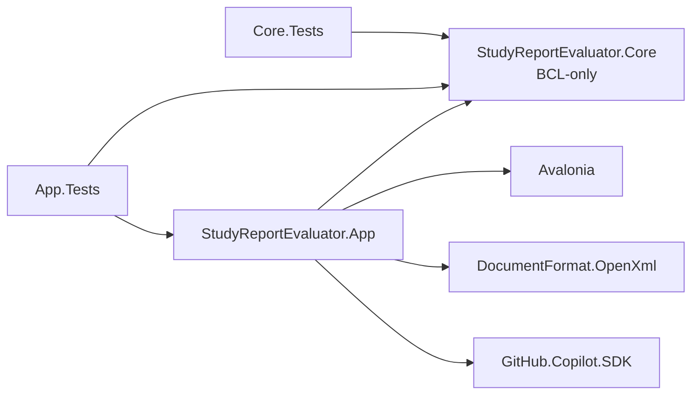
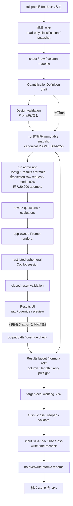
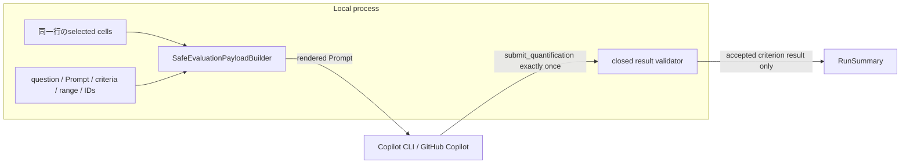
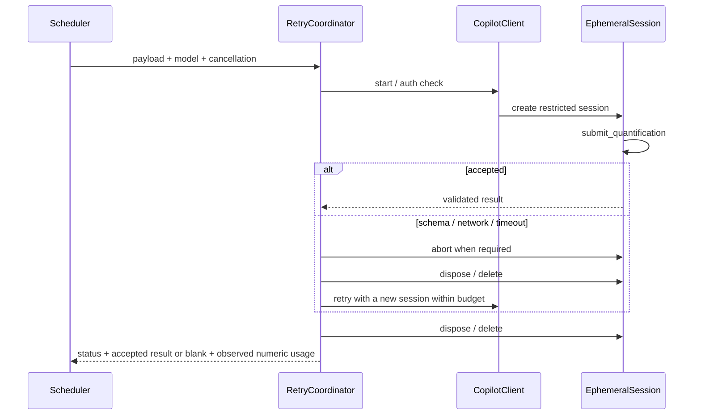

# StudyReport Evaluator アーキテクチャ

| 項目 | 内容 |
|---|---|
| Persona | 開発者、アーキテクト、QA、security reviewer |
| Current scope | requirements v3.0 / ADR-0011 |
| Gap closure implementation | commit `69e4b99` |
| Known implementation gaps | なし（IMPL-GAP-001 / 002はclosed、新acceptance `PASS`） |

旧scopeの構成、署名record、ReportDefinition、cross-platform、mandatory reviewは[`docs-dev/README.md`](README.md)で履歴として分離します。本書はcurrent production sourceだけを説明します。

## 1. 構成と依存方向

初版の production project は正確に2件、test project は正確に2件です。追加の Application / Infrastructure / Platform project や、独立した E2E project は設けません。

| 種別 | Project | 責務 | 直接依存 |
|---|---|---|---|
| production | `src/StudyReportEvaluator.Core/` | definition、immutable snapshot、Prompt rendering、result validation、scoring、formula AST | BCL-only |
| production | `src/StudyReportEvaluator.App/` | Avalonia UI、Open XML workbook adapter、GitHub Copilot adapter、workflow、composition root | Core、Avalonia、DocumentFormat.OpenXml、GitHub.Copilot.SDK |
| test | `tests/StudyReportEvaluator.Core.Tests/` | Core unit / contract / formula golden tests | Core |
| test | `tests/StudyReportEvaluator.App.Tests/` | adapter、UI、integration、E2E、publish / package、documentation tests | Core、App |

Core は Avalonia、Open XML、Copilot SDK を参照しません。外部frameworkとI/Oは App 側のadapterに閉じ、依存方向を App → Core の一方向にします。

## 2. run のデータフロー

利用者が編集するdefinitionはdraftです。実行開始時に ordered collection をdeep copyし、canonical JSONとSHA-256を持つ **immutable snapshot** を作ります。同じsnapshotだけをrun plan、Prompt、期待schema、result validation、formula layout、Config / Run metadataへ渡します。実行中のdraft編集は次のrunにだけ反映されます。

run admissionは、exportと同じResults layout / formula AST / validatorをI/Oなしで実行します。続いて入力identityを取得し、全selected rowの実payload / JSON schemaを測定し、request 65,536 Unicode scalars、SDK model上限の80%、retry込み20,000 attemptsを検査します。合格後に入力identityを再確認してからだけAI dispatchへ進みます。実装根拠: [`WorkbookExecutionPreflight.cs`](../src/StudyReportEvaluator.App/Workbooks/Writing/WorkbookExecutionPreflight.cs)、[`EvaluationRequestCapacityValidator.cs`](../src/StudyReportEvaluator.App/Copilot/EvaluationRequestCapacityValidator.cs)、[`QuantificationOrchestrator.cs`](../src/StudyReportEvaluator.App/Workflow/QuantificationOrchestrator.cs)。

## 3. Prompt・result・capability 境界

- Knowledge evaluator は app-owned の semantic coverage instruction を使い、単語一致ではなく説明・関係・具体的適用を評価します。Custom evaluator は利用者templateを使いますが、app-owned structured-output contract は外せません。
- 1回の評価単位は1行 × 1質問 × 1evaluatorです。**workbook由来の値**は、選択済みの同じ行の主回答と補助列だけをPromptへ入れ、他行、非選択列、file pathは渡しません。
- Promptにはquestion text、criterion ID / display name / description / effective range、CustomまたはKnowledge template、expected IDs、許可source IDs、app-owned output contractも含めます。
- AIへ要求するのは、期待するevaluator IDと各criterionのraw score、短いreason、連続substringのevidence、source kind、stable source column IDだけです。weight、evaluator / question / overall aggregate、合否は要求しません。
- expected ID、全criterion、range、evidence provenanceをclosed schemaとCore validatorで確認します。partial result、unknown field、duplicate、range外を部分採用せず、0点にも変換しません。
- evaluatorごとにrestricted ephemeral sessionを作り、公開toolは `submit_quantification` 1件だけです。shell、filesystem、GitHub write、MCP、ambient memoryやremote sessionを公開せず、permission requestを拒否します。
- schema failureは最大1回、transient network / timeoutは最大2回だけ新sessionでretryします。各attemptは既定120秒、並列度は既定1・最大3です。cancel後に新規dispatchせず、sessionをabort / dispose / deleteします。
- logはevent codeとsafe dimensionだけを保持し、回答、Prompt、reason、evidence、token文字列、credentialを記録しません。SDKが返したnumeric input / output / reasoning / cache token countsはlogではなくRunSummaryへ集計し、観測unit数とともにRun sheetへ保存します。

実装根拠: [`SafeEvaluationPayloadBuilder.cs`](../src/StudyReportEvaluator.Core/Prompting/SafeEvaluationPayloadBuilder.cs#L38-L160)、[`EvaluationSchemaFactory.cs`](../src/StudyReportEvaluator.App/Copilot/EvaluationSchemaFactory.cs#L179-L243)、[`SubmitQuantificationTool.cs`](../src/StudyReportEvaluator.App/Copilot/SubmitQuantificationTool.cs)。

### attempt lifecycle

schema failureは最大2 attempts、network / timeoutは最大3 attemptsです。cleanup失敗時は後続retryを行いません。根拠: [`RetryAndCleanupCoordinator.cs`](../src/StudyReportEvaluator.App/Copilot/RetryAndCleanupCoordinator.cs#L113-L291)。

## 4. workbook 境界

Open XML adapterは入力をread-onlyで識別し、出力先directory内の一意な **target-local** temp `.xlsx` へbyte-copyします。Config、Results、Run sheetと式を書いた後、flush、close、reopen、formula / cached value / referenceを検証し、入力のSHA-256・size・last-write timeが開始時と完全一致することを再確認します。

final pathは入力と異なる `.xlsx` に限り、既存fileを上書きしません。完成状態への遷移は同一volumeのno-overwrite atomic renameだけです。commit前のcancelまたは検証失敗では完成名を作らずtempをbest effortで削除し、rename critical section開始後はvalid finalまたはfinalなしの安全点までcancelを遅延します。

formulaはCoreのclosed ASTから生成し、Configの検証済みcellだけを参照します。回答、Prompt、reason、evidenceなどのuntrusted textはinline string cellとして保存し、formulaとして解釈させません。詳細は [Excel / formula 契約](excel-contract.md) を参照してください。

出力は入力を縮小したcopyではありません。入力全体をbyte-copyし、ConfigにはCustom Prompt、question / criterion text、canonical snapshotも保存します。そのためoutputは入力と同等以上に機密です。根拠: [`WorkingPackage.cs`](../src/StudyReportEvaluator.App/Workbooks/Writing/WorkingPackage.cs#L105-L155)、[`ConfigSheetWriter.cs`](../src/StudyReportEvaluator.App/Workbooks/Writing/ConfigSheetWriter.cs#L129-L249)。

## 5. UI と warning

Avalonia shellは **入力 → 定量化設計 → 実行 → 結果・出力** の4 stepです。keyboard navigation、文字による状態表現、200% scale時のscrollをrequired UI testで確認します。

- 入力とoutputはnative pickerではなくfull pathのTextBoxです。
- Results UIはraw、override、effective、normalized、evaluator、overallを表示します。Reason / Evidence / Question scoreはworkbookだけに出力します。
- Results ViewModelは同じprocessで完了した`ExecutionRunContext`からだけloadします。保存済みoutputの再importはありません。
- reusable definition profileの独立storeはありません。definition snapshotはoutput Configへ保存します。

| 実行準備 | 結果review |
|---|---|
|  |  |

画像はproduction viewのheadless Skia renderです。認証とscoreはfake、inputは合成です。provenance: [`images/README.md`](../images/README.md)。

> AIによる定量値には誤りや偏りが含まれる可能性があります。利用目的に応じて結果を確認してください。

warningはpersistent non-modal bannerであり **nonblocking** です。Focusable / tab stop / hit testの対象にせず、checkbox、dismiss、同意、承認、role、期限、snapshot fieldを持ちません。warningへ一度も操作しなくてもmapping、run、cancel、override、exportを行えます。file形式、range、formula、output pathなどの技術的validationは別のblocking errorとして表示します。

bannerはshell rootにあり、現在は4 stepすべてで表示されます。要求の「入力画面と結果画面を含むpersistent表示」を上回る表示範囲です。根拠: [`MainWindow.axaml`](../src/StudyReportEvaluator.App/Views/MainWindow.axaml#L140-L177)。

## 6. 永続化とnetwork

app-owned database と cloud backend はありません。definitionとrun provenanceは完成workbookのConfig / Run sheetへ保存します。通常のworkbook読込、preview、出力はlocal I/Oだけで完結し、外部通信はAI実行時に既存Copilot CLIログインを使ってGitHub Copilotへ接続する場合だけです。アプリ固有secretは保存しません。

Copilot CLIはpackageへ同梱せず、Windowsでは`PATH`上の`copilot.exe`だけを探索します。SDK clientは`CopilotClientMode.CopilotCli`、`UseLoggedInUser=true`です。根拠: [`CopilotClientFactory.cs`](../src/StudyReportEvaluator.App/Copilot/CopilotClientFactory.cs#L15-L57)、[`CopilotClientFactory.cs`](../src/StudyReportEvaluator.App/Copilot/CopilotClientFactory.cs#L258-L270)。

## 7. validation timing

| Validation | Current timing | Blocking boundary |
|---|---|---|
| file classification / input snapshot | Input load | workbookをadoptしない |
| mapping / structural definition | Input、Execution、snapshot creation | run開始をblock |
| Custom Prompt ownership / syntax | Design、Execution、snapshot creation | run開始をblock。input capture / row read / session / runner 0 |
| empty primary | unit row read後 | AI dispatchせず`EMPTY` |
| AI schema / range / evidence | tool handler + Core validator | payload全体を拒否 |
| override | Results UI + output preparation | exportをblock |
| Config / Results / formula capacity | Execution + orchestrator run admission、export | AI dispatch前にblockし、exportでも同じvalidatorを再実行 |
| request / model context / retry capacity | orchestrator run admission | 全selected row測定後、AI dispatch前にblock |
| package / formula / cached value | temp write後のread-only reopen | final renameをblock |
| input identity | run後およびrename直前 | final renameをblock |

## 8. tests と gates

required pathはMicrosoft Excel、Office、LibreOffice、COM automationを必要としません。

| Surface | Required evidence |
|---|---|
| Core | definition / snapshot / Prompt / result / scoring / formula unit・golden tests、GATE-CORE `PASS` |
| Excel | sample structural probe、synthetic output reopen、formula / cached oracle、input immutability、atomic fault tests、GATE-EXCEL `PASS` |
| AI | fake authentication / schema / capability / retry / timeout / cleanup tests、GATE-AI `PASS` |
| App | 4-step journey、warning nonblock、keyboard / 200%、cancel / partial output tests、GATE-APP `PASS` |
| Windows delivery | Windows 11 x64 self-contained publish、unsigned ZIP、SHA-256 sidecar、layout / tamper tests |
| Historical generated gate | HEAD `62581a3`、solution tests 452/452、GATE-ACCEPTANCE `PASS` |
| Current generated gate | evaluation HEAD `3f4227e`、solution 485/485、independent review blocker/high/medium 0、GATE-ACCEPTANCE `PASS` |

optional live Copilot smokeとoptional Microsoft Excel recalculation smokeは、固定合成データだけで`PASS`しました。generated evidenceはそれぞれ`artifacts/test/live-copilot-smoke.json`と`artifacts/test/external-recalculation-smoke.json`です。どちらもrequired test、実在データ品質、全環境保証へ読み替えません。

旧GATE-ACCEPTANCE後の監査で確認したIMPL-GAP-001 / 002はcommit `69e4b99`でclosedです。旧gate artifactは履歴として不変に保ち、新しいfinal acceptanceを評価HEAD `3f4227e`の別証跡`gate-acceptance-3f4227e.json`へ`PASS`として記録しました。詳細: [`implementation-status.md`](implementation-status.md)。

## 9. 外部仕様出典

- Microsoft [Working with formulas](https://learn.microsoft.com/office/open-xml/spreadsheet/working-with-formulas) — SpreadsheetMLの`CellFormula`とcached `CellValue`（2026-09-01確認）
- Microsoft [Excel specifications and limits](https://support.microsoft.com/office/excel-specifications-and-limits-1672b34d-7043-467e-8e27-269d656771c3) — row / column / cell / formula等の媒体上限（2026-09-01確認）
- Microsoft [.NET application publishing overview](https://learn.microsoft.com/dotnet/core/deploying/#publish-as-self-contained) — self-contained deployment（2026-09-01確認）
