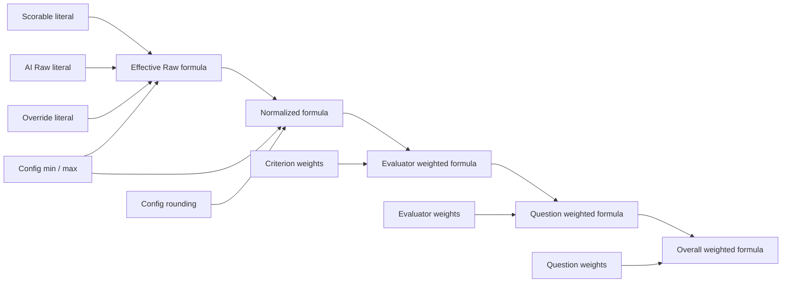
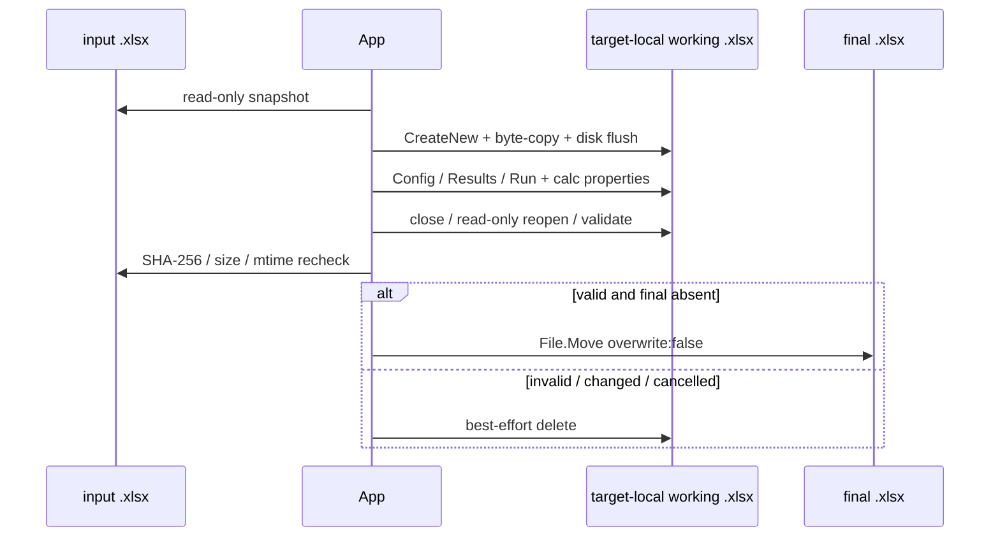

# Excel / formula 契約

| 項目 | 内容 |
|---|---|
| Persona | workbook / formula実装者、Excel監査者、QA |
| Normative baseline | requirements v3.0 / ADR-0011 |
| Current implementation | Config / Results / Run、closed formula AST、cached Core preview、run admission、atomic output |
| Known gap | なし（IMPL-GAP-002はcommit `69e4b99`でclosed、evaluation HEAD `3f4227e`の新acceptance `PASS`） |

## 1. 入出力とapp-owned sheets

入力は標準 `.xlsx` 1ファイルだけです。入力workbookはread-onlyで扱い、元sheetを保持したcopyへ次の3 sheetを追加し、入力とは異なるpathの `.xlsx` として完成させます。

| Base sheet name | 内容 |
|---|---|
| `Quantification_Config` | canonical definition snapshot、質問 / evaluator / criterion、source mapping、enabled、raw weight、effective range、rounding、schema version、definition SHA-256 |
| `Quantification_Results` | 行ごとのliteral結果、override、effective / normalized / aggregate formula、reason、evidence、source、status |
| `Quantification_Run` | input identity、definition hash、app / SDK / CLI / model identity、開始・終了、planned / completed / error件数、観測unit数、input / output / reasoning / cache token数、実際の3 sheet名 |

同名sheetがある場合は既存sheetを変更せず、`Quantification_Config (2)`、`Quantification_Config (3)` のように最小の未使用suffixを割り当てます。suffixを含めて31文字に収まるようbaseを安全に切り詰め、実際の名前をformulaとRun sheetへ記録します。

> [!CAUTION]
> outputは入力の全sheet・全cellを保持するbyte-copyです。さらにConfigへquestion、Custom Prompt、criterion、mappingを、Resultsへreason / evidence等を追加します。匿名化・最小化copyではなく、入力と同等以上に機密なworkbookです。実装根拠: [`WorkingPackage.cs`](../src/StudyReportEvaluator.App/Workbooks/Writing/WorkingPackage.cs#L105-L155)、[`ConfigSheetWriter.cs`](../src/StudyReportEvaluator.App/Workbooks/Writing/ConfigSheetWriter.cs#L129-L249)。

## 2. Config cell reference

Config headerは次の25列です。

`RecordType`, `Path`, `NodeId`, `ParentNodeId`, `DisplayName`, `Revision`, `ContentText`, `PromptTemplate`, `BuiltInTemplateVersion`, `EvaluatorType`, `SourceSheet`, `HeaderRow`, `FirstDataRow`, `LastDataRow`, `PrimarySourceColumn`, `SupportingSourceColumn`, `Enabled`, `RawWeight`, `EffectiveMinimum`, `EffectiveMaximum`, `RoundingDigits`, `SchemaVersion`, `DefinitionSha256`, `ChunkIndex`, `SnapshotChunk`

formulaが参照する主要列は `RawWeight`（R列）、`EffectiveMinimum`（S列）、`EffectiveMaximum`（T列）、`RoundingDigits`（U列）です。question / evaluator / criterionのweight、criterion effective minimum / maximum、root rounding digitsは、Config writerが返した **verified app-owned cell** をabsolute referenceで参照します。rangeやweightをformula textへliteral埋込みしません。canonical JSONは30,000文字以下のchunkへ分けて `ChunkIndex` / `SnapshotChunk` に保存します。

## 3. Resultsのliteral列とformula列

各enabled criterionのprefixは安定した `QuestionId.EvaluatorId.CriterionId` です。

| Suffix | 種別 | 契約 |
|---|---|---|
| `.Scorable` | literal number | 主回答が非空なら1、空なら0 |
| `.AI_Raw` | literal number / blank | validated AI raw。未実行・失敗・cancelはblank |
| `.Override` | literal number / blank | 任意。criterion effective rangeのdata validation付き |
| `.Effective_Raw` | formula | Scorable、Override、AI raw、Config rangeから選択 |
| `.Normalized` | formula | effective rawを0〜100へ正規化 |
| `.Reason` | literal string | AIの短い理由 |
| `.Evidence` | literal string | 同じ行の選択済みsource内の連続substringまたは空文字 |
| `.Evidence_Source` | literal string | `PRIMARY_ANSWER` / `SUPPORTING_COLUMN` / `NONE` |
| `.Evidence_SourceColumn` | literal string | stable source column IDまたは空文字 |
| `.Status` | literal string | `SUCCESS`、`EMPTY`、技術的failure / cancel code |

各enabled evaluatorの末尾へ `.Evaluator_Score`、各enabled questionの末尾へ `.Question_Score`、行の末尾へ `Overall_Score` のformula列を追加します。disabled nodeと子孫はResults列、AI dispatch、COUNT、分子、分母から除外します。

Results UIはこの全列を表示しません。Reason、Evidence、Evidence source、Question scoreはoutput workbookで確認します。画面／workbook差分は[利用者向け機能リファレンス](../docs/features.md#画面とworkbookの項目差)を参照してください。

## 4. effective raw とblank / override semantics

criterion $c$ のeffective rangeを $[min_c,max_c]$ とすると、effective rawは次です。

$$
R_{effective}=\begin{cases}
R_{override} & \text{主回答が非空で、overrideがrange内の数値}\\
R_{AI} & \text{主回答が非空、overrideが空で、AI rawがrange内の数値}\\
\mathrm{blank} & \text{それ以外}
\end{cases}
$$

基準となるformula shapeは次です。

```text
=IF(ScorableCell<>1,"",IF(OverrideCell="",IF(ISNUMBER(AiRawCell),IF(AiRawCell<MinCell,"",IF(AiRawCell>MaxCell,"",AiRawCell)),""),IF(ISNUMBER(OverrideCell),IF(OverrideCell<MinCell,"",IF(OverrideCell>MaxCell,"",OverrideCell)),"")))
```

- 空の主回答は `Scorable=0` とし、AIへ送らず、overrideも受け付けず、AI raw / effective / normalized / ancestorsをblankにします。0点やsentinelへ変換しません。
- 主回答が非空なら、range内のoverrideはAI rawがblankまたはAI失敗でも優先されます。
- overrideが空のときだけ、妥当なAI rawへfallbackします。
- app内で非数値またはrange外のoverrideを入力した場合はfield errorとして出力前に訂正またはclearを要求します。
- 出力後にOverride cellが非空の非数値またはrange外へ変更された場合、formulaはclampせず、AI rawへfallbackせず、effective rawをblankにします。

## 5. normalized と3階層aggregate

criterion normalizationは次です。

$$
N_c=100\times\frac{R_{effective}-min_c}{max_c-min_c}
$$

```text
=IF(ISNUMBER(EffectiveRawCell),IFERROR(ROUND((EffectiveRawCell-MinCell)/(MaxCell-MinCell)*100,RoundingDigitsCell),""),"")
```

evaluator、question、overallは、それぞれenabled childの加重平均です。

$$
E=\frac{\sum_c N_cw_c}{\sum_cw_c},\qquad
Q=\frac{\sum_e E_ew_e}{\sum_ew_e},\qquad
O=\frac{\sum_q Q_qw_q}{\sum_qw_q}
$$

非連続のchild cellも明示的なscore / Config weight pairとして列挙します。基準shapeは次です。

```text
=IF(COUNT(ChildScoreRef1,...)=EnabledChildCount,IFERROR(ROUND(SUM(ChildScoreRef1*ChildWeightRef1,...)/SUM(ChildWeightRef1,...),RoundingDigitsCell),""),"")
```

1件でもenabled child scoreがblankなら、その親とすべてのancestorもblankです。blankを算術0として扱いません。normalized、evaluator、question、overallの各階層で丸め、親は丸め済みのchild formula cellを入力にします。

Core previewは `decimal` と `MidpointRounding.AwayFromZero` を使い、Excel `ROUND` のmidpoint away-from-zeroへ合わせます。rounding digitsは0〜6です。formula cellには式と同時にCore previewの最終丸め値を **cached value** として書き、workbookをautomatic / force full calculation / full calculation on loadに設定します。



実装根拠: [`FormulaExpression.cs`](../src/StudyReportEvaluator.Core/Formulas/FormulaExpression.cs#L85-L173)、[`ResultsSheetWriter.cs`](../src/StudyReportEvaluator.App/Workbooks/Writing/ResultsSheetWriter.cs#L838-L920)。

## 6. formula allowlist とpreflight

formulaはraw textを組み立てず、closed formula ASTからserializeします。function allowlistは正確に `IF`, `IFERROR`, `ISNUMBER`, `COUNT`, `SUM`, `SUMPRODUCT`, `ROUND` です。operatorは比較と四則演算、operandは数値、blank、app-owned sheetのverified cell / rangeだけです。

write前のpreflightで次を検証します。

- formula lengthは最大8,191文字。8,192文字以上は切り詰めず拒否。
- 1 functionは最大255 arguments。
- Excel columnは最大16,384、rowは最大1,048,576、sheet nameは最大31文字。
- 参照先は実際に割り当てたapp-owned sheetとverified cell / rangeだけ。
- formula targetの重複がなく、依存graphがacyclic DAGであること。
- 失敗時はquestion / evaluator / criterionのsafe ID、display name、field、実測dimensionを返し、回答やPrompt本文をerrorへ含めないこと。

external workbook reference、defined name、DDE、macro、raw user formula、未検証cell、循環参照は許可しません。

### Current timing

同じpreflightを**AI run開始前**と**export時**の2段階で実行します。

- `ConfigSheetWriter.CreateAddressMap`はsnapshotから実Config row/address配置をI/Oなしで構築し、実writerと同じ参照mapになることをtestします。
- `ResultsSheetWriter.Preflight`は実際のsheet名、Config address、最終source rowを使ってResults layoutとformula ASTを構築します。
- run admissionとexportは同じ`FormulaExpressions` / `FormulaPreflightValidator`を共有するため、formula length、function arguments、reference、DAGの判定を二重実装しません。
- 全selected rowのPrompt / schema / tool contractをAI dispatch前に測定し、65,536 Unicode scalarsとSDK model prompt/context上限の80%を検査します。保守的UTF-8 byte dimensionを実model token数とは表記しません。
- evaluation units × 最大3 attemptsは20,000以下を要求し、上限超過を切り詰めません。

input snapshot取得後にrequest preflightを行う必要があるため、完了直後にSHA-256 / size / last-write timeを再確認し、一致した場合だけAI dispatchします。export時の検証は最終防御として維持します。

実装根拠: [`WorkbookExecutionPreflight.cs`](../src/StudyReportEvaluator.App/Workbooks/Writing/WorkbookExecutionPreflight.cs)、[`ResultsSheetWriter.cs`](../src/StudyReportEvaluator.App/Workbooks/Writing/ResultsSheetWriter.cs)、[`FormulaPreflightValidator.cs`](../src/StudyReportEvaluator.Core/Formulas/FormulaPreflightValidator.cs)、[`EvaluationRequestCapacityValidator.cs`](../src/StudyReportEvaluator.App/Copilot/EvaluationRequestCapacityValidator.cs)。

## 7. string / formula injection 防止

回答、Prompt、reason、evidence、source ID、status、display nameなどのuntrusted textはOpen XMLのinline string cellとして保存します。先頭が `=`, `+`, `-`, `@` でもformula cellへ昇格させません。1 string cellは32,767文字以下とし、超過時は内容をerrorへechoせずwrite前に拒否します。

formula cellはapp-owned ASTからだけ生成し、Config / Resultsのverified referenceだけを使います。overrideはapp側で有限数とrangeを検証し、Resultsのdata validationに加えてformula自身でもrangeを再検査します。

## 8. atomic commit


1. final pathが入力と異なる標準 `.xlsx` で、既存fileではないことを確認します。
2. final pathと同じdirectory / volumeに一意な **target-local** working `.xlsx` を `CreateNew` し、入力をcopyしてdiskへflushします。
3. Config / Results / Runとcalculation propertiesを書き、closeします。
4. working fileをreopenし、package、sheet、formula AST / reference、cached value、元sheet preservationを検証します。
5. 元入力のSHA-256、size、last-write timeを開始時snapshotと完全一致で再確認します。drift時は `INPUT_CHANGED` で完成名を作りません。
6. final pathが依然存在しないことを守り、同一volumeの **no-overwrite atomic rename** だけでcommitします。

rename critical sectionより前のcancel、validation failure、I/O failureでは完成名を作らず、tempをbest effortで削除します。critical section開始後のcancelはvalid finalまたはfinalなしの安全点まで遅延します。既存finalを黙って上書きしません。



実装根拠: [`AtomicOutputCommitter.cs`](../src/StudyReportEvaluator.App/Workbooks/Writing/AtomicOutputCommitter.cs#L105-L243)。

## 9. Office-independent required path

required のread、write、preview、reopen validation、formula / cached oracle、atomic fault testsにはMicrosoft Excel、Office、LibreOffice、COM automationを使用しません。登録済みMicrosoft Excelによる固定合成workbookの再計算はadvisoryなoptional smokeとして`PASS`しました。EffectiveRaw 5、Normalized / Evaluator / Question / Overall 50を保存後にOpen XMLで再読しましたが、required oracleや全環境保証を代替しません。

Open XMLではformula textは`CellFormula`、cached valueは`CellValue`へ保存されます。外部仕様: Microsoft [Working with formulas](https://learn.microsoft.com/office/open-xml/spreadsheet/working-with-formulas)（2026-09-01確認）。本アプリのcached valueはCore previewであり、外部spreadsheetが再計算した値という意味ではありません。

## 10. 媒体上限と出典

| Limit | Current application contract | Source |
|---|---:|---|
| worksheet row | 1,048,576 | [`QuantificationDefinitionValidator.cs`](../src/StudyReportEvaluator.Core/Validation/QuantificationDefinitionValidator.cs#L35-L38) |
| worksheet column | 16,384 | 同上 |
| string cell | 32,767 characters | [`UntrustedStringCellWriter.cs`](../src/StudyReportEvaluator.App/Workbooks/Writing/UntrustedStringCellWriter.cs#L8-L25) |
| formula | 8,191 characters以下 | [`FormulaPreflightValidator.cs`](../src/StudyReportEvaluator.Core/Formulas/FormulaPreflightValidator.cs#L61-L69) |
| function arguments | 255以下 | 同上 |
| sheet name | 31 characters以下 | 同上 |
| app-owned request | 65,536 Unicode scalars以下 | [`EvaluationRequestCapacityValidator.cs`](../src/StudyReportEvaluator.App/Copilot/EvaluationRequestCapacityValidator.cs) |
| model context admission | SDK prompt/context上限の80%以下（保守的UTF-8 dimension） | 同上 |
| worst-case attempts / run | 20,000以下 | 同上 |

Excel媒体上限の外部正本: Microsoft [Excel specifications and limits](https://support.microsoft.com/office/excel-specifications-and-limits-1672b34d-7043-467e-8e27-269d656771c3)（2026-09-01確認）。application contractは外部上限以下へさらに制限する場合があります。

画面画像の生成条件と非保証範囲は[`images/README.md`](../images/README.md)を参照してください。
