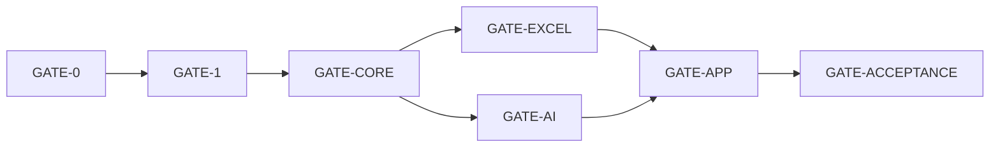

# Requirement traceability — dynamic Excel quantification

| 項目 | 値 |
|---|---|
| Task | B-04 |
| Requirement baseline | `docs/requirements-definition.md` v3.0 |
| Plan | `work/20260831-implementation-plan.md` v4.0 |
| Scope ADR | ADR-0011 |
| Exact path map | 37 task/gate rows |
| Acceptance criteria tracked | 15 |
| Test requirements tracked | 15 |
| Mandatory requirement surfaces tracked | 18 |
| Initial platform | Windows 11 x64 |
| Required runtime input | standard response `.xlsx` 1 file |
| Production implementation | **NOT STARTED — current GATE-0 pending** |
| Supersedes | requirement v2.0 / plan v3.0 traceability |
| Record date | 2026-09-01 |

## Status vocabulary

| Status | Meaning |
|---|---|
| `BASELINE_COMPLETE` | Current requirement、plan、ADR、sample profile、baseline、path ownership are committed and verified。 |
| `PLANNED` | Exact production/test owner paths exist, but behavior has not been implemented or proven。 |
| `PENDING_GATE` | Work or evidence is prohibited until its direct prerequisite gate passes。It is not PASS。 |
| `NOT_REQUIRED` | A former external input/feature is outside initial scope; its existence or approval is not claimed。 |
| `PROHIBITED_BY_CURRENT_SCOPE` | Old behavior directly contradicts current requirement and must not be implemented。 |
| `OPTIONAL_ADVISORY` | Evidence may PASS/SKIP/NOT_RUN/FAIL visibly, but never substitutes for required evidence。 |

A mapping is not implementation evidence。Every production row remains `PLANNED`／`PENDING_GATE` until its owner task, required tests, and phase gate pass。

## Current baseline evidence

| Task | Result | Evidence | Commit | SHA-256 / boundary |
|---|---|---|---|---|
| B-01 | COMPLETE | requirement v3.0 | `adc6ad12a3c80b4a92c9453d8b7a58e2daeb346f` | `ACB7E1C524E1628C48AC2669B5B2FC730B3EF7EED96723D02F1B5AA6B6264C03` |
| B-01 | COMPLETE | plan v4.0 | `adc6ad12a3c80b4a92c9453d8b7a58e2daeb346f` | `F63D0E1A9AAABFA4C0F2C0A0F032AFE5F5674A64B76723F82D68000A7A506BCD` |
| B-02 | COMPLETE | ADR-0011 | `502b48898411ca247543143773be8a3ee28ea7e5` | `33A678396FFC9BFB7B5726B34B1874ADC9868C97E9C6EAA3E94FFB0F9C14CC65` |
| B-02 | COMPLETE | sample structural profile | `502b48898411ca247543143773be8a3ee28ea7e5` | `A0BA407B55A59363649FE3CEB001B7219838B2F216D8B74FF7E74B9A3B17A2C1` |
| B-03 | COMPLETE | requirements baseline | `da8ced2f3ff78f7d3c1d7ed0c95c8de359bcbaab` | `0EC8C1591195ECE3A5DF880CC553C0831383B2309D1D867A9BF4911700515CBE` |
| B-03 | COMPLETE | 37-row exact path map | `da8ced2f3ff78f7d3c1d7ed0c95c8de359bcbaab` | `A2A9BD9A9E8E6026AAF89E3889D6A48192AF83056C294579706FD9BBB3AFD68C` |
| B-04 | THIS RECORD | `docs-dev/traceability.md` | pending | mappings do not satisfy production tests |

## Acceptance criteria mapping

| Requirement | Implementation owners | Required test/evidence owners | Gate | Current result |
|---|---|---|---|---|
| AC-001 — one standard `.xlsx`; immutable input; separate output | X-01、X-03、X-05、U-03、U-04 | X-01/X-03/X-05 tests、E-01、E-02 | GATE-EXCEL → GATE-APP → GATE-ACCEPTANCE | BASELINE_COMPLETE; implementation PLANNED |
| AC-002 — sample `Original!A1:L531` and F/G/H/I/J/K/L role suggestions | B-02、X-01、X-02、U-03 | sample profile、X-01/X-02 tests、E-02 | GATE-EXCEL → GATE-APP → GATE-ACCEPTANCE | profile BASELINE_COMPLETE; app PLANNED |
| AC-003 — dynamic question add/copy/reorder/disable/delete | C-01、C-02、U-03 | C-01/C-02 tests、U-03 tests、E-01 | GATE-CORE → GATE-APP → GATE-ACCEPTANCE | PLANNED |
| AC-004 — dynamic Knowledge/Custom evaluators、criteria、range、weight | C-01、C-02、C-03、U-03 | C-01〜C-03 tests、U-03 tests、E-01 | GATE-CORE → GATE-APP → GATE-ACCEPTANCE | PLANNED |
| AC-005 — Knowledge semantic inclusion, not keyword count | C-03、A-02、U-03 | built-in Prompt/schema/UI tests、E-01 fake transport | GATE-CORE → GATE-AI → GATE-APP | PLANNED; live quality claim not made |
| AC-006 — Custom Prompt quantifies arbitrary selected primary including student Prompt | C-01、C-03、X-02、A-02、U-03 | C-01/C-03/X-02/A-02/U-03 tests、E-01 | GATE-CORE/GATE-EXCEL/GATE-AI → GATE-APP | PLANNED |
| AC-007 — AI returns criterion raw only, no aggregate | C-04、A-02、A-03、X-04 | C-04/A-02/A-03/X-04 contract tests | GATE-CORE/GATE-AI/GATE-EXCEL | PLANNED |
| AC-008 — app-set 3-level weights; Config-referenced 0〜100 formulas | C-01、C-05、X-03、X-04、U-03、U-04 | C-05 oracle/formula tests、X-03/X-04 tests、E-01 | GATE-CORE → GATE-EXCEL → GATE-APP | PLANNED |
| AC-009 — nonempty primary valid override wins; empty override uses valid AI | C-05、X-04、U-01、U-04 | C-05 hand oracles、X-04/U-04 override tests、U-01 run-snapshot range test、E-01 | GATE-CORE → GATE-EXCEL → GATE-APP | PLANNED |
| AC-010 — Config/Results/Run sheets and atomic separate output | X-03、X-04、X-05、U-04 | X-03〜X-05 tests、E-01、E-02 | GATE-EXCEL → GATE-APP → GATE-ACCEPTANCE | PLANNED |
| AC-011 — empty primary is always blank; failed/cancelled stays blank unless a nonempty primary has valid override | C-04、C-05、A-03、X-04、U-01、U-04 | C-04/C-05/A-03/X-04/U-01/U-04 tests、E-01 | GATE-CORE/GATE-AI/GATE-EXCEL → GATE-APP | PLANNED; no zero conversion |
| AC-012 — persistent non-modal warning is display-only and nonblocking | U-02、U-03、U-04 | EthicsWarningTests、MainWindowTests、PrimaryJourneyAccessibilityTests、E-01 | GATE-APP → GATE-ACCEPTANCE | PLANNED; acknowledgment state prohibited |
| AC-013 — selected same-row sources only; no body/token logging | C-03、C-04、A-02、A-03、U-01 | SafeEvaluationPayloadBuilderTests→QuantificationResultValidatorTests source-map roundtrip、CapabilityBoundaryTests、SafeLoggerCanaryTests、E-02 | GATE-CORE/GATE-AI → GATE-APP/GATE-ACCEPTANCE | PLANNED |
| AC-014 — existing Copilot CLI login; no app client ID/secret/policy | A-01、U-04 | A-01 auth/factory tests、A-03 capability test、optional synthetic live smoke | GATE-AI → GATE-APP | PLANNED; live smoke OPTIONAL_ADVISORY |
| AC-015 — Windows x64 build/tests/E2E/self-contained package | F-01〜F-03、E-01、E-02、P-01、D-01 | GATE-1、F-03 regressions at every later gate、E-01/E-02、P-01 package test、documentation test | GATE-1 → GATE-ACCEPTANCE | PLANNED |

## Mandatory requirement surfaces

| Requirement surface | Implementation owners | Verification owners | Current result |
|---|---|---|---|
| Standard `.xlsx` classification and read-only snapshot | X-01 | FileFormatClassifier/InputSnapshot tests、E-02 | PLANNED |
| Arbitrary sheet/header/data rows and primary/support mapping | C-01、C-02、X-01、X-02、U-03 | definition/mapping/UI tests、E-01/E-02 | PLANNED |
| Ordered dynamic hierarchy and enabled minima | C-01、C-02、U-03 | domain/validator/UI matrix tests | PLANNED |
| Immutable canonical run snapshot and draft isolation | C-02、U-01 | snapshot/serializer/orchestrator tests including mid-run range/weight/enabled/mapping changes | PLANNED |
| Knowledge app-owned semantic instruction | C-03、A-02 | prompt/schema tests、fake-transport E2E | PLANNED |
| Custom Prompt six placeholders and opaque insertion | C-03 | renderer/safe-payload tests | PLANNED |
| Closed AI criterion result and same-row evidence binding | C-04、A-02 | result/schema/tool tests | PLANNED |
| Three-level weights and rounded-child aggregate | C-05、X-03、X-04 | independent hand oracle、golden formula、writer tests | PLANNED |
| Scorable/blank/override semantics | C-05、X-04、U-04 | Core formula oracle、post-export edit、UI field tests | PLANNED |
| Formula allowlist/ref/DAG/length/function/column preflight | C-05、X-05 | preflight validator/output validator tests | PLANNED |
| Cached preview and Office-independent required tests | C-05、X-03、X-04 | hand oracle/cached-value/reopen tests | PLANNED; external recalc OPTIONAL_ADVISORY |
| Unique Config/Results/Run sheets and preserved originals | X-03、X-04 | sheet collision/preservation/formula-reference tests | PLANNED |
| Target-local temp、reopen validation、input recheck、atomic rename | X-01、X-03、X-05 | output fault and input-drift tests、E-02 | PLANNED |
| Existing CLI auth、ephemeral session、timeout/retry/cancel/cleanup | A-01〜A-03、U-01 | fake transport lifecycle tests、optional live smoke | PLANNED |
| Selected-source capability and no-content logging | C-03、C-04、A-02、A-03 | source-ID-to-same-row-cell roundtrip、capability、logger canary、hostile E2E | PLANNED |
| Persistent warning with zero processing dependency | U-02〜U-04 | warning/focus/journey tests | PLANNED |
| Four-step keyboard/focus/200% UI and dynamic editor | U-02〜U-04 | UI/accessibility tests、E-01 | PLANNED |
| Limits、Windows E2E、publish/package、documentation | C-02、C-05、E-02、P-01、D-01 | boundary tests、Windows local test、package/docs contract | PLANNED |

## Test requirement mapping

| Requirement test | Primary owners | Required gate/evidence |
|---|---|---|
| TR-01 sample identity/sheet/dimension/header-role suggestions | B-02、X-01、X-02、E-02 | GATE-EXCEL; E-02 structural PASS |
| TR-02 dynamic 1/2/10 questions、1/2/5 evaluators、1/4/20 criteria | C-01、C-02、C-06、U-03 | GATE-CORE; GATE-APP |
| TR-03 Knowledge points/semantic instruction/schema | C-03、A-02 | GATE-CORE; GATE-AI |
| TR-04 Custom arbitrary primary/Prompt/brace/supporting | C-01、C-03、X-02、A-02 | GATE-CORE/GATE-EXCEL/GATE-AI |
| TR-05 range/weight/override/blank/midpoint hand calculation | C-02、C-05、X-04 | GATE-CORE; GATE-EXCEL |
| TR-06 criterion→evaluator→question→overall formula/cached/blank | C-05、X-03、X-04 | GATE-CORE; GATE-EXCEL |
| TR-07 empty/invalid AI/auth/network/cancel/input/output failures | C-04、A-01、A-03、X-05、U-01 | relevant lane gates; GATE-APP |
| TR-08 formula injection/external/cycle/formula/cell limits | C-05、X-01、X-04、X-05 | GATE-CORE; GATE-EXCEL |
| TR-09 input identity/copy preservation/atomic faults | X-01、X-03、X-05 | GATE-EXCEL; E-02 |
| TR-10 selected source/evidence/row isolation/no-content/capability | C-03、C-04、A-02、A-03 | GATE-CORE; GATE-AI; E-02 |
| TR-11 warning visible and nonblocking | U-02〜U-04 | GATE-APP; E-01 |
| TR-12 existing login/timeout/Office independence/optional smoke | A-01、A-03、C-05、X-04 | GATE-AI/GATE-EXCEL; advisory status separately |
| TR-13 four-step keyboard/focus/200% UI | U-02〜U-04 | GATE-APP |
| TR-14 fixed-seed sample-like 531-row synthetic E2E | C-06、E-01 | GATE-CORE; GATE-ACCEPTANCE |
| TR-15 Windows x64 publish/package/documentation | E-02、P-01、D-01 | GATE-ACCEPTANCE |

## Prohibited or non-required former behavior

| Former surface | Current disposition | Enforcement owner |
|---|---|---|
| AI candidate waits for mandatory human adoption before calculation | PROHIBITED_BY_CURRENT_SCOPE | C-05/X-04/U-04 tests require valid AI direct use when override blank |
| Ethics consent/checkbox/approval/role/expiry gate | PROHIBITED_BY_CURRENT_SCOPE | U-02 warning tests and GATE-APP negative checks |
| Send-preview confirmation required before AI dispatch | PROHIBITED_BY_CURRENT_SCOPE | U-01/U-04 journey has no confirmation dependency |
| Fixed two-question/fixed report-vs-Prompt candidate model | PROHIBITED_BY_CURRENT_SCOPE | C-01/U-03 dynamic matrix tests |
| Invalid nonempty override silently falls back to AI | PROHIBITED_BY_CURRENT_SCOPE | C-05/X-04 invalid-override tests |
| Empty primary can be scored by override | PROHIBITED_BY_CURRENT_SCOPE | C-05/X-04/U-04 Scorable tests |
| Excel/Office/LibreOffice/COM required runtime/test | PROHIBITED_BY_CURRENT_SCOPE | F-03 architecture/dependency tests; GATE-EXCEL |
| Managed OAuth app/org policy/legal/education approval | NOT_REQUIRED | no implementation owner in initial map |
| macOS/Linux/Arm64/signing/notarization | NOT_REQUIRED | D-01 prevents unsupported claims |
| Repeated stochastic evaluation/majority/median | NOT_REQUIRED | no implementation owner in initial map |

`NOT_REQUIRED` does not mean provided、approved、verified、or universally unnecessary。Future inclusion requires a new requirement、owner、test、and gate update。

## Gate chain

- All production mappings are `PENDING_GATE` until current GATE-0 passes。
- A phase gate requires every listed prerequisite task and required test to PASS。
- Every gate after GATE-1 reruns F-03 architecture/supply-chain tests so later code cannot invalidate foundation boundaries。
- `NOT_RUN` or `SKIPPED` is never required PASS。
- Authenticated Copilot and external spreadsheet smoke are explicitly `OPTIONAL_ADVISORY`; their status remains visible and cannot satisfy required fake/oracle tests。

## Current disposition

- B-01 requirement v3.0／plan v4.0: committed and verified。
- B-02 ADR-0011／sample structural profile: committed and verified。
- B-03 current baseline／37-row exact path map: committed and independently reviewed with unresolved blocker/high 0。
- All 15 acceptance criteria、18 mandatory surfaces、15 test requirements have planned implementation and verification owners。
- Production `src/` remains absent or contains zero files。
- This B-04 record does not prove implementation or authorize source creation。
- Next action is current GATE-0 evaluation。`docs-dev/preflight/gate-result.md` must exist with the current requirement/plan identities and `PASS`; only that recorded PASS authorizes F-01 and successors。
