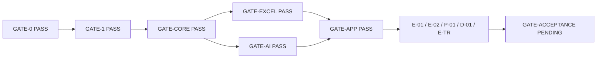

# Requirement traceability — final required evidence

| 項目 | 値 |
|---|---|
| Task | E-TR |
| Requirement baseline | `docs/requirements-definition.md` v3.0 |
| Plan | `work/20260831-implementation-plan.md` v4.0 |
| Scope ADR | ADR-0011 |
| Exact path map | 37 task/gate rows |
| Acceptance criteria tracked | 15 |
| Test requirements tracked | 15 |
| Mandatory requirement surfaces tracked | 18 |
| Initial platform | Windows 11 x64 |
| Required runtime input | standard response `.xlsx` 1 file |
| Production projects / test projects | 2 / 2 |
| Current implementation evidence | **REQUIRED_EVIDENCE_COMPLETE** |
| Final gate | **PENDING — GATE-ACCEPTANCE is not recorded by this task** |
| Supersedes | B-04の実装前 `PLANNED` / `PENDING_GATE` progress snapshot |
| Record date | 2026-09-01 |

本書はB-04で割り当てたownerを変更せず、実装前statusだけを、完了したtask、required test、gate、commitへ置換する。B-04時点のmappingはGATE-0のidentity anchorとして履歴上有効だが、現在の実装状況は本E-TRを正本とする。

## Status vocabulary

| Status | Meaning |
|---|---|
| `PASS_REQUIRED` | 実装が存在し、required deterministic testと直接phase gateがPASSしている。 |
| `PASS_REQUIRED_OPTIONAL_NOT_RUN` | Required fake/oracle testはPASS。関連するoptional advisory smokeは明示的に`NOT_RUN`で、required PASSへ算入していない。 |
| `PENDING_FINAL_GATE` | E-TRまでのrequired evidenceは揃ったが、後続のGATE-ACCEPTANCE自体はまだ実行していない。 |
| `PROHIBITED_BY_CURRENT_SCOPE` | 現要求と矛盾する旧behaviorであり、negative testで不在を確認する。 |
| `NOT_REQUIRED` | 初版scope外。提供、承認、検証、普遍的な不要性を意味しない。 |

`PASS_REQUIRED`はAIの教育的妥当性、法的適合性、公平性、または未実行のlive service品質を保証しない。各gateのsolution test件数は、その時点の累積snapshotであり、相互に加算しない。

## Evidence integrity and storage

- 実装とtestのprimary identityはGit commitで固定する。
- `artifacts/test/gate-*.json`、`artifacts/test/reviews/*.json`、performance JSON、package ZIP / sidecarはsession-localのgenerated ignored evidenceである。`git ls-files -- artifacts`は0件であり、commit済みartifactとは表記しない。
- Generated evidenceはsample回答本文、Prompt、AI reason/evidence、token、credentialを含めず、review/gate JSONは`content_data_included: false`を記録する。
- E-02 task reviewは3回測定の中央値3.279264秒、閾値30秒、AI待機除外でPASSを記録した。`performance-windows-x64.json`はrequired performance testの再実行ごとに再測定され得るため、固定baselineではない。同JSONは各測定のUTC時刻、OS / process architecture、logical processor数、.NET runtime、3件のraw測定値を自己記録する。GATE-ACCEPTANCEはその実行時に生成された値を読み、30秒以下であることを評価する。
- Required workbook pathはExcel、Office、LibreOffice、COM automationを使用しない。external recalculationはoptional advisoryとしてだけ扱う。

## Task and gate evidence ledger

### Baseline and foundation

| Task / gate | Result | Commit / evaluation identity | Required evidence |
|---|---|---|---|
| B-01 | PASS | `adc6ad12a3c80b4a92c9453d8b7a58e2daeb346f` | requirement v3.0、plan v4.0 |
| B-02 | PASS | `502b48898411ca247543143773be8a3ee28ea7e5` | ADR-0011、read-only sample profile |
| B-03 | PASS | `da8ced2f3ff78f7d3c1d7ed0c95c8de359bcbaab` | baseline、37-row exact path map |
| B-04 | PASS at baseline | `dfeb25408756c8626f1d2cab0995bed107167415` | planned AC/TR/surface mapping; progress status superseded by E-TR |
| GATE-0 | PASS | record `25e128ba5284784964243535f498af8f84e8e326`; evaluation HEAD `dfeb25408756c8626f1d2cab0995bed107167415` | 8 gate conditions、production source count 0、review blocker/high 0 |
| F-01 | PASS | `fe0976924c13ce44f19fd413a53c79e7a3ca001c` | .NET 10、deterministic、warnings-as-errors、locked restore |
| F-02 | PASS | `6314453d08f1f883af37b1f3782d1a4ba8b0f7c1`; compatibility `641dd426763b65a7e9cb795d526b77a8f8290b3d` | exact 2 production + 2 test topology、Avalonia bootstrap |
| F-03 / GATE-1 | PASS | `f36db24ff314b6c8625036a125823e30b2decadf` | 8/8 tests、locked restore、Release build、architecture/supply-chain、review promotion-safe |

### Core, Excel, AI, and application

| Phase | Result | Task commits | Gate evidence snapshot |
|---|---|---|---|
| C-01〜C-06 | PASS | `1c736346d75a064fd30af8c41f1918c89e98c01f`; `7e895599919c12a3ec6ab187fb304373c2449547`; `be2faf19d54284e5b730b48c34257dfd0497d65b`; `3a5edf27428bf9aefeaf843e798ca61a692e83d4`; `0ffc77c7f45f8bf8f0e37f885f66b61e89d224e3`; `e72ce21aeb8fedbc89c11cb69c3e975e954be03d` | GATE-CORE PASS、122/122、failed 0、skipped 0、review unresolved blocker/high 0 |
| X-01〜X-05 | PASS | `9de8f61e32e6d84ae2215a64fb384546124275ac`; `6dbb82cb189f030761ef09b38fa5c4b01aebf63c`; `d2c635382a28b678a2f690f08dc13037dae47cf1`; `9255f5b76d5c9f7e122350f2e75bd674c6ea394c`; `e0962611e3c0fe75123e80dacd40c12997b6cf61` | GATE-EXCEL PASS、344/344、failed 0、skipped 0、sample/input/formula/atomic evidence、review promotion-safe |
| A-01〜A-03 | PASS | `bf13ee67929878172b80789397f1b524a6f91d09`; `37a89b1b937faeaa7b325ceda1a7f466a5e34384`; `56569e8f2ec95e10d2f8d4f67f7873bf8ed49cb7` | GATE-AI PASS、294/294、failed 0、skipped 0、fake auth/schema/tool/retry/timeout/cleanup、review promotion-safe; live=`NOT_RUN` |
| U-01〜U-04 | PASS | `aabab47aca4cc976644a8a8f8da7aa5467cf6122`; `2a59d263cd7df5203a9d1390daedccd98869718e`; `c80772248110f2a8ca0eef09c905d9360464c4fd` + `414b04d40b53786ceeeca23d540e4247f72fc8bd`; `e955cca533bdc98a543465b4895dbdb6ca22fcce` + `e3f328a574d107af8cbde0da362d7446806db363` + `9ef26a20501c289b1a10f544c3f341983d6dae8f` | GATE-APP PASS、417/417、warnings 0、failed 0、skipped 0、4-step/warning/keyboard/200%/cancel/snapshot evidence、review promotion-safe |

### Acceptance-phase tasks before E-TR

| Task | Result | Commit | Required evidence |
|---|---|---|---|
| E-01 | PASS | `90a512e7410ad72d7e1254f4173779afed6dd256` | fixed-seed 531-row synthetic journey; task 1/1; solution 418/418; review promotion-safe |
| X-02 follow-up | PASS | `66c727da10dfeca8c5c6ef9fe20973909747b287` | real sampleのPrompt-companion suggestionをsemanticに補完 |
| E-02 | PASS | `28802b5d42ecf331d07990093e3c2f15c481a384` | target 20/20; real sample identity/input unchanged/content emitted false; Windows local/performance/failure evidence; review promotion-safe |
| P-01 | PASS | `3c43105536c064e2f74daf8a2bc668548bc53b92` | package 3/3; solution 443/443; self-contained unsigned ZIP + SHA-256; review evidenced defects 0 |
| D-01 | PASS | `10576398fb02c54d01f2811b87222a76ea43c039` | documentation 9/9; solution 452/452; generated review record promotion-safe; unsupported screenshot/quality/signing/platform claims absent |
| E-TR | candidate | this document | final AC/TR/surface mapping; independent task review required before commit |
| GATE-ACCEPTANCE | PENDING_FINAL_GATE | no artifact yet | E-TR commit後に全required checksとindependent gate reviewを実行する |

## Acceptance criteria mapping

| Requirement | Production / delivery owners | Passing required test and evidence owners | Direct gate | Current result |
|---|---|---|---|---|
| AC-001 — one standard `.xlsx`; immutable input; separate output | X-01、X-03、X-05、U-03、U-04 | `FileFormatClassifierTests`; `InputSnapshotServiceTests`; `WorkingPackageTests`; `AtomicOutputCommitterFaultTests`; `SyntheticQuantificationJourneyTests`; `SampleWorkbookStructuralTests` | GATE-EXCEL、GATE-APP、E-01/E-02 | PASS_REQUIRED |
| AC-002 — sample `Original!A1:L531` and F/G/H/I/J/K/L role suggestions | B-02、X-01、X-02、U-03 | `WorkbookMetadataReaderTests`; `ColumnMappingSuggesterTests`; `InputViewTests`; `SampleWorkbookStructuralTests` verifies exact identity、3 dimensions、F〜K candidates、A〜E/L unselected、J→K support | GATE-EXCEL、E-02 | PASS_REQUIRED |
| AC-003 — dynamic question add/copy/reorder/disable/delete | C-01、C-02、U-03 | `DefinitionCollectionTests`; `QuantificationDefinitionValidatorTests`; `QuantificationDesignViewTests.Dynamic_question_evaluator_and_criterion_operations_preserve_stable_ids_and_snapshot_isolation` | GATE-CORE、GATE-APP | PASS_REQUIRED |
| AC-004 — dynamic Knowledge/Custom evaluators、criteria、range、weight | C-01〜C-03、U-03 | `DefinitionCollectionTests`; `SyntheticSpecificationContractTests` 27-shape matrix; `QuantificationDesignViewTests` dynamic/type/range/weight/large-definition tests | GATE-CORE、GATE-APP | PASS_REQUIRED |
| AC-005 — Knowledge semantic inclusion, not keyword count | C-03、A-02、U-03 | `BuiltInPromptTemplatesTests.Knowledge_template_requires_semantic_explanation_relation_and_application_not_keyword_presence`; `SafeEvaluationPayloadBuilderTests`; `EvaluationSchemaFactoryTests`; `QuantificationDesignViewTests.Knowledge_prompt_is_immutable_semantic_coverage_and_evaluator_types_are_closed` | GATE-CORE、GATE-AI、GATE-APP | PASS_REQUIRED — app-owned semantic instruction/schemaを検証。live AI品質や教育的妥当性は非保証 |
| AC-006 — Custom Prompt quantifies arbitrary selected primary including student Prompt | C-01、C-03、X-02、A-02、U-03 | `PromptTemplateRendererTests`; `SafeEvaluationPayloadBuilderTests`; `ColumnMappingSuggesterTests`; `SubmitQuantificationToolTests`; `QuantificationDesignViewTests`; E-01 uses J as Custom primary and K as support | GATE-CORE、GATE-EXCEL、GATE-AI、GATE-APP、E-01 | PASS_REQUIRED |
| AC-007 — AI returns criterion raw only, no aggregate | C-04、A-02、A-03、X-04 | `BuiltInPromptTemplatesTests.App_owned_contract_forbids_aggregate_scores_and_requires_one_tool_submission`; `QuantificationResultValidatorTests`; `EvaluationSchemaFactoryTests`; `SubmitQuantificationToolTests`; `ResultsSheetWriterTests` | GATE-CORE、GATE-AI、GATE-EXCEL | PASS_REQUIRED |
| AC-008 — app-set 3-level weights; Config-referenced 0〜100 formulas | C-01、C-05、X-03、X-04、U-03、U-04 | `WeightedScoreCalculatorTests`; `FormulaSerializerTests`; `FormulaPreflightValidatorTests`; `ConfigAndRunSheetWriterTests`; `ResultsSheetWriterTests`; `QuantificationDesignViewTests.Three_level_weights_and_optional_ranges_show_effective_values_and_block_invalid_snapshot`; E-01 reopen/cached assertions | GATE-CORE、GATE-EXCEL、GATE-APP、E-01 | PASS_REQUIRED |
| AC-009 — valid override wins for nonempty primary; blank override uses valid AI | C-05、X-04、U-01、U-04 | `WeightedScoreCalculatorTests.Valid_override_wins_even_when_ai_is_invalid_or_missing`; invalid-override no-fallback test; `ResultsSheetWriterTests`; `QuantificationOrchestratorTests` override/snapshot tests; `ResultsOutputViewTests`; E-01 | GATE-CORE、GATE-EXCEL、GATE-APP、E-01 | PASS_REQUIRED |
| AC-010 — Config/Results/Run sheets and atomic separate output | X-03〜X-05、U-04 | `ConfigAndRunSheetWriterTests`; `ResultsSheetWriterTests`; `OutputPackageValidatorTests`; `AppOwnedSheetNameResolverTests`; `AtomicOutputCommitterFaultTests`; E-01 full output/reopen/original-preservation test | GATE-EXCEL、GATE-APP、E-01/E-02 | PASS_REQUIRED |
| AC-011 — empty/failure/cancel remain blank unless valid nonempty-primary override | C-04、C-05、A-03、X-04、U-01、U-04 | `WeightedScoreCalculatorTests.Empty_primary_is_unscorable_and_override_cannot_create_a_score`; missing-never-zero test; `EphemeralEvaluationRunnerTests`; `ResultsSheetWriterTests`; `QuantificationOrchestratorTests.Empty_primary_has_EMPTY_blank_contract_and_cannot_receive_an_override`; cancel-partial test; E-01 blank reopen assertions | GATE-CORE、GATE-AI、GATE-EXCEL、GATE-APP、E-01 | PASS_REQUIRED |
| AC-012 — persistent non-modal warning is display-only and nonblocking | U-02〜U-04 | `EthicsWarningTests`; `MainWindowTests`; `QuantificationDesignViewTests.Design_contract_has_no_warning_acknowledgement_state`; `PrimaryJourneyAccessibilityTests`; GATE-APP `warning_visible_nonblocking_without_interaction` | GATE-APP | PASS_REQUIRED |
| AC-013 — selected same-row sources only; no body/token logging | C-03、C-04、A-02、A-03、U-01 | `SafeEvaluationPayloadBuilderTests`; `QuantificationResultValidatorTests`; `SubmitQuantificationToolTests`; `CapabilityBoundaryTests`; `SafeLoggerCanaryTests`; `QuantificationOrchestratorTests` redaction/snapshot tests; `HostileInputAndFailureTests` | GATE-CORE、GATE-AI、GATE-APP、E-02 | PASS_REQUIRED |
| AC-014 — existing Copilot CLI login; no app client ID/secret/policy | A-01、U-04 | `CopilotClientFactoryTests`; `CopilotAuthenticationServiceTests`; `CapabilityBoundaryTests`; `ExecutionViewTests`; required fake/runtime contract PASS | GATE-AI、GATE-APP | PASS_REQUIRED_OPTIONAL_NOT_RUN — authenticated live smoke is `NOT_RUN` |
| AC-015 — Windows x64 build/tests/E2E/self-contained package | F-01〜F-03、E-01、E-02、P-01、D-01 | `DependencyRulesTests`; `PackageLockTests`; `WindowsLocalApplicationTests`; `WindowsX64PerformanceEvidenceTests`; `WindowsPublishPackageTests`; `DocumentationContractTests`; D-01 solution 452/452 | GATE-1、GATE-APP、E-01/E-02、P-01/D-01 | PASS_REQUIRED; overall status remains PENDING_FINAL_GATE until GATE-ACCEPTANCE |

## Mandatory requirement surfaces

| Requirement surface | Passing verification | Result |
|---|---|---|
| Standard `.xlsx` classification and read-only snapshot | `FileFormatClassifierTests`; `InputSnapshotServiceTests`; `SampleWorkbookStructuralTests` | PASS_REQUIRED |
| Arbitrary sheet/header/data rows and primary/support mapping | `QuantificationDefinitionTests`; `ColumnMappingSuggesterTests`; `ColumnMappingValidatorTests`; `InputViewTests`; E-01/E-02 | PASS_REQUIRED |
| Ordered dynamic hierarchy and enabled minima | `DefinitionCollectionTests`; `QuantificationDefinitionValidatorTests`; `QuantificationDesignViewTests` | PASS_REQUIRED |
| Immutable canonical run snapshot and draft isolation | `QuantificationSnapshotTests`; `CanonicalDefinitionSerializerTests`; `QuantificationOrchestratorTests.Mid_run_draft_replacement_cannot_change_current_payload_validation_override_or_formula_layout_contract` | PASS_REQUIRED |
| Knowledge app-owned semantic instruction | `BuiltInPromptTemplatesTests`; `SafeEvaluationPayloadBuilderTests`; `QuantificationDesignViewTests` | PASS_REQUIRED |
| Custom Prompt six placeholders and opaque insertion | `PromptTemplateRendererTests`; `SafeEvaluationPayloadBuilderTests`; `QuantificationDesignViewTests` | PASS_REQUIRED |
| Closed AI criterion result and same-row evidence binding | `QuantificationResultValidatorTests`; `EvaluationSchemaFactoryTests`; `SubmitQuantificationToolTests` | PASS_REQUIRED |
| Three-level weights and rounded-child aggregate | `WeightedScoreCalculatorTests`; `FormulaSerializerTests`; `ResultsSheetWriterTests`; E-01 | PASS_REQUIRED |
| Scorable/blank/override semantics | `WeightedScoreCalculatorTests`; `ResultsSheetWriterTests`; `QuantificationOrchestratorTests`; `ResultsOutputViewTests` | PASS_REQUIRED |
| Formula allowlist/ref/DAG/length/function/column preflight | `FormulaSerializerTests`; `FormulaPreflightValidatorTests`; `OutputPackageValidatorTests` | PASS_REQUIRED |
| Cached preview and Office-independent required tests | `FormulaCellWriterTests`; `ResultsSheetWriterTests`; `OutputPackageValidatorTests`; E-01/P-01 | PASS_REQUIRED_OPTIONAL_NOT_RUN — external recalculation is `NOT_RUN` |
| Unique Config/Results/Run sheets and preserved originals | `AppOwnedSheetNameResolverTests`; `ConfigAndRunSheetWriterTests`; `ResultsSheetWriterTests`; E-01 | PASS_REQUIRED |
| Target-local temp、reopen validation、input recheck、atomic rename | `WorkingPackageTests`; `OutputPackageValidatorTests`; `AtomicOutputCommitterFaultTests`; E-01/E-02 | PASS_REQUIRED |
| Existing CLI auth、ephemeral session、timeout/retry/cancel/cleanup | `CopilotClientFactoryTests`; `CopilotAuthenticationServiceTests`; `EphemeralEvaluationRunnerTests`; `RetryAndCleanupCoordinatorTests`; `EvaluationSchedulerTests`; `QuantificationOrchestratorTests` | PASS_REQUIRED_OPTIONAL_NOT_RUN — live smoke is `NOT_RUN` |
| Selected-source capability and no-content logging | `SafeEvaluationPayloadBuilderTests`; `QuantificationResultValidatorTests`; `CapabilityBoundaryTests`; `SafeLoggerCanaryTests`; `HostileInputAndFailureTests` | PASS_REQUIRED |
| Persistent warning with zero processing dependency | `EthicsWarningTests`; `MainWindowTests`; `PrimaryJourneyAccessibilityTests`; GATE-APP negative checks | PASS_REQUIRED |
| Four-step keyboard/focus/200% UI and dynamic editor | `MainWindowTests`; `InputViewTests`; `QuantificationDesignViewTests`; `ExecutionViewTests`; `ResultsOutputViewTests`; `PrimaryJourneyAccessibilityTests` | PASS_REQUIRED |
| Limits、Windows E2E、publish/package、documentation | boundary/unit tests; `SyntheticSpecificationContractTests`; E-01/E-02; `WindowsPublishPackageTests`; `DocumentationContractTests` | PASS_REQUIRED |

## Test requirement mapping

| Requirement test | Required test/evidence | Result |
|---|---|---|
| TR-01 sample identity/sheet/dimension/header-role suggestions | B-02 profile; `WorkbookMetadataReaderTests`; `ColumnMappingSuggesterTests`; `SampleWorkbookStructuralTests` | PASS_REQUIRED |
| TR-02 dynamic 1/2/10 questions、1/2/5 evaluators、1/4/20 criteria | `SyntheticSpecificationContractTests.Definition_matrix_builds_all_27_dynamic_shapes_as_valid_deterministic_snapshots`; definition/UI collection and enabled-minimum tests | PASS_REQUIRED |
| TR-03 Knowledge points/semantic instruction/schema | `BuiltInPromptTemplatesTests`; `SafeEvaluationPayloadBuilderTests`; `EvaluationSchemaFactoryTests`; design UI tests | PASS_REQUIRED |
| TR-04 Custom arbitrary primary/Prompt/brace/supporting | `PromptTemplateRendererTests`; `SafeEvaluationPayloadBuilderTests`; mapping tests; E-01 J/K path | PASS_REQUIRED |
| TR-05 range/weight/override/blank/midpoint hand calculation | `WeightedScoreCalculatorTests`; `SyntheticSpecificationContractTests.Result_oracles_match_the_independent_hand_calculation_contract`; writer/orchestrator override tests | PASS_REQUIRED |
| TR-06 criterion→evaluator→question→overall formula/cached/blank | `FormulaSerializerTests`; `FormulaCellWriterTests`; `ResultsSheetWriterTests`; `OutputPackageValidatorTests`; E-01 reopen/cached oracle | PASS_REQUIRED |
| TR-07 empty/invalid AI/auth/network/cancel/input/output failures | definition/result validators; Copilot auth/runner/retry tests; orchestrator cancellation/input-drift tests; atomic/output validation tests; `HostileInputAndFailureTests` | PASS_REQUIRED |
| TR-08 formula injection/external/cycle/formula/cell limits | `FormulaSerializerTests`; `FormulaPreflightValidatorTests`; `UntrustedStringCellWriterTests`; `FileFormatClassifierTests`; `OutputPackageValidatorTests`; `HostileInputAndFailureTests` | PASS_REQUIRED |
| TR-09 input identity/copy preservation/atomic faults | `InputSnapshotServiceTests`; `WorkingPackageTests`; `AtomicOutputCommitterFaultTests`; E-01/E-02 | PASS_REQUIRED |
| TR-10 selected source/evidence/row isolation/no-content/capability | `SafeEvaluationPayloadBuilderTests`; `QuantificationResultValidatorTests`; `SubmitQuantificationToolTests`; `CapabilityBoundaryTests`; `SafeLoggerCanaryTests`; hostile E2E | PASS_REQUIRED |
| TR-11 warning visible and nonblocking | `EthicsWarningTests`; `MainWindowTests`; `PrimaryJourneyAccessibilityTests`; GATE-APP required check | PASS_REQUIRED |
| TR-12 existing login/timeout/Office independence/optional smoke | auth/factory/runner/retry tests; formula/cached reopen tests; Windows local/package tests | PASS_REQUIRED_OPTIONAL_NOT_RUN — live and external smoke remain separate `NOT_RUN` |
| TR-13 four-step keyboard/focus/200% UI | `MainWindowTests`; five view test surfaces; `PrimaryJourneyAccessibilityTests` | PASS_REQUIRED |
| TR-14 fixed-seed sample-like 531-row synthetic E2E | C-06 synthetic fixtures; `SyntheticQuantificationJourneyTests.Fixed_seed_531_row_workbook_completes_the_local_atomic_quantification_journey` | PASS_REQUIRED |
| TR-15 Windows x64 publish/package/documentation | `WindowsLocalApplicationTests`; `WindowsX64PerformanceEvidenceTests`; `WindowsPublishPackageTests`; `DocumentationContractTests` | PASS_REQUIRED |

## Optional advisory evidence — never a required substitute

| Optional evidence | Status | Required evidence that independently passed | Disposition |
|---|---|---|---|
| Authenticated live Copilot smoke | `NOT_RUN` | A-01〜A-03 fake authentication、schema、single-tool、retry、timeout、cancel、cleanup、capability tests | Visible advisory only; no live quality or authentication claim |
| External spreadsheet recalculation | `NOT_RUN` | Core hand oracle、closed formula AST、cached values、Open XML reopen validation、calculation properties | Visible advisory only; no Excel/LibreOffice execution claim |

`NOT_RUN`はPASSでもfailureでもなく、required gateを決定しない。GATE-AIとGATE-EXCELのPASSはそれぞれfake runtimeとformula/cached oracleだけで決定済みである。

## Prohibited or non-required former behavior

| Former surface | Current disposition | Required enforcement evidence |
|---|---|---|
| AI candidate waits for mandatory human adoption before calculation | PROHIBITED_BY_CURRENT_SCOPE | scoring/writer/results tests require valid AI direct use when override blank |
| Ethics consent/checkbox/approval/role/expiry gate | PROHIBITED_BY_CURRENT_SCOPE | `EthicsWarningTests`; design/result contract tests; GATE-APP warning-gate count 0 |
| Send-preview confirmation required before AI dispatch | PROHIBITED_BY_CURRENT_SCOPE | orchestrator/execution journey has no confirmation dependency |
| Fixed two-question/fixed report-vs-Prompt candidate model | PROHIBITED_BY_CURRENT_SCOPE | 27-shape fixture matrix and dynamic UI operations |
| Invalid nonempty override silently falls back to AI | PROHIBITED_BY_CURRENT_SCOPE | calculator/writer invalid-override tests require blank |
| Empty primary can be scored by override | PROHIBITED_BY_CURRENT_SCOPE | calculator/orchestrator/writer Scorable tests |
| Excel/Office/LibreOffice/COM required runtime/test | PROHIBITED_BY_CURRENT_SCOPE | dependency tests、Open XML required path、Windows launch/package tests |
| Managed OAuth app/org policy/legal/education approval | NOT_REQUIRED | no initial owner or credential input surface |
| macOS/Linux/Arm64/signing/notarization | NOT_REQUIRED | Windows x64 unsigned package and documentation negative contracts |
| Repeated stochastic evaluation/majority/median | NOT_REQUIRED | one evaluation per row × question × evaluator contract |

## Unsupported-claim audit

Required documentation and delivery evidence make none of the following claims:

- signed ZIP、installer、notarization;
- macOS、Linux、Windows Arm64 support;
- authenticated live Copilot smoke PASS;
- external Excel/LibreOffice recalculation PASS;
- AI score quality、educational validity、fairness、institutional policy、legal compliance guarantees;
- screenshots that were not captured;
- package/gate artifacts being committed to Git.

The package is explicitly unsigned。The supported initial platform is Windows 11 x64 only。The absence of an unsupported claim does not certify the omitted capability。

## Gate chain and current disposition

- AC-001〜015、18 mandatory surfaces、TR-01〜15はすべてpassing required evidenceへ接続した。
- FoundationからD-01までのtask reviewはunresolved blocker/high 0でpromotion-safeとなった。Reviewの推測や再現しない指摘はdefectへ数えず、再現したfindingだけを修正後のrequired testで閉じた。
- D-01完了時のRelease solution testは452/452、failed 0、skipped 0だった。この値は過去gate件数との合計ではない。
- Optional live Copilot smokeとexternal recalculation smokeはともに`NOT_RUN`であり、required PASSへ昇格していない。
- E-TR完了後も、GATE-ACCEPTANCE artifact、全required rerun、package/input/performance再確認、independent gate reviewが完了するまでは最終受入PASSを主張しない。
