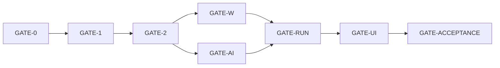

# Requirement traceability — single-input implementation

| 項目 | 値 |
|---|---|
| Task | G0-04 |
| Requirement baseline | `docs/requirements-definition.md` v2.0 |
| Plan | `work/20260831-implementation-plan.md` v3.0 |
| Scope ADR | ADR-0010 |
| Acceptance criteria tracked | 12 |
| Mandatory requirement surfaces tracked | 18 |
| Initial platform | Windows 11 x64 |
| Sole user-provided input | Forms response `.xlsx` |
| Production implementation | **NOT STARTED — revised GATE-0 pending** |
| Supersedes | G-18 traceability for requirement v1.2 |
| Record date | 2026-08-31 |

## Status vocabulary

| Status | Meaning |
|---|---|
| `BASELINE_COMPLETE` | Current requirement, plan, ADR, baseline, and path ownership are committed and verified. |
| `PLANNED` | Exact production and test owner tasks exist, but implementation has not started. |
| `NOT_REQUIRED` | A former external input or feature is outside the v2.0 initial scope; it is not claimed as satisfied. |
| `PENDING_GATE` | Work is prohibited until its direct gate passes. It is not treated as PASS. |

A mapping is not implementation evidence. Every `PLANNED` row remains unimplemented until its owner task, tests, and phase gate pass.

## Current baseline evidence

| Task | Result | Evidence | Commit | SHA-256 / boundary |
|---|---|---|---|---|
| G0-01 | COMPLETE | requirement v2.0 | `740736f0ccc5df2dbf94989227b50a0ea34f480e` | `D401EEC4778E5A088D1674F65F5E036C4957713BADAC86B5D162584ABFB9FE31` |
| G0-01 | COMPLETE | plan v3.0 plus ID correction | `23c48392a124541386f7d0d880a576943b1ef0ad` | `63E0669916B27E0ADF2FD1A44435EE20EC664B57D624EA949DCD2B3AED0C504E` |
| G0-02 | COMPLETE | `docs-dev/adr/0010-single-input-local-scope.md` | `84484fb912a474b9ec36e0e240407af3e7cfea01` | `E6849DBFD0FE7C86782440E3C1AB99920AAE369F79D6D3D0B88DE7B2377038E6` |
| G0-03 | COMPLETE | `docs-dev/preflight/requirements-baseline.md` | `3f40760bb05ee6fdc3837368cb835ec75ececd7d` | `36A9815BAAFE22AB69614BC48FAF8E27A4FDF352AFF68A3956F2DBEAC7D66535` |
| G0-03 | COMPLETE | `docs-dev/preflight/implementation-task-file-map.md` | `3f40760bb05ee6fdc3837368cb835ec75ececd7d` | `519044E8CA218C24AF27EB3A85B1D5C376C7FCBF4C08E87FC16E42B56C987E63` |
| G0-04 | THIS RECORD | `docs-dev/traceability.md` | pending | mappings do not satisfy production tests |

## Acceptance criteria

| Requirement | Implementation owners | Test / evidence owners | Current result |
|---|---|---|---|
| AC-001 — sole required user information is one response `.xlsx` | G0-01; U-02; D-01 | G0-04; D-03 | BASELINE_COMPLETE; application/UI/docs PLANNED |
| AC-002 — map multiple questions and required/optional columns | T-02; W-03/W-04; U-03 | T-10; E-01 | PLANNED; GATE-1/GATE-2/GATE-W/GATE-UI |
| AC-003 — two editable question presets and prompt templates | T-03〜T-05; U-04 | T-04 tests; E-01 | PLANNED; GATE-1/GATE-2/GATE-UI |
| AC-004 — default report 0–30 and Prompt 1–10 candidate scores | T-03/T-04/T-07; A-02; U-04/U-06 | T-04/T-07/T-08 tests; E-01 | PLANNED; GATE-1/GATE-2/GATE-AI/GATE-UI |
| AC-005 — criterion status, reason, and verified evidence | T-07/T-08; A-02/A-03; W-07; U-06 | T-08/A-03/W-07 tests; E-01/E-02 | PLANNED; source-field binding required |
| AC-006 — optional Prompt/considerations combinations | T-02/T-07; R-01; W-07; U-03/U-06 | T-02/T-07/R-01 tests; E-01 | PLANNED; `CONSIDERATIONS_ONLY` and `NOT_APPLICABLE` required |
| AC-007 — identifier/other data excluded and preview confirmed | T-06; A-04/A-06; U-05 | T-06/A-06 tests; E-02 | PLANNED; send confirmation cannot be bypassed |
| AC-008 — AI candidate cannot auto-confirm | T-09; W-07; U-06 | T-09/W-07 tests; E-01 | PLANNED; pending/rejected values remain blank |
| AC-009 — input hash/size/time unchanged | W-02/W-05/W-09; U-07 | W-02/W-05/W-09 tests; E-02/E-03 | PLANNED; failure/cancel paths included |
| AC-010 — temp, reopen, validate, atomic rename | W-08/W-09; U-07 | W-08/W-09 tests; E-02/E-03 | PLANNED; partial final filename prohibited |
| AC-011 — existing Copilot CLI login; no app client ID/secret/policy | A-01; U-05 | A-01/A-07 tests; optional A-08; E-03 | PLANNED; interactive runtime auth only |
| AC-012 — Windows 11 x64 build/test/E2E/self-contained | F-01〜F-05; E-03; P-01 | GATE-1; E-03; P-01 layout tests | PLANNED; unsupported OS claims prohibited |

## Mandatory requirement surfaces

| Requirement surface | Implementation owners | Verification owners | Current result |
|---|---|---|---|
| §2.1 one Forms response `.xlsx` | U-02; W-01〜W-03 | E-01/E-03; D-03 | PLANNED |
| §2.2 no extra policy/key/baseline/runner input | A-01; D-01 | A-01/A-07; D-03 | BASELINE_COMPLETE; runtime implementation PLANNED |
| §2.3 interactive existing CLI authentication | A-01; U-05 | A-01 tests; optional A-08 | PLANNED; unauthenticated live smoke may be SKIPPED |
| §3 Windows x64 initial scope and exclusions | F-01/F-03; P-01/P-02; D-01 | E-03; P-01/P-02 tests; D-03 | PLANNED; other platforms NOT_REQUIRED |
| §4.1 row/column input contract | T-02; W-03/W-04; U-03 | T-02/W-04 tests; E-01 | PLANNED |
| §4.2 read-only file safety | W-01/W-02/W-05/W-08/W-09 | Workbooks tests; E-02/E-03 | PLANNED |
| §5.1 editable questions/criteria/ranges | T-03; U-04 | T-03 tests; E-01 | PLANNED |
| §5.2 seven closed placeholders | T-05 | T-05 tests; T-10 | PLANNED |
| §6 built-in editable presets | T-04; U-04 | T-04 tests; E-01 | PLANNED |
| §7.1 SDK and logged-in-user auth | A-01 | A-01/A-07; optional A-08 | PLANNED |
| §7.2 minimal payload and per-run preview | T-06; U-05; A-04 | T-06/A-04/U-05 tests; E-02 | PLANNED |
| §7.3 structured result and source evidence | T-07/T-08; A-02/A-03 | T-07/T-08/A-02/A-03 tests | PLANNED |
| §7.4 session/retry/cleanup | A-04/A-05; R-02 | A-04/A-05/R-02 tests | PLANNED |
| §8 candidate/human review boundary | T-09; W-07; U-06 | T-09/W-07/U-06 tests; E-01 | PLANNED |
| §9 Open XML output contract | W-05〜W-09 | Workbooks tests; E-01〜E-03 | PLANNED |
| §10 privacy/security boundary | T-06; A-03〜A-07; W-07 | T-06/A-06/A-07/W-07 tests; E-02 | PLANNED |
| §11 seven-step keyboard-accessible UI | U-01〜U-08 | Desktop tests; E-01/E-03 | PLANNED |
| §12 reliability/performance/platform | W-02/W-09; R-02/R-03; E-03/E-04; P-01 | fault tests; E-03/E-04; P-01 tests | PLANNED |

## Test requirement mapping

| Test item | Primary task owners | Gate |
|---|---|---|
| 14-01 mapping 1/2/10 questions and row boundaries | T-02/T-10; W-03/W-04 | GATE-2/GATE-W |
| 14-02 optional Prompt/considerations combinations | T-02/T-07/T-10; R-01 | GATE-2/GATE-RUN |
| 14-03 presets/edit/snapshot | T-03〜T-05 | GATE-2 |
| 14-04 score/result protocol negatives | T-07/T-08; A-02/A-03 | GATE-2/GATE-AI |
| 14-05 injection/Unicode/long input | T-05/T-06/T-08/T-10; W-07/W-08 | GATE-2/GATE-W |
| 14-06 identifier/PII preview/log | T-06; A-06; U-05 | GATE-2/GATE-AI/GATE-UI |
| 14-07 fake Copilot lifecycle | A-01〜A-07 | GATE-AI |
| 14-08 optional authenticated synthetic smoke | A-08 | separately PASS or `SKIPPED_NOT_AUTHENTICATED` |
| 14-09 Open XML preservation/string/atomic faults | W-05〜W-09 | GATE-W |
| 14-10 Windows synthetic E2E | E-03 | GATE-ACCEPTANCE |
| 14-11 basic accessibility | U-08 | GATE-UI |
| 14-12 traceability completeness | each `*-TR`; E-TR | every phase gate/GATE-ACCEPTANCE |

## Former external inputs

| Former input | Current v2.0 result | Future rule |
|---|---|---|
| EXT-03 policy/org/OAuth/production trust | NOT_REQUIRED | New requirement required before managed organization mode |
| EXT-04 privacy governance artifacts | NOT_REQUIRED | User responsibility notice only in initial version |
| EXT-05 educational baseline/threshold | NOT_REQUIRED | Candidate score + human review; no validity claim |
| EXT-06 legal/EU decision | NOT_REQUIRED | App does not make legal compliance claim |
| EXT-07 cross-platform/signing/print runners | NOT_REQUIRED | Windows 11 x64 local unsigned package only |
| EXT-08 independent signed release review | NOT_REQUIRED | Internal adversarial review remains a development check |
| EXT-09 dump-policy attestation | NOT_REQUIRED | No institutional real-data gate is implemented |

`NOT_REQUIRED` means outside current initial scope, not externally approved or verified.

## Gate chain

All production rows are `PENDING_GATE` until revised GATE-0 passes. `NOT_RUN` and optional live-smoke `SKIPPED_NOT_AUTHENTICATED` are never promoted to production test PASS; only A-08 is explicitly nonblocking.

## Current disposition

- Requirement v2.0、plan v3.0、ADR-0010、current baseline、72-task exact path map are committed.
- All 12 acceptance criteria and 18 mandatory requirement surfaces have implementation and verification owners.
- The sole user-provided runtime input is one Forms response `.xlsx`.
- Existing Copilot CLI login is an interactive runtime prerequisite; no credential value is a project input.
- There are no external policy、legal、education、signing、cross-platform blockers in the initial scope.
- Production `src/` must remain absent or contain zero files until revised GATE-0 PASS.
- Next action is to replace the historical BLOCKED gate record with the revised GATE-0 evaluation.
