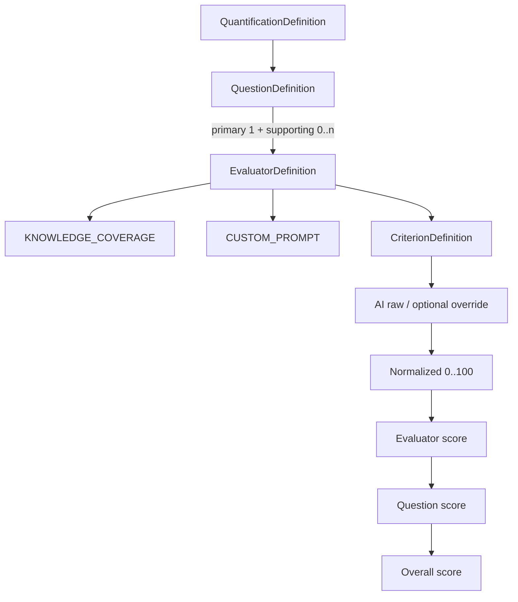
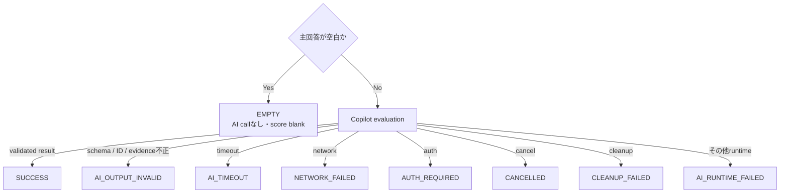

# 機能リファレンス

対象読者は教員・評価設計者・結果を監査する人です。現在のproduction sourceと決定的testで確認できる範囲だけを記載します。

## 実装状態

| Surface | 現在の状態 | 根拠 |
|---|---|---|
| 標準`.xlsx`のread-only読込 | 実装済み。安全上限とpackage graphを検査 | [`FileFormatClassifier.cs`](../src/StudyReportEvaluator.App/Workbooks/Intake/FileFormatClassifier.cs)、[`InputSnapshotService.cs`](../src/StudyReportEvaluator.App/Workbooks/Intake/InputSnapshotService.cs) |
| sheet / row / column mapping | 実装済み。候補は利用者が変更可能 | [`InputViewModel.cs`](../src/StudyReportEvaluator.App/ViewModels/InputViewModel.cs#L968-L1080) |
| 動的question / evaluator / criterion | 実装済み | [`QuantificationDesignViewModel.cs`](../src/StudyReportEvaluator.App/ViewModels/QuantificationDesignViewModel.cs#L594-L793) |
| Knowledge / Custom Prompt | 実装済み。Knowledgeのsemantic coreはapp-owned | [`BuiltInPromptTemplates.cs`](../src/StudyReportEvaluator.Core/Prompting/BuiltInPromptTemplates.cs) |
| immutable run snapshot | 実装済み | [`QuantificationSnapshot.cs`](../src/StudyReportEvaluator.Core/Domain/QuantificationSnapshot.cs) |
| Copilot result schema / single tool | fake transportとschema testで実装確認。live smokeは`NOT_RUN` | [`EvaluationSchemaFactory.cs`](../src/StudyReportEvaluator.App/Copilot/EvaluationSchemaFactory.cs)、[`traceability.md`](../docs-dev/traceability.md#optional-advisory-evidence--never-a-required-substitute) |
| raw → normalized → 3階層aggregate | Core previewとExcel formulaを実装 | [`WeightedScoreCalculator.cs`](../src/StudyReportEvaluator.Core/Scoring/WeightedScoreCalculator.cs)、[`FormulaExpression.cs`](../src/StudyReportEvaluator.Core/Formulas/FormulaExpression.cs) |
| partial result after cancel | 実装済み | [`RunSummary.cs`](../src/StudyReportEvaluator.App/Workflow/RunSummary.cs#L117-L151) |
| atomic separate output | 実装済み。既存fileは上書きしない | [`AtomicOutputCommitter.cs`](../src/StudyReportEvaluator.App/Workbooks/Writing/AtomicOutputCommitter.cs) |
| native file picker | 提供なし。full pathを入力 | [`InputView.axaml`](../src/StudyReportEvaluator.App/Views/InputView.axaml#L117-L145) |
| 保存済み結果の再import | 提供なし | [`ResultsOutputViewModel.cs`](../src/StudyReportEvaluator.App/ViewModels/ResultsOutputViewModel.cs#L683-L706) |
| reusable definition profile | 提供なし。snapshotはoutput Configへ保存 | [`ConfigSheetWriter.cs`](../src/StudyReportEvaluator.App/Workbooks/Writing/ConfigSheetWriter.cs#L129-L249) |

## 定量化model

disabled nodeとその子孫はAI dispatch、Results列、集計分母から除外されますが、Configのdefinition snapshotには保持されます。実装根拠: [`EvaluationPlanBuilder.cs`](../src/StudyReportEvaluator.App/Workflow/EvaluationPlanBuilder.cs#L537-L578)、[`ConfigSheetWriter.cs`](../src/StudyReportEvaluator.App/Workbooks/Writing/ConfigSheetWriter.cs#L157-L249)。

## scoreの選択と集計

criterion $c$ のrangeを$[min_c,max_c]$とします。

$$
R_{effective}=\begin{cases}
R_{override} & \text{scorableかつoverrideがrange内}\\
R_{AI} & \text{scorable、overrideが空、AI rawがrange内}\\
\mathrm{blank} & \text{それ以外}
\end{cases}
$$

$$
N_c=100\times\frac{R_{effective}-min_c}{max_c-min_c}
$$

criterion、evaluator、questionの各階層では、enabled childのweightを親内のweight合計で正規化します。enabled childが1件でもblankなら親もblankです。実装根拠: [`WeightedScoreCalculator.cs`](../src/StudyReportEvaluator.Core/Scoring/WeightedScoreCalculator.cs#L20-L88)、[`FormulaExpression.cs`](../src/StudyReportEvaluator.Core/Formulas/FormulaExpression.cs#L85-L173)。

## 画面とworkbookの項目差

| 項目 | Results画面 | `Quantification_Results` |
|---|---:|---:|
| source row / node名 / status | Yes | row位置・header prefix・statusで保持 |
| AI raw | Yes | Yes |
| override | 編集可 | literal + data validation |
| effective raw / normalized | Yes | formula + cached preview |
| evaluator / overall | Yes | formula + cached preview |
| question score | No | formula + cached preview |
| reason / evidence / evidence source | No | literal string |

根拠: [`ResultsOutputView.axaml`](../src/StudyReportEvaluator.App/Views/ResultsOutputView.axaml#L151-L219)、[`ResultsSheetWriter.cs`](../src/StudyReportEvaluator.App/Workbooks/Writing/ResultsSheetWriter.cs#L157-L171)。

## statusの読み方

失敗statusを0点へ変換しません。非空主回答にvalid overrideがある場合だけ、失敗statusを保持したままscoreを補完できます。根拠: [`ResultsStatusCodes`](../src/StudyReportEvaluator.App/Workbooks/Writing/ResultsSheetWriter.cs#L11-L40)、[`RunSummary.cs`](../src/StudyReportEvaluator.App/Workflow/RunSummary.cs#L174-L280)。

## 非保証

- KnowledgeのPromptは意味内容を評価するよう指示しますが、live AIの教育的品質を実証していません。
- cached valueはCore previewであり、外部Excel／LibreOfficeが再計算した証拠ではありません。
- warningは確認を促す表示であり、mandatory human reviewや組織承認の代替ではありません。

証跡: [`traceability.md`](../docs-dev/traceability.md#optional-advisory-evidence--never-a-required-substitute)、[要求定義書 §15](requirements-definition.md#15-scope)。
