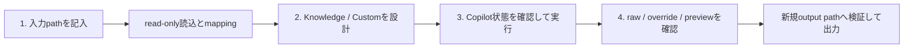
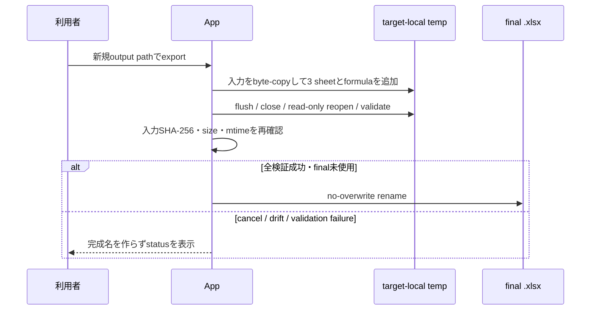

# はじめに — 最初の定量化workbookを作る

対象読者は、Windows 11 x64で標準 `.xlsx` の回答を定量化する教員・採点者です。本書は現在のUIとproduction sourceだけを手順化し、未取得の画面やlive AI結果を作りません。

## 全体像

実装根拠: [`WorkflowNavigator.cs`](../src/StudyReportEvaluator.App/Navigation/WorkflowNavigator.cs#L14-L32)、[`MainWindow.axaml`](../src/StudyReportEvaluator.App/Views/MainWindow.axaml#L234-L296)。

## 0. 準備

### 必須

- Windows 11 x64。
- 標準Office Open XML `.xlsx`。`.xls`、`.xlsb`、CSV、PDF、`.xlsm`、暗号化／権利保護workbookは利用できません。
- 入力とは別の完成fileを作成できる既存directory。

### AI評価を使う場合だけ必要

- GitHub Copilot CLIを別途導入する。配布ZIPに`copilot.exe`は含まれません。
- Windowsの`PATH`から`copilot.exe`を解決できるようにする。
- Copilot CLIで対話loginを完了する。アプリへPAT、client secret、passwordを入力する欄はありません。

実装根拠: [`FileFormatClassifier.cs`](../src/StudyReportEvaluator.App/Workbooks/Intake/FileFormatClassifier.cs#L86-L104)、[`CopilotClientFactory.cs`](../src/StudyReportEvaluator.App/Copilot/CopilotClientFactory.cs#L15-L57)、[`WindowsPublishPackageTests.cs`](../tests/StudyReportEvaluator.App.Tests/Packaging/WindowsPublishPackageTests.cs#L399-L414)。

## 1. 入力

| 画面項目 | 入力例 | 意味 |
|---|---|---|
| ファイルpath（標準 `.xlsx`） | `C:\Synthetic\StudyReport-100x2.xlsx` | 実際には利用するworkbookのfull pathを入力 |
| 回答sheet | `Original` | 回答を含むsheetを選択 |
| 見出し行 | `1` | column headerがあるrow |
| 回答開始行 | `2` | 最初の回答row |
| 回答終了行 | `101` | 100名ならheaderを除く最終row |

1. **ファイルpath（標準 `.xlsx`）**へfull pathを入力します。現在のUIにnative file pickerはありません。
2. **read-onlyで読込**を選びます。
3. 回答sheet、見出し行、回答開始行、回答終了行を確認します。
4. 自動候補を出発点として、質問ごとの主回答列と補助列を確認・変更します。
5. 画面下部が「技術検証を通過しました」になることを確認します。

主回答列と同じ列を同じ質問の補助列にはできません。同じ列を別の質問で使うことはできます。入力変更時は、それまでのmetadataとmapping候補が破棄されます。

| 画面項目 | 入力例 | 意味 |
|---|---|---|
| 表示名 | `設問1：機械学習の基礎` | Results画面やConfigで識別する名称 |
| 設問text | `機械学習とルールベースの違いを説明してください。` | AIへ送る設問本文 |
| 主回答列 | `B` | このQuestionの評価対象。必ず1列 |
| 補助列 | `D · 補助情報` | 必要な場合だけ0件以上を選択 |

UI根拠: [`InputView.axaml`](../src/StudyReportEvaluator.App/Views/InputView.axaml#L117-L145)、[`InputView.axaml`](../src/StudyReportEvaluator.App/Views/InputView.axaml#L149-L362)。検証根拠: [`InputViewTests.cs`](../tests/StudyReportEvaluator.App.Tests/UI/InputViewTests.cs#L104-L123)、[`InputViewTests.cs`](../tests/StudyReportEvaluator.App.Tests/UI/InputViewTests.cs#L208-L228)。

## 2. 定量化設計

| 画面項目 | 入力例 | 意味 |
|---|---|---|
| 定義名 | `100名・2設問 レポート定量化` | run snapshotを識別する名称 |
| revision | `2026-09` | 利用者が管理する版識別子 |
| 丸め桁数 | `1` | normalized / aggregateを0〜6桁で丸める |
| 質問weight | `1` | question間の相対weight |
| evaluator weight | `1` | 同じquestion内の相対weight |
| range minimum / maximum | `0` / `10` | evaluatorのdefault raw range |
| criterion weight | `1` | 同じevaluator内の相対weight |

KnowledgeのPrompt previewはread-onlyです。知識ポイントはcriterionの項目名と説明へ入力します。

1. definition名、revision、丸め桁数（0〜6）を確認します。
2. 質問を追加・複製・並べ替え・無効化・削除できます。
3. 各質問へKnowledgeまたはCustom evaluatorを追加します。
4. evaluator range、criterion、criterion / evaluator / question weightを設定します。
5. Customでは`{回答}`と`{評価項目}`を含むtemplateを入力します。
6. **snapshot preflightが「設計は有効です」になることを必ず確認します。**

Custom evaluatorでは次の編集欄を使用します。

| 画面項目 | 入力例 | 意味 |
|---|---|---|
| type | `CUSTOM_PROMPT` | Knowledge以外の独自評価 |
| 評価方法名 | `説明品質` | evaluatorの表示名 |
| Custom Prompt template | `次の回答を… {回答} … {補助情報} … {評価項目}` | `{回答}`と`{評価項目}`は必須 |
| 項目名 | `具体性と論理性` | AIがraw scoreを返すcriterion |
| 説明 | `活用例が具体的で、説明の流れが論理的か。` | criterionの判断観点 |

> [!IMPORTANT]
> Custom Promptのplaceholder構文はDesignだけでなく、Execution開始条件とimmutable snapshot作成時にも同じCore validatorで再検査されます。invalidのままstepを移動できてもrunは開始されず、入力本文の読取やCopilot session作成は行われません。

UI根拠: [`QuantificationDesignView.axaml`](../src/StudyReportEvaluator.App/Views/QuantificationDesignView.axaml#L52-L216)、[`QuantificationDesignViewModel.cs`](../src/StudyReportEvaluator.App/ViewModels/QuantificationDesignViewModel.cs#L1187-L1261)。

## 3. 実行

| 画面項目 | 選択例 | 意味 |
|---|---|---|
| Copilot状態を確認 | buttonを実行 | CLI loginと利用可能modelを確認 |
| Model | `Auto` | UIに列挙された場合だけ選択。具体的modelはserviceが決定 |
| Concurrency | `2` | 同時実行数。1〜3 |
| Evaluation plan | `200 evaluation units` | 100名 × 2設問 × 1 evaluator |

1. **Copilot状態を確認**を選びます。
2. 「既存のCopilot CLI loginを利用できます」と表示された場合だけ、列挙されたmodelから1件を選びます。
3. concurrencyを1〜3から選びます。既定は1です。
4. evaluation unit数を確認します。単位は1行 × 1質問 × 1 enabled evaluatorです。
5. **定量化を開始**を選びます。
6. 必要なら**cancel**を選びます。新規送信を停止し、完了済みunitだけを保持した部分結果へ進めます。

run開始後のdraft編集は現在runへ反映されません。Prompt、schema、range、weight、mappingは開始時snapshotへ固定されます。

UI根拠: [`ExecutionView.axaml`](../src/StudyReportEvaluator.App/Views/ExecutionView.axaml#L97-L203)。実装根拠: [`QuantificationOrchestrator.cs`](../src/StudyReportEvaluator.App/Workflow/QuantificationOrchestrator.cs#L119-L177)、[`EvaluationScheduler.cs`](../src/StudyReportEvaluator.App/Workflow/EvaluationScheduler.cs#L273-L404)。

## 4. 結果を確認する

画面には次を表示します。

- source row
- question / evaluator / criterion名
- status
- AI raw
- 任意override
- effective raw
- normalized score
- evaluator score
- overall score

Reason、Evidence、Evidence source、Question scoreは現在のResults画面には表示せず、出力workbookの`Quantification_Results`へ保存します。

overrideは主回答が非空の場合だけ入力できます。空欄なら妥当なAI rawを使い、range内の数値ならAI rawより優先します。非空の不正overrideはAI rawへfallbackせず、scoreを空欄にしてexportを停止します。

スクリーンショットのraw `8`とoverride `9`はfake runnerの合成値です。期待されるlive AI scoreではありません。

UI根拠: [`ResultsOutputView.axaml`](../src/StudyReportEvaluator.App/Views/ResultsOutputView.axaml#L151-L219)。workbook根拠: [`ResultsSheetWriter.cs`](../src/StudyReportEvaluator.App/Workbooks/Writing/ResultsSheetWriter.cs#L157-L171)。

## 5. 別workbookへ出力する

| 画面項目 | 入力例 | 意味 |
|---|---|---|
| Output path | `C:\Synthetic\StudyReport-100x2_quantified_20260901-170325.xlsx` | 実際には既存directory内の未使用 `.xlsx` full path |
| 検証して出力 | buttonを実行 | working copyの検証後にno-overwrite commit |
| cancel output | 必要時に実行 | final rename前の出力を取り消す |

1. **Output path**へ、入力とは異なる新規 `.xlsx` のfull pathを入力します。directoryは事前に存在している必要があります。
2. 既存fileを指定すると上書きせず停止します。
3. **検証して出力**を選びます。
4. working copyのwrite、flush、close、reopen、formula/cache検証、入力identity再確認が成功した場合だけ完成名へ移動します。

実装根拠: [`ResultsOutputViewModel.cs`](../src/StudyReportEvaluator.App/ViewModels/ResultsOutputViewModel.cs#L134-L177)、[`ResultsOutputViewModel.cs`](../src/StudyReportEvaluator.App/ViewModels/ResultsOutputViewModel.cs#L201-L274)、[`AtomicOutputCommitter.cs`](../src/StudyReportEvaluator.App/Workbooks/Writing/AtomicOutputCommitter.cs#L105-L243)。

> [!CAUTION]
> output workbookは入力の全sheet・全データを保持し、さらにquestion、Prompt、criterion、weight、AI resultを追加します。入力と同等以上に機密なfileとして扱ってください。詳細は[データとprivacy](privacy-and-data-handling.md)を参照してください。

## 現行UIで提供しない操作

- native open/save file picker
- reusable definition profileの独立save/load
- 保存済みoutput workbookをアプリへ再importしてreviewする機能
- signed installer、macOS／Linux／Windows Arm64 package

Results画面は同一プロセス内で完了またはcancelされたrunの`ExecutionRunContext`からだけ読み込まれます。根拠: [`MainWindowViewModel.cs`](../src/StudyReportEvaluator.App/ViewModels/MainWindowViewModel.cs#L242-L245)、[`ResultsOutputViewModel.cs`](../src/StudyReportEvaluator.App/ViewModels/ResultsOutputViewModel.cs#L683-L706)。

## スクリーンショットの境界

本書の画像は[`DocumentationScreenshotTests.cs`](../tests/StudyReportEvaluator.App.Tests/UI/DocumentationScreenshotTests.cs)がproduction viewをheadless Skiaでrenderしたものです。合成workbook metadata、fake authentication、fake AI resultだけを使い、live network、実在学生data、private pathを含みません。詳細は[`images/README.md`](../images/README.md)を参照してください。
