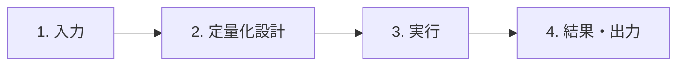

# はじめに

このガイドでは、Windows 11 x64でStudyReport Evaluatorを起動し、標準`.xlsx`から最初の結果workbookを作る手順を説明します。

現在の公開版は`v0.8.1`です。[GitHub Releases](https://github.com/dahatake/StudyReport-Evaluator/releases)で取得できる`StudyReportEvaluator-win-x64.zip`と`StudyReportEvaluator-win-x64.zip.sha256`はこの旧公開版です。**公開`v0.8.1`には単一EXE配布も「GitHubにログイン」buttonもありません。**

> [!WARNING]
> 生成AIが行う評価には正確性が欠ける可能性があるため、必ず自分で責任をもって評点を行ってください。このツールや生成AIは評価結果に対しては一切の責任を負えません

> [!IMPORTANT]
> 単一EXEとlogin buttonは、現在のソース候補**`0.8.4`（UNRELEASED・未公開）**向けです。新EXEのdownload linkはまだ公開されていません。**fresh Windowsのclean-host試験CH-01〜06と本人loginは`NOT_RUN`**であり、追加ソフト未導入のOS-only環境での動作を実証済みとはしていません。既存の検証状況と画像の対象版は本ガイド末尾を参照してください。

## 準備

必要なもの:

- Windows 11 x64の標準user環境
- 下記の対象版に合った配布物（今後の主導線は単一EXE、現在の公開版はZIP）
- 評価対象の標準`.xlsx`
- AI処理を行う場合だけ、利用可能なGitHub Copilot account、本人の対話login、network接続、利用可能model、組織policy上の利用許可

GUI起動に.NET Runtime／SDK、PowerShell、Node.js／npm、Git、GitHub CLI（`gh`）、別Copilot CLI、Microsoft Excel／Office／LibreOffice、IDEの導入を要求しないself-contained設計です。Copilot CLIは配布物へ同梱され、PATH上の別CLIへfallbackしません。GUI起動とAI利用の前提は別です。

development MSIXは非公開の開発検証専用であり、一般利用者向けの入手・起動手順には含めません。

## 単一EXEから起動する（未公開候補・今後の主導線）

今後の主配布名は`StudyReportEvaluator-win-x64.exe`と`StudyReportEvaluator-win-x64.exe.sha256`です。公開条件を満たす最終成果物の公開後に一般利用者の主導線となります。現時点では、開発者から対象の未公開候補を受領した場合の手順として読んでください。

1. 取得済みの`StudyReportEvaluator-win-x64.exe`をダブルクリックします。
2. 入力画面が表示されたら、本ガイドの「1. 入力」へ進みます。

**ダブルクリックを1起動gestureと数えます。** download、任意の手動hash比較、Windowsの警告への操作、本人loginはこの1操作に含めません。警告・拒否や追加操作を隠して、無条件に1操作で起動できるとは表示しません。

標準userがofflineでGUI、Excel読込、mapping、採点設計を利用できることを要求しています。ただし、**fresh OS-only環境での実証は未完了**です。手動展開、setup script、terminalへのcommand入力、管理者昇格、repository、隣接DLL／manifest、既存CLI cache・認証情報、sidecarをGUI起動の前提にしません。起動時にloginやAI評価は自動開始しません。

未公開のdownload URLを推測したり、repository内の`artifacts`を一般配布先として扱ったりしないでください。

## ZIPを起動する（現在の公開v0.8.1・代替経路）

1. 上記GitHub Releasesの`v0.8.1`から`StudyReportEvaluator-win-x64.zip`をdownloadします。
2. 任意・推奨のhash確認を行う場合は、同じreleaseの`StudyReportEvaluator-win-x64.zip.sha256`も取得し、下記の方法で照合します。
3. ZIPを新しいdirectoryへ展開します。
4. `StudyReportEvaluator-win-x64\StudyReportEvaluator.App.exe`を起動します。

単一EXEが公開された後も、ZIPとsidecarの名前および展開後の起動方法は代替経路として維持します。**既存の公開`v0.8.1`の内容が候補版へ置き換わるわけではなく、login buttonも追加されません。**

## SHA-256を確認する（手動比較は任意・推奨）

EXE／ZIPそれぞれのsidecar公開と、CI・公開判定での最終配布bytesとのSHA-256完全一致確認は必須です。一方、**利用者の手動hash比較は任意の推奨であり、sidecarはアプリ起動の依存fileではありません。** 確認のためだけにPowerShell等を導入する必要はありません。

確認する場合は、取得したEXEまたはZIPのSHA-256を、同じrelease／候補・同じ形式のsidecarの先頭64文字と照合してください。不一致なら実行せず、正式配布元からの再取得を確認します。同じ配布元のhash一致だけでは、発行者の真正性やSmartScreen reputationは保証されません。

PowerShell 7が既にある場合の、公開ZIPのSHA-256確認例（任意）:

```powershell
(Get-FileHash -Algorithm SHA256 .\StudyReportEvaluator-win-x64.zip).Hash
```

Windows 11標準の`certutil`の`-hashfile`機能でも、取得した配布fileを指定し、アルゴリズムを`SHA256`として確認できます。単一EXEを確認する場合は対象を`StudyReportEvaluator-win-x64.exe`とし、EXE用sidecarと照合します。どちらの確認方法もGUI起動の必須操作ではありません。

## Windowsの警告・実行拒否

公開ZIPと候補EXEはunsignedです。SmartScreen、Smart App Control（SAC）、企業policyによる警告・実行拒否があり得ます。code signing済み、installer形式、SmartScreen reputation確立済み、すべての端末で無警告とは表示しません。

入手元を確認できない場合やhashが不一致の場合は実行しないでください。保護機能が実行を拒否した場合は停止し、所属組織の管理者に確認してください。保護機能の無効化、MOTW除去、証明書の自動trust、execution policy変更、UAC回避は案内しません。

## 単一EXEの標準展開と残存cache

候補EXEの内容は.NET標準hostが、通常は標準userの一時領域`%TEMP%/.net/<app>/<bundle-id>/`へ展開します。展開先の書込権限と空き容量が必要です。cacheは終了後も残り、再利用され得ます。**1ファイル配布は「ディスク上も1ファイル」「痕跡なし」ではありません。** 独自のcache管理UIや自動掃除はありません。

cacheはアプリ配置用で、入力workbook、final／partial、CLI credential storeとは別です。**結果の初期保存先は入力fileに隣接する`result`**であり、EXE配置先や抽出cacheではありません。配布・展開・起動のために利用者workbookを移動・削除しません。アプリは抽出cacheの再帰削除やCLI credentialの削除も行いません。

## 4stepの流れ



## 1. 入力


1. **ファイルを選択**でnative pickerを開くか、**ファイル path（標準 .xlsx）**へfull pathを入力します。
2. **read-only で読込**を選びます。
3. **回答 sheet**を選びます。
4. **質問文の行**を1または2から選びます。
5. **回答開始行**と**回答終了行**を確認します。
6. 質問ごとの表示名、設問text、主回答列、補助列を確認します。
7. 技術検証の問題をすべて解消します。

**0.8.4候補の追加動作:** 主回答列を選択すると、選択中の回答sheetで**質問文の行**と同じ列が交差するセルの値を、同じ質問の**設問text**へ即座に表示します。設問textを手入力した後に主回答列を選び直すと、新しい列のセル値で置き換わります。交差するセルが空の場合は代替文を作らず設問textも空になるため、内容を確認して手入力してください。

候補mappingは出発点です。列位置だけで役割を確定せず、workbookの見出しと授業設計に合わせて変更してください。同じ質問内で主回答列と補助列を重複させることはできません。**質問文の行**を変更した場合は、以前の行の値を使わないよう、**見出し行を再読込**してから主回答列を確認してください。

## 2. 定量化設計


設計画面で次を設定します。

- **Base points:** 既定60
- **Special points:** 既定0
- **Similarity penalty weight:** 既定0.1、範囲0〜1
- **Question points:** 設問ごとの絶対配点
- **Knowledge / Custom evaluator:** 通常回答の評価方法
- **criterion:** evaluator内の評価項目、range、weight
- **固有評価:** 学生Prompt等、別source列を0〜1で定量化する任意項目
- **丸め桁数:** 0〜6

**0.8.4候補の設計UI:** 画面上部の**採点計算式**の要約とBase・Special・類似度減点係数の現在値は、設問カードや評価詳細を縦にスクロールしても残ります。各設問の配点は設問カードで確認します。本文の**計算式の詳細**を展開すると、色と記号の対応、`Rq`（通常評価率）、`Lq`（類似度）、固有評価平均の説明を確認できます。これらの率は実行時に計算されます。丸め桁数は表示だけでなく計算の各段階と最終点に影響します。

**設問一覧（すべて表示）**には、入力画面で選んだ全設問がカードで表示されます。幅に余裕があれば横に並び、狭い場合は次の行へ折り返します。カードでは設問名、設問text、絶対配点、主回答列、補助列を比較できます。カードを選ぶと太枠になり、その設問のKnowledge／Custom評価、評価項目、固有評価、Promptを下の詳細欄で編集できます。

入力欄、選択欄、追加・複製・移動・削除などの操作へマウスを合わせると、設定する内容、値の範囲、計算への影響を説明するヘルプが表示されます。

起動時に読み込んだPromptを適用する場合（以下のカード操作・表示名は`0.8.4`候補向け。`0.8.1`は[Promptファイルから起動](prompt-launch.md)を参照）:

1. **IMPORTED PROMPTS**からPromptを選びます。
2. 設問カードを選び、**Prompt適用先の設問**が目的の設問になっていることを確認します。
3. 適用先の種類をCustom評価方法または固有評価から選びます。
4. 「設問名 → Custom: 評価方法名」または「設問名 → 固有評価: 固有評価名」と表示されたことを確認し、**Promptを適用**を選びます。

適用はPromptのコピーだけで、AI処理は開始しません。AI評価は「3. 実行」の**定量化を開始**を選ぶまで行われません。


配点は次を正確に満たす必要があります。

$$
BasePoints + SpecialPoints + \sum_{q=1}^{N} QuestionPoints_q = 100
$$

各$QuestionPoints_q$は1つの有効な設問へ割り当てる絶対配点で、$N$は有効な設問数です。

**設問配点を均等化**は利用者が選んだときだけ実行されます。設問追加やBase/Special変更だけで、手動入力したQuestion pointsを黙って変更しません。

Custom Promptの作り方は[Custom evaluator](custom-evaluator-guide.md)を参照してください。Promptファイルを起動時に読み込む場合は[Promptファイルから起動](prompt-launch.md)を参照してください。

## 3. 実行


### GitHubにログイン（未公開0.8.4候補のみ）

1. 既存の**Copilot 状態を確認**を選びます。この操作だけではloginを開始しません。
2. 未認証の場合は、**GitHubにログイン**を明示的に選びます。検証済みの同梱native CLIが認証用console／ブラウザーを開きます。
3. 本人のaccountで、CLI／ブラウザー上の対話を完了します。アプリへpassword、PAT、token、device codeを入力しないでください。
4. 完了後は、既存の**Copilot 状態を確認**をもう一度選びます。取消・失敗後やアプリ再起動後も、このbuttonで再確認します。login processの起動・終了だけを認証成功とは扱いません。

認証とcredential保管は同梱CLI／ブラウザーに委譲します。アプリはpassword、PAT、secret、token、device codeを入力・収集・解析・保存・log出力しません。PowerShell等を介したlogin用commandの入力は、この候補版buttonの利用に不要です。

GUI起動、起動引数、Prompt適用、状態確認からloginやAI評価を暗黙に開始しません。login完了後もmodelを自動変更せず、AI評価は**定量化を開始**を選ぶまで行いません。GUI表示やlogin完了だけではAI利用可能とは判断せず、network、account、列挙されたmodel、組織policy上の許可を別途確認してください。

### loginの取消・失敗（未公開0.8.4候補のみ）

**ログインを取り消す**またはアプリ終了で終了・解放するのは、アプリが開始・所有した**当該login CLI processだけ**です。ブラウザー、他のCLI、保存済みcredentialには触れず、logout、credentialの削除・失効も行いません。

loginの二重開始と評価中の開始はできません。取消・失敗後もExcel読込、mapping、設計編集、checkpoint確認は利用できます。表示された理由を確認し、既存の**Copilot 状態を確認**で再確認してから、必要な場合だけloginを再試行してください。

ただし、**login処理の終了を確認できない場合**は旧処理の終了確認までlogin再試行・AI開始を控えてください。アプリの再起動だけでは旧CLIの終了を保証しません。確認不能なら[トラブルシューティング](troubleshooting.md#loginの失敗取消終了処理)の案内に従ってください。

### 同梱CLIで手動loginする（旧公開v0.8.1のみ）

**この手動操作は、login buttonがない旧公開`v0.8.1`のZIP向けです。** 未公開候補の通常のGUI起動・login buttonの利用手順ではありません。

1. 展開済みZIP内の`StudyReportEvaluator-win-x64\runtimes\win-x64\native\copilot.exe`を指定して、同梱CLIの対話loginを本人が行います。認証はCLI／ブラウザー上で完了してください。
2. アプリへ戻り、既存の**Copilot 状態を確認**を選びます。

どちらの版でも、CLI欠落・不一致時は正式配布物の再取得／展開状態を確認します。PATH上の別CLIの導入やhash検証の緩和で回避しないでください。別途.NET、PowerShell、Node.js、Git／`gh`、CLIを導入する案内ではありません。

### 新規run

1. **Copilot 状態を確認**を選びます。未認証なら上記の対象版に合ったlogin手順を行い、再確認します。
2. loginが利用可能と表示されたら、列挙された**Model**を選びます。
3. **Concurrency**を1〜3から選びます。既定は1です。
4. **既存checkpointから再開**をoffにします。
5. **出力directory**を確認します。初期値は入力fileに隣接する`result`です。
6. evaluation planと技術検証を確認します。
7. **定量化を開始**を選びます。

run開始時にfinalとpartialの未使用名を予約します。

- final: `eval-yyyyMMdd-HHmm[-NN].xlsx`
- partial: `eval-yyyyMMdd-HHmm[-NN].partial.xlsx`

処理順は参照回答生成、学生行評価、checkpoint保存、finalizationです。全処理と検証が成功するとfinalを自動作成し、Resultsへ移動します。

### checkpointから再開

1. **既存checkpointから再開**をonにします。
2. **再開するpartial checkpoint**へ`.partial.xlsx`のfull pathを入力します。
3. Copilot状態とmodelを確認します。
4. 技術検証を通過したら**定量化を開始**を選びます。

再開にはinput、definition、model、app/SDK/CLI runtime identityの一致が必要です。保存済み参照回答とcomplete student rowを再利用し、最初の未完了rowから続けます。partialを書換えて一致を回避しないでください。

### cancel

**cancel**後は新しいAI送信を開始せず、最後にatomic保存されたcomplete rowまでのpartialを保持します。処理中だったrowはcomplete扱いにしません。

## 4. 結果・出力


結果画面では次を確認します。

- run statusとfinal/partial path
- 対象row、成功、空回答、技術失敗の件数
- Question earned、Special earned、Similarity penalty
- Final rawと0〜100へ収めたFinal score
- criterionのAI raw、effective raw、normalized value
- cleanup warning

空回答と技術的失敗は区別します。

- **空回答:** AIを呼ばず、その設問の通常評価率と獲得点を0として扱います。
- **技術的失敗:** AI処理で値を確定できなかった場合、対象値をblankとして記録します。

0とblankは異なります。blankが必要な計算へ伝播するとFinal rawとFinal scoreもblankになります。

criterion overrideが必要な場合はrange内の値を入力し、任意の新しい`.xlsx`へ反映版を出力できます。この操作は既存finalを変更せず、別名workbookを作ります。

## final workbook

finalは入力workbookの全sheetとdataを保持し、次の4sheetを追加します。

- `Quantification_Config`
- `Quantification_References`
- `Quantification_Results`
- `Quantification_Run`

入力に同名sheetがある場合は、既存sheetを変更せず` (2)`等の一意名を使います。partialは入力全体と`Quantification_Checkpoint`を含みます。

final/partialには入力全体、Prompt、参照回答、AI結果が含まれ得ます。入力と同等以上に機密なfileとして扱ってください。詳細は[データとprivacy](privacy-and-data-handling.md)を参照してください。

## 対応しない操作

- `.xlsx`以外や暗号化／macro-enabled workbookの読込
- 保存済みfinalのアプリへの再import
- definition profileだけの独立save/load
- macOS、Linux、Windows Arm64
- installer、code signing、notarization
- AIによる最終評点・合否・不正行為の確定

問題がある場合は[トラブルシューティング](troubleshooting.md)を参照してください。

## 未公開候補の検証範囲

2026-09-06のD07着手時に引き継いだ既存の検証状況です。この文書更新で新たに試験やレビュー合格を付与したものではありません。

| 対象 | 確認状況 |
|---|---|
| P05・実成果物を用いた試験 | 13件PASS |
| P06・実EXE試験 | 7件すべてPASS、敵対的レビュー指摘0 |
| A03・login UIレビュー | 指摘0 |
| fresh Windows 11 x64のclean-host試験CH-01〜06／本人login | **NOT_RUN** |

開発環境の実EXE試験やUIのfake認証試験を、追加ソフト未導入のOS-only試験、MOTW／Windows保護の実測、本人認証成功の代わりにはしません。新EXEの公開判定には最終成果物と一致するCH-01〜06の必須PASSが必要であり、現時点では公開条件を満たしていません。

## 対象版

単一EXEとlogin button、設問text自動同期、固定表示の採点計算式、幅に応じて折り返す設問カードの説明は、現在のソース候補向けです。既存画像も候補の説明用synthetic data／fake authentication・結果であり、login buttonの追加やclean-host／本人認証の成功を示す証跡ではありません。公開`v0.8.1`では追加UI／動作を前提にせず、設問textと対象設問を利用中の画面で確認・設定してください。

要求文書v4.5と製品版は別です。製品版のPATCH `0.8.3` → `0.8.4`はR03で完了しましたが、0.8.4の最終EXE／ZIPとCH-01〜06はまだ再検証前です。

本ガイドは配布物へ同梱するsourceです。**本変更や後続の版更新を取り込むと最終EXE／ZIPのbytesとSHA-256も変わるため、後続作業で再build・再package・sidecar生成・必要な再検証を行います。** 既存のPASSを変更後の最終EXEへ流用せず、そのexact EXEでclean-host CH-01〜06も実施する必要があります。本D07では再build・試験・公開は行っていません。

**対象版: 現在のソース候補`0.8.4`（UNRELEASED・未公開）。現在の公開版は`v0.8.1`のZIPです。**
