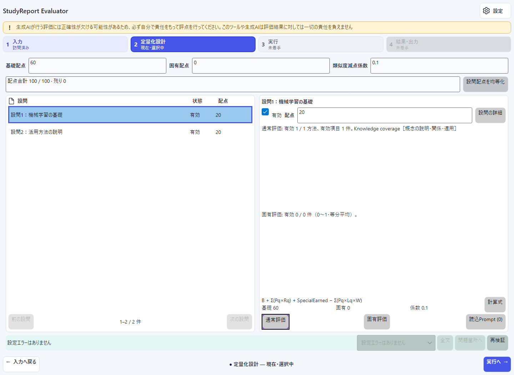
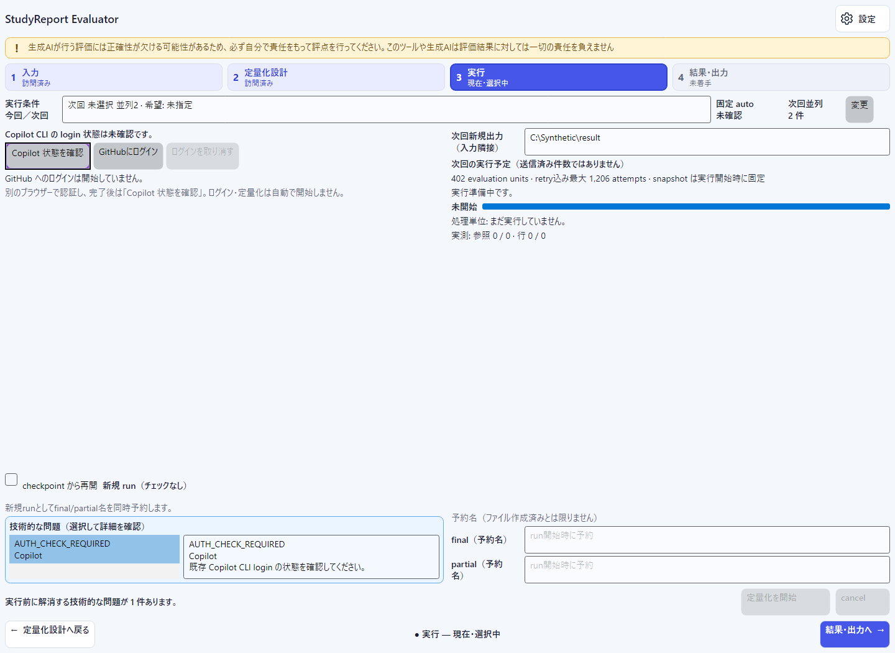
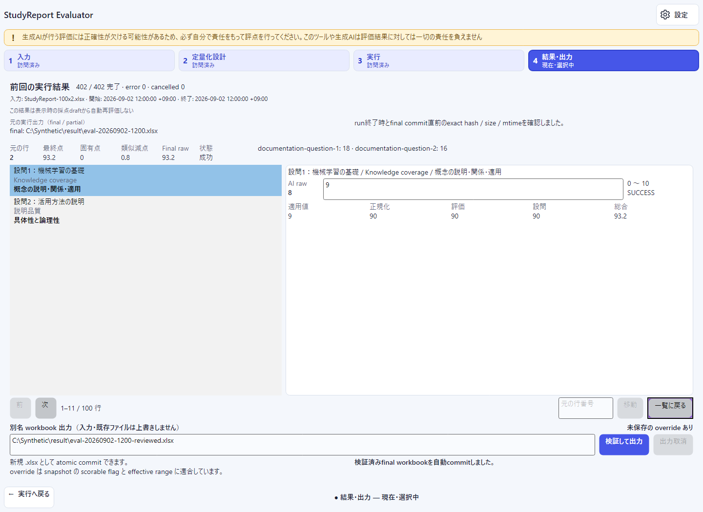

# はじめに

このガイドでは、Windows 11 x64でStudyReport Evaluatorを起動し、標準`.xlsx`から最初の結果workbookを作る手順を説明します。

現在の公開版は`v0.8.1`です。[GitHub Releases](https://github.com/dahatake/StudyReport-Evaluator/releases)で取得できる`StudyReportEvaluator-win-x64.zip`と`StudyReportEvaluator-win-x64.zip.sha256`はこの旧公開版です。**公開`v0.8.1`には単一EXE配布も「GitHubにログイン」buttonもありません。**

> [!WARNING]
> 生成AIが行う評価には正確性が欠ける可能性があるため、必ず自分で責任をもって評点を行ってください。このツールや生成AIは評価結果に対しては一切の責任を負えません

> [!IMPORTANT]
> 単一EXE、login button、以下の簡素化UI・設定保存は、現在のソース候補**`0.8.5`（UNRELEASED・未公開）**向けです。新EXEのdownload linkはまだ公開されていません。**fresh Windowsのclean-host試験CH-01〜06と本人loginは`NOT_RUN`**であり、追加ソフト未導入のOS-only環境での動作を実証済みとはしていません。公開`v0.8.1`の操作と区別してください。既存の検証状況と画像の対象版は本ガイド末尾を参照してください。

## 準備

必要なもの:

- Windows 11 x64の標準user環境
- 下記の対象版に合った配布物（今後の主導線は単一EXE、現在の公開版はZIP）
- 評価対象の標準`.xlsx`
- AI処理を行う場合だけ、利用可能なGitHub Copilot account、本人の対話login、network接続、利用可能model、組織policy上の利用許可

GUI起動に.NET Runtime／SDK、PowerShell、Node.js／npm、Git、GitHub CLI（`gh`）、別Copilot CLI、Microsoft Excel／Office／LibreOffice、IDEの導入を要求しないself-contained設計です。Copilot CLIは配布物へ同梱され、PATH上の別CLIへfallbackしません。GUI起動とAI利用の前提は別です。

development MSIXは非公開の開発検証専用であり、一般利用者向けの入手・起動手順には含めません。

## 単一EXEから起動する（未公開候補・今後の主導線）

今後の主配布名は`StudyReportEvaluator-win-x64.exe`と`StudyReportEvaluator-win-x64.exe.sha256`です。公開条件を満たす最終成果物の公開後に一般利用者の主導線となります。現時点では、開発者から対象の未公開候補を受領した場合の手順として読んでください。

1. 取得済みの`StudyReportEvaluator-win-x64.exe`をダブルクリックします。
2. 入力画面が表示されたら、本ガイドの「1. 入力」へ進みます。

**ダブルクリックを1起動gestureと数えます。** download、任意の手動hash比較、Windowsの警告への操作、本人loginはこの1操作に含めません。警告・拒否や追加操作を隠して、無条件に1操作で起動できるとは表示しません。

標準userがofflineでGUI、Excel読込、mapping、採点設計を利用できることを要求しています。ただし、**fresh OS-only環境での実証は未完了**です。手動展開、setup script、terminalへのcommand入力、管理者昇格、repository、隣接DLL／manifest、既存CLI cache・認証情報、sidecarをGUI起動の前提にしません。起動時にloginやAI評価は自動開始しません。

未公開のdownload URLを推測したり、repository内の`artifacts`を一般配布先として扱ったりしないでください。

## ZIPを起動する（現在の公開v0.8.1・代替経路）

1. 上記GitHub Releasesの`v0.8.1`から`StudyReportEvaluator-win-x64.zip`をdownloadします。
2. 任意・推奨のhash確認を行う場合は、同じreleaseの`StudyReportEvaluator-win-x64.zip.sha256`も取得し、下記の方法で照合します。
3. ZIPを新しいdirectoryへ展開します。
4. `StudyReportEvaluator-win-x64\StudyReportEvaluator.App.exe`を起動します。

単一EXEが公開された後も、ZIPとsidecarの名前および展開後の起動方法は代替経路として維持します。**既存の公開`v0.8.1`の内容が候補版へ置き換わるわけではなく、login buttonも追加されません。**

## SHA-256を確認する（手動比較は任意・推奨）

EXE／ZIPそれぞれのsidecar公開と、CI・公開判定での最終配布bytesとのSHA-256完全一致確認は必須です。一方、**利用者の手動hash比較は任意の推奨であり、sidecarはアプリ起動の依存fileではありません。** 確認のためだけにPowerShell等を導入する必要はありません。

確認する場合は、取得したEXEまたはZIPのSHA-256を、同じrelease／候補・同じ形式のsidecarの先頭64文字と照合してください。不一致なら実行せず、正式配布元からの再取得を確認します。同じ配布元のhash一致だけでは、発行者の真正性やSmartScreen reputationは保証されません。

PowerShell 7が既にある場合の、公開ZIPのSHA-256確認例（任意）:

```powershell
(Get-FileHash -Algorithm SHA256 .\StudyReportEvaluator-win-x64.zip).Hash
```

Windows 11標準の`certutil`の`-hashfile`機能でも、取得した配布fileを指定し、アルゴリズムを`SHA256`として確認できます。単一EXEを確認する場合は対象を`StudyReportEvaluator-win-x64.exe`とし、EXE用sidecarと照合します。どちらの確認方法もGUI起動の必須操作ではありません。

## Windowsの警告・実行拒否

公開ZIPと候補EXEはunsignedです。SmartScreen、Smart App Control（SAC）、企業policyによる警告・実行拒否があり得ます。code signing済み、installer形式、SmartScreen reputation確立済み、すべての端末で無警告とは表示しません。

入手元を確認できない場合やhashが不一致の場合は実行しないでください。保護機能が実行を拒否した場合は停止し、所属組織の管理者に確認してください。保護機能の無効化、MOTW除去、証明書の自動trust、execution policy変更、UAC回避は案内しません。

## 単一EXEの標準展開と残存cache

候補EXEの内容は.NET標準hostが、通常は標準userの一時領域`%TEMP%/.net/<app>/<bundle-id>/`へ展開します。展開先の書込権限と空き容量が必要です。cacheは終了後も残り、再利用され得ます。**1ファイル配布は「ディスク上も1ファイル」「痕跡なし」ではありません。** 独自のcache管理UIや自動掃除はありません。

cacheはアプリ配置用で、入力workbook、final／partial、利用者別設定、CLI credential storeとは別です。**新規runの明示出力先が未指定（`null`）の場合だけ、入力fileに隣接する`result`**を使います。保存した明示出力先は再起動・入力変更後も保持し、EXE配置先や抽出cacheを既定先にしません。配布・展開・起動のために利用者workbookを移動・削除しません。アプリは抽出cacheの再帰削除やCLI credentialの削除も行いません。

## 4stepの流れ


主画面は入力・配点・実行判断・結果の確認に絞っています。詳細は同じウィンドウの**設定**で編集します。設定は第5ステップではなく、**共通／入力詳細／通常評価／固有評価／読込Prompt**の5カテゴリです。[設定ガイド](settings.md)に操作と保存範囲をまとめています。

- **入力詳細…**、**通常評価**などの入口から、選択中の同じ設問を開けます。**設定から戻る**で元ステップへ戻り、値・対象・表示ページ・入力途中の編集を保持します。呼出元の操作が残っていて利用可能なら、そこへフォーカスも戻ります。
- 設問はコンパクト一覧とページ切替で**全件へ到達**できます。詳細カードを全件同時表示する方式ではありません。表示範囲と全件数を確認し、必要なページ・設問を選びます。1ページの表示件数は画面の残領域に応じて変わり、設問数の上限ではありません。
- 「訪問済み」は準備完了や処理成功ではありません。画面移動・設定編集だけでは認証確認、login、AI評価、設定fileへの保存を行いません。

## 1. 入力


1. **ファイルを選択**でnative pickerを開くか、**ファイル path（標準 .xlsx）**へfull pathを入力し、**read-only で読込**を選びます。
2. **回答 sheet**、**質問文の行**（1または2）、**回答開始行／回答終了行**を確認します。
3. 設問一覧の前後ページ、または全設問を選べる**設問**欄から対象を選び、**有効**、**主回答列**、**設問文（必須）**を確認・編集します。
4. 設問名・補助列・候補・追加／複製／並替え／削除は**入力詳細…**から設定で編集します。保存定義を再利用する場合は、Excel読込後に[保存定義を明示適用](settings.md#保存定義を現在の入力へ適用する)します。
5. 技術エラーの対象と内容を確認し、**問題箇所へ**などから対応する画面で修正します。

主回答列を選択すると、選択中sheetの**質問文の行と同じ列が交差する1セル**の値を**設問文（必須）**へ即座に反映します。手入力後に主列を選び直すと置き換わり、交差セルが空なら設問文も空になります。回答行や列全体を連結する動作ではありません。

候補mappingは出発点です。列位置だけで役割を確定せず、見出しと授業設計に合わせて変更してください。同じ設問内で主回答列と補助列を重複させることはできません。**質問文の行**を変えたら**見出し行を再読込**します。再読込前は旧行の値で質問文を上書きせず、現在の文を保持して不一致を通知します。

## 2. 採点設計



1. **基礎配点**（Base points、既定60）、**固有配点**（Special points、既定0）、**類似度減点係数**（既定0.1、範囲0〜1）を設定します。
2. **前の設問／次の設問**で全設問の有効状態と配点を確認し、選択した設問の**有効／配点**を編集します。ページを切り替えるだけでは編集中の設問を変更しません。
3. 通常評価・固有評価の概要と**計算式**を確認します。詳細編集は**通常評価／固有評価／読込Prompt（件数）**から設定へ進み、**設定から戻る**で確認を続けます。定義名・revision・丸め桁数は**設定 → 共通 → 共通設定**にあります。

配点合計は、表示ページ外を含む全有効設問について次を**正確に**満たす必要があります。

$$
BasePoints + SpecialPoints + \sum_{q=1}^{N} QuestionPoints_q = 100
$$

各$QuestionPoints_q$は絶対配点、$N$は有効な設問数です。**設問配点を均等化**は明示操作した場合だけ手動配点を置き換えます。設問追加やBase／Special変更だけでは自動調整しません。

丸め桁数は0〜6で、表示だけでなく計算の各段階に影響します。通常評価率・類似度・固有評価平均は実行時に求め、設計画面で学生の仮点は生成しません。技術エラーや数値の未反映表示があれば修正し、概要の確定値を確認してください。

評価項目・range・weight・Promptの操作は[設定ガイド](settings.md)、Promptの記述規則は[Custom evaluator](custom-evaluator-guide.md)、起動時の読込は[Promptファイルから起動](prompt-launch.md)を参照してください。Promptの選択・適用・プレビューだけではAI評価を開始しません。

## 3. 実行



実行画面の**モデル・並列度・実効出力先は確認用**です。編集は**変更 → 設定の共通**で行います。新規／再開、認証確認・login開始／取消、**定量化を開始／cancel**は実行画面に残っています。

### GitHubにログイン（未公開0.8.5候補のみ）

1. 既存の**Copilot 状態を確認**を選びます。この操作だけではloginを開始しません。
2. 未認証の場合は、**GitHubにログイン**を明示的に選びます。検証済みの同梱native CLIが認証用console／ブラウザーを開きます。
3. 本人のaccountで、CLI／ブラウザー上の対話を完了します。アプリへpassword、PAT、token、device codeを入力しないでください。
4. 完了後は、既存の**Copilot 状態を確認**をもう一度選びます。取消・失敗後やアプリ再起動後も、このbuttonで再確認します。login processの起動・終了だけを認証成功とは扱いません。

認証とcredential保管は同梱CLI／ブラウザーに委譲します。アプリの認証処理はpassword、PAT、secret、token、device codeを入力・収集・解析・保存・log出力しません。これらを設問文やPromptへ貼り付けないでください。貼付内容は設定の明示保存時に平文で残り得ます。PowerShell等を介したlogin用commandの入力は、この候補版buttonの利用に不要です。

GUI起動、起動引数、Prompt適用、状態確認からloginやAI評価を暗黙に開始しません。login完了後もmodelを自動変更せず、AI評価は**定量化を開始**を選ぶまで行いません。GUI表示やlogin完了だけではAI利用可能とは判断せず、network、account、列挙されたmodel、組織policy上の許可を別途確認してください。

### loginの取消・失敗（未公開0.8.5候補のみ）

**ログインを取り消す**またはアプリ終了で終了・解放するのは、アプリが開始・所有した**当該login CLI processだけ**です。ブラウザー、他のCLI、保存済みcredentialには触れず、logout、credentialの削除・失効も行いません。

loginの二重開始と評価中の開始はできません。取消・失敗後もExcel読込、mapping、設計編集、checkpoint確認は利用できます。表示された理由を確認し、既存の**Copilot 状態を確認**で再確認してから、必要な場合だけloginを再試行してください。

ただし、**login処理の終了を確認できない場合**は旧処理の終了確認までlogin再試行・AI開始を控えてください。アプリの再起動だけでは旧CLIの終了を保証しません。確認不能なら[トラブルシューティング](troubleshooting.md#loginの失敗取消終了処理)の案内に従ってください。

### 同梱CLIで手動loginする（旧公開v0.8.1のみ）

**この手動操作は、login buttonがない旧公開`v0.8.1`のZIP向けです。** 未公開候補の通常のGUI起動・login buttonの利用手順ではありません。

1. 展開済みZIP内の`StudyReportEvaluator-win-x64\runtimes\win-x64\native\copilot.exe`を指定して、同梱CLIの対話loginを本人が行います。認証はCLI／ブラウザー上で完了してください。
2. アプリへ戻り、既存の**Copilot 状態を確認**を選びます。

どちらの版でも、CLI欠落・不一致時は正式配布物の再取得／展開状態を確認します。PATH上の別CLIの導入やhash検証の緩和で回避しないでください。別途.NET、PowerShell、Node.js、Git／`gh`、CLIを導入する案内ではありません。

### 新規run

1. **Copilot 状態を確認**を選びます。未認証なら上記の対象版に合ったlogin手順を行い、再確認します。
2. 候補版では**変更 → 共通 → 共通設定**で、列挙された**通常モデル**、**並列度**（1〜3、既定1）、**指定出力先**を確認・変更します。保存希望modelが利用不可なら未選択のままで、別modelへfallbackしません。
3. **設定から戻る**で実行画面へ戻り、実効modelと固定`auto`の利用可否を別々に確認します。**checkpoint から再開**をoffにします。
4. **次回新規runの実効出力先**、実行予定、技術検証を確認します。指定出力先が空欄の場合だけ入力隣接`result`となり、利用できない指定先から別pathへ自動退避しません。
5. **定量化を開始**を選びます。設定を次回起動にも残すには別途**設定を保存**が必要ですが、設定fileの保存自体はrun開始操作ではありません。

run開始時に入力・採点定義・実効model・並列度・出力条件を固定し、finalとpartialの未使用名を予約します。

- final: `eval-yyyyMMdd-HHmm[-NN].xlsx`
- partial: `eval-yyyyMMdd-HHmm[-NN].partial.xlsx`

処理順は参照回答生成、学生行評価、checkpoint保存、finalizationです。**予約名の表示はfile作成・保存成功ではありません。** 実行予定、処理単位の完了数、参照回答数、学生行数、実際のAI送信回数も区別します。全処理と検証が成功するとfinalを自動作成します。実行画面を表示中なら結果へ進みますが、設定表示中は設定を閉じません。

### checkpointから再開

1. **checkpoint から再開**をonにします。
2. **既存の .partial.xlsx**と表示されるpath欄へ、再開するcheckpointのfull pathを入力します。
3. Copilot状態と実効modelを確認します。modelの変更は**変更 → 共通**で行います。
4. 技術検証を通過したら**定量化を開始**を選びます。

再開にはinput、definition、modelの一致とruntimeの互換性が必要です。アプリidentityを`アプリ名/バージョン`として解釈できる場合は、**アプリ名とmajor版の一致**を求め、minor／patchの差だけでは拒否しません。解釈できないidentityは文字列の完全一致が必要です。**SDK informational version、CLI version、CLI SHA-256は完全一致**を求めます。

保存済み参照回答とcomplete student rowを再利用し、最初の未完了rowから続けます。共通設定の新規出力先でcheckpoint内の予約済みpathを置き換えません。partialを書換えて一致を回避しないでください。

同じ入力・定義の単なる画面往復では再開指定を保持します。入力または定義を変更すると、次回の実行準備時に再開指定を解除して理由を表示するため、checkpointを確認して指定し直してください。再開modeとpartial指定は`setting.txt`へ保存しません。

### cancel

**cancel**後は新しいAI送信を開始せず、最後にatomic保存されたcomplete rowまでのpartialを保持します。処理中だったrowはcomplete扱いにしません。実行中は他ステップ・設定でも下部の**進捗へ／停止**を利用できます。loginの取消や結果fileの**出力取消**とは別の操作です。

### 現在runと次回設定

実行中も戻って次回用の入力・設計・共通設定を編集できますが、**開始済みrunのrequest／immutable snapshot・予約済みpathは変わりません**。実行画面は今回／前回runの固定条件と次回条件を分けて表示します。入力画面から設定へ直接移った場合も、次回の実効出力先は現在の入力と明示指定を基準にします。

設定表示中の完了で結果画面へ強制移動しません。必要なときに**4 結果**で到着した結果を確認してください。前回結果は次回draftの編集から自動再評価されません。

## 4. 結果・出力


上部に前回runの入力名・開始／終了時刻、処理単位の完了／error／cancelled、元のfinal／partial、cleanup警告、入力不変性を確認した段階を表示します。部分結果と完成版を区別し、入力snapshot取得だけをfinal commit直前の検証成功とは扱いません。

| 表示 | 確認できる項目 |
|---|---|
| 一覧 | **元の行／最終点／固有点／類似減点／状態／設問別得点**。状態は成功・回答空欄・取消・未処理／未確定・技術エラーを区別 |
| 選択行の詳細 | 上記に加え**Final raw**、全設問得点の全文。設問・評価方法・評価項目を選択 |
| 選択criterion | **AI raw／任意override／range／status**、計算previewの**適用値／正規化／評価／設問／総合** |

**前／次**でページを切り替えるか、**元の行番号 → 移動**で対象のExcel行へ移動します。**詳細・override**（一覧行でEnterでも可）と**一覧に戻る**は結果内の表示切替で、別ステップや設定画面ではありません。criterionの「設問」は通常評価の集計値であり、一覧の絶対獲得点とは区別します。理由・根拠の本文はこの詳細欄ではなく出力workbookで確認します。

**空回答はAIを呼ばず0相当、技術的失敗はblank（画面では`—`）**です。未処理・未確定も得点0としません。必要な値のblankはFinal raw／Final scoreへ伝播し、数値のFinal scoreは0〜100へ収めます。

### overrideを別名workbookへ出力する

1. 対象行の**詳細・override**で通常criterionを選び、range内の数値を入力します。空欄へ戻すとoverrideを解除します。変更できない項目は無効表示で、固有評価・類似度のoverride欄はありません。
2. AI rawを保持した計算previewと**未保存の override あり**を確認します。エラーがあれば**エラー … 件・次へ**でページ外も含む対象へ移動して修正します。
3. **別名 workbook 出力**へ、既存directory内の未使用の新しい`.xlsx` pathを指定し、**検証して出力**を選びます。入力・既存final／partialは上書きしません。
4. 成功後の**保存済み修正版**とpathを確認します。出力先候補の入力や「出力可能」の表示だけでは保存されません。出力中の再編集は、先の出力が成功しても未保存として残り得ます。

一覧／詳細やページを往復してもoverrideは保持します。**設定を保存**は結果やoverrideの保存操作ではありません。



## final workbook

finalは入力workbookの全sheetとdataを保持し、次の4sheetを追加します。

- `Quantification_Config`
- `Quantification_References`
- `Quantification_Results`
- `Quantification_Run`

入力に同名sheetがある場合は、既存sheetを変更せず` (2)`等の一意名を使います。partialは入力全体と`Quantification_Checkpoint`を含みます。

final/partialには入力全体、Prompt、参照回答、AI結果が含まれ得ます。入力と同等以上に機密なfileとして扱ってください。詳細は[データとprivacy](privacy-and-data-handling.md)を参照してください。

## 対応しない操作

- `.xlsx`以外や暗号化／macro-enabled workbookの読込
- 保存済みfinalのアプリへの再import
- 複数のdefinition profileの管理・切替（採点定義1件の明示保存・適用は[設定ガイド](settings.md)の範囲で対応）
- macOS、Linux、Windows Arm64
- installer、code signing、notarization
- AIによる最終評点・合否・不正行為の確定

問題がある場合は[トラブルシューティング](troubleshooting.md)を参照してください。

## 未公開候補の検証範囲

以下は2026-09-07、版更新前の**製品`0.8.4`で得た検証履歴**です。**T01〜T38は対象範囲でREVIEWED**です。文書・実成果物・full required gateの実績を、版更新後の`0.8.5`の最終成果物や未完了のnative確認のPASSへ読み替えません。

| 対象 | 確認状況 |
|---|---|
| 文書・画像contract（T36） | **21/21成功**。文書の整合性確認であり、native操作の成功ではない |
| ZIP実成果物・MSIX静的検証（T37） | **ZIP実検証3件＋MSIX静的検証6件＝9/9成功**。`0.8.4`時点の対象範囲に限定 |
| 単一EXEの対象検証（T38） | **114/114成功**。開発hostのP06実EXE試験も**7/7成功**。fresh OS-onlyや本人loginの確認とは別 |
| full required gate（T39） | **Core 190 + App 1702 = 1892/1892成功、skip 0**。`0.8.4`の結果であり、追加native確認を含むT39全体の完了ではない |
| development MSIX | **`PASS_MECHANISM`**。開発用の方式検証に限定し、一般配布・署名・公開成功を示さない |
| 追加native probe | **NOT COMPLETE（FAIL）**。3回の試行後、最終試行はUIAの行を一意に特定する段階で停止。アプリ不具合の確定ではない |
| Space／Narrator・本人walkthrough・隔離利用者環境のnative保存 | **NOT_RUN** |
| fresh Windows 11 x64のclean-host試験CH-01〜06／本人login | **NOT_RUN** |

**T39全体は`BLOCKED`です。** 追加native probeで観測できたのは、**120 DPI、実client 1475 × 1000 pixels（1180 × 800 DIP）**での入力読込、入力hashの保持、設定fileが存在しないことまでです。主画面4ステップと設定5カテゴリを通した確認は完了していません。既存P06の実EXE観測まで未実施とするものではありません。

開発環境の実EXE試験やUIのfake認証試験を、追加ソフト未導入のOS-only試験、MOTW／Windows保護の実測、本人認証成功の代わりにはしません。新EXEの公開判定には最終成果物と一致するCH-01〜06の必須PASSが必要であり、現時点では公開条件を満たしていません。

## 対象版

単一EXEとlogin button、4ステップ＋設定5カテゴリ、ページ切替、設定保存・明示適用の説明は現在のソース候補向けです。[画像一覧](../images/README.md)の**8枚（01〜08）**は説明用synthetic／fake状態です。02はSettingsの入力詳細、03はDesign概要、04はSettingsのCustom編集、05は認証未確認、06はfake結果、07は未保存override、08はstore未構成の合成Common画面です。生成時の製品版は`0.8.4`で、版更新に伴うPNGの再生成はしていません。画像を実認証・実保存・native確認の証拠や、`0.8.5`の新たなUI検証結果に読み替えません。

公開`v0.8.1`にこれらのUI・設定保存を追加したわけではありません。**要求文書v4.6、製品候補`0.8.5`、公開版`v0.8.1`は別**です。

本ガイドは配布物へ同梱するsourceです。同梱文書や製品版を変更すると最終EXE／ZIPのbytesとSHA-256も変わるため、**公開判定は対象版の最終成果物・sidecarと、その成果物に対応する検証に基づきます。** 過去のPASSでこの条件やclean-host条件を省略しません。

**対象版: 現在のソース候補`0.8.5`（UNRELEASED・未公開）。現在の公開版は`v0.8.1`のZIPです。**
