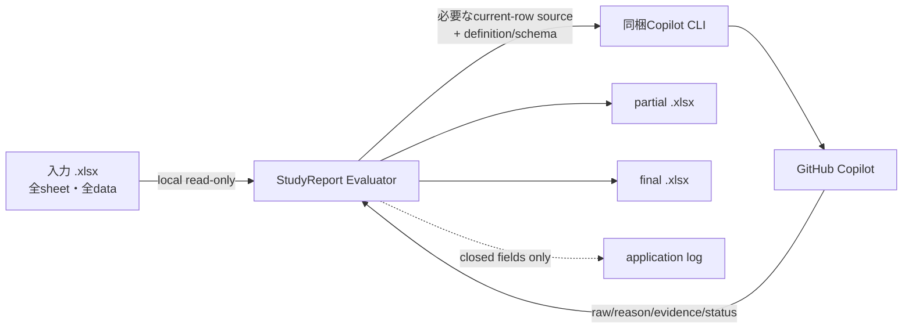

# データとprivacy

このガイドは、StudyReport Evaluatorが扱う情報と保存先を説明します。法的助言、組織承認、教育的妥当性の証明ではありません。

## 全体像

## AIへ送る情報

処理ごとに送る内容が異なります。

| 処理 | workbook由来の値 | その他 |
|---|---|---|
| Reference | なし | Question text、closed output schema |
| Normal | current rowの選択済み主回答・補助列 | Question、Prompt、criterion metadata、許可source IDs、closed schema |
| Special | current rowの選択済み固有評価主値・補助列 | Question、利用者Prompt、closed schema |
| Similarity | current rowの主回答 | 同じQuestionの保存済みReference、closed schema |

workbook由来で送る値は、現在処理しているrowの選択済みsourceだけです。他row、非選択列、workbook pathは通常payloadへ含めません。

「選択済みcellだけを送る」はworkbook由来の値についての説明です。Question text、利用者Prompt、criterion、Reference、schema metadataも処理に必要な範囲で送ります。

## AIへ公開しないapp capability

各attemptは必要なresult toolだけを持つrestricted sessionです。StudyReport Evaluatorは評価sessionへshell、filesystem、Web、GitHub write、MCP toolを公開しません。

これはGitHub Copilot serviceや同梱CLI全体のデータ取扱いを置き換える説明ではありません。利用するaccount・組織のGitHub Copilot policyも確認してください。

## application log

application loggerはclosedな項目だけを扱います。

- event code
- severity
- attempt/count/limit/concurrency
- failure category
- appが生成したsession ID

回答、Prompt、Reference、reason、evidence、file path、credentialを受け取るfree-text parameterはありません。SDKが返したtoken usage数値はapplication logへ出さず、観測できたunitだけをRun sheetへ集計します。

## input

入力workbookはread-onlyで開きます。run開始時にSHA-256、size、last-write timeを記録し、checkpoint更新・再開・final commit時に再確認します。不一致時は新しい送信やfinal commitを停止します。

ただし、同時に別applicationで入力を編集しないことを推奨します。入力を変更する場合はrunを止め、変更完了後に最初から読み込み直してください。

## partial

`.partial.xlsx`は入力全体のbyte-copyへ`Quantification_Checkpoint`を追加した標準workbookです。次を含み得ます。

- 入力の全sheet・全data
- definition snapshotとPrompt
- input/definition/model/runtime identity
- Reference
- complete rowのraw、reason、evidence、status、usage

partialは暗号化containerではありません。保存先のOS access controlに従います。final完成までは再開に必要な正本なので、編集、rename、copy、削除しないでください。

## final

finalも入力を匿名化・縮小したfileではありません。入力の全sheet・全dataを保持し、次を追加します。

- `Quantification_Config`: definition、Prompt、mapping、range、配点
- `Quantification_References`: Question、Reference、model、status、時刻
- `Quantification_Results`: raw、override、reason、evidence、status、formula、score
- `Quantification_Run`: input/definition/runtime identity、時刻、件数、観測usage

選択しなかったsheet、管理列、氏名、email等も入力にあればそのまま残ります。

## 運用上の注意

- input、partial、finalへ同等以上のaccess controlを適用する
- 共有前に元sheetとapp-owned sheetsの含有情報を確認する
- repository、issue、chat、通常test artifactへ実在学生本文を貼らない
- retention期限と削除手順は所属組織の規則に従う
- appは送信権限、保持期間、共有先の安全性、法的根拠を判定しない

## credential

アプリはPAT、password、client secret、独自OAuth credentialを入力・保存しません。同梱Copilot CLIで利用者本人が完了した対話loginを使います。

loginできない場合、新しいAI処理は開始できません。workbook読込や設計編集は引き続き利用できます。

## 非保証

- AI score、reason、evidenceの正確性
- 教育的妥当性、公平性
- 法的適合性、組織policy適合性
- Similarityによる不正行為判定
- GitHub Copilot service側の契約・保持・料金

> [!WARNING]
> 生成AIが行う評価には正確性が欠ける可能性があるため、必ず自分で責任をもって評点を行ってください。このツールや生成AIは評価結果に対しては一切の責任を負えません
