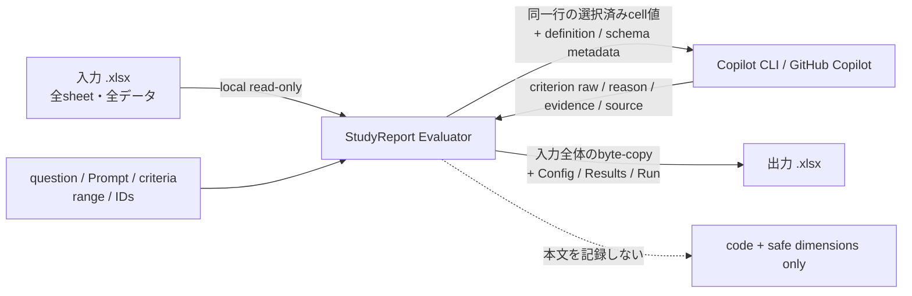

# データとprivacy

対象読者は教員、情報管理担当、運用担当です。本書はアプリが実際に扱うデータ経路を説明します。法的助言、機関承認、教育的妥当性の証明ではありません。

## データフロー

実装根拠: [`SafeEvaluationPayloadBuilder.cs`](../src/StudyReportEvaluator.Core/Prompting/SafeEvaluationPayloadBuilder.cs)、[`WorkingPackage.cs`](../src/StudyReportEvaluator.App/Workbooks/Writing/WorkingPackage.cs)、[`SafeLogger.cs`](../src/StudyReportEvaluator.App/Logging/SafeLogger.cs)。

## Copilotへ送る情報

### workbook由来

- 現在のevaluation unitと同じ行のprimary value
- 同じ行の、利用者が選択したsupporting values

他行、非選択列、workbook pathはpayloadへ含めません。source cellにはExcel列名をstable source IDとして割り当てます。

### definition由来

- question text
- evaluator ID
- criterion ID、表示名、description、effective range
- Custom Prompt template、またはapp-owned Knowledge template
- expected criterion IDs、許可source IDs、app-owned structured-output instruction

したがって「選択cellだけを送る」という表現は、**workbook由来の値**に限定した説明です。Prompt全体にはdefinition metadataも含まれます。

根拠: [`SafeEvaluationPayloadBuilder.cs`](../src/StudyReportEvaluator.Core/Prompting/SafeEvaluationPayloadBuilder.cs#L52-L87)、[`SafeEvaluationPayloadBuilder.cs`](../src/StudyReportEvaluator.Core/Prompting/SafeEvaluationPayloadBuilder.cs#L107-L160)。

## Copilotへ送らない情報

- 他のrow
- 非選択列
- workbook path
- app logや過去sessionから取得した本文
- evaluator / question / overall aggregate、weight、合否

結果tool以外のshell、filesystem、GitHub write、MCP、memory、session store等はsession configで無効化します。根拠: [`EvaluationSchemaFactory.cs`](../src/StudyReportEvaluator.App/Copilot/EvaluationSchemaFactory.cs#L179-L243)。

## log

production loggerの項目はevent code、severity、attempt、limit、concurrency、failure category、生成session IDに限定されます。回答、Prompt、reason、evidence、path、token、credentialを受け取るfree-text parameterはありません。

根拠: [`SafeLogger.cs`](../src/StudyReportEvaluator.App/Logging/SafeLogger.cs)、検証: [`SafeLoggerCanaryTests.cs`](../tests/StudyReportEvaluator.App.Tests/Logging/SafeLoggerCanaryTests.cs)。

## output workbookは入力と同等以上に機密

出力は入力を縮小・匿名化したfileではありません。入力workbookをbyte-copyするため、選択しなかったsheet、管理列、氏名、email、元回答等も入力に存在すればそのまま残ります。

さらに`Quantification_Config`には次が追加されます。

- question text
- Custom Prompt
- evaluator / criterionの表示名とdescription
- source mapping、range、weight、rounding
- canonical definition snapshotとSHA-256

`Quantification_Results`にはAI raw、override、reason、evidence、status、formulaが追加されます。

根拠: [`WorkingPackage.cs`](../src/StudyReportEvaluator.App/Workbooks/Writing/WorkingPackage.cs#L105-L155)、[`ConfigSheetWriter.cs`](../src/StudyReportEvaluator.App/Workbooks/Writing/ConfigSheetWriter.cs#L129-L249)、[`ResultsSheetWriter.cs`](../src/StudyReportEvaluator.App/Workbooks/Writing/ResultsSheetWriter.cs#L157-L171)。

### 運用上の扱い

- inputとoutputへ同等のaccess controlを適用する。
- outputを共有する前に、元sheetとConfig / Resultsの含有情報を確認する。
- appはretention期限、自動削除、共有先の安全性を判定しない。
- repositoryや通常のtest artifactへ実在学生の本文を追加しない。

## credential

アプリ固有OAuth app、client ID、client secret、PATを入力・保存しません。別途導入済みCopilot CLIのlogged-in userを使用します。根拠: [`CopilotClientFactory.cs`](../src/StudyReportEvaluator.App/Copilot/CopilotClientFactory.cs#L258-L270)。

## 検証できていない境界

- authenticated live Copilot smoke: `NOT_RUN`
- external Excel / LibreOffice recalculation: `NOT_RUN`
- AI scoreの教育的品質、公平性、法的適合性、組織policy適合性: 非保証

証跡: [`traceability.md`](../docs-dev/traceability.md#optional-advisory-evidence--never-a-required-substitute)。
