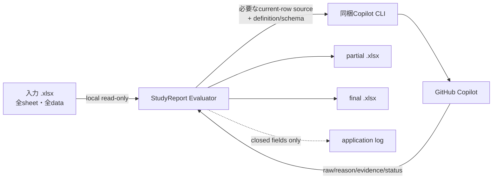

# データとprivacy

このガイドは、StudyReport Evaluatorが扱う情報と保存先を説明します。法的助言、組織承認、教育的妥当性の証明ではありません。

> **対象版と確認範囲:** 単一EXEと「GitHubにログイン」buttonの説明は、現在のソースの`0.8.4`候補（**UNRELEASED・未公開**）向けです。公開`v0.8.1`はZIP配布で、単一EXEもlogin buttonもありません。**clean-host試験と本人loginは`NOT_RUN`**であり、OS-only環境での動作、実認証、新EXEの公開完了を示すものではありません。配布状況と起動・login手順は[README](../README.md)を確認してください。

## 全体像

## offline GUIと外部通信

GUI起動、Excel読込、mapping、採点設計は、本人loginやAI利用とは分離したoffline機能として設計しています。clean-hostでの実証は上記のとおり未完了です。GUI起動、Prompt適用、状態確認からloginやAI評価を暗黙に開始しません。

上図の評価データ送信とは別に、CLI／ブラウザーによるGitHubとのOAuth認証にはnetwork接続が必要です。**Copilot 状態を確認**も認証状態と利用可能modelを要求するため、AI評価を開始しなくてもCLI／SDKがnetwork通信を行うことがあります。**「AI評価なし」は「network通信なし」ではありません。** AI利用には本人認証に加え、利用可能account・model、network接続、組織policy上の許可が必要です。

## AIへ送る情報

処理ごとに送る内容が異なります。

| 処理 | workbook由来の値 | その他 |
|---|---|---|
| Reference | なし | Question text、closed output schema |
| Normal | current rowの選択済み主回答・補助列 | Question、Prompt、criterion metadata、許可source IDs、closed schema |
| Special | current rowの選択済み固有評価主値・補助列 | Question、利用者Prompt、closed schema |
| Similarity | current rowの主回答 | 同じQuestionの保存済みReference、closed schema |

workbook由来で送る値は、現在処理しているrowの選択済みsourceだけです。他row、非選択列、workbook pathは通常payloadへ含めません。

「選択済みcellだけを送る」はworkbook由来の値についての説明です。Question text、利用者Prompt、criterion、Reference、schema metadataも処理に必要な範囲で送ります。

## AIへ公開しないapp capability

各attemptは必要なresult toolだけを持つrestricted sessionです。StudyReport Evaluatorは評価sessionへshell、filesystem、Web、GitHub write、MCP toolを公開しません。

これはGitHub Copilot serviceや同梱CLI全体のデータ取扱いを置き換える説明ではありません。利用するaccount・組織のGitHub Copilot policyも確認してください。

## application log

application loggerはclosedな項目だけを扱います。

- event code
- severity
- attempt/count/limit/concurrency
- failure category
- appが生成したsession ID

回答、Prompt、Reference、reason、evidence、file path、credentialを受け取るfree-text parameterはありません。SDKが返したtoken usage数値はapplication logへ出さず、観測できたunitだけをRun sheetへ集計します。

## 単一EXEのruntime抽出cacheと保存先

未公開候補の単一EXEは.NET標準hostが、通常は標準userの一時領域`%TEMP%/.net/<app>/<bundle-id>/`へ内容を展開します。展開内容はアプリ本体、.NET／native library、同梱Copilot CLI、runtime manifest、README／利用者docs／画像／LICENSE等の配布物です。**このcacheはアプリ配置用であり、入力workbook／final／partialの保管先でも、CLI credential storeでもありません。**

cacheはアプリ終了後も残り、再利用され得ます。1ファイル配布は「ディスク上も1ファイル」「痕跡なし」を意味しません。アプリは独自cache管理、自動掃除、cacheの再帰削除、旧版の自動削除を行いません。

入力は元の場所でread-onlyのまま扱い、final／partialの初期出力先は従来どおり入力fileに隣接する`result`です。EXE配置先や抽出cacheへ変更せず、配布・展開・起動のために利用者workbookを移動・変更・削除しません。出力先はrun開始前に利用者が変更できます。完成成功後のpartial cleanupは、このruntime cacheの扱いとは別です。

## input

入力workbookはread-onlyで開きます。run開始時にSHA-256、size、last-write timeを記録し、checkpoint更新・再開・final commit時に再確認します。不一致時は新しい送信やfinal commitを停止します。

ただし、同時に別applicationで入力を編集しないことを推奨します。入力を変更する場合はrunを止め、変更完了後に最初から読み込み直してください。

## partial

`.partial.xlsx`は入力全体のbyte-copyへ`Quantification_Checkpoint`を追加した標準workbookです。次を含み得ます。

- 入力の全sheet・全data
- definition snapshotとPrompt
- input/definition/model/runtime identity
- Reference
- complete rowのraw、reason、evidence、status、usage

partialは暗号化containerではありません。保存先のOS access controlに従います。final完成までは再開に必要な正本なので、編集、rename、copy、削除しないでください。

final完成成功後には、そのrunのpartialを削除します。削除に失敗してもfinalは有効で、残存partialのcleanup warningを表示します。これはcheckpoint処理であり、runtime cacheやCLI credentialの削除・失効ではありません。再開手順は[はじめに](getting-started.md#checkpointから再開)を参照してください。

## final

finalも入力を匿名化・縮小したfileではありません。入力の全sheet・全dataを保持し、次を追加します。

- `Quantification_Config`: definition、Prompt、mapping、range、配点
- `Quantification_References`: Question、Reference、model、status、時刻
- `Quantification_Results`: raw、override、reason、evidence、status、formula、score
- `Quantification_Run`: input/definition/runtime identity、時刻、件数、観測usage

選択しなかったsheet、管理列、氏名、email等も入力にあればそのまま残ります。

## 運用上の注意

- input、partial、finalへ同等以上のaccess controlを適用する
- 共有前に元sheetとapp-owned sheetsの含有情報を確認する
- repository、issue、chat、通常test artifactへ実在学生本文を貼らない
- retention期限と削除手順は所属組織の規則に従う
- appは送信権限、保持期間、共有先の安全性、法的根拠を判定しない

## credential

アプリはpassword、PAT、client secret、token、device code、独自OAuth credentialを入力・収集・解析・保存・application log出力しません。これらをアプリへ渡さないでください。本人認証のOAuth対話、認証用console／ブラウザー、credential保管は同梱CLI／ブラウザーへ委譲します。アプリ独自のOAuth、token入力UI、WebView、callback serverは追加していません。

**アプリがcredentialを収集・保存しないことと、CLI自身が認証情報を保存することは別です。** 同梱CLI `1.0.79`の`login --help`は、system credential storeが見つからない、または利用に問題がある場合、tokenを`~/.copilot/`配下の**平文config file**へ保存するfallbackを案内しています。CLI側の保管が常に安全・暗号化済みであるとは保証しません。CLI／OSの保管仕様と利用環境、所属組織の規則を確認してください。

### loginの開始と再確認

1. **未公開`0.8.4`候補のみ**、利用者が**GitHubにログイン**を選んだ場合に開始します。manifest、RID、SDK／CLI版、SHA-256を検証した同梱native CLIの絶対pathだけを使い、PATH上の別CLIへfallbackしません。
2. shell、PowerShell、`cmd /c`を介さず、固定引数`--no-auto-update`、`--log-level none`、`login --web-flow`で直接子processを起動します。token等を引数・標準入力へ渡さず、標準入力／標準出力／標準errorをredirectせず、CLIの出力もcapture・解析しません。本人の対話はCLI／ブラウザー上で完了します。
3. 完了・取消・失敗後や再起動後は、既存の**Copilot 状態を確認**を利用者が選びます。processの開始・終了codeだけを認証成功とせず、login完了だけでmodelを自動選択したりAI評価を開始したりしません。

loginの二重開始と評価中のlogin開始を防ぎます。login processの終了を確認できない場合は、新しいloginやAI処理を開始せず、旧処理の終了を確認してください。アプリの再起動や認証確認成功だけでは旧処理の終了を保証しません。確認不能なら[トラブルシューティング](troubleshooting.md#loginの失敗取消終了処理)に従って問い合わせてください。CLI欠落・不一致時は配布物の再取得／ZIPの再展開を確認し、PATH上の別CLI導入やhash検証の緩和で回避しません。

公開`v0.8.1`にはlogin buttonがないため、同梱CLIで本人の対話loginを行い、既存の状態確認buttonで確認します。従来の対処は[トラブルシューティング](troubleshooting.md#copilotを利用できない)、候補版のlogin手順は[README](../README.md)を参照してください。

loginできない場合、新しいAI処理は開始できません。取消・失敗後もworkbook読込、mapping、設計編集、checkpoint確認は引き続き利用できます。

### login取消・アプリ終了とcredential

候補版の**ログインを取り消す**またはアプリ終了時に、終了・解放の対象とするのは、**このアプリが開始・所有した当該login CLI processだけ**です。process tree全体や名前一致で一括終了せず、ブラウザー、他のCLI、利用者workbook、credential storeには触れません。

このcleanupはlogoutやcredential削除・失効（revocation）ではありません。アプリは保存済みcredentialを削除せず、ブラウザー側で進んだ認証を取り消しません。アプリ終了やruntime cacheの有無を認証失効とみなさず、logout／失効が必要な場合は、利用者本人がCLI／GitHubの手順と所属組織の規則に従ってください。

## 非保証

- AI score、reason、evidenceの正確性
- 教育的妥当性、公平性
- 法的適合性、組織policy適合性
- Similarityによる不正行為判定
- GitHub Copilot service側の契約・保持・料金

> [!WARNING]
> 生成AIが行う評価には正確性が欠ける可能性があるため、必ず自分で責任をもって評点を行ってください。このツールや生成AIは評価結果に対しては一切の責任を負えません
