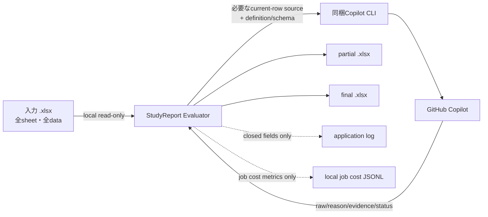

# データとprivacy

このガイドは、StudyReport Evaluatorが扱う情報と保存先を説明します。法的助言、組織承認、教育的妥当性の証明ではありません。

> **対象版と確認範囲:** 単一EXE、「GitHubにログイン」button、`setting.txt`への設定保存・適用の説明は、現在のソースの`0.8.6`候補（**UNRELEASED・未公開**）向けです。公開`v0.8.1`はZIP配布で、単一EXE、login button、本頁の設定保存・適用機能はありません。**clean-host試験と本人loginは`NOT_RUN`**であり、OS-only環境での動作、実認証、新EXEの公開完了を示すものではありません。配布状況は[README](../README.md)、候補版の起動・login手順は[はじめに](getting-started.md)を確認してください。
>
> 設定の説明は現行productionコードに基づきます。一時保存先の実設定fileとfake AI境界を使うdeterministic E2Eの成功は、native WindowsのUI／DPI／Narrator確認・本人walkthroughやrelease完了の証拠ではありません。版更新前の実EXE確認には実測がありますが、追加native確認は**NOT COMPLETE（FAIL）**です。Space／Narrator、本人walkthrough、隔離利用者環境のnative保存は`NOT_RUN`です。[確認範囲](getting-started.md#未公開候補の検証範囲)を参照し、部分的な観測を全native確認や公開の成功へ読み替えないでください。

## 全体像

## offline GUIと外部通信

GUI起動、Excel読込、mapping、採点設計は、本人loginやAI利用とは分離したoffline機能として設計しています。clean-hostでの実証は上記のとおり未完了です。GUI起動、Prompt適用、状態確認からloginやAI評価を暗黙に開始しません。

上図の評価データ送信とは別に、CLI／ブラウザーによるGitHubとのOAuth認証にはnetwork接続が必要です。**Copilot 状態を確認**も認証状態と利用可能modelを要求するため、AI評価を開始しなくてもCLI／SDKがnetwork通信を行うことがあります。候補版ではlogin processの正常終了後と、model一覧キャッシュがある場合の起動時にも、この再確認を自動で行います。キャッシュなしの旧設定・初回起動は自動確認しません。**「AI評価なし」は「network通信なし」ではありません。** AI利用には本人認証に加え、利用可能account・model、network接続、組織policy上の許可が必要です。

## AIへ送る情報

処理ごとに送る内容が異なります。

| 処理 | workbook由来の値 | その他 |
|---|---|---|
| Reference | なし | Question text、closed output schema |
| Normal | current rowの選択済み主回答・補助列 | Question、Prompt、criterion metadata、許可source IDs、closed schema |
| Special | current rowの選択済み固有評価主値・補助列 | Question、利用者Prompt、closed schema |
| Similarity | current rowの主回答 | 同じQuestionの保存済みReference、closed schema |

workbook由来で送る値は、現在処理しているrowの選択済みsourceだけです。他row、非選択列、workbook pathは通常payloadへ含めません。

「選択済みcellだけを送る」はworkbook由来の値についての説明です。Question text、利用者Prompt、criterion、Reference、schema metadataも処理に必要な範囲で送ります。

## AIへ公開しないapp capability

各attemptは必要なresult toolだけを持つrestricted sessionです。StudyReport Evaluatorは評価sessionへshell、filesystem、Web、GitHub write、MCP toolを公開しません。

これはGitHub Copilot serviceや同梱CLI全体のデータ取扱いを置き換える説明ではありません。利用するaccount・組織のGitHub Copilot policyも確認してください。

## application log

application loggerはclosedな項目だけを扱います。

- event code
- severity
- attempt/count/limit/concurrency
- failure category
- appが生成したsession ID

回答、Prompt、Reference、reason、evidence、file path、credentialを受け取るfree-text parameterはありません。SDKが返したtoken usage数値はapplication logへ出さず、観測できたunitだけをRun sheetへ集計します。これは次節の専用ジョブコストログとは別です。

## ジョブコストログ

AI処理を開始すると、アプリは今回のジョブだけの観測値を画面の**コスト詳細／ジョブログ**と、利用者別の`%LOCALAPPDATA%\StudyReportEvaluator\jobs\<job-id>.jsonl`へ記録します。JSON LinesはUTF-8の平文で、同じ入力・checkpointを再開した場合も開始操作ごとに別のjob ID・別ファイルです。既存Excelの`Quantification_Run`シートは残りますが、画面・ジョブログの表示はExcelを読む必要がありません。

記録するのは、生成したjob／attempt ID、UTC時刻、閉じた状態コード、試行数、入力・出力・推論・キャッシュのtoken数、SDKが報告した`nano-AI units`とpremium request消費量、項目ごとの観測状態と取得元（イベント／最終RPC／最後の呼び出しのみ）の試行数、モデル内訳とセッション総量が一致しなかった試行数、試行ごとにアプリが指定したreasoning effort（`RequestedReasoningEffort`。`medium`、未指定は`null`）です。**記録しない**ものは、回答、Prompt、Reference、reason、evidence、学生識別子、設問本文・名称、入力／出力の実path、credential・PAT・account識別子、SDK応答全文、例外本文・stack traceです。モデル内訳は実モデル名を保存せず、匿名化した識別子だけを記録します。

数値はGitHub Copilot SDKから観測できた範囲であり、請求確定額、アカウント全体の利用量、すべての実消費を保証しません。未取得は`—（未取得）`で表示し、0へ置き換えません。再試行、失敗、取消、checkpointへ保存されなかった途中行で観測できた値は今回ジョブに含み得ます。`nano-AI units`はSDK報告値で、アプリは通貨やAIクレジットへ換算しません。

ログは1ジョブ32 MiB、画面表示は最新200行までです。詳細が上限で省略された場合や保存に失敗した場合も、画面に状態を表示します。対応対象のWindowsでは、アプリは開始時に30日より古い、自身が作成した非稼働のジョブログだけを整理します。非Windowsでソースを実行した場合、安全な保持整理は未対応のため自動削除せず、その旨を表示します。ログは暗号化・監査証明・自動公開・cloud同期の対象ではありません。共有、保持、削除は所属組織の規則に従ってください。

画面内のジョブログは今回ジョブのメモリ上の履歴で、ディスク保存の成功を保証するものではありません。各行に入力・出力・推論・cache・`nano-AI units`・premium消費量の観測済み累計を表示します。**行同士を足し合わせないでください。** JSONLの`AggregationScope`は`CurrentInvocation`、`UnitPolicy`はSDK報告の原単位を保持しクレジット・通貨へ換算しない方針を示します。過去ログのアプリへの再取込・画面復元はありません。

開始・終端レコードの`Context`にはアプリ／SDK／CLIの数値バージョン、並列度、再開有無、匿名化した要求モデル識別子を記録します。不明な項目はnullです。バージョンのsuffixや任意文字列は保持しません。新しい観測値が以前の値より減った場合は下方訂正の履歴を示し、古い値を加算しません。

## 単一EXEのruntime抽出cacheと保存先

未公開候補の単一EXEは.NET標準hostが、通常は標準userの一時領域`%TEMP%/.net/<app>/<bundle-id>/`へ内容を展開します。展開内容はアプリ本体、.NET／native library、同梱Copilot CLI、runtime manifest、README／利用者docs／画像／LICENSE等の配布物です。**このcacheはアプリ配置用であり、入力workbook／final／partialの保管先でも、CLI credential storeでもありません。**

cacheはアプリ終了後も残り、再利用され得ます。1ファイル配布は「ディスク上も1ファイル」「痕跡なし」を意味しません。アプリは独自cache管理、自動掃除、cacheの再帰削除、旧版の自動削除を行いません。

入力は元の場所でread-onlyのまま扱います。final／partialの新規runの出力先は、利用者の明示指定がない場合だけ入力fileに隣接する`result`です。明示した絶対pathは設定へ保存でき、再起動・別入力の読込後も保持します。空欄へ戻すと未指定（`null`）になり、その時点の入力から`result`を算出します。この自動算出pathは設定へ保存せず、入力未選択なら「入力後に決定」です。指定先が利用不可でも別pathへfallbackせず、設定の読込だけでは出力directoryを作成しません。

EXE配置先や抽出cacheを既定の出力先にせず、配布・展開・起動のために利用者workbookを移動・変更・削除しません。出力先はrun開始前に変更できます。実行中の変更は次回用であり、現在runのimmutable snapshot・予約済みfinal／partial pathや既存checkpointの再開条件は変更しません。完成成功後のpartial cleanupは、このruntime cacheの扱いとは別です。

## setting.txtの保存と機密性（未公開候補）

### 保存場所と形式

設定は現在のOS利用者のLocalApplicationData配下、Windowsでは通常`%LOCALAPPDATA%\StudyReportEvaluator\setting.txt`に保存します。productionの`SettingsFileStore`が扱う**UTF-8 JSONの平文file**で、拡張子は`.txt`、設定schemaは整数`1`です。読込はUTF-8のBOMあり／なしを受け付けます。設定schema、採点定義のrevision／canonical schema、要求文書版、製品版は別です。

保存先はEXE配置先、入力／結果workbook、runtime抽出cache、CLI credential storeとは別です。実際の場所は**設定 → 共通 → 保存定義**で確認できます。場所を解決できない場合は保存を利用できず、EXE横やcwdへ代わりに書き込みません。新しい環境変数・API key・`.env`の作成は不要です。

### 保存する項目・しない項目

設定fileの項目は次のとおりです。

| JSON項目 | 保存する値 |
|---|---|
| `schemaVersion` | 設定形式の整数`1` |
| `preferredModelId` | 通常評価modelの希望ID、または未指定の`null`。認証済み・利用可能という保証ではない |
| `maxConcurrency` | 最大並列度1〜3、既定1 |
| `outputDirectoryOverride` | 利用者が明示した絶対出力path、または未指定の`null`。自動算出した`result`は保存しない |
| `definition` | 任意の採点定義1件、または`null`。複数profileや結果の保管庫ではない |
| `cachedModels` | 任意の最後に取得成功したmodel一覧。要素は`id`、`maximumPromptTokens`、`maximumContextWindowTokens`（各上限は正の整数または`null`）。省略／`null`はキャッシュなし、空配列`[]`も有効 |

設定schemaは`1`のままで、`cachedModels`のない旧設定も読み込めます。キャッシュはmodel metadataのみで、credential・account情報・login状態を含まず、現在の利用権限の証明でもありません。詳細な形式と旧実装での読込に関する注意は[設定ガイド](settings.md#保存場所と形式)を参照してください。

採点定義はID・name・revision、sheet／質問文行／回答行範囲、base／special配点・類似度係数・丸め、設問のID・名前・質問文・主列／補助列・配点・enabled、通常evaluatorの種別・組込template版・Custom Prompt・criterion・range・weight、固有評価のID・source・Prompt等を含みます。共通画面の「採点定義名」「定義revision」「丸めの桁数」も、この定義の値です。

次は専用の保存項目ではなく、設定保存のために自動収集しません。

- 入力xlsxのpath・bytes、回答行本文
- AI結果・reason・evidence・参照回答、run／checkpoint状態・partial指定
- 認証情報としてのcredential・account情報・login状態、CLI hash等のruntime診断
- Imported Promptの取込file一覧・未適用の本文・順序（定義へ明示適用したtemplateは定義の一部として保存）
- 画面の選択対象・表示ページ・カテゴリ・操作履歴、Control／Command、warningの承認状態（定義内のIDは保存）

**定義を明示保存すると、主回答列の選択で見出しセルから取り込んだ質問文も平文で保存されます。** 読込や主列変更だけでdiskへ自動保存する意味ではありません。設問text、Prompt、評価基準等へ利用者が貼り付けた学生回答・氏名・その他の機密情報や秘密情報も、定義に入れば保存され得ます。**「回答行を自動収集しない」は「機密な本文が設定に絶対に含まれない」という保証ではありません。** sheet名や明示出力path自体にも機密情報が含まれ得ます。

`setting.txt`は暗号化containerではありません。OSの利用者別保存先のaccess controlに従います。設定fileや内容をrepository、配布物、画像、log、issue、chat、共有証跡へ含めず、保存・共有・廃棄は所属組織の規則に従ってください。設定fileの自動削除・backup・履歴・cloud同期はありません。

### 画面への反映とdisk保存は別

- 起動時は設定を読み込みますが、fileなしなら既定値で続行し、明示保存または認証・一覧取得成功後のキャッシュ自動保存で初めてfileを作成します。主列変更・Prompt適用・画面遷移・**設定から戻る**・終了で共通設定や採点定義を自動保存しません。「戻る」は変更破棄でもありません。再起動後も使いたい編集は、終了前に明示保存してください。
- 認証・一覧取得に成功すると、保存済み設定を読み直して`cachedModels`だけを自動更新します。未保存の希望model・並列度・出力先・採点定義は保存しません。取得した全一覧をlocalで比較し、追加・削除・順序・上限値に変更がなければ書き直しません。破損・未対応schema・読込不能のfileは自動上書きせず、失敗は設定画面下部に表示し、次の状態確認成功時に再試行します。
- **設定を保存**は共通設定とInput／Designの最新draftを対象にします。入力未読込なら、既に読み込んだ保存定義を保持したまま共通設定を保存します。定義やPrompt・配点・共通値が不正な場合は旧fileと編集内容を保持し、保存しません。
- 保存開始時点の値を固定し、同じdirectoryの一意tempへ書込・flush・close後に旧fileを置き換えます。先に旧fileを削除・切り詰めません。保存開始を成功とは扱わず、開始後の再編集は成功後も未保存として残り得ます。失敗・置換前の取消では旧fileとdraftを保持します。
- tempの後始末はその保存で作ったfileだけへのbest effortです。失敗時に残る一時fileにも設定本文が含まれ得るため、同じ機密情報として扱います。別processとのmerge・監視はなく、最後に成功した保存が優先します。電源断や任意network filesystemまでの耐久性は保証しません。
- 認証状態・runtime情報は表示だけで保存しません。希望model IDと現在使えるmodelの選択も別です。明示または自動の認証・一覧再確認に成功し、希望IDが候補に存在する場合だけ実効選択へ反映し、不在なら未選択・no fallbackです。確認失敗ではキャッシュと希望IDを保持しますが、実行用の認証・model選択を解除し、再認証確認の成功まで評価できません。希望ID未指定の初回確認で表示する従来の初期選択も、暗黙の希望IDとしては保存しません。参照回答／類似度の固定`auto`は別に利用可否を確認します。

### 保存定義の適用は別の明示操作

起動時の読込は保存定義を保持するだけです。Excelを読み込み、**設定 → 共通 → 保存定義**で概要を確認して**現在の入力に適用**を選ぶと、現在の編集を保存定義へ置き換えるための検証を行います。保存定義の質問文行でExcelをread-only再読込し、入力identity、sheet、列、行範囲、定義全体を検証して、成功時だけInput／Designへ反映します。以前の質問行のmetadataを流用しません。

失敗・取消では現在のmetadata・draft・Designと保存fileを変更しません。成功時は保存したID・順序・質問文・Prompt・配点を保持し、候補の作り直しや新しいheader値への暗黙置換をしません。その後に利用者が主回答列を変更すると、既存どおり交差セルの値へ質問文を更新します。Imported Prompt一覧・本文・順序は適用で変更・消去しません。

run中の一括適用はできません。別Excelのsheet・列が存在しても授業内容の一致やcheckpoint再開可能性は保証せず、利用者の確認と既存の再開検証が必要です。認証・一覧の自動再確認は前述のキャッシュありの起動時とlogin正常終了後に限り、設定の明示再読込・保存・適用からは開始しません。login・AI評価も自動開始しません。

障害時は[設定のトラブルシューティング](troubleshooting.md#設定を保存読み込めない未公開候補)を確認してください。詳細な操作は[設定ガイド](settings.md)を参照してください。

## input

入力workbookはread-onlyで開きます。run開始時にSHA-256、size、last-write timeを記録し、checkpoint更新・再開・final commit時に再確認します。不一致時は新しい送信やfinal commitを停止します。

ただし、同時に別applicationで入力を編集しないことを推奨します。入力を変更する場合はrunを止め、変更完了後に最初から読み込み直してください。

## partial

`.partial.xlsx`は入力全体のbyte-copyへ`Quantification_Checkpoint`を追加した標準workbookです。次を含み得ます。

- 入力の全sheet・全data
- definition snapshotとPrompt
- input/definition/model/runtime identity
- Reference
- complete rowのraw、reason、evidence、status、usage

partialは暗号化containerではありません。保存先のOS access controlに従います。final完成までは再開に必要な正本なので、編集、rename、copy、削除しないでください。

final完成成功後には、そのrunのpartialを削除します。削除に失敗してもfinalは有効で、残存partialのcleanup warningを表示します。これはcheckpoint処理であり、runtime cacheやCLI credentialの削除・失効ではありません。再開手順は[はじめに](getting-started.md#checkpointから再開)を参照してください。

## final

finalも入力を匿名化・縮小したfileではありません。入力の全sheet・全dataを保持し、次を追加します。

- `Quantification_Config`: definition、Prompt、mapping、range、配点
- `Quantification_References`: Question、Reference、model、status、時刻
- `Quantification_Results`: raw、override、reason、evidence、status、formula、score
- `Quantification_Run`: input/definition/runtime identity、時刻、件数、観測usage

選択しなかったsheet、管理列、氏名、email等も入力にあればそのまま残ります。

## 運用上の注意

- input、partial、finalへ同等以上のaccess controlを適用する
- `setting.txt`と保存失敗時に残った設定の一時fileも、含有する本文に応じて同等以上に保護する
- 共有前に元sheetとapp-owned sheetsの含有情報を確認する
- repository、issue、chat、通常test artifactへ実在学生本文を貼らない
- retention期限と削除手順は所属組織の規則に従う
- appは送信権限、保持期間、共有先の安全性、法的根拠を判定しない

## credential

アプリの認証処理はpassword、PAT、client secret、token、device code、独自OAuth credentialを入力・収集・解析・保存・application log出力しません。これらを設問textやPrompt等へ貼り付けないでください。貼付内容が定義に入った場合の平文保存は、上記の設定fileの説明に従います。本人認証のOAuth対話、認証用console／ブラウザー、credential保管は同梱CLI／ブラウザーへ委譲します。アプリ独自のOAuth、token入力UI、WebView、callback serverは追加していません。

**アプリの認証処理がcredentialを収集・保存しないことと、CLI自身が認証情報を保存することは別です。** 同梱CLI `1.0.79`の`login --help`は、system credential storeが見つからない、または利用に問題がある場合、tokenを`~/.copilot/`配下の**平文config file**へ保存するfallbackを案内しています。CLI側の保管が常に安全・暗号化済みであるとは保証しません。CLI／OSの保管仕様と利用環境、所属組織の規則を確認してください。

### loginの開始と再確認

1. **未公開`0.8.6`候補のみ**、利用者が**GitHubにログイン**を選んだ場合に開始します。manifest、RID、SDK／CLI版、SHA-256を検証した同梱native CLIの絶対pathだけを使い、PATH上の別CLIへfallbackしません。
2. shell、PowerShell、`cmd /c`を介さず、固定引数`--no-auto-update`、`--log-level none`、`login --web-flow`で直接子processを起動します。token等を引数・標準入力へ渡さず、標準入力／標準出力／標準errorをredirectせず、CLIの出力もcapture・解析しません。本人の対話はCLI／ブラウザー上で完了します。
3. login processの正常終了後は認証状態とmodel一覧を自動再確認します。取消・失敗後や再確認失敗時は、利用者が**Copilot 状態を確認**で再試行します。processの開始・終了codeだけを認証成功とせず、実効modelは再確認結果に従って反映します。AI評価は自動開始しません。

loginの二重開始と評価中のlogin開始を防ぎます。login processの終了を確認できない場合は、新しいloginやAI処理を開始せず、旧処理の終了を確認してください。アプリの再起動や認証確認成功だけでは旧処理の終了を保証しません。確認不能なら[トラブルシューティング](troubleshooting.md#loginの失敗取消終了処理)に従って問い合わせてください。CLI欠落・不一致時は配布物の再取得／ZIPの再展開を確認し、PATH上の別CLI導入やhash検証の緩和で回避しません。

公開`v0.8.1`にはlogin buttonがないため、同梱CLIで本人の対話loginを行い、既存の状態確認buttonで確認します。従来の対処は[トラブルシューティング](troubleshooting.md#copilotを利用できない)、候補版のlogin手順は[はじめに](getting-started.md#githubにログイン未公開086候補のみ)を参照してください。

loginできない場合、新しいAI処理は開始できません。取消・失敗後もworkbook読込、mapping、設計編集、checkpoint確認は引き続き利用できます。

### login取消・アプリ終了とcredential

候補版の**ログインを取り消す**またはアプリ終了時に、終了・解放の対象とするのは、**このアプリが開始・所有した当該login CLI processだけ**です。process tree全体や名前一致で一括終了せず、ブラウザー、他のCLI、利用者workbook、credential storeには触れません。

このcleanupはlogoutやcredential削除・失効（revocation）ではありません。アプリは保存済みcredentialを削除せず、ブラウザー側で進んだ認証を取り消しません。アプリ終了やruntime cacheの有無を認証失効とみなさず、logout／失効が必要な場合は、利用者本人がCLI／GitHubの手順と所属組織の規則に従ってください。

## 非保証

- AI score、reason、evidenceの正確性
- 教育的妥当性、公平性
- 法的適合性、組織policy適合性
- Similarityによる不正行為判定
- GitHub Copilot service側の契約・保持・料金

> [!WARNING]
> 生成AIが行う評価には正確性が欠ける可能性があるため、必ず自分で責任をもって評点を行ってください。このツールや生成AIは評価結果に対しては一切の責任を負えません
