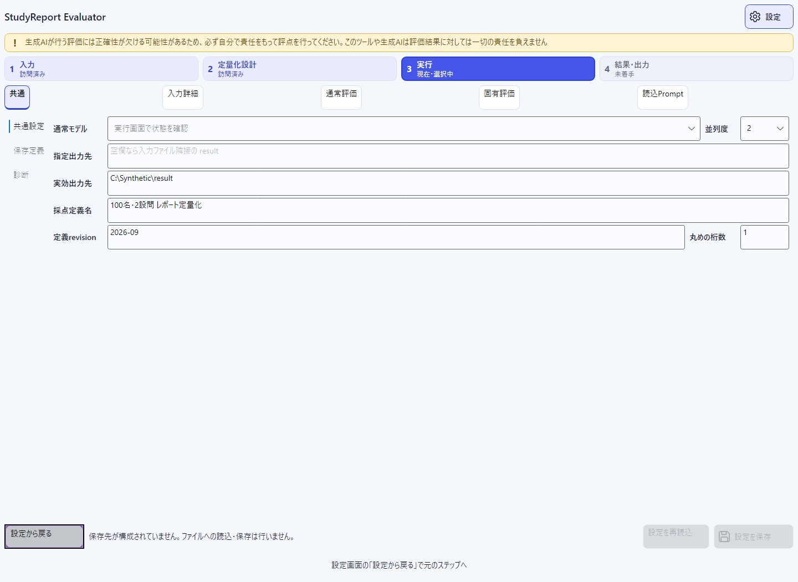
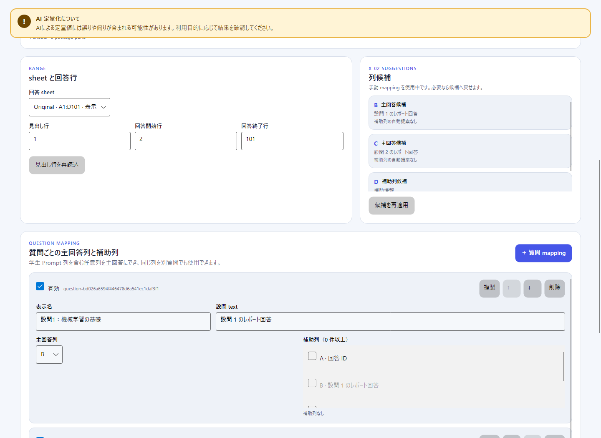

# 設定ガイド

主画面の4ステップを保ったまま、詳細設定を編集し、次回起動にも使う設定を明示保存する方法を説明します。最初の評価までの流れは[はじめに](getting-started.md)を参照してください。

> **対象版:** 現在のソース候補`0.8.6`（**UNRELEASED・未公開**）、要求文書v4.6に対応する説明です。公開`v0.8.1`はZIP配布で、本頁の設定保存・適用機能はありません。本頁は公開・実配布物の検証完了を示しません。

## 設定の開き方と戻り方

右上の**設定**、または主画面の**入力詳細…／設問の詳細／通常評価／固有評価／読込Prompt（件数）／変更**から開きます。設定は同じウィンドウ内の内容画面で、modalや第5ステップではありません。

| カテゴリ | 編集・確認する内容 | 主画面に残るもの |
|---|---|---|
| **共通** | 通常モデル、並列度、指定出力先、採点定義名・revision・丸め、保存定義、読取専用の診断 | 実行画面の実効値と変更入口、認証・開始・取消 |
| **入力詳細** | 設問名、補助列、候補詳細、設問の追加・複製・並替え・削除 | 入力file、sheet・行範囲、有効状態、主回答列、設問文の編集 |
| **通常評価** | Knowledge／Custom、evaluator・criterion、range・weight、Prompt | 採点設計の通常評価概要と配点 |
| **固有評価** | 固有項目名・enabled、主対象列・補助列、Prompt | 採点設計の固有配点と概要 |
| **読込Prompt** | 起動時に読み込んだ原文、適用先の選択、明示コピー | 採点設計の読込件数と入口 |

入口から開いた設問はIDで引き継ぎます。**設定から戻る**は元ステップへ戻る操作で、保存でも編集の破棄でもありません。同一起動中の値・対象ID・ページ・カテゴリ・入力途中の編集を保持します。対象が削除された場合は残る隣の対象へ移ります。選択IDや表示ページ自体は設定fileへ保存しません。

カテゴリ切替後は利用可能な該当欄へフォーカスを移し、利用できない場合はカテゴリボタンへ戻します。設定終了時は呼出元が残っていて利用可能ならそこへ、そうでなければ元画面の利用可能な操作へ戻ります。Tab／Shift+Tabで移動でき、長文の設問・Promptや全文pathは各欄内でスクロール・選択できます。対象がないカテゴリも消さず、先にExcelや設問を用意するなどの理由を表示します。

有効な編集は保存操作を待たず次回用draftへ即時反映されますが、編集した共通設定・採点定義の永続化には**設定を保存**が必要です。例外として、認証・model一覧取得に成功した際の一覧だけは自動保存します。数値へ変換できない入力途中の文字列と確定値は別なので、エラーを解消し、主画面の概要へ反映された値を確認してください。往復やカテゴリ切替で認証確認・login・AI評価を始めることはありません。

## 共通

**共通 → 共通設定**で次を編集します。「共通設定／保存定義／診断」は共通カテゴリ内の表示切替で、6番目以降のカテゴリではありません。

| 画面の項目 | 扱い |
|---|---|
| **通常モデル** | 保存済み一覧を表示用に復元。明示または自動の認証・一覧再確認に成功した後、利用可能なmodelを実効選択へ反映 |
| **並列度** | 1〜3、既定1。変更は次回run用 |
| **指定出力先** | ドライブ等を含む完全修飾の絶対path、または空欄。例: `C:\Reports\Results` |
| **実効出力先** | 現在の明示指定と次回の入力から決まる読取専用表示。ここを保存用の指定値にはしない |
| **採点定義名／定義revision／丸めの桁数** | Designの採点定義を編集。Excel読込後に利用可能。丸めは既定1・範囲0〜6で、計算の各段階に影響 |

### 保存希望modelと実効model

保存するのは**希望ID**で、認証済み・利用可能という判定ではありません。今回の明示編集、保存済み共通値、従来の既定値の順に使います。

- 希望IDは、明示または自動の認証・一覧再確認に成功し、候補に存在するときだけ実効選択へ反映します。不在なら未選択のままなので、共通設定で利用可能なmodelを選び直します。別modelへfallbackしません。
- 確認失敗だけでは希望IDを消しません。希望ID未指定の初回は従来の確認成功後の初期選択を表示しますが、それだけで暗黙の希望IDを保存しません。
- 参照回答・類似度に使う固定`auto`の利用可否は通常modelと別に検証します。通常modelが使えても`auto`不在なら開始できません。
- 通常modelには`auto`を含む列挙された全modelを選べます。ただし`auto`はrouterのためSDKがtoken上限を公開せず、実行画面の上限は「SDK未公開・事前検証なし」となります。この場合はmodel相対の容量検査を行わず、大きすぎるrequestは送信後に行ごとの技術statusとして記録されます。app自身の絶対上限は常に適用されます。
- **共通 → 診断**の認証状態・runtime情報は取得済みの情報を読むだけで、保存対象外です。表示する希望IDとも区別します。ここを開いても新たな認証確認やloginは行いません。

### model一覧のキャッシュと自動再確認

- **GitHubにログイン**で開始したlogin processが正常終了すると、認証状態とmodel一覧を自動で再確認します。終了codeだけを認証成功とは扱わず、AI評価も開始しません。取消・失敗後や再確認に失敗した場合は、**Copilot 状態を確認**で再試行します。
- 起動時は保存済み`cachedModels`を表示用に復元し、**キャッシュがある場合だけ**認証・一覧を自動で再確認します。空配列`[]`もキャッシュありとして扱います。項目のない旧設定や`null`、fileなしの初回起動では自動確認せず、明示確認またはloginを待ちます。自動確認ではlogin・AI評価を開始しませんが、CLI／SDKのnetwork通信は発生し得ます。
- 明示確認・login後・キャッシュありの起動時確認のいずれでも、認証・一覧取得に成功すると最後に取得した一覧を同じ利用者別`setting.txt`へ自動保存します。保存済み設定を読み直して**`cachedModels`だけを置き換え**、未保存の希望model・並列度・出力先・採点定義は保存しません。fileなしなら既定設定を基に作成します。
- modelの追加・削除・順序変更・上限値の変更を比較して反映し、保存済み一覧と同じならfileを書き直しません。これは**APIから全一覧を取得してlocalで比較する処理**であり、network上の差分取得APIではありません。
- 認証・一覧取得の失敗時は最後のキャッシュを保持しますが、実行用の認証・model選択は解除します。**一覧が表示されても、現在の認証確認に成功するまでは評価できません。** キャッシュにcredential・account情報・login状態は保存しません。
- 自動保存は破損・未対応schema・読込不能の設定fileを上書きしません。自動保存処理（callback）の失敗・取消は**設定画面下部のモデル一覧保存状態**へ表示し、次の状態確認成功時に再試行します。一覧が同じでも前回保存できていなければ再試行の対象です。編集した設定の「未保存」と一覧の保存結果は別です。

### 指定出力先と実効出力先

明示出力先を保存すると、再起動後や別Excelへ変更した後もその絶対pathを保持します。**指定出力先を空欄にする操作は未指定（`null`）への明示変更**で、以前の保存指定へ勝手に戻りません。

`null`の場合だけ、現在の入力fileに隣接する`result`を都度算出します。入力Aから入力Bへ変えればBの隣接先となり、入力未選択なら**入力後に決定**です。入力画面から直接共通設定を開いた場合も次回の入力を基準に表示します。自動算出したpathは指定値として保存しません。空欄の選択を次回起動にも残す場合は**設定を保存**してください。

指定先が利用不可でも別pathへfallbackしません。相対pathを使わず、実行前に既存または作成可能なdirectoryかを確認します。設定の復元だけでは出力directoryを作りません。checkpoint再開では保存済みの予約pathを使い、この新規run用指定で置き換えません。

**08は意図的にstoreを構成しない合成デモです。**「保存先が構成されていません。ファイルへの読込・保存は行いません。」という表示は、本番利用者が手動setupすべき手順を示しません。本番アプリはOSの利用者別保存先を解決します。環境変数・API key・`.env`は不要です。

## 入力詳細

**設問**を選び、名前や補助列を編集します。補助列は一覧で列を選んで**補助に含める**を切り替えます。同じ設問の主回答列は補助列にできません。主回答列・有効状態・設問文はここでは確認用で、編集は入力主画面へ戻って行います。

**追加／複製／上へ／下へ／削除**は設問単位です。名前変更・並替えではIDを保持し、複製は新しいIDを作ります。これらの操作で既存の手動配点を自動調整しないため、採点設計で合計を再確認してください。

列候補を選ぶだけではmappingは変わりません。**候補一式を再適用**は、選択候補1件ではなくsheetの候補一式で設問と回答範囲を作り直し、手動mapping・設問文を置き換えます。保存ID等を保持して適用する後述の**現在の入力に適用**とは別の操作です。

## 通常評価

**設問 → 評価方法 → 評価項目**で対象を選びます。**基本**では名前・enabled・weight・rangeを編集し、各対象を追加・複製・並替え・削除できます。weightは0より大きい相対係数で、criterionの**個別の範囲**を使わなければevaluatorのrangeを引き継ぎます。最小値は最大値より小さくします。

**Prompt**の表示は評価方法によって異なります。

- **Knowledge:** アプリ管理の固定Prompt全文を読取専用で確認します。
- **Custom:** Prompt全文を編集します。`{回答}`と`{評価項目}`が必須です。隣のpreviewは安全な合成値による表示で、学生回答の読込やAI評価ではありません。
- CustomからKnowledgeへ種類を変更するとCustom本文を消去します。必要な本文を失わないよう、切替前に確認してください。

許可placeholderは`{設問}`、`{回答}`、`{補助情報}`、`{評価項目}`、`{最小点}`、`{最大点}`の6つです。literal braceは`{{`と`}}`で表します。詳しい記述規則は[Custom evaluator](custom-evaluator-guide.md)を参照してください。

## 固有評価

**設問 → 固有項目**を選び、追加・複製・並替え・削除を行います。**項目設定**では名前、有効状態、主対象列、0件以上の補助列を編集します。主対象列と同じ列は補助列から除きます。

固有評価の定量値は**0〜1固定**です。**Prompt**では`{回答}`を必須とする全文を編集し、合成値の読取専用previewを確認します。操作やpreviewではAIを実行しません。

固有配点はここでは読取専用で、採点設計主画面で変更します。配点0なら固有評価AIを実行せず、正の配点には有効な設問内の有効な固有項目が1件以上必要です。項目ごとのweightはなく、設問内と固有評価を持つ有効設問間で等分平均します。

## 読込Prompt

起動時に読み込んだPromptを、指定順のfile名と読取専用の原文で確認します。入力Excelの読込前でも原文を閲覧できますが、適用には入力と対象が必要です。

1. 原文の一覧からPromptを選びます。
2. **適用先の設問／適用先の種類**と、対象のCustom評価方法または固有評価を選びます。Knowledgeへは適用できません。
3. 表示された「設問 → Custom／固有評価」の対象を確認して、**Promptを適用**を選びます。

適用は本文のコピーだけです。file名による暗黙割当、画面遷移、設定保存、認証確認・login・AI評価は行いません。適用後の編集は通常評価／固有評価で行います。元の一覧・本文・順序は保持し、同じPromptを再利用できます。未適用一覧は`setting.txt`へ保存しません。起動方法は[Promptファイルから起動](prompt-launch.md)を参照してください。

## 保存場所と形式

保存先はOSの**LocalApplicationData配下`StudyReportEvaluator\setting.txt`**です。Windowsでは通常`%LOCALAPPDATA%\StudyReportEvaluator\setting.txt`で、実際の場所は**共通 → 保存定義 → 設定ファイルの保存先**に表示します。EXE、入力／出力workbook、runtime抽出cache、CLI credential storeとは別です。

拡張子は`.txt`ですが、中身は**UTF-8 JSON、設定schemaは整数`1`**です。読込はUTF-8のBOMあり／なしを受け付けます。要求版v4.6、製品候補0.8.6、採点定義revision・canonical schemaとは独立します。

| JSON項目 | 実際に保存する値 |
|---|---|
| `schemaVersion` | 必須の整数`1` |
| `preferredModelId` | 通常modelの希望ID、または`null`。利用可能と確認した実行状態ではない |
| `maxConcurrency` | 1〜3、既定1 |
| `outputDirectoryOverride` | 明示した完全修飾の絶対出力path、または`null`。自動算出`result`は保存しない |
| `definition` | 任意の採点定義**1件**、または`null` |
| `cachedModels` | 任意の最後に取得成功したmodel一覧。省略／`null`はキャッシュなし、空配列`[]`も有効 |

`cachedModels`の各要素は`id`、`maximumPromptTokens`、`maximumContextWindowTokens`を持つobjectです。`id`は有効で重複のないmodel ID、各上限値は正の整数または`null`（未取得）で、一覧は最大512件です。保存時にキャッシュが`null`なら項目を省略します。**schemaは`1`のまま**で、項目のない旧設定も読み込めます。ただし、`cachedModels`未対応の旧実装は同schemaの未知項目として拒否する場合があり、旧実装でも読める保証ではありません。

採点定義にはID・name・revision、sheet／質問文行／回答行範囲、base／special／類似度係数／丸め、設問名・text・mapping・配点・enabled、evaluator／criterionのID・種類・range・weight、組込template版、Custom Prompt、固有評価・適用済みPrompt等を含みます。ID・順序・decimal値・Unicode・改行・Promptを保持する保存で、checkpointの代用や複数profileの保管庫ではありません。

## 設定を明示保存する

起動時に設定を読み込み、共通設定を復元します。**保存定義は保持するだけで自動適用しません。login・AI評価も開始しません。** 認証・一覧の自動再確認は前述のキャッシュがある場合だけです。fileがない初回は既定値で続行し、明示保存または認証・一覧取得成功後のキャッシュ自動保存で初めてfileを作ります。設定読込の完了前は、未読の保存定義を消さないため明示保存できません。

1. 各画面の技術エラー、配点合計、Prompt・共通値を確認します。
2. 設定下部の**設定を保存**を選びます。保存するのは共通値とInput／Designの最新draftです。Excel未読込なら、読込済みの保存定義を消さずに共通値を保存します。
3. **保存済み**または失敗理由を確認します。編集の反映とdisk保存は別なので、再起動後も使う変更は終了前に明示保存してください。

| 状態 | 意味 |
|---|---|
| 未保存 | 編集内容が保存値と異なる。戻る・画面遷移・終了では自動保存しない |
| 保存中 | 保存開始時点の値を固定して書込中。開始しただけでは成功ではない |
| 保存済み | その保存対象の書込・置換が成功。保存中に再編集した現在draftは未保存のまま残り得る |
| 保存失敗 | 不正な共通値・定義・Prompt・配点、またはIO失敗。現在draftと旧fileを保持 |

保存は同じdirectoryの一意tempへwrite／flush／closeした後に置換します。先に旧fileを削除・直接切り詰めせず、失敗や置換前の取消では**旧bytesを保持**します。tempの後始末は自分が作ったfileだけへのbest effortで、残ったtempも設定と同様に保護してください。同一画面の二重保存は防ぎますが、別processでは最後に成功した保存が優先します。merge・履歴・自動backupはなく、電源断や任意network filesystemまでの耐久性は保証しません。

**設定を再読込**は保存済みの共通値を読み直します。読込前からある未保存の共通編集が保存値へ戻り得るため、押す前に確認してください。読込中の明示編集は優先し、採点定義は自動適用しません。

## 保存定義を現在の入力へ適用する

1. **1 入力**で標準`.xlsx`をread-onlyで読み込みます。
2. **設定 → 共通 → 保存定義**で、保存定義の概要（sheet・設問数・質問文行・回答行範囲）を確認します。
3. 現在の編集を保存定義へ置き換える意図がある場合だけ、**現在の入力に適用**を選びます。Excel未読込・保存定義なし・読込／保存／適用中・run中は利用できません。
4. 適用結果を確認し、**設定から戻る**で入力と採点設計の有効値を確認します。

保存定義の質問文行でExcel metadataをread-only再読込し、入力identity、sheet、header、回答行範囲、主列・補助列、定義全体を検証します。古いheader metadataを流用しません。**成功時だけInput metadata・選択値・draftとDesignを更新し、失敗・取消では現在のInput／Designを置き換えず、設定fileも変更しません。**

失敗時は**設定 → 共通 → 保存定義**の適用状態に一般的な失敗案内を表示しますが、具体的な失敗理由・codeは現行UIに表示されません。**入力側の技術検証は現在のdraftに対する結果であり、保存定義の適用失敗理由ではありません。** 保存定義のsheet・質問文行（header）・回答行範囲・主列／補助列を、現在の入力Excelと入力画面の設定に手動で照合してください。

成功時は保存したID・順序・設問text・Prompt・配点を保持します。候補の再生成や、別headerの文への暗黙置換は行いません。その後に利用者が主回答列を変更した場合だけ、従来どおり交差セルの値で設問textを更新します。Imported Promptの一覧・本文・順序は変更・消去せず、未適用Promptを定義へ取り込みません。

別Excelにsheetや列が存在することは、授業内容の一致やcheckpoint再開可能性の保証ではありません。意味的な対応は利用者が確認し、再開時は既存のinput／definition／model／runtime検証を別途通します。適用はfile保存・認証確認・login・AI実行ではありません。

## 実行中・前回結果との分離

実行中に編集・保存する設定は**次回用draft**です。現在runは開始時のrequest／immutable snapshot、model・並列度・出力条件、予約済みpathを保持します。保存定義の一括適用だけはrun中に行えません。

全画面に進捗入口と**停止**を残し、Settings表示中に完了しても結果へ強制移動しません。結果は**4 結果**で確認できます。単なる往復では再開指定や進捗を初期化せず、入力・定義変更時は次回実行準備で再開指定を解除し理由を表示します。

前回結果とoverrideは次回設定から分離し、Resultsの一覧／詳細を往復しても保持します。修正版の永続化は結果画面の**検証して出力**による別名workbookで、**設定を保存**ではありません。[結果・出力](getting-started.md#4-結果出力)を参照してください。

## 保存しない情報と平文保存の注意

次は設定保存のために自動収集・保存する項目ではありません。

- 入力xlsxのpath・bytes、学生の回答行本文
- AI結果、reason、evidence、参照回答、結果override
- run／checkpoint状態、新規／再開mode、partial指定
- 認証情報としてのcredential・account情報・login状態、CLI hash等のruntime診断（model一覧のキャッシュとは別）
- Imported Promptの取込file一覧・未適用本文・順序（明示適用したtemplateは定義に含む）
- Control／Command、選択ID・表示ページ・カテゴリ・操作履歴、warning承認状態

一方、**見出しセルから取り込まれた設問textは、定義を明示保存すると平文で含まれます。** Promptや評価基準等に利用者が貼り付けた学生回答・氏名・秘密情報も、定義に入れば保存され得ます。sheet名・明示出力pathにも機密情報が含まれ得ます。**回答行を自動コピーしないことは、秘密情報が設定に絶対に入らない保証ではありません。** 読込・主列変更だけでdiskへ自動保存する意味でもありません。

`setting.txt`は暗号化containerではなく、OSの利用者別保存先のaccess controlに従います。実内容をrepository・配布物・画像・log・issue・chat・共有証跡へ含めず、所属組織の規則に従って管理してください。詳しくは[データとprivacy](privacy-and-data-handling.md)を参照してください。

## fileなし・破損・保存失敗

| 状況 | 動作・対処 |
|---|---|
| fileなし（`Missing`） | 既定値で続行。明示保存または認証・一覧取得成功後のキャッシュ自動保存で作成。空fileを手作業で作らない |
| JSON／値が不正（`JsonInvalid`） | UTF-8、必須値・型・enum・範囲、schema欠損／不正型、同schemaの未知項目・重複項目等を拒否。部分適用せず元fileを保持 |
| 未対応schema（`UnsupportedVersion`） | 整数1以外の設定版を自動移行しない。schema番号だけを書き換えて回避しない |
| 読込失敗（`ReadFailed`） | 元fileを保持。保存先・利用者のアクセス権等を確認し、原因解消後に**設定を再読込** |
| 保存失敗（`InvalidSettings`／`WriteFailed`） | 旧bytesと現在draftを保持。値または書込権限・容量・占有等を確認し、明示保存を再試行 |
| 保存先を解決できない | 読込・保存を無効にして理由を表示。EXE横・cwd・cacheへfallbackしない |

破損・未対応版・読込拒否でもoffline編集は継続でき、自動修復・削除・移行は行いません。モデル一覧の自動保存でも元fileを上書きしません。ただし、**その後に有効な設定を明示保存すると元fileを置き換えます**。元fileを残したい場合は、上書きの意図がないまま保存しないでください。環境変数や`.env`を新設する復旧手順はありません。詳しい切り分けは[トラブルシューティング](troubleshooting.md#設定を保存読み込めない未公開候補)を参照してください。

## 対応範囲と検証の限界

採点定義1件の保存・読込・明示適用に対応しますが、複数profileの管理・切替と保存済みfinal workbookの再importは未対応です。model一覧以外の設定の自動保存、採点定義の自動適用、cloud同期は行いません。

本頁と[はじめに](getting-started.md)が参照する画像は、[画像一覧](../images/README.md)の**8枚（01〜08）**です。05の認証未確認、06のfake結果、07の未保存修正版、08のNO STOREを実認証・実出力・実設定保存の証拠にしません。画像は製品`0.8.4`の時点で生成し、版更新に伴う再生成はしていません。

既存の対象検証とレビューは[未公開候補の検証範囲](getting-started.md#未公開候補の検証範囲)を参照してください。追加native確認は**NOT COMPLETE（FAIL）**で、版更新前のP06で実測済みの実EXE確認とは区別します。Space／Narrator、本人walkthrough、隔離利用者環境のnative保存、fresh clean-host CH-01〜06・本人loginは未実施です。過去の成功で変更後の最終EXE／ZIP・sidecarの検証や公開条件を省略しません。