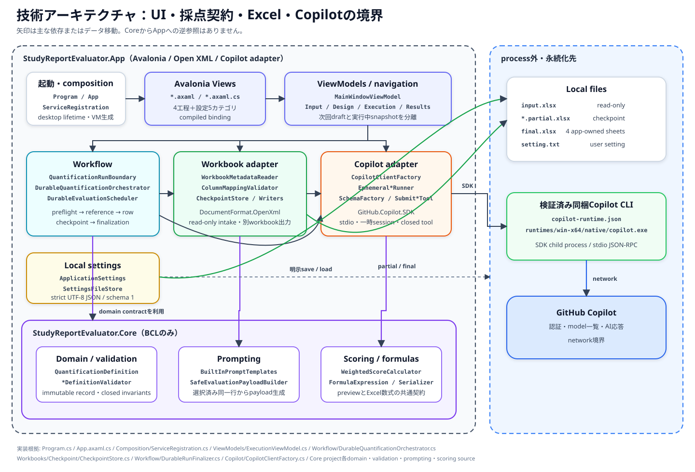
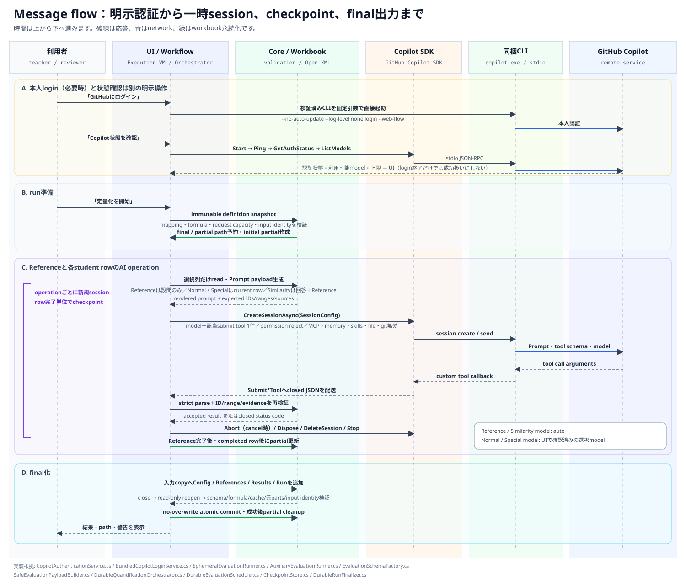

# StudyReport Evaluator 技術ガイド

本書は、StudyReport Evaluatorを保守・拡張するソフトウェアエンジニア向けの実装ガイドです。利用手順は[製品README](../README.md)、評価Promptだけを編集する場合は[Custom evaluatorガイド](custom-evaluator-guide.md)を先に参照してください。

本書の説明は2026-09-15時点の現行sourceを直接確認したものです。型名とfile pathはrepository sourceの所在を示します。配布物にはsourceが含まれないため、source pathはリンクではなくcode表記にしています。

## まず見る3つの図

### 製品全体とGitHub Copilot CLI


StudyReport EvaluatorはAI modelを内蔵しません。アプリ内のGitHub Copilot SDKが、検証済みの同梱GitHub Copilot CLIを子processとして起動し、CLIがGitHub Copilotサービスと通信します。入力・採点契約・検証・checkpoint・出力はアプリが管理します。

### Componentとproject境界



### 認証・評価・保存のmessage flow



図は現行実装を説明する論理図であり、network topology、GitHub内部構成、性能測定、live認証成功の証跡ではありません。図版の一覧と範囲は[画像一覧](../images/README.md)にあります。

## Technology baseline

| 項目 | 現行contract | 正本 |
|---|---|---|
| Target framework / language | `net10.0` / C# 14 | `Directory.Build.props` |
| .NET SDK | `10.0.400` feature band、`latestPatch`、prerelease不可 | `global.json` |
| UI | Avalonia `12.1.1`、Fluent theme、compiled binding | `Directory.Packages.props`、`StudyReportEvaluator.App.csproj` |
| Spreadsheet | DocumentFormat.OpenXml `3.5.1` | `Directory.Packages.props`、App package lock |
| AI client | GitHub.Copilot.SDK `1.0.11` | `Directory.Packages.props`、App package lock |
| Bundled AI runtime | Copilot CLI `1.0.79`との組合せを現行package contractで固定 | generated `copilot-runtime.json`、packaging tests |
| Tests | xUnit v3、Avalonia Headless | test projects、`Directory.Packages.props` |
| Build policy | nullable、warning-as-error、deterministic、locked restore、NuGet audit | `Directory.Build.props` |

上流のGitHub Copilot SDK文書は更新が速く、`main`の例がこのrepositoryの固定版`1.0.11`より新しい場合があります。APIを変更する前に、package lock、コンパイル結果、現行tests、対象版release notesを同時に確認してください。

## Project境界

### StudyReportEvaluator.Core

`src/StudyReportEvaluator.Core/`は採点契約を所有するBCL-only projectです。

- `Domain/`: immutable recordによる採点定義とAI結果
- `Validation/`: 定義、通常結果、補助結果のclosed validation
- `Prompting/`: Prompt template、placeholder展開、AIへ渡すpayload
- `Scoring/`: 正規化、重み付き集計、配点、類似度減点
- `Formulas/`: 許可されたExcel数式のclosed AST、serialize、preflight
- `Serialization/CanonicalDefinitionSerializer.cs`: run identityに使うcanonical JSONとSHA-256

CoreはAvalonia、Open XML、Copilot SDK、filesystemを参照しません。変更可能性を継承で開く設計ではなく、sealed recordと明示的なclosed switch／validatorを更新する設計です。

### StudyReportEvaluator.App

`src/StudyReportEvaluator.App/`はplatformと外部I/Oを所有します。

- `Views/`、`ViewModels/`、`Navigation/`: Avalonia UIと4工程
- `Composition/ServiceRegistration.cs`: production object graphと設定storeの組立て
- `Workflow/`: immutable run、評価schedule、checkpoint、finalization
- `Workbooks/`: `.xlsx`分類、read-only読込、mapping、checkpoint、writer、output validation
- `Copilot/`: SDK client、認証、login process、一時session、tool schema／collector
- `Settings/`: 利用者別`setting.txt`のstrict JSON読込・明示保存
- `Launch/`: `--input`と`--prompt`の解析
- `Logging/`: 内容を受け取らないsafe event log

依存方向は`App → Core`だけです。別UI、別AI provider、別spreadsheet形式を追加するときも、Coreへplatform型を持ち込まないでください。

## 起動とUI composition

1. `Program.Main`が`LaunchStartupState`を作り、Avalonia classic desktop lifetimeを開始します。
2. `App.OnFrameworkInitializationCompleted`が`MainWindow`または起動error windowを作ります。
3. `ServiceRegistration.FromStartup`が利用者別設定pathを解決します。構築だけではfileを読みません。
4. `ServiceRegistration.CreateMainWindowViewModel`がInput、Design、Execution、Results、Settingsを接続します。
5. `MainWindowViewModel`と`WorkflowNavigator`が入力 → 採点設計 → 実行 → 結果の4工程を管理します。設定は第5工程ではなく、同じwindow内の編集surfaceです。

Avaloniaの一般的なMVVMでは、ViewをAXAML、ViewModelをUI frameworkへ依存しないclassとして分離し、bindingで接続します。本アプリもこの構造を採りますが、ViewModelはApp project内にあり、workbook／Copilot境界をinterface経由で置換できる箇所と直接compositionする箇所が混在します。

## GitHub Copilot SDKと同梱CLI

### Processとtransport

GitHubの公式説明では、Copilot SDKの基本構成は「application → SDK client → JSON-RPC → Copilot CLI server」です。本アプリは次のように固定しています。

- `CopilotClientFactory.BuildOptions`が`RuntimeConnection.ForStdio(path: cliPath)`を指定
- `CopilotClientMode.CopilotCli`
- `UseLoggedInUser = true`、Appからの`GitHubToken`注入なし
- remote session、SDK telemetry、runtime logを無効化
- PATH上の別CLIや外部serverへfallbackしない

`BundledCopilotCliPathResolver`は`AppContext.BaseDirectory`の`copilot-runtime.json`を読み、schema、RID、SDK版、CLI版、相対path、CLI SHA-256、実file版を照合します。成功した絶対pathだけをSDKとlogin serviceへ渡します。

> [!IMPORTANT]
> 公式SDKの認証優先順位では、明示token、Copilot API用token、対応する環境変数token、保存済みCopilot CLI credential、GitHub CLI credentialの順です。現行Appはtokenを注入しませんが、子process環境を全面的には消去しません。UIは本人のCLI loginを主導線としています。認証方式を変更する場合は、`UseLoggedInUser`だけでなく、子process環境、credential優先順位、multi-user isolation、logとtest fixtureを一緒に設計してください。

### Loginと状態確認

loginと状態確認は別操作です。

- `BundledCopilotLoginService`は利用者の明示操作時だけ、検証済みCLIを`--no-auto-update --log-level none login --web-flow`で直接起動します。
- shellを介さず、標準streamやcredentialをAppへredirectしません。
- process exit code 0は認証成功の証明ではありません。
- `CopilotAuthenticationService`が別processで`StartAsync`、`PingAsync`、`GetAuthStatusAsync`、認証済みなら`ListModelsAsync`を実行します。
- `ExecutionViewModel`はmodel IDに加え、SDKが返したprompt／context上限をrun preflightへ渡します。

login、状態確認、model列挙はnetwork通信を伴い得ます。AI評価callが0件でも外部通信0件とは限りません。

### 一時sessionとclosed tool境界

Normal、Reference、Special、Similarityの各operationは新しいtransportとsessionを作り、完了後にabort／dispose／delete／stopを行います。SDK sessionの永続化をjob resumeには使いません。

`EvaluationSchemaFactory.CreateRestrictedSessionConfig`は、operationに必要な`submit_*` tool 1件だけを公開し、次を明示的に無効化します。

- file change、file hook、host Git操作
- config／instruction／skill discovery
- MCP、GitHub MCP、plugin、custom agent
- session store、infinite session、memory、large output
- embedding retrieval、remote session、telemetry
- user input、elicitation、command、canvas

permission requestはrejectします。該当custom toolだけは`SkipPermission = true`かつterminal toolとして事前登録されます。これは一般のCopilot CLIへ`--allow-all-tools`を渡す方式ではありません。

| Operation | model | 公開tool | Appが渡す主なdata |
|---|---|---|---|
| Reference | UIで確認済みの選択model（Normalと同じ） | `submit_reference_answer` | 設問文 |
| Normal | UIで確認済みの選択model | `submit_quantification` | current rowの主回答・選択補助列、設問、criterion |
| Special | UIで確認済みの選択model | `submit_special_quantification` | current rowの固有評価用主値・選択補助列、設問 |

SimilarityはLLMを呼ばず、current rowの主回答と保存済みReferenceからアプリ内で表層類似度を計算します。Reference／Normal／Specialはrun開始時に解決した同じreasoning effortを使います。

modelが返したtool argumentsは信頼しません。JSON Schemaに加え、`SubmitQuantificationTool`／各`Submit*Tool`のclosed parserと、Coreの`QuantificationResultValidator`／`AuxiliaryQuantificationResultValidator`で再検証します。未知・重複・欠落property、ID不一致、範囲外数値、未送信source、元文字列の連続部分列でないevidence、2回目のtool callは拒否されます。通常assistant本文は採点結果として採用しません。

## Workbookとdurable run

### Input

`WorkbookMetadataReader`と`OpenXmlEvaluationRowSource`は`SpreadsheetDocument.Open(..., false)`で読みます。先に`FileFormatClassifier`が標準`.xlsx`か、macro・暗号化・外部relationship等を含まないかをclosed分類します。

実行前に次を固定します。

- canonical `QuantificationSnapshot`とdefinition SHA-256
- `ColumnMappingValidator`を通ったsheet、row、primary／supporting column
- 入力fileのSHA-256、bytes、last-write UTC
- 通常model、CLI／SDK runtime identity、並列度、model容量
- final／partialの予約済みpath

AI payloadへ送るworkbook由来dataはoperationに必要なcurrent rowの選択列だけです。別row、非選択列、workbook pathを通常payloadへ加えない境界は、privacy契約の一部です。

### Checkpoint

`CheckpointStore`はdatabaseを使いません。入力workbookを一意tempへbyte-copyし、`Quantification_Checkpoint` sheetへhash付きchunk payloadを書きます。Reference完了ごと、1 student rowの全operation完了ごとに`.partial.xlsx`を更新します。

再開時はcheckpoint自身のschema／hashだけでなく、入力identity、canonical definition、model、App major、CLI版・SHA-256、SDK版、Reference順、completed row順と各保存結果を再検証します。処理途中のrowは完了として再利用しません。

### Final workbook

`WorkbookDurableRunFinalizer`は入力copyへ次の4 sheetを追加します。

- `Quantification_Config`
- `Quantification_References`
- `Quantification_Results`
- `Quantification_Run`

`OutputPackageValidator`がOpen XML schema、元sheet／partの保持、追加sheet集合、外部relationship・macro・active contentの不在、数式のtarget／reference／serialize結果、cached preview値、再計算propertyをread-only reopenで確認します。`AtomicOutputCommitter`は入力identityと未使用targetを再確認してから、同じvolume内でno-overwrite moveします。final成功後にだけpartialをcleanupします。

## 採点contract

### Definition graph

rootは`QuantificationDefinition`です。

```text
QuantificationDefinition
└─ QuestionDefinition[]
   ├─ EvaluatorDefinition[]
   │  └─ CriterionDefinition[]
   └─ SpecialEvaluationDefinition[]
```

主な不変条件は`QuantificationDefinitionValidator`が所有します。

- IDはdefinition graph全体で一意
- enabled Questionにはenabled Evaluator、enabled Evaluatorにはenabled Criterionが必要
- rowとcolumnはExcel範囲内、選択rowは最大20,000
- textは1 cell最大32,767 UTF-16 code units
- weightは正、rangeは`minimum < maximum`
- Prompt placeholderとtemplate種別が有効
- `BasePoints + SpecialPoints + enabled Question Points = 100`をexact decimalで満たす
- `RoundingDigits`は0〜6、`SimilarityPenaltyWeight`は0〜1

このvalidatorをUI入力検証だけのものとみなさないでください。設定保存、run admission、snapshot、writerにも同じcontractが波及します。

### ScoreとExcel formula

`WeightedScoreCalculator`はApp内previewとcached valueを計算し、`FormulaExpressions`は同じ意味のExcel数式ASTを作ります。`ResultsSheetWriter`は両方を書き、`FormulaPreflightValidator`と`OutputPackageValidator`がclosed function／operator、参照sheet、DAG、文字列化結果、cached valueを検証します。

したがって採点式を変更するときは、少なくとも次を同時に扱います。

1. `WeightedScoreCalculator`のdecimal計算
2. `FormulaExpression`／`FormulaExpressions`のAST
3. `FormulaSerializer`のExcel表現
4. `FormulaPreflightValidator`のallowlist／上限
5. `ConfigSheetWriter`／`ResultsSheetWriter`の列・formula・cached value
6. `OutputPackageValidator`の最終検証
7. CoreとApp双方のunit／workbook tests

previewだけ、またはExcel数式だけを変更してはいけません。

## 安全なカスタマイズ手順

### 1. Prompt文だけを変える

AI resultのshapeを変えない最小変更です。

1. Knowledge固定文なら`Core/Prompting/BuiltInPromptTemplates.cs`で新しいversionを追加します。既存versionの意味を黙って上書きしない方が、checkpointと監査上安全です。
2. Custom／Specialで使えるplaceholderを変えるなら`PromptTemplateRenderer`のallowlist、必須placeholder、validatorを更新します。
3. `SafeEvaluationPayloadBuilder`で実際に渡すcontextとApp-owned output contractを確認します。
4. `BuiltInPromptTemplatesTests`、`PromptTemplateRendererTests`、`SafeEvaluationPayloadBuilderTests`へ正常・未知placeholder・欠落・長さ・data境界を追加します。
5. Custom evaluatorの利用者向け説明も更新します。

App-owned structured output instructionを外す、通常assistant本文を採用する、selected source以外をPromptへ追加する変更は「文言変更」ではなくprotocol／privacy変更です。

### 2. 新しいEvaluator種別を加える

現行`EvaluatorType`は`KNOWLEDGE_COVERAGE`と`CUSTOM_PROMPT`のclosed enumです。

1. `Domain/EvaluatorDefinition.cs`へenum値とJSON名を追加
2. `QuantificationDefinitionValidator.ValidatePromptConfiguration`へ種別固有条件を追加
3. `CanonicalDefinitionSerializer.GetEvaluatorTypeName`と`eng/schemas/report-definition-v1.schema.json`を更新
4. `SafeEvaluationPayloadBuilder.Build`でtemplate選択を追加
5. Design／SettingsのViewModelとAXAMLへ編集・previewを追加
6. Config／Run／Results出力が新しいmetadataを保持するか確認
7. domain、serialization、validation、prompting、UI、settings、E2E testsを追加

新種別がAI result shapeも変える場合は、次節の変更も必要です。

### 3. AI toolのfieldやresult shapeを変える

Normalの一field追加でも、次は一つのprotocolとして同期します。

1. Coreのresult record
2. `EvaluationSchemaFactory`または`AuxiliaryEvaluationSchemaFactory`のJSON Schemaとrequired property集合
3. `SubmitQuantificationTool`または各`Submit*Tool`のclosed wire parser
4. Core result validator
5. checkpoint envelope／codecとresume時の保存結果再検証
6. `ResultsSheetWriter`の列、文字列安全化、formula依存
7. `OutputPackageValidator`とexport／再出力
8. schema、tool、adversarial payload、checkpoint、writer、E2E tests

Schemaだけを更新しても、collectorが未知propertyとして拒否します。collectorだけを緩めても、validator、checkpoint、writerが意味を保持できません。未知fieldを黙って捨てず、protocol versionと後方互換方針を明示してください。

### 4. 採点式を変える

前節「ScoreとExcel formula」の7点を一組で変更します。特に次を回帰対象にします。

- minimum／maximum端点、負数、decimal桁、丸め境界
- AI rawとmanual overrideの優先順位
- empty、technical failure、cancelの0とblankの区別
- criterion → evaluator → question → finalへのblank伝播
- similarity減点と0〜100 clamp
- Excel数式とcached previewの一致
- 外部参照、DDE、許可外sheet／function、cycleの拒否

### 5. Excel列やsheetを変える

Input側を変える場合は`FileFormatClassifier`、`WorkbookMetadataReader`、`ColumnMappingSuggester`／`ColumnMappingValidator`、`OpenXmlEvaluationRowSource`、payload source選択を確認します。

Output側へ新sheetや列を足す場合はwriterだけでなく、次も更新します。

- `AppOwnedSheetNameResolver`
- `WorkbookDurableRunFinalizer`
- `OutputPackageValidationPlan`／`OutputPackageValidator`
- `RunSheetWriter`のbinding metadata
- `WorkingPackage`／`AtomicOutputCommitter`の保持・commit条件
- checkpointとfinalを区別するtests

元workbookの既存sheet／partを変更する設計へ変える場合は、現在のpreservation contractを明示的に改訂する必要があります。

### 6. UIや設定を変える

UI fieldを足すときはAXAMLだけでなく、その値の所有者とrun固定時点を先に決めます。

- 次回用draftか、現在runのimmutable valueか
- `setting.txt`へ保存するか
- checkpoint／finalへ保存するか
- 設定を開閉しても保持するか
- 実行中に編集できるか
- automation name、keyboard、狭いwindow、200%表示で到達できるか

設定fieldを追加する場合は`ApplicationSettings`、`SettingsFileStore`のstrict JSON／validation、`SettingsViewModel`、UI、`docs/settings.md`を同期します。未知propertyを拒否するため、field追加とschema version／migration方針を曖昧にしないでください。

production compositionは汎用DI containerではなく`ServiceRegistration`による明示構築です。新serviceは所有・dispose・startup I/Oの有無を明確にし、testでは一時pathまたはfake boundaryを注入します。

### 7. Copilot SDK接続方式を変える

`CopilotClientFactory`、認証runtime、evaluation transportを同時に見ます。

- stdioからTCP／外部URIへ変えると、process所有、接続token、loopback／firewall、multi-user identityが変わります。
- custom toolを増やすと、permission、AvailableTools、schema、handlerのdata accessが増えます。
- streaming、session store、memory、MCP、skills、hooks、telemetryを有効にすると、現行のprivacy／ephemeral／closed-tool contractが変わります。
- BYOKやOAuth Appへ変えると、secret保管、token rotation、tenant separation、billing、UI、運用手順が必要です。

SDK optionを1つ有効にするだけの変更として扱わず、threat model、保存場所、network、log、cleanup、failure recoveryを設計してから実装してください。

### 8. Runtime／packageを更新する

GitHub.Copilot.SDK、CLI、Avalonia、Open XML、.NET runtimeはpackage／配布contractに含まれます。

1. central versionとlock fileを意図的に更新
2. SDKとCLIの互換版、manifest生成、CLI archive／binary版・SHA-256検証を確認
3. compile warningを抑止せず、新旧API差を反映
4. unit、UI、workbook、Copilot fake transport、package contractを実行
5. folder publish、単一EXE抽出、ZIP／MSIX allowlist、起動境界を再検証
6. README、第三者通知、release文書を更新

`.NET`単一fileはOS／architecture固有です。現行profileはnative libraryだけでなく全contentをdiskへ展開する互換modeを使うため、`AppContext.BaseDirectory`、抽出cache、同梱CLI相対pathの挙動を維持する必要があります。

## Test strategy

変更対象に最も近いtestを先に実行し、最後にsolution全体を実行します。test projectはproduction構造をほぼ反映しています。

| 変更 | 主なtest directory |
|---|---|
| domain／validation／prompt／score／formula | `tests/StudyReportEvaluator.Core.Tests/` |
| Copilot schema／tool／retry／auth | `tests/StudyReportEvaluator.App.Tests/Copilot/` |
| metadata／mapping／checkpoint／writer／validation | `tests/StudyReportEvaluator.App.Tests/Workbooks/` |
| workflow／durable resume | `tests/StudyReportEvaluator.App.Tests/Workflow/` |
| UI／accessibility／responsive layout | `tests/StudyReportEvaluator.App.Tests/UI/` |
| settings／composition／launch | 対応するApp test directory |
| end-to-end synthetic journey | `tests/StudyReportEvaluator.App.Tests/E2E/` |
| publish／package allowlist | `tests/StudyReportEvaluator.App.Tests/Packaging/` |

repository rootでの基本確認例です。

```powershell
pwsh.exe -NoLogo -NoProfile -Command "dotnet restore .\StudyReportEvaluator.slnx --locked-mode"
pwsh.exe -NoLogo -NoProfile -Command "dotnet build .\StudyReportEvaluator.slnx --no-restore -c Release"
pwsh.exe -NoLogo -NoProfile -Command "dotnet test .\StudyReportEvaluator.slnx --no-restore -c Release"
```

live Copilot、本人login、実データ、repository画像更新、package実物の生成は通常unit testの代替ではなく、明示opt-inと別証跡が必要です。fake transportの成功をlive AI品質や本人認証成功へ拡張しないでください。

## 変更review checklist

- [ ] 変更の正本をCoreまたはAppの一方へ明確に置いた
- [ ] immutable run snapshotと次回用draftを混ぜていない
- [ ] selected current-row data以外をAI payloadへ増やしていない、またはprivacy変更を明示した
- [ ] tool schema、wire parser、validator、checkpoint、writerを同期した
- [ ] decimal previewとExcel formula／cached valueを同期した
- [ ] 0、blank、technical failure、cancelを区別した
- [ ] input保持、read-only reopen、no-overwrite commitを弱めていない
- [ ] login／認証確認／AI開始を暗黙化していない
- [ ] credential、Prompt、回答、reason、evidenceをlogへ追加していない
- [ ] unit、adversarial、resume、output、UI、package contractの必要範囲を実行した
- [ ] 利用者文書、図、配布allowlistを同期した

## 公式資料

以下は2026-09-15に本文を確認した公式資料です。repositoryの実際の動作は、固定package版と現行sourceを正本とします。

- [GitHub Copilot SDK repository](https://github.com/github/copilot-sdk) — application → SDK → JSON-RPC → Copilot CLIという基本構成
- [GitHub Copilot SDK for .NET](https://github.com/github/copilot-sdk/blob/main/dotnet/README.md) — `CopilotClient`、`RuntimeConnection.ForStdio`、session、custom tool、permission
- [GitHub Copilot SDK authentication](https://github.com/github/copilot-sdk/blob/main/docs/auth/authenticate.md) — signed-in user、token、BYOK、credential優先順位
- [Bundled Copilot CLI](https://github.com/github/copilot-sdk/blob/main/docs/setup/bundled-cli.md) — bundled runtime、stdio、version compatibility
- [About GitHub Copilot CLI](https://docs.github.com/en/copilot/concepts/agents/about-copilot-cli) — CLI、tool permission、security consideration
- [Avalonia MVVM pattern](https://docs.avaloniaui.net/docs/fundamentals/the-mvvm-pattern) — View、ViewModel、Modelとbinding
- [Avalonia data binding](https://docs.avaloniaui.net/docs/data-binding/introduction-to-data-binding) — binding方向とDataContext
- [Open XML SDK for Office](https://learn.microsoft.com/en-us/office/open-xml/open-xml-sdk) — package／SpreadsheetMLの型付きAPI
- [Open a spreadsheet read-only](https://learn.microsoft.com/en-us/office/open-xml/spreadsheet/how-to-open-a-spreadsheet-document-for-read-only-access) — `SpreadsheetDocument.Open(..., false)`
- [.NET single-file deployment](https://learn.microsoft.com/en-us/dotnet/core/deploying/single-file/overview) — RID固有publish、native／content extraction、`AppContext.BaseDirectory`
- [xUnit.net v3 getting started](https://xunit.net/docs/getting-started/v3/getting-started) — .NET test projectと`dotnet test`
