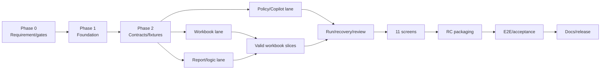

# StudyReport Evaluator 実装プラン（runtime ReportDefinition対応版）

| 項目 | 内容 |
|---|---|
| 計画版 | 2.1 |
| 作成日 | 2026-08-31 |
| 要求正本 | `docs/requirements-definition.md` v1.2 |
| 状態 | 要求所有者訂正反映済み。実装未開始 |
| 適用範囲 | P0を正式releaseまで実装。P1はG-09で全件IMPLEMENT。P2は対象外 |

> 依頼文にある`docs/requirement-definition.md`は存在しない。実在し、`README.md`から参照される`docs/requirements-definition.md`を正本として優先する。
>
> 本書は計画である。教育内容とreport固有上限は製品releaseへ固定せず、利用者がアプリ起動後に`ReportDefinition`として作成する。local launcherの本人性・role認証は対象外とする。実データの機関policy、privacy、教育評価、security、release署名・実機evidenceは別gateとして維持する。

## 1. タスク目的

Microsoft Forms / Google Forms由来の静的な`.xlsx`を入力し、入力を変更せず、利用者が起動後にreport種類ごとに定義するPrompt/rubric/result contract、GitHub Copilot SDKによる項目別採点候補、local類似度、利用者判断、Excel数式による最終点を別の`.xlsx`へ安全に出力する`.NET 10 + Avalonia` desktop appを実装する。

最優先の成功条件は次の6点である。

1. 入力workbookと変更許可外Open XML part/relationshipを不変にする。
2. Copilotを最小権限にし、学生dataを必要最小限だけ送る。
3. AI候補だけで採用点・最終点を確定させない。
4. report固有のreason/evidence規則、missing flags、言語、item/ID/field上限を起動後に変更でき、run開始時にsnapshot/hashへ固定する。
5. local launcher identity/roleを認証・推測しない。GitHub OAuth account確認はservice利用権限だけに使う。
6. 対応を表明する全OS/CPUでsetupからuninstallまで証跡付きで検証する。

## 2. v2.1で修正した設計誤り

| ID | 旧設計の問題 | v2.1の修正 |
|---|---|---|
| FIX-01 | reason/evidence例を実装前EXT-01として要求した | 実本文は各回答から生成する。ReportDefinitionが規則とmaxだけを持つ |
| FIX-02 | missing flagsをrelease固定enumへしようとした | 利用者がreport種類ごとにclosed taxonomyを定義し、schemaをrunごとに生成する |
| FIX-03 | rubric item数、evaluator/item ID長、target languageをrelease固定値へしようとした | ReportDefinitionの編集可能設定へ移し、technical hard ceilingと最大instance実測で制御する |
| FIX-04 | 教員/製品責任者によるfield-limit approvalをG-05完了条件にした | approvalを撤去し、設定保存/実行確認を本人・role承認と呼ばない |
| FIX-05 | local launcherとGitHub OAuth userを同じidentity境界として扱った | launcher identityは対象外。OAuth accountはGitHub org/service authorizationだけに使用する |
| FIX-06 | `ReasonMaxScalars`等を1組のrelease定数へ固定した | 1 string/request/tool/run/concurrencyだけをhard ceilingにし、report値はdynamic preflightする |
| FIX-07 | 特定授業のPrompt/rubricがないとproduction codeを開始できなかった | generic ReportDefinition/schema/serializer contractをG-10で確定し、実内容はruntime入力にする |
| FIX-08 | review transitionにauthenticated actorを必須化した | explicit action/timestampだけを必須化し、reviewer labelは任意・非認証とする |

v2.0までの敵対的reviewで確定した次の統制は維持する。

- strict GATE-0、`src/`の事前作成禁止。
- detached completion recordによるworkbook self-hash回避。
- Open XML low-level copy-on-writeとclosed mutation allowlist。
- `ROUND`だけをformula allowlistへ追加。
- result toolだけpermission bypass、その他requestは全Reject。
- strict JWS ES256/RFC 8785とAES-256-GCM checkpoint。
- signed endpoint manifest、telemetry/experimentation deny。
- Wayland/print/packageをG-17実測前に採用済みとしない。
- P1全10件をIMPLEMENTし、実装/test前に完成扱いしない。

## 3. 基本方針

1. 要求正本を最優先し、矛盾をADRだけで上書きしない。
2. 第17節とGATE-0を満たすまでproduction code、正式project、配布物、実データ処理を開始しない。
3. Phase 0で許可するcodeは採用可否だけを検証する`spikes/`と合成fixtureに限定する。
4. ReportDefinitionはruntime local settingであり、signed operational policyではない。
5. ReportDefinitionは学生回答、token、launcher identity、approverを保存しない。
6. run開始時にReportDefinitionをcanonical snapshot/hashへ固定し、schema/checkpoint/cache/manifestへ結合する。
7. report設定を自動縮小・切詰めせず、hard ceiling不成立なら送信前に`REPORT_DEFINITION_INVALID`で停止する。
8. 実データmodeはsigned policy、GitHub org authorization、教育評価、privacy/security運用gateが全て成立した場合だけ有効にする。
9. 1 taskは原則1契約・1失敗境界・production 1〜2 files・対応test 1 fileとする。
10. 工数、外部承認時間、実機結果、model精度を捏造せず、task DAGとgate evidenceで管理する。

## 4. 最小architectureとshared owner

### 4.1 Production projects

| Project | 責務 | 許可参照 |
|---|---|---|
| `src/StudyReportEvaluator.Core/` | domain、ReportDefinition/RunSnapshot、port、mapping、Prompt、similarity、formula、validation、run/review/orchestrator | BCLのみ |
| `src/StudyReportEvaluator.Workbooks/` | read-only intake、ZIP/OPC、Open XML reader/writer、package diff、atomic output | Core |
| `src/StudyReportEvaluator.Platform/` | signed policy、OAuth、credential vault、Copilot、checkpoint、safe log/network | Core |
| `src/StudyReportEvaluator.Desktop/` | Avalonia Views/ViewModels、navigation、composition root | Core、Workbooks、Platform |

Core orchestratorは`IWorkbookPort`、`ICopilotPort`、`ICheckpointPort`等の狭いportだけへ依存する。PlatformはWorkbooksを参照しない。追加Application projectは作らない。

### 4.2 Test projects

- `tests/StudyReportEvaluator.Core.Tests/`
- `tests/StudyReportEvaluator.Workbooks.Tests/`
- `tests/StudyReportEvaluator.Platform.Tests/`
- `tests/StudyReportEvaluator.Desktop.Tests/`
- `tests/StudyReportEvaluator.E2E.Tests/`

表中の`Core/`等はproduction project root alias、`Core.Tests/`等はtest project root aliasである。

### 4.3 Shared path owner

| Path | owner task |
|---|---|
| `docs/requirements-definition.md` | G-RB |
| `StudyReportEvaluator.sln` | F-05 |
| `global.json`, `Directory.Build.props` | F-01 |
| `Directory.Packages.props`, `NuGet.Config` | F-02 |
| production/test `.csproj` | F-04〜F-06 |
| `packages.lock.json` | F-10 |
| `.gitignore` | F-03 |
| `Desktop/Composition/ServiceRegistration.cs` | UI-14 |
| `docs-dev/traceability.md` | G-18と各`*-TR`のみ |
| `README.md` | D-09 |
| `SECURITY.md` | D-08 |
| fixture manifest | T-08 |

## 5. 実装前decision gate

| ID | 不明点 | 決定 | owner | block/期限 |
|---|---|---|---|---|
| DEC-01 | strict gate / two-stage gate | strict gate。Phase 0 docs/schema/isolated spikeのみ許可 | 要求所有者 | G-RB前、srcはGATE-0まで禁止 |
| DEC-02 | FR-017 output self-hash | logical manifest digest + signed detached completion record | 要求/security | O-04/O-10前 |
| DEC-03 | Eval projection | value + required static display。external/data-table formula拒否、local formulaはwarning後cached valueのみ | 教員/Workbook | W-09/O-03前 |
| DEC-04 | immutable part comparison | expanded payload bytes + URI/content type/relationship tuple | 要求/Workbook | W-05前 |
| DEC-05 | rounding | `ROUND`のみ追加、digitsはConfig ref | 教育評価/要求 | L-10前 |
| DEC-06 | similarity metric/boundary | calibration recordが指定。unknownなら`閾値未校正` | 教育評価 | L-13前 |
| DEC-07 | evidence tool argument | external-I/O-free `submit_evaluation.evidence`だけ限定例外 | 要求/security | C-01〜C-03前 |
| DEC-08 | permission | result toolだけbypass、発生request全Reject | 要求/security | A-12/C-03/C-10前 |
| DEC-09 | reason/evidence等のlimit | **ReportDefinition runtime setting**。release固定値・実装前corpus・teacher/product approvalなし。hard ceiling内をactual serializerでpreflight | 要求所有者 | 解決。T-03/T-06/C-01へ反映 |
| DEC-10 | attempt定義 | outbound attempt、worst case最大12/evaluation unit | 製品/費用 | R-04前 |
| DEC-11 | price欠測 | 見積非表示。policy cost検証不能な実データrunだけ停止 | 情報管理 | C-05前 |
| DEC-12 | signed record | 機関指定。未指定時strict JWS ES256 profile | PKI/security | A-01前 |
| DEC-13 | JSON canonicalization | RFC 8785 JCSだけ | security | A-01前 |
| DEC-14 | checkpoint | AES-256-GCM、one-time key、AAD、vault two-phase | security | R-01前 |
| DEC-15 | Wayland意味 | 未決。XWayland/nativeを別表示、experimental nativeを正式対応にしない | 製品/QA | G-17/P-04 block |
| DEC-16 | row print | OS/platform print feasibility。PDF/XLSX exportで代替しない | 製品/privacy | G-17/R-11/UI-10 block |
| DEC-17 | education metrics | preregistrationまで計算しない | 教育評価 | V-01前 |
| DEC-18 | dump scope | app/CLI + OS policy attestationをreal-data gateに含める | security | A-14前 |
| DEC-19 | student ID detection | signed policyのinstitution pattern。未指定なら保証しない | 情報管理 | L-06前 |
| DEC-20 | package format | G-17で成立した1 format/OSだけ採用 | release | P-01前 |
| DEC-21 | review/status/recalc | existing axesを維持し明示mapping/transition | 要求/formula | C-01前 |
| DEC-22 | P1 | 全10件IMPLEMENT、DEFER 0 | release | 各P1挿入期限前 |
| DEC-23 | local launcher identity | OS launcher/person/role/approval認証は対象外。OAuth accountはservice authorizationのみ | 要求所有者 | T-03/A-10/R-10/UI全体へ反映 |

## 6. Runtime入力と外部入力

### 6.1 Runtime入力

| ID | 入力者 | 内容 | 消費先 | 不正時 |
|---|---|---|---|---|
| RUN-01 | app利用者 | report type/revision、target language、Prompt、rubric/anchor、reason/evidence policy、missing flags、item/ID/field上限、weight/round/formula | T-03/T-06、L-02〜04/07/10〜14、C-01〜03、O-04、UI-05/07 | `REPORT_DEFINITION_INVALID`、送信0 |
| RUN-02 | app利用者 | workbook、mapping、output先、model、redaction確認 | W/L/A/R/UI | validation失敗、送信0 |
| RUN-03 | app利用者 | review action、override、comment、任意reviewer label | R-10/O-05/UI-09 | invalid transition拒否 |

RUN-01は実装前外部入力ではない。実際のreason/evidence本文は学生回答ごとのmodel outputであり、ReportDefinitionには保存しない。

### 6.2 External gate inputs

EXT-01（特定授業のPrompt/rubric/field corpus）はADR-0009により**廃止**し、RUN-01へ置換した。IDを再利用しない。

| ID | owner | 最低内容 | 消費task | 欠落時 |
|---|---|---|---|---|
| EXT-02 | fixture責任者 | non-PII synthetic XLSX、hostile/Unicode/formula/report-definition vectors | G-11/T-08 | GATE-0 block |
| EXT-03 | GitHub/情報管理者 | client ID、requested/granted scope、GitHub org、model、保持/所在/費用、signed policy。local user/launcher IDなし | G-12/A-03〜A-14 | `POLICY_BLOCKED` |
| EXT-04 | privacy責任者 | notice、legal basis、retention、access、contact | G-13/A-14/UI-01 | `POLICY_BLOCKED` |
| EXT-05 | 教育評価責任者 | human baseline、metric spec、pre-threshold、subgroup policy | G-14/V-01〜V-06 | research/trial only |
| EXT-06 | 法務（EU該当時） | classification、provider/deployer責任、conformity plan | G-13/REL-03 | EU release block |
| EXT-07 | release/QA | signing、notarization、Arm64、Office/print runner | G-17/P/E-09 | platform release block |
| EXT-08 | independent reviewer | P0/evidence signed review | REL-04 | release block |
| EXT-09 | security管理者 | OS/app/CLI dump policy attestation | A-14/E-06 | real-data block |

## 7. 実行順序とparallelization

Parallel groups:

- PG-0A: G-02〜G-09とADR-0009。G-RBは直列owner。
- PG-0B: G-10〜G-14（直接依存とexternal inputが独立する範囲）。
- PG-0C: G-15〜G-17（runner環境が独立する範囲）。
- PG-1: F-03/F-04/F-06/F-09（shared fileを跨がない範囲）。
- PG-2: T contracts/fixtures。
- PG-3: W/L/A lanes。
- PG-7: UI component files。
- PG-9: read-only E2E suites。

Critical paths:

1. Open XML: G-16 → W → O → R → UI → P → E-07/E-09。
2. Copilot: G-10/G-15 → A/C → R → UI → P → E-04/E-05/E-11。

## 8. Phase 0 — Requirement decision / hard gate

| ID | 依存 | 成果物 | 完了条件 |
|---|---|---|---|
| G-01 | none | `docs-dev/adr/0001-gate-semantics.md` | strict gate、Phase 0許可/禁止scope |
| G-02 | G-01 | `docs-dev/adr/0002-output-digest.md` | self-hash、pair validation、failure semantics |
| G-03 | G-01 | `docs-dev/adr/0003-openxml-mutation.md` | mutable URI/relationship/elementとprojection |
| G-04 | G-01 | `docs-dev/adr/0004-formula-status-similarity.md` | ROUND、mapping、transition、metric protocol |
| G-05 | G-01/ADR-0009 | `docs-dev/adr/0005-copilot-result-protocol.md` | evidence exception、permission、dynamic report schema/limits |
| G-06 | G-01 | `docs-dev/adr/0006-signed-records.md`; `eng/schemas/signed-record-v1.schema.json` | JWS/AES known-answer/negative vectors |
| G-07 | G-01 | ADR-0007; endpoint schema | source/time/purpose/expiry/telemetry deny |
| G-08 | G-01 | ADR-0008 | Wayland/print/package candidates and tests |
| G-09 | G-01 | `docs-dev/release/p1-disposition.md` | all P1 disposition |
| G-RB | G-02〜G-09/ADR-0009 | `docs/requirements-definition.md`; `docs-dev/preflight/requirements-baseline.md` | v1.2 content approved、file hash/base commit、block table。commit hashはcommit後追記 |
| G-10 | G-RB | `eng/schemas/report-definition-v1.schema.json`; `docs-dev/preflight/report-definition-contract.md`; synthetic report profile vectors | no lesson-specific values、dynamic schema/max-instance/snapshot contract、launcher identityなし |
| G-11 | G-RB/G-10/EXT-02 | `tests/fixtures/specs/workbook-clean.json`; `workbook-hostile.json`; `unicode.json`; `formula.json`; `report-definition.json`; `docs-dev/preflight/fixture-plan.md` | positive/rejection/Unicode/formula/report vectors |
| G-12 | G-RB/G-06/G-07/EXT-03 | external production bundle; test-only policy fixtures | production/test trust separation、secret/PAT/local launcher ID 0 |
| G-13 | G-RB/EXT-04/06 | `docs-dev/preflight/governance-inputs.md` | owner/hash/expiry/region、bodyなし |
| G-14 | G-RB/EXT-05 | external baseline; `tests/fixtures/evaluation/metric-spec-test.json` | all metric parameters preregistered |
| G-15 | G-RB/G-05/G-07/G-10/G-12 | `spikes/CopilotContract/*`; `docs-dev/preflight/copilot-contract.md` | exact SDK/CLI/hash、dynamic schema、Empty/auth/tool/permission/telemetry/session/delete/usage live synthetic canary |
| G-16 | G-RB/G-03/G-04 | `spikes/DocumentPipeline/*`; `docs-dev/preflight/document-pipeline.md` | minimal XLSX mutation、ICU、Excel/LibreOffice recalc |
| G-17 | G-RB/G-08/EXT-07 | `spikes/PlatformPreflight/*`; `docs-dev/preflight/platform-matrix.md`; `eng/platform-matrix.json` | real OS/CPU app/print/vault/display/package/sign/notary evidence |
| G-18 | G-RB/G-10〜G-17 | `docs-dev/traceability.md` | every P0 → task/evidence、blockers explicit |
| GATE-0 | G-RB/G-10〜G-18 | `docs-dev/preflight/gate-result.md` | all Section 17 items PASS、approved revision commit、src files 0 |

GATE-0 failureにlocal overrideを設けない。不足input/evidenceを補う、要求を正式改版する、対象platform/feature/projectを停止する、のいずれかで再評価する。

## 9. Phase 1 — Foundation

| ID | 依存 | files | 完了条件 |
|---|---|---|---|
| F-01 | GATE-0 | `global.json`; `Directory.Build.props` | exact SDK、nullable、warnings、deterministic、locked restore |
| F-02 | F-01 | `Directory.Packages.props`; `NuGet.Config` | exact version/approved source only |
| F-03 | F-01 | `.gitignore` | bin/obj/artifacts/secret/local evidence除外、sample規則 |
| F-04 | F-01 | Core csproj; `Core/Ports/Ports.cs` | opaque CompletionProof、Core外部参照0 |
| F-05 | F-02/F-04 | solution + Workbooks/Platform/Desktop projects | 4 project one-way build |
| F-06 | F-05 | 5 test projects | all test hosts runnable、TestSupportなし |
| F-07 | F-05/F-06 | `Core.Tests/Architecture/DependencyRulesTests.cs` | Core/Platform dependency violations検出 |
| F-08 | F-05 | `Workbooks.Tests/Packaging/PublishAssetTests.cs` | 6 RID asset inspection only |
| F-09 | F-05/F-06 | MainWindow/ViewModel/styles/tests | accessibility shell first |
| F-10 | F-05/F-06 | all `packages.lock.json`; supply chain tests | locked restore/floating 0 |
| F-TR | F-07〜F-10 | traceability | Foundation evidence |
| GATE-1 | F-TR | `artifacts/test/gate-foundation.json` | clean restore/build/test/architecture |

## 10. Phase 2 — Domain contracts / fixtures

| ID | 依存 | files | 完了条件 |
|---|---|---|---|
| T-01 | GATE-1 | `Core/Domain/StatusCodes.cs`; tests | review mapping/recalc/adoption conditions |
| T-02 | GATE-1 | `Core/Domain/MappingDefinition.cs`; tests | 1+ question、roles、duplicate warning、confirmation |
| T-03 | GATE-1/G-10 | `Core/Domain/ReportDefinition.cs`; `Core/Domain/RunSnapshot.cs`; tests | report type/language/policies/taxonomy/limits、no student/launcher/approver fields、immutable snapshot |
| T-04 | T-01〜T-03 | `Core/Domain/EvaluationRun.cs`; tests | unit key + report snapshot hash unique |
| T-05 | GATE-1 | `Core/Limits/InputAdmissionLimits.cs`; tests | input defaults、admin downward-only |
| T-06 | GATE-1/T-03 | `Core/Limits/InferenceHardLimits.cs`; `Core/Validation/ReportDefinitionBudgetValidator.cs`; tests | hard ceiling immutable、actual serializer max instance、dynamic report settings、20,000 attempts |
| T-07 | G-06 | `Core/Hashing/CanonicalRecord.cs`; tests | JCS known-answer |
| T-08 | G-11 | fixture factory/manifest/tests | accepted/rejected fixed seed、PII 0、hash |
| T-09 | GATE-1 | scripted HTTP/retry tests | no sleep deterministic |
| T-10 | G-16 | `IAtomicFileOps`; fault doubles/tests | narrow atomic seam |
| T-11 | GATE-1 | `MonotonicDeadline`; tests | TimeProvider deadlines |
| T-TR | T-01〜T-11 | traceability | contract/fixture evidence |
| GATE-2 | T-TR | gate artifact | report boundary/accepted fixture positive、single-cause negatives |

## 11. Phase 3/4 — Parallel lanes

### 11.1 Workbook intake

| ID | 依存 | files | 完了条件 |
|---|---|---|---|
| W-01 | GATE-2 | Windows file identity + tests | volume/file ID、read-only handle |
| W-02 | GATE-2 | Unix file identity + tests | device/inode/link policy |
| W-03 | W-01/W-02 | snapshot service + tests | same handle hash/snapshot、TOCTOU、input unchanged |
| W-04 | GATE-2 | format classifier + tests | ZIP/CFB/disguise/corrupt/unknown、decrypt 0 |
| W-05 | T-05/W-04 | ZIP budget scanner + tests | entry/size/ratio/time/depth |
| W-06 | W-05 | OPC URI scanner + tests | traversal/duplicate/case/percent reject |
| W-07 | W-06 | external execution scanner + tests | external/DDE/OLE/ActiveX/macro/query/signature classification |
| W-08 | W-06 | protection/visibility scanner + tests | workbook/sheet protection、hidden/names |
| W-09 | W-07/W-08 | metadata reader + tests | clean 1/2/10 question exact、body log 0 |
| W-10 | W-09 | worksheet value reader + tests | SAX typed values、empty/style-only rows |
| W-11 | W-09 | output identity + tests | output/sheet name、same file、marker |
| W-12 | W-06 | package fingerprint + tests | payload/URI/content type/relationship diff |

### 11.2 ReportDefinition / Prompt / Similarity / Formula

| ID | 依存 | files | 完了条件 |
|---|---|---|---|
| L-01 | T-02/W-09 | MappingValidator + tests | 1/2/10 questions、roles、confirmation |
| L-02 | T-03 | TemplateParser + tests | closed placeholders、nonrecursive、unknown reject |
| L-03 | T-03 | RubricValidator + tests | dynamic item/ID limits、anchors、range、language/flag semantics |
| L-04 | L-01〜L-03 | SafePayloadBuilder + tests | untrusted JSON boundary、property allowlist、target language instruction |
| L-05 | G-12 | PII detector + tests | email/phone/institution pattern、limitations |
| L-06 | L-04/L-05 | RedactionPreview + tests | minimized payload + explicit preview |
| L-07 | T-07/L-03 | DesignHasher + tests | full ReportDefinition canonical hash |
| L-08 | G-16 | SimilarityNormalizer + tests | ICU NFKC/LF/space/Rune |
| L-09 | L-08 | ShingleSimilarity + tests | states、containment、C/J |
| L-10 | G-04/T-01 | Formula AST/serializer + tests | allowlist including ROUND、Config refs |
| L-11 | L-10 | AdoptedScoreBuilder + cross-product tests | valid accepted/overridden only |
| L-12 | L-10/L-11/T-03 | AggregateFormulaBuilder + tests | runtime ReportDefinition formula AST、no EXT-01、weight/error rules |
| L-13 | G-04/L-09/L-10 | SimilarityFormulaBuilder + tests | calibration metric、unconfigured、scoring disconnect |
| L-14 | L-10〜L-13 | GeneratedFormulaValidator + tests | parser/DAG/ref/8192/forbidden/external 0 |

### 11.3 Policy / OAuth / Copilot

| ID | 依存 | files | 完了条件 |
|---|---|---|---|
| A-01 | G-06/T-07 | SignedRecordVerifier + tests | typ/iss/aud/schema/kid/time/replay/tamper |
| A-02 | A-01 | TrustAndRevocationStore + tests | current/next/revocation/recovery/rollback |
| A-03 | A-01/A-02/EXT-03 | OperationalPolicyReader + tests | schema/expiry/org/model/retention/cost、local user/report contentなし |
| A-04 | A-01/EXT-05 | CalibrationRecordReader + tests | MISSING/INVALID/VALID、metric/hash |
| A-05 | T-09/T-11/EXT-03 | GitHubDeviceFlowClient + tests | scope/granted、interval/slow_down/expiry/cancel/error |
| A-06 | A-05 | TokenRefreshService + tests | atomic rotation/re-auth |
| A-07 | G-17 | Windows vault + tests | save/replace/delete/restart、file fallback 0 |
| A-08 | G-17 | macOS Keychain + tests | same |
| A-09 | G-17 | Linux Secret Service + tests | missing/locked/rotation/logout、fallback 0 |
| A-10 | A-03/A-05〜A-09 | `Platform/Auth/GitHubAccountAuthorizationGuard.cs`; tests | OAuth account immutability、org membership、30 min、launcher identity mapping 0 |
| A-11 | G-07 | EndpointManifestVerifier + tests | signed manifest/TLS/expiry/rollback/semantic validation |
| A-12 | G-15/A-10/A-11 | CopilotClientFactory + tests | explicit token、sanitized env、Empty、ambient off |
| A-13 | A-03/A-12/T-06 | ApprovedModelCatalog + tests | auto/retired/unapproved reject、context/price separation |
| A-14 | A-03/A-04/A-10/EXT-04/EXT-09 | RealDataGate + tests | policy/org/calibration/notice/contact/dump AND、launcher identityなし |
| C-01 | G-05/L-03/T-06 | SubmitEvaluationSchemaFactory + tests | snapshot/evaluator-specific exact IDs/items/flags/lengths、max instance ceiling |
| C-02 | C-01/L-06 | EvaluationOutputValidator + tests | type/finite/range/ID/count/evidence/status/dynamic limits |
| C-03 | A-12/C-01/C-02 | SubmitEvaluationTool + tests | I/O 0、one call/submission、normal body ignored |
| C-04 | A-12/A-13/C-03 | EphemeralSessionRunner + tests | new session per unit/attempt、history 0 |
| C-05 | C-04 | SchemaRetryCoordinator + tests | new session max 2、delete first |
| C-06 | C-04/T-09 | TransportRetryCoordinator + tests | transient max 3、jitter/cancel |
| C-07 | C-04〜C-06 | SessionCleanupService + tests | explicit delete/interlock |
| C-08 | C-07 | StartupSessionScavenger + tests | owned orphan/canary 0 |
| C-09 | A-12 | UsageCollector + tests | SDK values only |
| C-10 | C-03 | CapabilityFirewallTests | forbidden tools 0、permission Reject |
| C-11 | C-02〜C-08 | ProtocolFailureTests | missing/duplicate/NaN/unknown flag/cross-report schema/body/timeout/etc |
| C-12 | A-11/A-12 | TelemetryContractTests | telemetry/remote/experiment egress 0 |
| C-13 | C-06/C-09 | AnonymousRunMetrics + tests | p50/p95/429/retry/timeout/token、PII 0 |

### 11.4 Lane gates

| Gate | Positive | Negative/conditions |
|---|---|---|
| GATE-WORKBOOK | W-09〜W-11 | W-03〜W-08/W-12、input immutable |
| GATE-LOGIC | L-01〜L-04/L-07〜L-13 | L-05/L-06/L-14、cross-report reuse 0 |
| GATE-COPILOT | A-01〜A-14/C-01〜C-09/C-13 | C-10〜C-12、launcher identity dependency 0、session/telemetry 0 |
| P4-TR | all lane gates | traceability serialized update |

## 12. Phase 5 — Valid workbook slices

| ID | 依存 | files | 完了条件 |
|---|---|---|---|
| O-01 | GATE-WORKBOOK | WorkingPackage + tests | byte-copy/no-op preservation |
| O-02 | O-01/G-03 | MinimalOutputWorkbook + tests | valid XLSX with 3 sheets |
| O-03 | O-02/GATE-LOGIC | EvalProjectionWriter/UntrustedStringCellWriter/tests | selected values/static display、all untrusted string、formula/link 0 |
| O-04 | O-02/L-07/A-04/T-03 | ControlSheetWriter + tests | Config/Run、marker/input/manifest/report snapshot hash、no PII/token/launcher identity |
| P1-07 | O-04 | ConfigNamedRangeWriter + tests | app namespace names、collision/ref failure 0 |
| O-05 | O-03/O-04/P1-07/L-11〜L-14 | EvaluationResultWriter + tests | candidate/review/status/similarity/formulas/recalc |
| O-06 | O-05 | presentation writer + tests | freeze/filter/wrap/width/style |
| O-07 | O-04〜O-06 | explanations writer + tests | notices/formula/threshold/ReportDefinition hash |
| O-08 | O-07/W-12 | output validator + golden tests | schema/3 sheets/columns/formulas/diff/limits/external 0 |
| O-09 | O-08/T-10 | PreparedOutputWriter + fault tests | close/flush/reopen/validate/hash、final name 0 |
| O-10 | O-09/G-02 | CompletionRecordWriter + tests | prepared SHA/future name/run/manifest durable、CompletionProof |
| O-11 | O-09/O-10 | AtomicOutputCommitter + tests | proof then same-volume rename/pair verify/orphan cleanup |
| O-TR | P4-TR/O-01〜O-11 | traceability | evidence update |
| GATE-OUTPUT | O-TR | gate artifact | positive output + preservation/formula/input negatives |

## 13. Phase 6 — Run / recovery / review / validation

| ID | 依存 | files | 完了条件 |
|---|---|---|---|
| R-01 | G-06/GATE-COPILOT | CheckpointCipher + tests | AES profile/vault/tamper/replay |
| R-02 | R-01/T-10 | CheckpointStore + fault tests | temp/flush/replace/orphan |
| R-03 | T-01/T-04 | RunStateMachine + tests | READY〜COMPLETED transitions |
| R-04 | T-06/C-05/C-06 | RequestAttemptBudget + tests | preflight + atomic reserve、cancel 0、20,000 |
| R-05 | R-03/R-04 | EvaluationScheduler + tests | concurrency 1/3、progress、UI nonblock |
| R-06 | R-02/R-03/C-08 | ResumePlanner + tests | completed only、snapshot mismatch/unknown no auto-send |
| R-07 | GATE-OUTPUT/R-03 | OfflineRunPlanner + tests | NOT_RUN/PENDING/blank score |
| R-08 | GATE-COPILOT | SafeLogger + tests | enum/count/hash/opaque ID only |
| R-09 | C-02/L-09 | ReviewQueue + tests | priority/filter |
| R-10 | R-09/T-01 | ReviewDecisionService + tests | explicit action/timestamp、optional unverified reviewer label、no launcher identity requirement |
| R-11 | R-10/G-17 | RowExplanation + tests | other-student 0、approved print model、no authenticated actor |
| P1-04 | V-04/R-04 | RepeatedEvaluationPlan + tests | dynamic trial budget、separate trials |
| P1-08 | R-11 | MinimizedReviewCopyWriter + tests | selected rows/columns、identifier default deny |
| R-12 | GATE-OUTPUT/GATE-COPILOT/R-02〜R-11 | EvaluationOrchestrator + tests | ports、O-09→10→11、success/failure/cancel/crash/offline |
| V-01 | G-14 | EducationalMetrics + tests | preregistered exact metrics |
| V-02 | V-01 | subgroup/counterexample report + tests | attributes not sent、missing explicit |
| V-03 | V-01/V-02/L-07/A-14 | ProductionReadinessGate + tests | changes invalidate、failed baseline research-only |
| V-04 | C-04/R-04 | repeated evaluation E2E harness/tests | trial separation |
| V-05 | V-01/V-04 | nondeterminism report tests | no collapse |
| V-06 | V-02/V-03/V-05/EXT-05 | educational gate tests | preregistration/double scoring/failure/change |
| P1-06 | V-01/EXT-05 | ThresholdCalibrationMetrics + tests | educator labels only |
| R-TR | R/V tasks | traceability | evidence update |
| GATE-RUN | R-TR | gate artifact | duplicate send 0、cleanup lock、offline、unreviewed score 0、failed baseline real 0 |

## 14. Phase 7 — Avalonia screens

Each screen task owns its View, code-behind, ViewModel, component test only. Composition root belongs to UI-14.

| ID | 依存 | screen/complete |
|---|---|---|
| UI-01 | F-09/A-14 | welcome: AI assist、data scope、mode、contact warning |
| UI-02 | A-05〜A-14 | GitHub OAuth service account/org、switch/logout/diagnostics。local launcher identityなし |
| UI-03 | GATE-WORKBOOK/P1-09 | file selection/risk/hash/sheets/input immutable |
| UI-04 | L-01/L-06/P1-01/P1-02 | mapping/profile/suggestions/redaction confirmation |
| UI-05 | T-03/T-06/L-02/L-03/L-07/A-04 | report type/revision/language、Prompt/items/anchors、reason/evidence/flags/item-ID-field limits、weights/threshold/hash/schema budget |
| UI-06 | C-04/V-01/P1-04/P1-06 | trial/schema/error/rerun/human baseline |
| UI-07 | A-13/C-09/R-04/T-06 | report snapshot/hash、model/count/max attempts/schema/request budget/estimate/output/run confirmation。identity approval checkboxなし |
| UI-08 | R-03〜R-06/C-13 | progress/stop/cancel/resume、student name hidden |
| UI-09 | R-09〜R-11 | answer/candidate/reason/evidence/status/similarity/actions、optional reviewer label |
| UI-10 | R-11/G-17 | row explanation/print、other students 0 |
| UI-11 | O-11/R-12 | input unchanged/output/count/usage/formula |
| UI-12 | A-11/R-08/P1-05/P1-09 | log/retention/proxy/domain/version/SBOM/no-content diagnostics |
| UI-13 | UI-01〜UI-12 | shared synthetic journey/accessibility tests |
| UI-14 | UI-01〜UI-13/GATE-RUN | ServiceRegistration/WorkflowNavigator/tests |
| UI-TR | UI-14 | traceability |
| GATE-UI | UI-TR | keyboard/200%/screen-reader target/no gate bypass/input write 0 |

## 15. Phase 8 — RC packaging

| ID | 依存 | files/complete |
|---|---|---|
| P-01 | GATE-UI/G-17 | publish script/matrix/layout tests、6 RID folder SCD、CLI/ICU |
| P-02 | P-01 | Windows setup cmd/pwsh/tests、signature/hash/repair |
| P-03 | P-01 | macOS setup/tests、signature/notary/Gatekeeper/user install |
| P-04 | P-01/G-17 | Linux setup/tests、Ubuntu/CPU/display/Secret Service/user install |
| P-05 | P-02 | Windows uninstall/tests、input/output preserved |
| P-06 | P-03 | macOS uninstall/tests |
| P-07 | P-04 | Linux uninstall/tests |
| P-08 | P-01 | SBOM/license/SHA/signature/security tests |
| P-09 | P-02〜P-08 | RC manifest schema/tests/artifact |
| GATE-RC | P-09 | signed candidate per real OS/RID setup/version/CLI handshake。test signature正式扱い0 |

## 16. Phase 9 — E2E / acceptance / performance

| ID | 依存 | complete |
|---|---|---|
| E-01 | GATE-RC | workbook preservation/immutability success/fail/cancel/crash/disk-full |
| E-02 | GATE-RC | protected sample offline classification、decrypt/raw metadata 0 |
| E-03 | GATE-RC | package/mapping/ReportDefinition/Prompt hostile boundaries |
| E-04 | GATE-RC/GATE-COPILOT | policy/OAuth/model/dynamic tool protocol |
| E-05 | E-04 | session/network/log canary 0 |
| E-06 | GATE-RC/GATE-RUN | checkpoint kill/resume/no-double-send/dump attestation |
| E-07 | GATE-RC/GATE-OUTPUT | Excel/LibreOffice formula/similarity recalc |
| E-08 | GATE-RC | keyboard/AT/manual matrix |
| E-09 | GATE-RC | all supported OS/CPU setup→OAuth→2 rows→output→uninstall |
| E-10 | GATE-RC | local benchmark warmup1+5/median/UI p95/memory |
| E-11 | E-04/C-13 | live Copilot p50/p95/429/retry/timeout/token、content 0 |
| E-12 | V-06/E-11 | real-data release gate、external baseline hash only |
| E-13 | UI-01/UI-09/O-07 | safety notices/contact warning |
| E-14 | E-01〜E-13 | shared 11-screen synthetic happy path |
| E-TR | E-01〜E-14 | traceability |
| GATE-ACCEPTANCE | E-TR | AC-001〜007 + Section 14、NOT_RUNをPASS扱い0 |

## 17. Phase 10 — Docs / release evidence

| ID | 依存 | output |
|---|---|---|
| D-01 | GATE-RUN | architecture + SVG |
| D-02 | UI-14 | components + SVG |
| D-03 | GATE-OUTPUT | Excel contract including report snapshot |
| D-04 | GATE-LOGIC/GATE-COPILOT | ReportDefinition/Prompt authoring/dynamic schema |
| D-05 | V-06 | education metrics/gates |
| D-06 | E-03〜E-06 | security/privacy/network/vault/dump/launcher boundary |
| D-07 | GATE-ACCEPTANCE/P-09 | build/test/release/OS/sign/SBOM/setup |
| D-08 | EXT-04/EXT-07 | SECURITY.md with real contact/support |
| D-10 | UI-14/E-09 | 11 real RC screenshots with synthetic data |
| D-09 | D-03〜D-08/D-10/UI-14/P-05〜P-07/E-13 | README all required sections、runtime report creation、no launcher identity claim |
| D-11 | all implementation | customization examples only |
| D-12 | D-09/D-10 | documentation contract tests |
| P1-10 | E-08 | accessibility conformance + tests、Release block until pass |
| REL-01 | GATE-ACCEPTANCE/P-08 | supply-chain index/SBOM/license/SHA/signature/security |
| REL-02 | GATE-ACCEPTANCE | generated acceptance report |
| REL-03 | EXT-03〜EXT-07/G-09/REL-02 | operations approval record。ReportDefinition values/launcher identity approvalは含めない |
| REL-04 | EXT-08/REL-01〜REL-03/D-12/P1-10 | independent signed review、blocker/high 0 |
| REL-05 | REL-04 | traceability completeness only |
| REL-06 | REL-05 | release manifest、support claims = tested rows |

## 18. Gate list

| Gate | Positive | Negative |
|---|---|---|
| GATE-0 | Section 17、requirement revision、external hashes、live/cross-OS preflight | unapproved defaults、src production files 0 |
| GATE-1 | clean build/test/architecture | floating/forbidden refs 0 |
| GATE-2 | accepted fixture/report definitions | PII/real data/cross-report reuse 0 |
| GATE-WORKBOOK | clean metadata/value | hostile/input mutation 0 |
| GATE-LOGIC | report/payload/formula/similarity | truncation/implicit default/similarity scoring 0 |
| GATE-COPILOT | explicit auth/dynamic tool/cleanup | launcher identity dependency/ambient tool/permission/telemetry/session residue 0 |
| GATE-OUTPUT | 3 sheets/report snapshot/formulas | diff/formula error/early final 0 |
| GATE-RUN | success/cancel/crash/offline/review | duplicate send/cleanup continuation/unreviewed score 0 |
| GATE-UI | keyboard/200%/AT | gate bypass/input write/identity approval requirement 0 |
| GATE-RC | signed RC on real OS/RID | unsigned/test-only formal claim 0 |
| GATE-ACCEPTANCE | all AC/Section 14 | NOT_RUN as PASS 0 |
| Release | docs/images/SBOM/external operations/independent review | blocker/high/untested support 0 |

## 19. P1 tasks

G-09 decision: all IMPLEMENT, DEFER 0. Details and interim controls are in`docs-dev/release/p1-disposition.md`。

| ID | Req | Insertion | Files/condition |
|---|---|---|---|
| P1-01 | FR-015 | L-01後/UI-04前 | MappingProfile/Store/tests、body/path/token 0 |
| P1-02 | FR-028 | L-01前 | FormsManagementColumnSuggester/tests、suggestion only |
| P1-03 | FR-038 | L-03後/L-04前 | FewShotExampleSet/tests、synthetic default、real examples separately governed |
| P1-04 | FR-058 | V-04後/UI-06前 | RepeatedEvaluationPlan/tests、dynamic attempt budget |
| P1-05 | FR-065 | A-14/UI-01/UI-12前 | RetentionResponsibility/tests、no identity authentication/auto-delete |
| P1-06 | FR-076 | V-01後/UI-06前 | ThresholdCalibrationMetrics/tests、educator labels only |
| P1-07 | FR-092 | O-04後/O-05前 | ConfigNamedRangeWriter/tests |
| P1-08 | FR-106 | R-11後/UI-10前 | MinimizedReviewCopyWriter/tests |
| P1-09 | NFR-PRI-006 | W-11後/UI-03/UI-12前 | SharedFolderRiskDetector/tests、DETECTED/UNKNOWN only |
| P1-10 | NFR-ACC-005 | E-08後/D-07前 | conformance docs/tests、Release blocker |

## 20. Task execution rules

1. 各taskは要求ID行、直接依存contract/ADR、自files、該当fixtureだけを読む。
2. shared fileはsingle ownerだけが編集する。
3. production変更が2 filesを超える場合、同一invariantを保てない理由がなければ分割する。
4. scanner/protocol negative testは1 fixture 1 failure reasonとする。
5. code taskはtests→project build→diagnostics、schema taskはpositive/negative schema validation、doc taskはlink/heading/path検査を行う。
6. task終了時はpublic contractとunresolved blockerだけを残し、生log、学生本文、reason/evidence本文、tokenを保存しない。
7. ReportDefinition testは合成内容だけを使い、特定授業の教育内容をapp defaultにしない。
8. performance/legal/model accuracy/approval/identityを実測・外部入力なしに記載しない。
9. local launcher identityを導入する変更は要求改版なしに行わない。

## 21. Primary references

- `docs/requirements-definition.md` v1.2
- ADR-0001〜ADR-0009
- GitHub Copilot SDK v1.0.11 source/docs
- GitHub OAuth Device Flow / org membership docs
- RFC 7515/7518/8785、NIST SP 800-38D
- Open XML SDK、Excel limits、.NET app-local ICU
- Avalonia supported platforms/Linux Wayland/accessibility
- OWASP LLM01/02/05/06/10
- GitHub Copilot allowlist
- applicable institutional/legal sources in requirements

## 22. v2.1 change summary

- ReportDefinitionをruntime first-class domainへ追加した。
- 特定授業のPrompt/rubric/reason/evidence/missing flag/language/limitsをEXT-01とGATE-0から除外した。
- DEC-09をdynamic report settings + immutable hard ceilings + actual serializer preflightで解決した。
- ReportDefinition schema、RunSnapshot、schema factory、budget validator、UI fields、workbook snapshot、cache/checkpoint bindingへtaskを再配線した。
- local launcher/person/role approvalをapplication scopeから除外した。
- GitHub OAuth account/org authorizationとlocal launcher identityを分離した。
- review actor必須をexplicit action/timestamp + optional unverified labelへ変更した。
- 既存security/privacy/education/release external gatesは、runtime report setting approvalとは別物として維持した。
- GATE-0以前の`src/`禁止を維持した。
