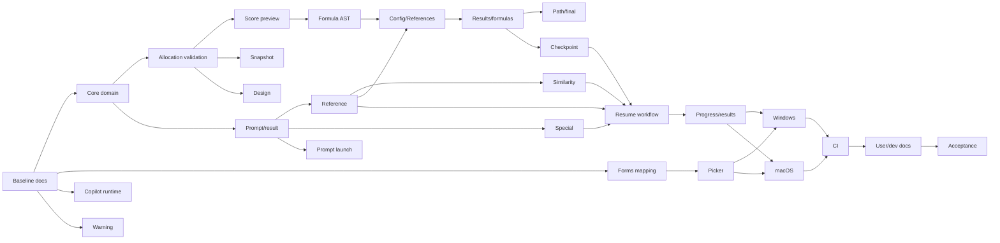

# StudyReport Evaluator v4.0 詳細実装計画

| 項目 | 内容 |
|---|---|
| 要求正本 | `docs/requirements-definition.md` v4.0 |
| 設計正本 | `docs-dev/detailed-design.md` / ADR-0012 |
| 作成日 | 2026-09-01 |
| Baseline | HEAD `b7b0c0ac91148c42c4aa61e04f1dab4efbb0fc98`、Release 485/485 PASS |
| 方針 | 2 production project維持、taskごとdirect test + 敵対的review + follow-up |

## 1. 実行規則

1. 各taskは表のowned filesとdirect testsだけを編集する。
2. 編集前に対象fileを読む。
3. production変更とdirect testを同じtaskで行う。
4. target test、`dotnet build -c Release`、`git diff --check`を実行する。
5. task完了直後にread-only敵対的reviewを行う。
6. review findingは再現可能性を確認し、実在findingだけ修正する。推測・未実装・好みはdefectへ数えない。
7. 修正後に同じtarget testとfocus follow-up reviewを行う。
8. blocker/high未解決のままdependent taskへ進まない。
9. 回答、Prompt、reference、reason、evidence、credentialをlog／review artifactへ出さない。
10. `work/` fileを更新する場合はdelete→createで全文再作成する。
11. 無関係な未追跡`work/20260901-realdata-*`を変更、削除、stageしない。
12. WindowsのPowerShell処理は`pwsh.exe -NoLogo -NoProfile` 7+だけを使う。

## 2. Dependency graph

並列可能な組:

- `C-01`、`X-01`、`A-01`はB-06後に並列。
- `C-04`と`C-05`はC-01/C-02後に並列。
- `A-02`と`A-03`はC-05/A-01後に並列。
- `U-01`と`U-04`は各依存後に並列。
- `P-01`と`P-02`はapplication gate後に並列。
- `D-01`〜`D-04`は実装／package完成後にファイル所有が衝突しない範囲で並列。

同じworkspaceで同一fileを編集するtaskは並列実行しない。

## 3. Baseline tasks

| ID | Depends | Owned files | Direct verification |
|---|---|---|---|
| B-01 Requirement | none | `docs/requirements-definition.md` | exact defaults/formulas/AC review |
| B-02 ADR | B-01 | `docs-dev/adr/0012-*` | decision consistency review |
| B-03 Detailed design | B-02 | `docs-dev/detailed-design.md` | calculation/checkpoint/platform review |
| B-04 Current dev docs | B-03 | `docs-dev/architecture.md`, `excel-contract.md`, `README.md` | cross-document review |
| B-05 Plan/trace | B-04 | this file, `docs-dev/traceability.md` | every AC/task/file mapped |
| B-06 Documentation contract | B-05 | `tests/.../Content/DocumentationContractTests.cs` | target test |
| GATE-B | B-01..06 | none | docs target + Release build + adversarial review |

## 4. Core tasks

| ID | Depends | Owned production files | Owned direct tests | Completion |
|---|---|---|---|---|
| C-01 Domain | GATE-B | `QuantificationDefinition.cs`, `QuestionDefinition.cs`, new `SpecialEvaluationDefinition.cs` | `DefinitionCollectionTests.cs`, `QuantificationDefinitionTests.cs` | v4 properties/collection ops |
| C-02 Allocation/validation | C-01 | new `ScoringAllocationCalculator.cs`, `QuantificationDefinitionValidator.cs` | allocation + validator tests | exact 100, equalize, special minimum |
| C-03 Score preview | C-02 | `WeightedScoreCalculator.cs` | `WeightedScoreCalculatorTests.cs` | question/special/penalty/final preview |
| C-04 Formula AST | C-03 | `FormulaExpression.cs`, `FormulaSerializer.cs` | formula tests | v4 formula shapes within existing allowlist |
| C-05 Prompt/result | C-01 | `BuiltInPromptTemplates.cs`, `PromptTemplateRenderer.cs`, `SafeEvaluationPayloadBuilder.cs`, result domain/validators | prompting/result tests | special/similarity/reference contracts |
| C-06 Snapshot/serialization | C-02/C-05 | `CanonicalDefinitionSerializer.cs`, `QuantificationSnapshot.cs` | serializer/snapshot tests | canonical v4 snapshot |
| GATE-C | C-01..06 | none | Core tests + Release build + phase review |

## 5. Input and Copilot tasks

| ID | Depends | Owned production files | Direct tests | Completion |
|---|---|---|---|---|
| X-01 Forms mapping | GATE-B | `WorkbookMetadataReader.cs`, `ColumnMappingSuggester.cs`, `ColumnMappingValidator.cs` | reading/mapping tests | question row 1/2 + sample roles |
| A-01 Runtime/bundle identity | GATE-B | package props/locks, `CopilotClientFactory.cs`, auth | runtime/auth/package tests | bundled CLI path/hash, auto discovery |
| A-02 Reference operation | C-05/A-01 | new reference tool/runner/schema | new reference tests | exactly once contract |
| A-03 Special operation | C-05/A-01 | new special tool/runner/schema | new special tests | 0..1 + evidence |
| A-04 Similarity operation | C-05/A-01/A-02 | new similarity tool/runner/schema | new similarity tests | 0..1 + no misconduct decision |
| GATE-A | A-01..04 | none | Copilot fake tests + capability review |

## 6. Workbook and workflow tasks

| ID | Depends | Owned production files | Direct tests | Completion |
|---|---|---|---|---|
| X-02 Config/References/Run | C-06/A-02 | `ConfigSheetWriter.cs`, new `ReferenceAnswersSheetWriter.cs`, `RunSheetWriter.cs`, sheet resolver | writer tests | v4 formula map + reference sheet |
| X-03 Results/formulas | C-04/A-03/A-04/X-02 | `ResultsSheetWriter.cs`, `WorkbookExecutionPreflight.cs`, `OutputPackageValidator.cs` | writer/preflight/validator tests | normal/special/similarity/final formulas |
| X-04 Paths/final | X-03 | new `OutputPathPlanner.cs`, `AtomicOutputCommitter.cs` | path/fault tests | result naming, auto final |
| W-01 Checkpoint store | X-02/X-03 | new checkpoint model/reader/writer | checkpoint tests | chunk hash + atomic update |
| W-02 Resume orchestrator | GATE-A/W-01/X-04 | plan/scheduler/orchestrator/run summary | workflow tests | reference-first, row checkpoints, resume |
| GATE-W | X-02..W-02 | none | workbook/workflow tests + E2E fault review |

## 7. UI and launch tasks

| ID | Depends | Owned production files | Direct tests | Completion |
|---|---|---|---|---|
| U-01 Picker/input | X-01 | `InputView*`, `InputViewModel.cs` | Input UI tests | native picker, row 1/2 |
| U-02 Design | C-02/C-05 | `QuantificationDesignView*`, VM | Design UI tests | points/equalize/special/Prompt target |
| U-03 Execution/results | W-02 | `ExecutionView*`, `ResultsOutputView*`, VMs, navigator/main VM | UI journey tests | new/resume/progress/auto final |
| U-04 Warning | B-01 | warning resource + shell | warning tests | exact text/nonblock |
| L-01 Launch options | C-05/U-01/U-02 | Program/App/composition + new launch files | startup tests | `--input`, repeated `--prompt`, no auto-run |
| GATE-U | U-01..L-01 | none | all UI tests + keyboard/200% + phase review |

## 8. Delivery tasks

| ID | Depends | Owned files | Direct tests | Completion |
|---|---|---|---|---|
| P-01 Windows | GATE-U | Windows publish/package/install scripts | Windows packaging tests | win-x64 self-contained + bundled CLI + user-local install |
| P-02 macOS | GATE-U | macOS publish/package/install/sign scripts, bundle metadata | macOS contract tests | arm64/x64 bundle + fail-closed signing |
| P-03 CI/release | P-01/P-02 | `.github/workflows/ci.yml` | workflow/documentation contract | Windows/macOS matrix + protected release |
| GATE-P | P-01..03 | none | Windows real smoke; macOS runner evidence or honest NOT_RUN |

## 9. Documentation and acceptance

| ID | Depends | Owned files | Verification |
|---|---|---|---|
| D-01 Entry/tutorial | GATE-U/GATE-P | `README.md`, `docs/README.md`, `docs/getting-started.md` | documentation contract |
| D-02 Features/Prompt | U-02/L-01 | `docs/features.md`, `custom-evaluator-guide.md`, new `prompt-launch.md` | examples + option contract |
| D-03 Install/privacy/troubleshoot | W-02/GATE-P | new `installation.md`, privacy, troubleshooting | platform/security/error contract |
| D-04 Screenshots | U-01..04 | screenshot test, `images/*.png`, manifest | headless render + provenance |
| D-05 Dev status/trace | all implementation | architecture/detail/excel/status/trace | source/test mapping |
| E-01 Synthetic E2E | GATE-U | E2E tests/fixture only | new run + formulas + final |
| E-02 Resume E2E | E-01 | E2E tests/fixture only | stop/resume same result |
| E-03 Full acceptance | D-01..05/E-01/E-02/GATE-P | generated evidence only | locked restore/build/all tests/package/input unchanged/review |

## 10. Acceptance mapping summary

| AC | Primary tasks |
|---|---|
| AC-001..003 | X-01, U-01, X-04 |
| AC-004..006 | C-01, C-02, U-02 |
| AC-007..008 | C-05, A-03, U-02 |
| AC-009..010 | A-02, A-04, X-02, X-03 |
| AC-011..012 | C-03, C-04, X-03 |
| AC-013 | X-02..04 |
| AC-014..015 | W-01, W-02 |
| AC-016 | U-03 |
| AC-017 | U-04 |
| AC-018 | L-01 |
| AC-019 | C-05, A-02..04, W-01 |
| AC-020 | P-01 |
| AC-021 | P-02, P-03 |
| AC-022 | D-01..05 |

## 11. Gate policy

A gate passes only when:

- all prerequisite task target tests pass;
- Release build has zero warning/error;
- `git diff --check` passes;
- no input/sample identity drift exists;
- task adversarial reviews have no unresolved reproducible blocker/high;
- optional/external evidence is not reported as required PASS;
- unsupported platform, signing, educational quality claims are absent.

## 12. Completion definition

All AC-001〜022 and test requirements 1〜24 are connected to implementation and passing evidence. Windows package/install is locally verified. macOS source/package pipeline and deterministic contracts pass; actual signing/notary/launch is reported from a macOS credentialed runner only, otherwise as `NOT_RUN_EXTERNAL_PREREQUISITE`. All user/developer documents and synthetic screenshots match current UI. Input workbook remains byte-for-byte unchanged.
