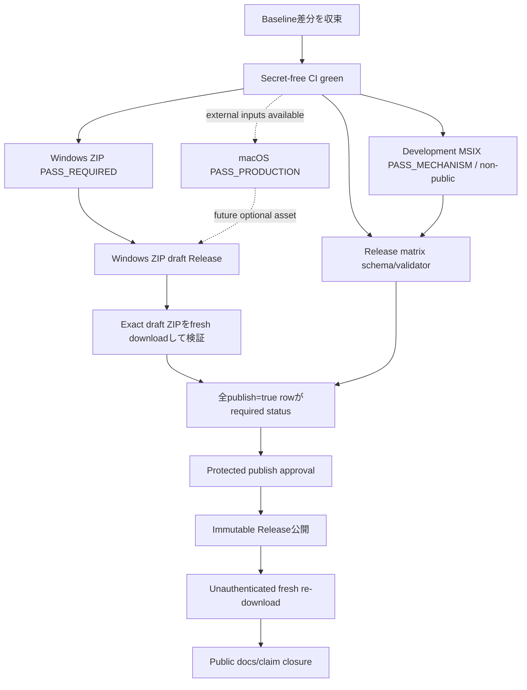
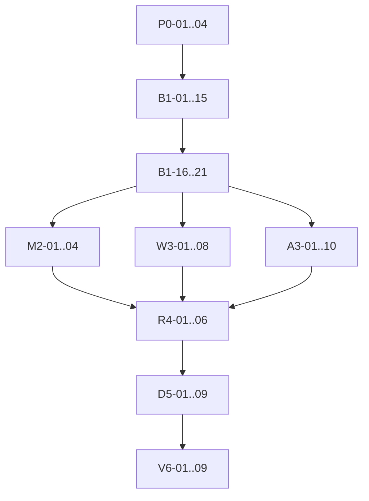

# StudyReport Evaluator 公開プロセス修正計画

## 0. 文書管理

| 項目 | 値 |
|---|---|
| 対象 repository | `dahatake/StudyReport-Evaluator` |
| 計画作成日 | 2026-09-04 |
| 調査基準 HEAD | `1fdc9ab40c9e605fa6a49a131e232563d8b351e7` |
| 調査時 branch | `main`（`origin/main`と同一HEAD） |
| 調査時 worktree | 14 entries（tracked変更13、untracked 1）。本計画追加前の値 |
| 要求正本 | 実在する [`docs/requirements-definition.md`](../docs/requirements-definition.md) v4.2 |
| 採用候補版 | `0.8.0` |
| 計画状態 | **APPROVED — IN PROGRESS** |
| 実行承認 | 2026-09-04の要求所有者指示「不明点はデフォルトのプランを採用」「全てのタスクを実行」 |

本書は修正計画であり、個別taskの結果、試験結果、公開結果は別の実行記録へ実測値だけを記載する。未実行を`PASS`へ変換しない。

### 0.1 2026-09-04 Windows MSIX scope update

要求所有者の追加指示「開発用のMSIXでOKです」「外部ブロッカーの情報はないです」により、次を本書の旧Windows production MSIX記述より優先する。

1. Windows MSIXは`StudyReportEvaluator-win-x64.unsigned.test.msix`による開発用`PASS_MECHANISM`までを採用する。
2. unsigned executable MSIXは広範配布しないというMicrosoft公式制約に従い、GitHub Releaseの一般利用者assetにしない。
3. Windowsの公開artifactは現行self-contained unsigned ZIPとSHA-256 sidecarを維持する。
4. W3-01〜W3-08のproduction certificate、timestamp、signed MSIX、App Installer production journeyは`SUPERSEDED_BY_DEVELOPMENT_MSIX_DECISION`とする。
5. 要求正本、ADR、architecture、detailed design、traceability、SystemTest、public docsをこの決定へ同期する。
6. Apple identity、notary credential、approved icon、native clean hostsは未提供のため推測せず、該当macOS taskは`BLOCKED_EXTERNAL`とする。
7. development MSIXとmacOS未完了を公開済み・`PASS_PRODUCTION`・全task成功へ読み替えない。

### 0.2 Active task routing（旧Phase 3W〜6を部分supersede）

§0.1を反映するため、以下をactive taskとし、本書後半のW3-01〜W3-08、production MSIXを前提とするR4/D5/V6記述は実行しない。

1. 実在する[`docs/requirements-definition.md`](../docs/requirements-definition.md)をv4.3へ改版し、Windows public artifactをunsigned ZIP、development MSIXをnon-public `PASS_MECHANISM`とする。
2. ADR-0015、architecture、detailed design、traceability、claim ledger、SystemTest、public docsをv4.3へ同期する。
3. initial public release gateはWindows ZIPに`PASS_REQUIRED`、development MSIXに`PASS_MECHANISM`を要求する。development MSIXはRelease assetへ含めない。
4. macOSはexact rowが`PASS_PRODUCTION`になった場合だけ将来のRelease asset/support claimへ追加する。未提供の外部入力をinitial Windows release blockerにしない。
5. platform matrixは`publish=true` rowだけを公開対象とし、artifact kindごとのrequired statusを検証する。初回required rowはWindows ZIP 1行。development MSIX rowは`publish=false`かつ`PASS_MECHANISM`。未実測macOS rowは公開matrixへ捏造追加しない。
6. Release workflowはWindows ZIPとsidecarのdraftだけを作る。publish workflowはmatrix、hash、tag、CHANGELOG、draft assetを検証し、protected approval後に公開する。
7. final docs、CHANGELOG、PATCH bump、tag、Releaseは上記initial Windows release scopeで実行する。

Active sequence:

`B1 baseline → v4.3 scope sync → development MSIX regression → release matrix → CI/release workflow → Windows ZIP full gate → docs/CHANGELOG/PATCH → draft/publish/fresh-download closure`

Active task IDs:

| ID | Task |
|---|---|
| S1-01 | `docs/requirements-definition.md`をv4.3へ改版 |
| S1-02 | ADR-0015、architecture、detailed designをv4.3へ同期 |
| S1-03 | traceability、claim ledger、SystemTest、public docsをv4.3へ同期 |
| M2-01〜03 | initial Windows release matrix schema、validator、tests |
| R2-01 | CIをWindows ZIP + development MSIX regressionへ確定 |
| R2-02 | draft-only Windows ZIP candidate workflow |
| R2-03 | protected publish workflowとcontract tests |
| V2-01 | current candidateのfull required gate |
| V2-02 | Keep a Changelog形式で`[Unreleased]`を最終更新 |
| V2-03 | PATCH bump（`0.8.0`→`0.8.1`）と版・lock・package再検証 |
| V2-04 | release commit、annotated tag、draft、publish、fresh re-download、closure |

S1-01〜03はB1-05/06直後に実行する。旧W3/R4/D5/V6 task IDはactive dependency graphへ含めない。

## 1. 結論

現時点では公開を開始しない。理由は次のとおりである。

1. GitHub Releaseは公開・draftとも0件であり、公開assetは存在しない。[S-07][S-08]
2. 公開tagは`v1.0.0` 1件だけで、Release workflow run #1は版・tag検証で失敗し、package、asset、Releaseを作成していない。[S-08][S-09]
3. remote `main`のCI run #3は、build、決定的test、macOS contractには成功したが、clean checkoutの空statusをMSIX証跡hash関数へ渡せず失敗した。[S-10][S-11]
4. ローカルworktreeには`0.8.0`再baselineと公開表示訂正があるが未commitであり、releaseのclean-tree条件を満たさない。[S-01][S-02][S-03]
5. 要求v4.2が求めるproduction MSIX、Developer ID署名・公証済みDMG、clean-machine test、platform matrix、protected release workflowは未完了である。[S-01][S-04][S-05][S-06]

したがって、最初に現在差分を安全に収束させてCIをgreenにし、その後WindowsとmacOSのproduction evidenceを並列に作り、全必須行が`PASS_PRODUCTION`になった場合だけ公開する。

## 2. 要求から導出する公開完了条件

本計画は要求v4.2の次だけを実装対象とする。

| 要求 | 必須結果 | 出典 |
|---|---|---|
| AC-020 / TR-19〜20 | Windows unsigned ZIPのpublish、hash、safe layout、bundled CLI、clean launch regression | [S-01] §18〜19、[S-12] |
| AC-021〜22 / TR-21〜22 | 未実測platformを対応済み表示せず、README・利用者文書・画面資料を実装と同期 | [S-01] §2.2(9)(10)、§18〜19 |
| AC-023 / TR-25 | trusted signatureとtimestampを持つWindows x64 MSIXのclean install/launch/lifecycle | [S-01] §13.2、§18〜19、[E-04][E-05] |
| AC-024〜25 / TR-26〜27 | `osx-arm64`/`osx-x64`のnative bundle、Developer ID、hardened runtime、notary、staple、DMG | [S-01] §13.3、§18〜19、[E-06][E-07] |
| AC-026 | Windows/macOSのprimary setupをOS標準UIの3操作以内にする | [S-01] §13、§18 |
| AC-027 / TR-28 | install/upgrade/repair/uninstallまたはapp removalで利用者workbookを変更・削除しない | [S-01] §13、§18〜19 |
| AC-028 / TR-29 | machine-readable matrixの全required行が`PASS_PRODUCTION`の場合だけprotected workflowが公開 | [S-01] §18〜19、[S-04] §13.5 |

`docs/requirement-definition.md`（単数形）は存在しないため新設しない。内容重複と正本分裂を避け、実在する複数形ファイルを使用する。[M-01]

## 3. 現在確認できる問題

### 3.1 公開前blocker

| ID | 重要度 | 確認済み事実 | 影響 | 出典 |
|---|---:|---|---|---|
| F-001 | P0 | clean checkoutでは`git status --porcelain`が空になり、`Get-Utf8Sha256Hex -Value ''`がparameter bindingで失敗する | 現行CIは必ずredのまま。MSIX本体生成後に証跡・sidecar作成が中断する | [S-10][S-11]、[`scripts/test-windows-msix-unsigned.ps1`](../scripts/test-windows-msix-unsigned.ps1) |
| F-002 | P0 | worktreeは14 entriesのdirty状態 | release commit/tagの検証と安全な差分帰属ができない | [M-02]、[`dev/version.ps1`](../dev/version.ps1) |
| F-003 | P0 | root `SystemTest-prompt.md`が削除扱いで、`tests/SystemTest-prompt.md`がuntracked。契約testはroot正本を読み、`tests/`配置を明示拒否する | 現在のworktreeでdocumentation contractが構造上成立しない | [M-03]、[`DocumentationContractTests.cs`](../tests/StudyReportEvaluator.App.Tests/Content/DocumentationContractTests.cs) |
| F-004 | P0 | real-data technical evidenceは要求とPromptを`v4.1`として出力する | v4.2 evidence contractと不一致 | [`RealDataSystemSmokeTests.cs`](../tests/StudyReportEvaluator.App.Tests/E2E/RealDataSystemSmokeTests.cs)、[S-01] |
| F-005 | P0 | localの公開不存在・`0.8.0`訂正は未commitで、remote READMEには存在しない`v1.0.1` asset URLが残る | public READMEが404を案内し続ける | [S-07][S-08]、[`README.md`](../README.md) |

### 3.2 CI/release automationの問題

| ID | 重要度 | 確認済み事実 | 影響 | 出典 |
|---|---:|---|---|---|
| F-006 | P1 | `dev/version.tests.ps1`は複数Git path回帰を持つが、CI/release workflowは実行しない | Release #1と同種の版tool回帰をworkflow前に検出できない | [`dev/version.tests.ps1`](../dev/version.tests.ps1)、[S-02][S-03][S-09] |
| F-007 | P1 | test/evidence uploadが`if: always()`かつ`if-no-files-found: error`で、前段skip/failure時に二次エラーを追加する | 一次原因が見えにくくなる。Release #1とCI #3で実際に発生 | [S-09][S-10]、[S-02][S-03] |
| F-008 | P1 | 両workflowが`actions/setup-dotnet@v4`を使用し、実runでNode 20 deprecation warningが出ている。公式の現行majorはv6 | 不要な警告と将来のrunner互換risk | [S-02][S-03][S-09][S-10][E-08] |
| F-009 | P1 | release workflowはprerelease tagを受理するが`--prerelease`を付けない | prereleaseをstable Releaseとして作り得る | [S-03]、[E-03] |
| F-010 | P0 | release workflowは`draft=false`入力で即時公開できる | production matrixやclean-machine evidenceなしでunsigned ZIPを公開可能 | [S-03]、[S-01] AC-028 |
| F-011 | P0 | release workflowが生成・添付するのはunsigned ZIPとsidecarだけ | v4.2のprimary MSIX/DMGとAC-028を満たさない | [S-03]、[S-01] §13、AC-023〜028 |
| F-012 | P0 | GitHub Environmentは0件、repository Actions secretも0件 | protected signing/notary workflowを実行できない | [M-04]、[S-01] §13.4 |

### 3.3 package実装の問題

| ID | 重要度 | 確認済み事実 | 影響 | 出典 |
|---|---:|---|---|---|
| F-013 | P1 | unsigned MSIX driverが製品版`0.8.0`/`0.8.0.0`を複数箇所へhard-codeする | `Directory.Build.props`単一正本とdriftし、次回bumpで手動同期が必要 | [`scripts/test-windows-msix-unsigned.ps1`](../scripts/test-windows-msix-unsigned.ps1)、[S-05] §5〜6 |
| F-014 | P0 | MSIX scriptは`SignedTest`と`UnsignedDevelopment`だけで、production output、trusted timestamp、public sidecar経路を持たない | `StudyReportEvaluator-win-x64.msix`をproduction contractで作れない | [`scripts/package-windows-msix.ps1`](../scripts/package-windows-msix.ps1)、[S-01] §13.2、[E-04][E-05] |
| F-015 | P1 | macOS public contractは`StudyReportEvaluator-osx-<arch>.dmg`だが、notary scriptは`StudyReportEvaluator-<version>-<RID>.dmg`を生成する | workflow/docs/asset contractが一致しない | [S-01] §13.3、[S-04] §13.3、[`notarize-package-macos.sh`](../scripts/notarize-package-macos.sh) |
| F-016 | P0 | production logo PNG、`.icns`、Windows signing identity、Apple Developer ID/notary profile、native clean hostsがrepository/GitHub環境にない | production signing、notary、clean-machine acceptanceを開始できない | [M-04][M-05]、[S-01] §13.4 |
| F-017 | P0 | platform release matrix/schema/validatorが存在しない | AC-028/TR-29の機械判定がない | [M-06]、[S-01] AC-028/TR-29 |

### 3.4 文書の問題

| ID | 重要度 | 確認済み事実 | 影響 | 出典 |
|---|---:|---|---|---|
| F-018 | P1 | root READMEはlocalで公開物0件へ訂正中だが、`docs/README.md`と`docs/getting-started.md`は「配布されたZIP」を前提にする | 公開前状態の説明が文書間で分裂する | [`README.md`](../README.md)、[`docs/README.md`](../docs/README.md)、[`docs/getting-started.md`](../docs/getting-started.md) |
| F-019 | P1 | `implementation-status.md`は`0.8.0`の過去test非流用を明記しつつ、transition表でZIPを`PASS_REQUIRED`とする | current candidateのstatus表現が自己矛盾する | [`implementation-status.md`](../dev/docs/implementation-status.md) |
| F-020 | P1 | status文書はroot Prompt 21 scenario/TR-24の旧結果を記す一方、現行Prompt候補は25 scenario/TR-29 | current test contractと状態記録が不一致 | [`implementation-status.md`](../dev/docs/implementation-status.md)、[`readme-claim-ledger.md`](../dev/docs/readme-claim-ledger.md)、[`tests/SystemTest-prompt.md`](../tests/SystemTest-prompt.md) |
| F-021 | P1 | 旧計画は`1.1.0`、dead `v1.0.1`修正、独自Windows Sandbox基盤をactive taskとして扱う | 現在の`0.8.0`差分と今回のYAGNI制約に不適合 | [`work/20260903-1655-TaskExecutionPlan.md`](20260903-1655-TaskExecutionPlan.md) |

## 4. 不明点、選択肢、採用デフォルト

2026-09-04の要求所有者指示により、以下のデフォルトを採用する。外部identity、credential、approved asset、native hostは生成・推測せず、未提供なら該当taskを`BLOCKED_EXTERNAL`とする。

| ID | 不明点 | 選択肢 | デフォルト | 理由 |
|---|---|---|---|---|
| Q-001 | 要求書の指定名が単数形だが実在は複数形 | A: 複数形を正本 / B: 別file指定 | **A** | v4.2、AC-001〜028、TR-01〜29を持つ実在正本は複数形だけ。重複file新設は正本分裂になる |
| Q-002 | 今回の公開scope | A: v4.2完全準拠 / B: unsigned ZIP先行 / C: 二段階 | **A** | ユーザーが要求正本の優先を明示し、AC-028がproduction matrix gateを要求する |
| Q-003 | 製品候補版 | A: `0.8.0` / B: `1.1.0` / C: 別版 | **A** | Release/assetは0件で、現行local差分が初回公開前版として一貫している。ただし公開`v1.0.0` tagは履歴として保持する |
| Q-004 | SystemTest正本位置 | A: root / B: `tests/` | **A** | 現行contract、dev文書、work文書がrootを参照する。corrected 25-scenario本文をrootへ置き、内容を失わない |
| Q-005 | prerelease公開 | A: stableのみ / B: prereleaseも実装 | **A** | MSIX/macOS production版mappingはstable前提で、v4.2はprerelease channelを要求しない。未使用channel追加はYAGNI |
| Q-006 | Windows production signing | A: approved PFX/certificate + SignTool / B: Azure Artifact Signing / C: owner指定 | **A** | 現行scriptとWindows SDK SignToolを再利用でき、新規cloud依存を導入しない。証明書取得方法はowner/security判断 |
| Q-007 | macOS `CFBundleVersion` | A: release commit count / B: workflow run number / C: owner指定 | **A** | 正整数・単調増加・同一commitで再現可能。`fetch-depth: 0`を前提に算出できる |
| Q-008 | macOS test matrix | A: 14/15/26 × Arm64/x64全6行 / B: scope改版で縮小 | **A** | 現要求§13.3/§17.1をそのまま実行する。実機が存在しない行は勝手にPASS/除外しない |
| Q-009 | production Releaseへlegacy ZIPを添付するか | A: CI regressionだけ / B: fallback assetとして添付 | **A** | MSIXをprimaryにする要件を明確にし、unsigned assetとの混同を避ける。AC-020 regressionはCIで維持できる |
| Q-010 | GitHub Environment構成 | A: signing用とpublish用の2環境 / B: 1環境 | **A** | draft作成前のsecret利用と、QA後の公開承認を分離する。既定名は未確定で、実装前にownerが確定する |

### 4.1 実行開始前に必須のowner回答

- Q-002、Q-003、Q-006、Q-008、Q-010。
- Windows certificateの非秘密Subject/Publisher、timestamp URL、production Identity Name。
- approved Windows PNG 3件とmacOS `.icns`。
- native clean-host availabilityとrunner/担当者。
- GitHub Environment名、required reviewer、secret**名**。secret値は本書・chat・repositoryへ書かない。

## 5. オーバーエンジニアリング防止境界

### 5.1 実装しないもの

- Windows Sandbox専用orchestrator、独自session bootstrap、watchdog、WTS/P/Invoke。clean VMで既存ST-UC-22を実行できない実測事実が出るまで追加しない。
- cloud backend、database、telemetry、queue、汎用plugin、policy engine。
- Strategy/Factory等の新抽象layer。既存PowerShell/Bash scriptを直接修正する。
- Microsoft Store、Mac App Store、auto-update、winget、universal macOS、Windows Arm64、Linux。
- SBOM、独自attestation、GPG tag署名。要求にないため追加しない。GitHub Immutable Releasesの既存attestationを利用する。[E-02]
- Actionのcommit-SHA pin、全workflowの全面再設計。今回必要なmajor更新とrelease gateだけを変更する。
- UIが変わらない場合の既存7画像再生成。
- optional Live Copilot/external spreadsheetをrequired release gateへ昇格する。
- `calcChain.xml` advisoryの修正。release blockerではなく、本計画外の別backlogとする。[S-06]

### 5.2 タスク粒度規則

1. 原則として1タスクは実装file 1件とtest file 1件以下。
2. 文書更新はproduction code変更と分離する。
3. 各executorが読むのは本書の該当task、要求の該当節、表に列挙したfileだけ。
4. 失敗したtaskの依存先を開始しない。別taskへscopeを拡張して「ついで修正」しない。
5. testで新しい実在findingが出た場合だけ、新IDを本計画へ追加してowner reviewを受ける。
6. file本文、credential、private pathをevidenceへ含めない。

## 6. 目標公開フロー

### 6.1 二段階workflowを採用する理由

- **Candidate workflow:** production signing/notaryを行い、assetをdraftへ添付する。公開しない。
- **Publish workflow:** QAが同じdraft assetをclean hostで検証しmatrix/evidenceを添付した後、全hash・required行・asset集合を再検証して公開する。

OS標準UIのmanual journeyを実artifact生成前に自動化したことにできないため、draftとpublishの間に実測期間が必要である。これはGitHubの「draftへ全assetを添付してから公開」というImmutable Releases推奨手順にも一致する。[E-02]

## 7. 詳細タスク

### Phase 0 — 承認と差分保護（完全直列）

#### P0-01 デフォルトdecision承認

- **入力:** §4。
- **変更file:** 本書だけ（decisionが変更された場合）。
- **処理:** Q-001〜010のowner回答を記録する。
- **完了条件:** Q-002/Q-003/Q-006/Q-008/Q-010が確定。
- **依存:** なし。

#### P0-02 worktree所有権確認

- **入力:** 14 status entriesと本計画file。
- **変更file:** なし。
- **処理:** 各差分を「0.8.0再baseline」「公開修正」「SystemTest移動」「本計画」に分類し、未知の利用者変更を勝手に破棄しない。
- **完了条件:** 全entryにowner/dispositionがある。
- **依存:** P0-01。

#### P0-03 専用branch作成

- **入力:** 現在のdirty `main`。
- **変更file:** なし（Git refのみ）。
- **既定branch:** `fix/publication-readiness-20260904`。
- **処理:** stash/reset/cleanせず、現在差分を保持したまま専用branchへ移る。
- **完了条件:** branch/HEAD/status entryがP0-02と一致。
- **依存:** P0-02。

#### P0-04 public state再観測

- **入力:** GitHub API。
- **変更file:** なし。
- **処理:** Releases（draft含む）、tags、CI/Release runs、Immutable Releases、Environment/secret名を再取得する。
- **停止条件:** 新しいRelease、`v0.8.0` tag、第三者変更を検出。
- **依存:** P0-02。P0-03と並列可。

### Phase 1 — 現在baselineをgreenにする

#### B1-01 SystemTest正本をrootへ収束

- **読むfile:** `tests/SystemTest-prompt.md`、`DocumentationContractTests.cs`。
- **編集file:** `SystemTest-prompt.md`、削除`tests/SystemTest-prompt.md`。
- **変更:** corrected日本語本文と25 scenario/TR-01〜29を保持したままrootへ配置する。HEADの内容で上書きしない。
- **検証:** scenario 01〜25連番、TR-01〜29網羅、root 1件、`tests/` 0件。
- **依存:** P0-03。

#### B1-02 v4.2 evidence identityへ同期

- **読むfile:** 要求§4.4/§19、root `SystemTest-prompt.md` ST-UC-19。
- **編集file:** `tests/StudyReportEvaluator.App.Tests/E2E/RealDataSystemSmokeTests.cs`。
- **変更:** evidence内のrequirements/system-test identityをv4.2へ変更する。test logicや実データ境界は変更しない。
- **検証:** focused testまたはevidence assertion。Live AIは実行しない。
- **依存:** B1-01。

#### B1-03 製品版正本を確定

- **編集file:** `Directory.Build.props`。
- **変更:** owner承認版（既定`0.8.0`）だけを保持する。
- **検証:** `dev/version.ps1 show/verify`でApp/Core一致。
- **依存:** P0-01、P0-03。

#### B1-04 version self-testを候補版へ同期

- **編集file:** `dev/version.tests.ps1`。
- **変更:** 承認版の期待値と、temporary repoだけにrelease entryを作る現行差分をreviewする。production CHANGELOGをtestが変更しないことを保持する。
- **検証:** 14 assertions、複数Git path、source不変。
- **依存:** B1-03。

#### B1-05 unsigned MSIX証跡のclean-tree修正と版一元化

- **編集file:** `scripts/test-windows-msix-unsigned.ps1`。
- **変更:**
  1. `Get-Utf8Sha256Hex.Value`へ空文字を明示許可し、clean statusはSHA-256(empty)として記録する。
  2. 製品版を`dev/version.ps1 show -Json`から1回だけ取得し、MSIX 4-part版を導出する。
  3. `0.8.0`/`0.8.0.0` hard-codeを取得値へ置換する。
  4. automatic `$Matches`と衝突しない`assetCandidates` renameを保持する。
- **非変更:** package identity、fixed unsigned OID、test-only status。
- **検証:** dirty/clean両status文字列、sidecar/evidence整合、production statusは`BLOCKED_EXTERNAL`。
- **依存:** B1-03。

#### B1-06 MSIX回帰契約を追加

- **編集file:** `tests/StudyReportEvaluator.App.Tests/Packaging/WindowsInstallerPackageTests.cs`。
- **変更:** empty status許可、版の単一正本利用、test-only identityを検査する。新test frameworkは追加しない。
- **検証:** 当該classのみ。
- **依存:** B1-05。

#### B1-07 lockを正規生成

- **編集file:** `tests/StudyReportEvaluator.App.Tests/packages.lock.json`（tool生成のみ）。
- **変更:** approved `Directory.Build.props`に対するproject reference versionだけをlocked restoreで生成する。手編集しない。
- **検証:** locked restore再実行でdiff 0、他package version/hash不変。
- **依存:** B1-03。

#### B1-08 CHANGELOGを未公開事実へ同期

- **編集file:** `CHANGELOG.md`。
- **変更:** 未公開1.0.0/1.0.1のdated sectionを`[Unreleased]`へ統合し、候補版を0.8.0と記す現差分をreviewする。公開済みとは書かない。
- **検証:** `[Unreleased]` 1件、dated 0.8.0はrelease commitまで作らない。
- **依存:** P0-01。

#### B1-09 root READMEの公開不存在表示

- **編集file:** `README.md`。
- **変更:** 404のv1.0.1 URLを削除し、公開物0件、0.8.0 candidate、Releases indexだけを案内する現差分を確定する。
- **検証:** `/releases/download/` 0件、公開済み断定0件。
- **依存:** B1-03、P0-04。

#### B1-10 利用者guide indexのpre-release注記

- **編集file:** `docs/README.md`。
- **変更:** 現在公開物0件であること、以下のZIP手順は公開後/受領済みartifact向けであることを短く明記する。
- **非変更:** macOS/MSIXを対応済みにしない。
- **検証:** DocumentationContractTests。
- **依存:** B1-09。

#### B1-11 getting-startedのpre-release注記

- **編集file:** `docs/getting-started.md`。
- **変更:** 「配布されたZIP」を現在入手可能と誤読しない注記を追加し、実在URLだけを案内する原則を保持する。
- **検証:** local link、public claim test。
- **依存:** B1-10。

#### B1-12 version ADR同期

- **編集file:** `dev/docs/adr/0015-windows-macos-installer-delivery.md`。
- **変更:** 0.8.0再baselineと「公開候補境界≠公開asset存在」の現差分を確定する。delivery decisionは変更しない。
- **依存:** B1-03。

#### B1-13 version手順同期

- **編集file:** `dev/docs/version-management.md`。
- **変更:** 0.8.0例、過去1.x非公開履歴、stable-only production workflow方針を同期する。version toolのprerelease build能力は残すが、production Release channelとは区別する。
- **依存:** B1-03、Q-005確定。

#### B1-14 developer index同期

- **編集file:** `dev/docs/README.md`。
- **変更:** product candidateだけを0.8.0へ同期する。
- **依存:** B1-03。

#### B1-15 CIの最小修正

- **編集file:** `.github/workflows/ci.yml`。
- **変更:**
  1. `actions/setup-dotnet@v6`へ更新する。
  2. `dev/version.tests.ps1`を独立stepで実行する。
  3. MSIX stepへIDを付け、成功時だけevidence uploadを要求する。
  4. TRXは存在時だけuploadし、前段skip時の二次エラーを出さない。
- **非変更:** permission `contents: read`、secretなし、既存test filter。
- **検証:** workflow diagnostics、focused static contract、hosted run。
- **依存:** B1-04〜06。

#### B1-16 baseline focused validation

- **編集file:** なし。
- **実行範囲:** version self-test、DocumentationContractTests（RealData evidenceのv4.3 source identity assertionを含む）、WindowsInstallerPackageTests、macOS static source contract、locked restore、Release build、`git diff --check`。
- **非実行:** opt-in `RealDataSystemSmokeTests`とLive AI。B1-02の「focused testまたはevidence assertion。Live AIは実行しない」に従い、ここでのRealData evidence contractはsource identity assertionを指す。
- **停止条件:** 1件でもfailure。full regressionへ進まない。
- **依存:** B1-01〜15。

#### B1-17 implementation status同期

- **編集file:** `dev/docs/implementation-status.md`。
- **変更:** current branch/commit、25 scenario/TR-29、0.8.0 current-run結果を実測値だけで記載する。再実行前のZIPは`NOT_RUN_CURRENT_CANDIDATE`相当へ戻し、過去PASSと分離する。
- **依存:** B1-16。

#### B1-18 traceability同期

- **編集file:** `dev/docs/traceability.md`。
- **変更:** current 0.8.0で再実行した項目だけstatus更新。mechanismとproductionを同じPASSにしない。
- **依存:** B1-16。

#### B1-19 claim ledger同期

- **編集file:** `dev/docs/readme-claim-ledger.md`。
- **変更:** Prompt 25件/TR-29、公開asset 0件を同期する。current evidenceに従いC-026/C-027/C-036〜038は`BLOCKED`、C-029/C-033は`VERIFIED`、C-034/C-035は`EXCLUDED`とし、過去evidenceをcurrent candidateへ流用しない。
- **依存:** B1-16、P0-04。

#### B1-20 baseline checkpoint commit/push

- **編集file:** なし（Git操作）。
- **処理:** allowlistだけをstageし、focused validation後に専用branchへcommit/pushする。
- **禁止:** main直push、tag、Release dispatch。
- **依存:** B1-17〜19。

#### B1-21 hosted CI確認

- **編集file:** なし。
- **完了条件:** exact commitのWindows job、macOS contract 2 jobが全て`completed/success`。
- **依存:** B1-20。

### Phase 2 — release matrix（Windows/macOS作業と並列可）

#### M2-01 closed JSON Schema

- **新規file:** `eng/schemas/platform-release-matrix-v1.schema.json`。
- **設計:** root、row、nested descriptorを全て`additionalProperties:false`とする。初回scopeはWindows ZIP rowとWindows development MSIX rowを`oneOf`で分け、各1行だけを要求する。
- **最小required field:** schemaVersion、productVersion、sourceCommit、rows、artifactKind、platform、RID、publish、exact Windows version/build、OS/process architecture、artifact basename/bytes/SHA-256、sidecar basename/bytes/SHA-256、evidence basename/bytes/SHA-256、status。
- **固定境界:** Windows ZIPは`publish=true`／`PASS_REQUIRED`、development MSIXは`publish=false`／`PASS_MECHANISM`。未実測macOS row、任意metadata bag、将来platform extension、自由form statusを追加しない。
- **依存:** P0-01。

#### M2-02 semantic validator

- **新規file:** `scripts/validate-platform-release-matrix.ps1`。
- **変更:** PowerShell 7 `Test-Json -SchemaFile`と明示semantic checksだけを実装する。
- **検証内容:** expected source/version一致、row重複なし、Windows ZIP／development MSIX各1行、artifact kindごとのpublish/status、required OS/arch、実file size/hash、sidecar exact content/hash、evidence size/hash。
- **禁止:** network、secret取得、artifact生成。
- **依存:** M2-01。

#### M2-03 matrix validator tests

- **新規file:** `tests/StudyReportEvaluator.App.Tests/Packaging/ReleaseMatrixContractTests.cs`。
- **変更:** temp JSON/fileを使い、valid、unknown property、duplicate row、missing row、non-PASS、hash mismatch、sidecar mismatch、wrong asset名を個別に検証する。
- **依存:** M2-02。

#### M2-04 detailed design link

- **編集file:** `dev/docs/detailed-design.md`。
- **変更:** matrix schema/validatorの正本pathと、required rowの意味だけを追記する。
- **依存:** M2-01〜03。

### Phase 2R — initial Windows release automation

#### R2-01 CIをWindows ZIP + development MSIX regressionへ確定

- **新規file:** `scripts/test-windows-zip.ps1`。
- **編集file:** `.github/workflows/ci.yml`、`WindowsInstallerPackageTests.cs`。
- **変更:** Windows ZIP 3 testをgeneral deterministic stepから分離し、clean sourceで1回だけ実行する。ZIP／sidecar／closed `PASS_REQUIRED` evidenceを独立artifactへuploadする。development MSIXは別stepの`PASS_MECHANISM`とし、MSIX本体をpublic Releaseへ含めない。
- **検証:** local parser／static contract／ZIP focused tests、exact commitのhosted Windows + macOS 2 job、test／ZIP／MSIX／macOS evidence artifact。
- **依存:** B1-21、M2-04。

#### R2-02 draft-only Windows ZIP candidate workflow

- **新規file:** 必要最小限のmatrix writer script。
- **編集file:** `.github/workflows/release.yml`。
- **変更:** stable annotated tagをcheckoutし、version／CHANGELOG／clean source、required tests、Windows ZIP、development MSIX、matrixを検証する。GitHub Releaseへ添付するのはZIPとsidecarだけで、常にdraftを作る。`draft=false`入力、既存Release上書き、asset clobber、prerelease暗黙公開を許可しない。
- **control artifact:** matrix、ZIP evidence、development MSIX evidenceとvalidator入力をActions artifactへ保存する。development MSIXをdraft assetへ含めない。
- **検証:** workflow contract test、local package/matrix gate、tag前はworkflow dispatchしない。
- **依存:** R2-01、M2-04。

#### R2-03 protected publish workflowとcontract tests

- **新規file:** `.github/workflows/publish-release.yml`、`ReleaseWorkflowContractTests.cs`。
- **変更:** existing draft tagとcandidate run IDを入力とし、protected environment approval後にcandidate control artifactとdraft ZIP／sidecarをfresh downloadする。tag／source／version／CHANGELOG／asset set／hash／matrixを再検証し、公開を最終write stepにする。
- **禁止:** artifact生成・置換、`--clobber`、tag作成、non-draft編集、matrix不足時公開、development MSIX／secret／macOS artifactのRelease添付。
- **検証:** positive/static contractとmissing matrix、wrong run/SHA、non-draft、asset drift、publish-before-validationのnegative contract。
- **依存:** R2-02。

### Phase 3W — Windows production MSIX（SUPERSEDED — 実行しない）

#### W3-01 production inputs確定

- **編集file:** なし。
- **owner入力:** Identity Name、Publisher DN/DisplayName、approved PNG 44×44/150×150/50×50、trusted certificate方式、timestamp URL、clean Windows build。
- **停止条件:** placeholderまたはtest certificateしかない。
- **依存:** P0-01。

#### W3-02 approved Windows assets追加

- **新規file:** owner指定の3 PNG（配置先は実装時に確定）。
- **検証:** exact dimension、nonzero、owner approval記録。
- **依存:** W3-01。

#### W3-03 production MSIX path実装

- **編集file:** `scripts/package-windows-msix.ps1`。
- **変更:** owner選択方式に従うproduction parameter setを1つだけ追加する。既定Aの場合、ephemeral certificate storeのthumbprint、Publisher一致、code-signing EKU、validity、SHA-256、RFC3161 timestamp、public basename、final signed bytesのsidecarを検証する。
- **出力:** `StudyReportEvaluator-win-x64.msix`と`.sha256`。
- **禁止:** PFX/passwordをargument/logへ出す、test OIDをproductionへ許可、`PASS_PRODUCTION`をpackage作成だけで出す。
- **依存:** W3-01〜02。

#### W3-04 production MSIX contract tests

- **編集file:** `tests/StudyReportEvaluator.App.Tests/Packaging/WindowsInstallerPackageTests.cs`。
- **変更:** public basename、unsigned OID拒否、timestamp必須、sidecarが署名後bytes由来、test/production identity分離を検証する。
- **依存:** W3-03。

#### W3-05 signed candidate生成

- **編集file:** なし。
- **環境:** protected Windows signing host。
- **結果:** package static/signature status。最大statusは`SIGNED_CANDIDATE`で、まだ`PASS_PRODUCTION`ではない。
- **依存:** W3-03〜04、GitHub signing environment。

#### W3-06 ST-UC-22 clean lifecycle

- **編集file:** なし。
- **環境:** package history/test certificate trustのないclean Windows 11 x64。
- **実測:** App Installer 3操作、Publisher、install、Start launch、bundled CLI、upgrade、repair、uninstall、tamper/wrong Publisher、user files不変。
- **出力:** content-free lifecycle evidence JSON。
- **禁止:** Windows Sandbox harness新設。clean VMを直接使う。
- **依存:** W3-05。

#### W3-07 Windows installed E2E

- **編集file:** なし。
- **実測:** ST-UC-25のWindows行。10-person synthetic fixture、picker、checkpoint/resume、final、CLI、log/privacy、input/final/partial保持。
- **依存:** W3-06。

#### W3-08 Windows matrix row作成

- **生成物:** draft/release evidence用JSON。source controlへ固定値としてcommitしない。
- **検証:** M2 validator、artifact/evidence hash exact match。
- **依存:** W3-07、M2-03。

### Phase 3M — macOS production DMG

#### A3-01 DMG public basename修正

- **編集file:** `scripts/notarize-package-macos.sh`。
- **編集test:** `tests/StudyReportEvaluator.App.Tests/Packaging/MacOsPublishPackageTests.cs`。
- **変更:** final DMG/sidecarを要求どおり`StudyReportEvaluator-osx-arm64.dmg`または`StudyReportEvaluator-osx-x64.dmg`にする。versionはInfo.plist/evidenceへ保持する。
- **依存:** B1-21。

#### A3-02 macOS build version policy

- **編集file:** `dev/docs/detailed-design.md`。
- **変更:** owner承認した正整数mappingだけを記録する。既定はrelease commit count。
- **依存:** Q-007確定。

#### A3-03 macOS external inputs確定

- **編集file:** なし。
- **入力:** approved `.icns`、Developer ID Application identity、notary keychain profile、native x64/Arm64 hosts、Apple/npm接続。
- **停止条件:** 1件でも不足。
- **依存:** P0-01。

#### A3-04 approved `.icns`追加

- **新規file:** owner指定 `.icns` 1件。
- **検証:** nonzero、valid icon、approval provenance。
- **依存:** A3-03。

#### A3-05 native unsigned bundle生成（2並列task）

- **A3-05A:** `osx-arm64` native host。
- **A3-05B:** `osx-x64` native host。
- **編集file:** なし。
- **実行:** existing publish/package scripts、exact SDK/CLI/SRI、thin Mach-O、Info.plist、execute mode、native GUI startup。
- **依存:** A3-01、A3-04、B1-21。

#### A3-06 entitlement実測（2並列task）

- **対象:** A3-05A/Bの各bundle。
- **処理:** empty entitlementから開始し、hardened runtimeで実際に必要な権限だけを測る。
- **条件付き変更:** JIT failureが再現した場合だけ`eng/packaging/macos/StudyReportEvaluator.entitlements`へ`allow-jit`を追加し、`MacOsPublishPackageTests.cs`を更新する。
- **禁止:** `get-task-allow`、unsigned executable memory、library validation disableを便宜追加。
- **依存:** A3-05A/B、[E-06][E-07]。

#### A3-07 Developer ID署名（2並列task）

- **編集file:** 原則なし。実在failure時だけ別fix taskを起票。
- **実行:** dylib/CLI/apphost→signed CLI hash→outer app、secure timestamp、strict verify。
- **依存:** A3-06、A3-03。

#### A3-08 app/DMG notary（2並列task）

- **実行:** existing notary script、app/DMG Accepted、log issues 0、staple/validate、Gatekeeper。
- **依存:** A3-07。

#### A3-09 quarantine clean matrix（最大6並列task）

- **行:** macOS 14/15/26 × Arm64/x64。
- **各task入力:** 同一RIDのexact DMG hash。
- **実測:** download quarantine、DMG open、drag、Finder launch、CLI、10-person E2E、app removal、user files不変、negative cases。
- **停止条件:** native host不存在。Rosettaで代用しない。
- **依存:** A3-08、M2-03。

#### A3-10 macOS matrix rows作成

- **生成物:** 6行のcontent-free JSON。
- **検証:** 全行のartifact hash、evidence hash、notary ID、exact OS build、native architecture。
- **依存:** A3-09。

### Phase 4 — protected candidate/publish workflow（旧production MSIX前提・SUPERSEDED）

#### R4-01 GitHub Environment設定

- **変更file:** なし（GitHub settings）。
- **既定:** signing environmentとpublish environmentを分離。
- **設定:** required reviewers、deployment branch/tag policy、必要最小secret。
- **禁止:** PR/fork workflowから参照、secret値のchat/log出力。
- **依存:** W3-01、A3-03、Q-010確定。

#### R4-02 candidate workflow実装

- **編集file:** `.github/workflows/release.yml`。
- **変更:**
  1. stable annotated tagだけを受理する。
  2. `actions/setup-dotnet@v6`、version self-test、locked restore/build/testを実行する。
  3. signing environment内でWindows MSIXと両macOS DMGを生成する。
  4. exact asset/hashを検証後、**draftだけ**を作る。
  5. test uploadは存在時だけ行い、一次failureへ二次failureを追加しない。
  6. Immutable Releases enabled、既存Releaseなし、tag/source/version/CHANGELOG一致を確認する。
- **添付:** MSIX+sidecar、DMG 2件+sidecar 2件。legacy ZIPは添付しない。
- **禁止:** workflow内で未実測行を`PASS_PRODUCTION`生成、`draft=false`入力、prerelease暗黙公開。
- **依存:** W3-04、A3-01〜08、R4-01、B1-21。

#### R4-03 candidate workflow contract test

- **新規file:** `tests/StudyReportEvaluator.App.Tests/Packaging/ReleaseWorkflowContractTests.cs`。
- **検証:** manual trigger、stable tag、annotated/source checks、environment、secret-free PR CI分離、draft-only、exact asset names、matrix前公開なし、setup-dotnet v6、conditional test artifacts。
- **依存:** R4-02。

#### R4-04 publish workflow実装

- **新規file:** `.github/workflows/publish-release.yml`。
- **変更:** existing draftだけを対象に、publish environment承認後、全assetをfresh downloadし、sidecar/matrix/evidence/schema/required rows/CHANGELOG/tagを再検証してからdraftを公開する。
- **禁止:** asset生成・置換、`--clobber`、tag作成、non-draft編集、matrix不足時公開。
- **failure:** draftを保持して停止し、自動削除しない。
- **依存:** M2-03、R4-01〜03、W3-08、A3-10。

#### R4-05 publish workflow contract test

- **編集file:** `ReleaseWorkflowContractTests.cs`。
- **検証:** draft必須、environment gate、download verification、matrix validator、全required row PASS、no clobber、公開が最終step。
- **依存:** R4-04。

#### R4-06 CI macOS native publishへ拡張

- **編集file:** `.github/workflows/ci.yml`。
- **変更:** 既存`macos-15`/`macos-15-intel` matrixへRIDを明示し、各native runnerで`publish-macos.sh`まで実行する。sign/notary/icon/packageはsecret-free CIへ入れない。
- **依存:** A3-05A/Bの実測成功。

### Phase 5 — production evidence後の文書切替（旧production MSIX前提・SUPERSEDED）

このphaseはWindows 1行とmacOS required 6行がすべて`PASS_PRODUCTION`になるまで開始しない。

#### D5-01 root README切替

- **編集file:** `README.md`。
- **変更:** primary MSIX、RID別DMG、3操作、実測済みOS/arch、Releases indexを記載する。公開前なのでdirect asset URLはまだ書かない。
- **依存:** W3-08、A3-10。

#### D5-02 user guide index切替

- **編集file:** `docs/README.md`。
- **変更:** Windows/macOSの検証済み行とprimary artifactを同期する。
- **依存:** D5-01。

#### D5-03 getting-started切替

- **編集file:** `docs/getting-started.md`。
- **変更:** Windows 3操作、macOS 3操作、architecture選択、advanced hash確認を記載する。terminal/Gatekeeper disableをprimary手順にしない。
- **依存:** D5-02。

#### D5-04 troubleshooting切替

- **編集file:** `docs/troubleshooting.md`。
- **変更:** signature/notary/architecture/install/removeの実測済みfailureだけを追加する。推測errorや万能回避策を追加しない。
- **依存:** W3-06、A3-09。

#### D5-05 privacy/lifecycle同期

- **編集file:** `docs/privacy-and-data-handling.md`。
- **変更:** install/repair/uninstall/app removalがworkbookを管理対象にしない事実を短く追加する。AI data boundaryは変更しない。
- **依存:** W3-07、A3-09。

#### D5-06 CHANGELOG release候補化

- **編集file:** `CHANGELOG.md`。
- **変更:** `[Unreleased]`を実日付の`[0.8.0]`へ移し、空の`[Unreleased]`を残す。実際にPASSしたplatformだけを書く。
- **依存:** D5-01〜05。

#### D5-07 status/traceability/claim更新（3直列task）

- **D5-07A:** `dev/docs/implementation-status.md`。
- **D5-07B:** `dev/docs/traceability.md`。
- **D5-07C:** `dev/docs/readme-claim-ledger.md`。
- **変更:** run ID、artifact hash、exact OS build、statusを実測値だけで更新。C-026/C-033〜038を根拠がある場合だけVERIFIEDへ変更。
- **依存:** D5-06、M2 validator PASS。

#### D5-08 version手順最終同期

- **編集file:** `dev/docs/version-management.md`。
- **変更:** candidate→releaseの実手順、stable-only workflow、draft→publish workflow名を同期する。
- **依存:** R4-04、D5-06。

#### D5-09 screenshot判定

- **編集file:** 原則なし。
- **処理:** app UIが変わっていないことを確認する。変わっていない場合は既存7画像を維持。変わった場合だけ別taskをowner承認後に追加する。
- **依存:** D5-01〜05。

### Phase 6 — release実行（旧production MSIX前提・SUPERSEDED）

#### V6-01 full release gate

- **編集file:** なし。
- **実行:** locked restore、version tests、Release build、全required deterministic tests、Windows ZIP regression、MSIX/DMG contract、matrix tests、documentation tests、SystemTest required scenarios。
- **除外:** optional Live Copilot/external recalculationを合否へ算入しない。
- **完了条件:** failure/error 0、未解決blocker/high 0、worktree clean。
- **依存:** D5-01〜09、R4-05〜06。

#### V6-02 release commit/main CI

- **処理:** reviewed allowlistをrelease commitへまとめ、mainへmerge/pushし、exact SHAの全CI成功を確認する。
- **依存:** V6-01。

#### V6-03 annotated tag

- **処理:** exact release commitへ`v0.8.0` annotated tagを作成し、`version.ps1 -Tag -RequireClean`後に明示pushする。
- **禁止:** 既存`v1.0.0`の削除・移動・再利用。
- **依存:** V6-02。

#### V6-04 candidate draft作成

- **処理:** candidate workflowを1回だけdispatchし、全job成功とdraft asset setを確認する。
- **失敗時:** 公開しない。同tagを黙って再利用せず、failure policyへ移る。
- **依存:** V6-03。

#### V6-05 exact draft asset QA

- **処理:** draftから取得したexact assetsをW3-06/07とA3-09で検証し、matrix/evidenceをdraftへ追加する。既存assetを置換しない。
- **依存:** V6-04。

#### V6-06 protected publish

- **処理:** publish workflowをdispatchし、matrix、hash、evidence、asset set再検証とenvironment approval後に公開する。
- **依存:** V6-05。

#### V6-07 public fresh re-download

- **処理:** 認証なしで全public assetを新規tempへ取得し、bytes/hash/sidecar/signature/notary/native RID/install/launchを再確認する。
- **完了条件:** GitHub API、Release page、download URL、actual filesが一致。
- **依存:** V6-06。

#### V6-08 public URL closure

- **編集file:** `README.md`、必要な`docs/*.md`、claim/status文書。
- **変更:** V6-07で実在確認したURL、asset ID/hash、公開時刻だけを記載する。
- **依存:** V6-07。

#### V6-09 closure commit/final CI

- **処理:** docs-only closureをmainへpushし、final CI、remote main、tag target、Release、assets、Immutable status、local cleanを再取得する。
- **依存:** V6-08。

## 8. 依存関係と並列実行

### 8.1 並列可能

- B1-01/02、B1-03〜07、B1-08〜14は、同一fileを触らない範囲で並列可。
- B1-21後、M2、Windows W3、macOS A3を並列可。
- A3-05A/B、A3-06A/B、A3-07A/B、A3-08A/BはRID別並列可。
- A3-09の6 OS/arch行は、exact same DMG hashを入力にできる場合だけ並列可。

### 8.2 並列禁止

- 同じworkflow fileを編集するB1-15、R4-06。
- 同じtest fileを編集するB1-06、W3-04。
- signing前後の同一`.app`/MSIXへの同時write。
- draft asset uploadとpublish verification。
- CHANGELOG release section作成とtag作成。
- source commitが異なるartifact/evidenceの集約。

## 9. File-to-task mapping

| File | Task |
|---|---|
| `SystemTest-prompt.md` / `tests/SystemTest-prompt.md` | B1-01 |
| `RealDataSystemSmokeTests.cs` | B1-02 |
| `Directory.Build.props` | B1-03 |
| `dev/version.tests.ps1` | B1-04 |
| `scripts/test-windows-msix-unsigned.ps1` | B1-05 |
| `WindowsInstallerPackageTests.cs` | B1-06、後続W3-04 |
| App tests `packages.lock.json` | B1-07 |
| `CHANGELOG.md` | B1-08、D5-06 |
| `README.md` | B1-09、D5-01、V6-08 |
| `docs/README.md` | B1-10、D5-02 |
| `docs/getting-started.md` | B1-11、D5-03 |
| `docs/troubleshooting.md` | D5-04 |
| `docs/privacy-and-data-handling.md` | D5-05 |
| ADR-0015 | B1-12、条件付きW3-02 decision記録 |
| `dev/docs/version-management.md` | B1-13、D5-08 |
| `dev/docs/README.md` | B1-14 |
| `.github/workflows/ci.yml` | B1-15、R4-06 |
| implementation status / traceability / claim ledger | B1-17〜19、D5-07、V6-08 |
| `platform-release-matrix-v1.schema.json` | M2-01 |
| `validate-platform-release-matrix.ps1` | M2-02 |
| `ReleaseMatrixContractTests.cs` | M2-03 |
| `scripts/package-windows-msix.ps1` | W3-03 |
| `notarize-package-macos.sh` | A3-01 |
| `MacOsPublishPackageTests.cs` | A3-01、条件付きA3-06 |
| macOS entitlements | 条件付きA3-06だけ |
| `.github/workflows/release.yml` | R4-02 |
| `ReleaseWorkflowContractTests.cs` | R4-03、R4-05 |
| `.github/workflows/publish-release.yml` | R4-04 |

## 10. Phase別品質gate

| Gate | 必須条件 | 失敗時 |
|---|---|---|
| G-Baseline | current version/source/docs/tests一致、focused tests green、hosted CI green | platform作業を開始しない |
| G-Matrix | schema/semantic positive+negative tests green | production evidenceをPASSへしない |
| G-Windows | exact signed MSIX + clean lifecycle + installed E2E | Windows rowは`BLOCKED_EXTERNAL`または`FAIL` |
| G-macOS | RID別signed/notarized DMG + required 6 rows | 不足rowを公開しない。scopeを勝手に縮小しない |
| G-Workflow | draft-only candidate、protected publish、secret leak 0 | tag/Releaseを作らない |
| G-Docs | current actual artifactだけを記載、broken link 0 | release commitを作らない |
| G-Public | unauthenticated fresh downloadと全hash/trust一致 | closure claimを書かない |

## 11. Failure / rollback

1. **commit前:** tag/Releaseを作らず、当該taskのallowlistだけを修正する。他者差分へreset/cleanしない。
2. **release commit後・tag前:** 原因修正commitを追加し、全gateを再実行する。
3. **remote tag後・draft前:** tagを移動・再利用しない。次のPATCH（例:`0.8.1`）へ進む。
4. **draft作成後・公開前:** draftを公開しない。自動削除・asset clobberをしない。ownerが証跡を確認し、次版へ進む。
5. **公開後:** Immutable Release、tag、assetを変更しない。修正は新しいPATCH/MINOR/MAJORで公開する。[E-01][E-02]
6. 公開`v1.0.0` tagと失敗run #1は履歴として保持する。

## 12. 実行時のcontext最小化

各task開始時に読む範囲を次へ限定する。

- 共通: 本書の当該task + 要求正本の参照節。
- code task: 編集対象1file +対応test 1file。
- docs task: 対象文書1file +直前phaseの実測summary。
- platform run: 対象RID/OSのscript + ST-UC 1件 + artifact identity。
- workflow task: workflow 1file + matrix validator + workflow contract test。

前taskのfull log、過去work report、無関係なapplication domain codeは読み込まない。必要情報は「commit、artifact hash、status、evidence hash、blocker」だけをhandoffする。

## 13. 出典

### Repository一次資料

- **[S-01]** [`docs/requirements-definition.md`](../docs/requirements-definition.md) v4.2 — 特に§2.2、§13、§17、§18 AC-020〜028、§19 TR-19〜29。
- **[S-02]** [`.github/workflows/ci.yml`](../.github/workflows/ci.yml)。
- **[S-03]** [`.github/workflows/release.yml`](../.github/workflows/release.yml)。
- **[S-04]** [`dev/docs/detailed-design.md`](../dev/docs/detailed-design.md) §13。
- **[S-05]** [`dev/docs/version-management.md`](../dev/docs/version-management.md)。
- **[S-06]** [`dev/docs/implementation-status.md`](../dev/docs/implementation-status.md)、[`traceability.md`](../dev/docs/traceability.md)、[`readme-claim-ledger.md`](../dev/docs/readme-claim-ledger.md)。
- **[S-11]** [`scripts/test-windows-msix-unsigned.ps1`](../scripts/test-windows-msix-unsigned.ps1)。
- **[S-12]** [`scripts/publish-windows.ps1`](../scripts/publish-windows.ps1)、[`package-windows.ps1`](../scripts/package-windows.ps1)、[`WindowsPublishPackageTests.cs`](../tests/StudyReportEvaluator.App.Tests/Packaging/WindowsPublishPackageTests.cs)。

### GitHub実測（2026-09-04調査）

- **[S-07]** [Repository API](https://api.github.com/repos/dahatake/StudyReport-Evaluator)、[Releases API](https://api.github.com/repos/dahatake/StudyReport-Evaluator/releases?per_page=100)、[Releases page](https://github.com/dahatake/StudyReport-Evaluator/releases)。公開Release 0件。
- **[S-08]** [Tags API](https://api.github.com/repos/dahatake/StudyReport-Evaluator/tags?per_page=100)。`v1.0.0`→`b68e7577df616c0e259b55697a52d26412a01208`。認証済みAPIでもdraft含むRelease 0件、Immutable Releases `enabled=true`を観測。
- **[S-09]** [Release run #1](https://github.com/dahatake/StudyReport-Evaluator/actions/runs/33696306818)。`Verify release identity and privacy boundary`失敗、後続skip、artifact 0件。
- **[S-10]** [CI run #3](https://github.com/dahatake/StudyReport-Evaluator/actions/runs/33731803304)。Windows MSIX evidence step失敗、macOS 2 job成功。
- **[M-01]** workspace file search。`docs/requirements-definition.md` 1件、単数形0件、`copilot-instructions.md` 0件。
- **[M-02]** `git status --porcelain`/`git diff --numstat`読み取り。計画作成前14 entries、HEAD `1fdc9ab...`。
- **[M-03]** current filesystemと`DocumentationContractTests`比較。root Prompt削除、tests Prompt untracked、両本文は非同一だが双方25 scenario/TR-01〜29。
- **[M-04]** 認証済み`GET /environments`と`gh secret list`。Environment 0、repository secret 0。secret値は取得していない。
- **[M-05]** workspace file search。`.icns` 0件、`eng/packaging/**/*.png` 0件。
- **[M-06]** workspace search。platform release matrix/schema/validator 0件。

### 外部一次資料

- **[E-01]** [Semantic Versioning 2.0.0](https://semver.org/spec/v2.0.0.html) — 公開版内容を変更せず新しい版で修正。
- **[E-02]** [GitHub Immutable Releases](https://docs.github.com/en/code-security/concepts/supply-chain-security/immutable-releases)、[Managing releases](https://docs.github.com/en/repositories/releasing-projects-on-github/managing-releases-in-a-repository) — draftへassetを揃えてから公開。
- **[E-03]** [GitHub CLI `gh release create`](https://cli.github.com/manual/gh_release_create) — `--draft`、`--prerelease`、`--verify-tag`。
- **[E-04]** [Microsoft Learn: Create an unsigned MSIX package](https://learn.microsoft.com/windows/msix/package/unsigned-package) — unsignedは試験用途、fixed OID、`-AllowUnsigned`、広範配布禁止。
- **[E-05]** [Microsoft Learn: Sign an MSIX package](https://learn.microsoft.com/windows/msix/package/signing-package-overview) — Publisher/Subject、署名、timestamp。
- **[E-06]** [Avalonia: macOS deployment](https://docs.avaloniaui.net/docs/deployment/macos) — `.app`、nested-first signing、hardened runtime、notary/staple。
- **[E-07]** [Apple: Notarizing macOS software](https://developer.apple.com/documentation/security/notarizing-macos-software-before-distribution)、[Customizing workflow](https://developer.apple.com/documentation/security/customizing-the-notarization-workflow)、[Resolving issues](https://developer.apple.com/documentation/security/resolving-common-notarization-issues) — Developer ID、secure timestamp、log確認、staple、Gatekeeper。
- **[E-08]** [actions/setup-dotnet](https://github.com/actions/setup-dotnet)、[v6.0.0](https://github.com/actions/setup-dotnet/releases/tag/v6.0.0) — v6が現行major、v5以降Node 24。

## 14. レビュー時チェックリスト

- [ ] Q-001〜010のdefaultを承認または変更した。
- [ ] 0.8.0を公開候補として承認した。
- [ ] 公開`v1.0.0` tagを保持する方針を承認した。
- [ ] v4.2全required platformを満たすまで公開しない方針を承認した。
- [ ] Windows signing方式と非秘密identityを決めた。
- [ ] macOS 6行matrixを実行可能、または要求改版が必要と判断した。
- [ ] GitHub signing/publish environment分離を承認した。
- [ ] legacy ZIPをproduction Releaseへ添付しない方針を承認した。
- [ ] Windows Sandbox等の要求外基盤を追加しない方針を承認した。
- [ ] タスク実行開始を明示指示した。
